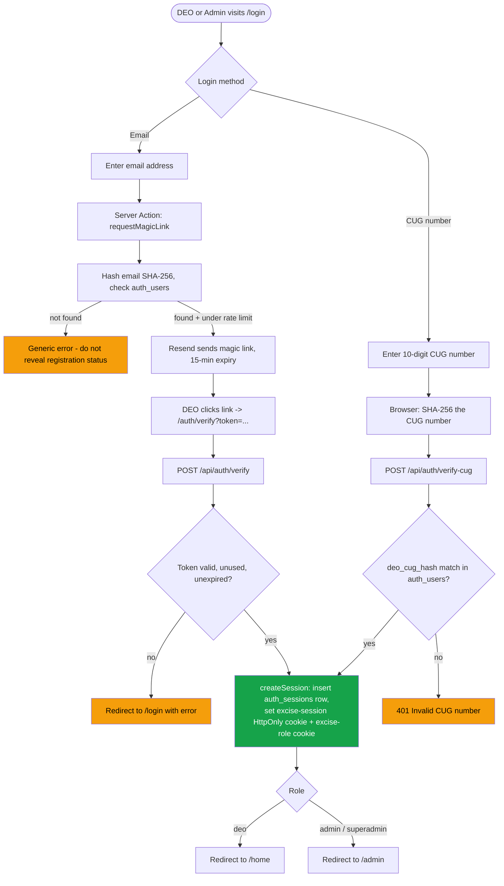
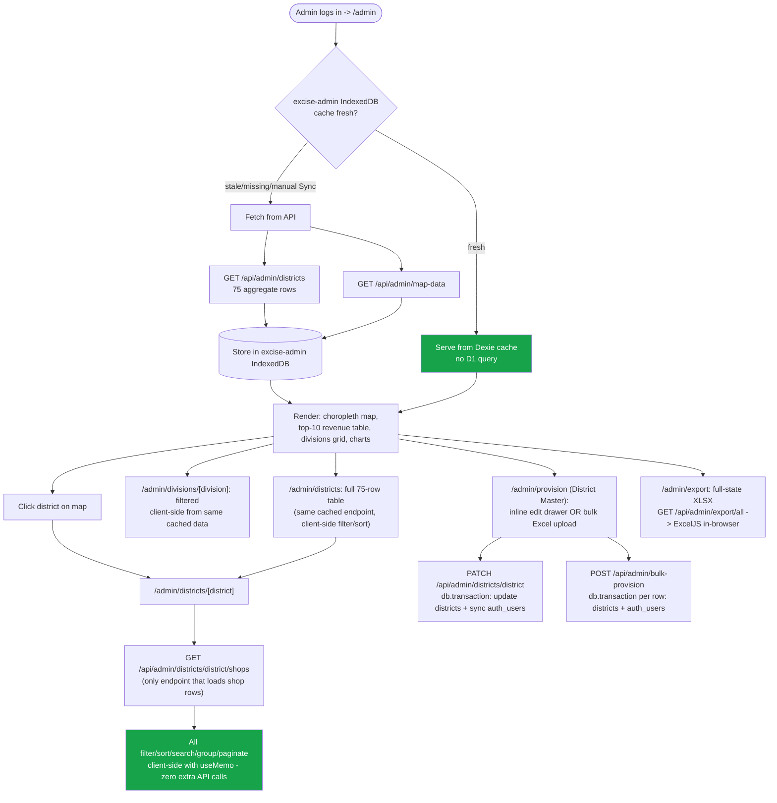
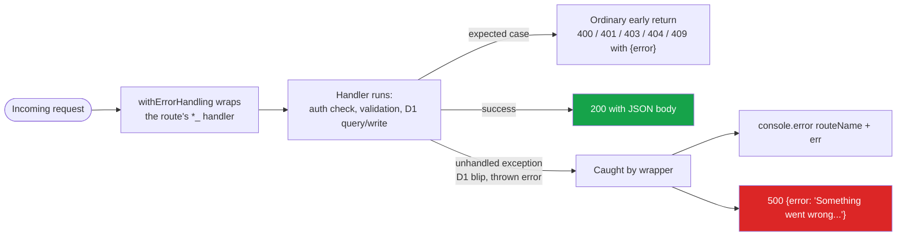

# App Flow

Mermaid diagrams of how requests move through the portal. See [CLAUDE.md](../CLAUDE.md) and
[roadmap.md](../roadmap.md) for the full architectural context behind each step.

## 1. Authentication (both login paths)

## 2. DEO workflow — gated, one step at a time

```mermaid
flowchart TD
    Login([DEO logs in]) --> HomeCheck{district_circles_sectors\nrow exists for district?}

    HomeCheck -->|no| UnitsOnly["/home shows ONLY\nCreate Circles & Sectors card"]
    UnitsOnly --> UnitsPage["/units: enter circle + sector counts"]
    UnitsPage --> NameBoxes[Fill pre-generated name boxes\nSector 1, Sector 2, ...\nCircle N.. starts at 1 if no sectors, else 2]
    NameBoxes --> ConfirmLock[SweetAlert2: confirm - cannot change afterward]
    ConfirmLock --> PostUnits[POST /api/districts/district/units]
    PostUnits --> LockCheck{Any existing unit row?}
    LockCheck -->|yes, 409| Rejected[Rejected - already locked]
    LockCheck -->|no| BatchInsert[db.batch: insert all units + audit_log unit_registered]
    BatchInsert --> Locked[Units locked - Upload/Verify now unlock]

    HomeCheck -->|yes| FullNav["/home shows Upload + Verify cards\n+ nav links appear"]
    Locked --> FullNav

    FullNav --> Download[Download district Excel template\nGET /api/districts/district/template]
    Download --> FillExcel[DEO/Inspectors fill workbook\noffline, per circle/sector]
    FillExcel --> UploadPage["/upload: select consolidated .xlsx"]
    UploadPage --> ParseBrowser[Parse in-browser with ExcelJS\nDMS-to-DD, revenue calc, UP bbox validation]
    ParseBrowser --> StageIDB[(Stage rows in IndexedDB\nDexie - excise-deo DB)]
    StageIDB --> ChunkUpload[POST /api/upload/chunk\n500 rows per batch]
    ChunkUpload --> DualVerify{Worker recomputes\ntotal_revenue - matches?}
    DualVerify -->|no| RowRejected[Row rejected with reason]
    DualVerify -->|yes| BatchWrite[db.batch: upsert rows + audit_log upload_chunk]

    BatchWrite --> VerifyPage["/verify: review staged rows"]
    VerifyPage --> FlagAdjacent[Client-side flag: adjacent Thana names\nnot in this district's own thanaName set]
    FlagAdjacent --> FixFlags[DEO corrects flagged rows]
    FixFlags --> ConfirmSubmit[SweetAlert2: confirm submission to HQ]
    ConfirmSubmit --> PostSubmit[POST /api/districts/district/submit]
    PostSubmit --> MissingCheck{All locked units\nhave uploaded rows?}
    MissingCheck -->|no| SubmitBlocked[400 - missing data for units: ...]
    MissingCheck -->|yes| SubmitBatch[db.batch: status=submitted + audit_log district_submitted]
    SubmitBatch --> Done([District appears as submitted\non /admin])

    style Locked fill:#16a34a,color:#fff
    style Done fill:#16a34a,color:#fff
    style Rejected fill:#f59e0b,color:#000
    style RowRejected fill:#f59e0b,color:#000
    style SubmitBlocked fill:#f59e0b,color:#000
```

## 3. Admin / HQ dashboard — data loading (IndexedDB-first)

## 4. API error handling (every non-trivial route)

