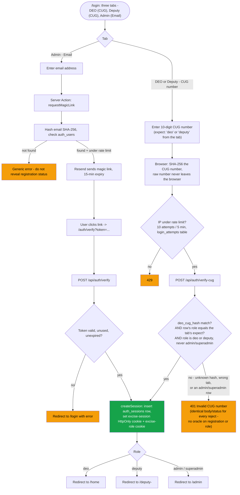
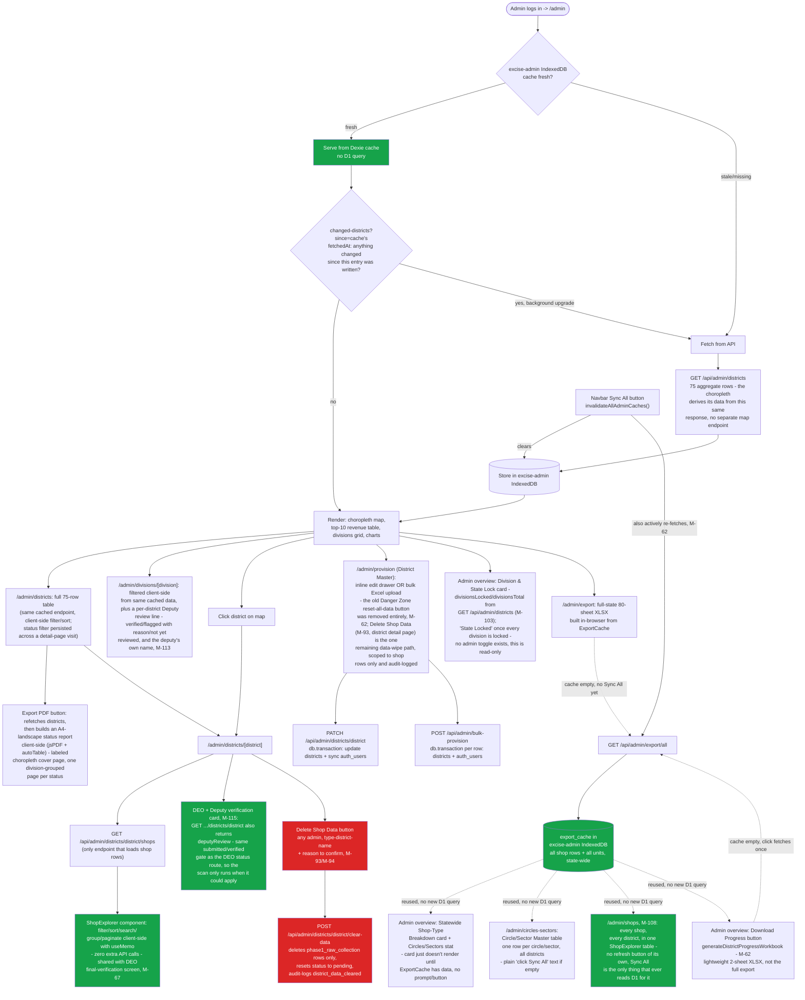
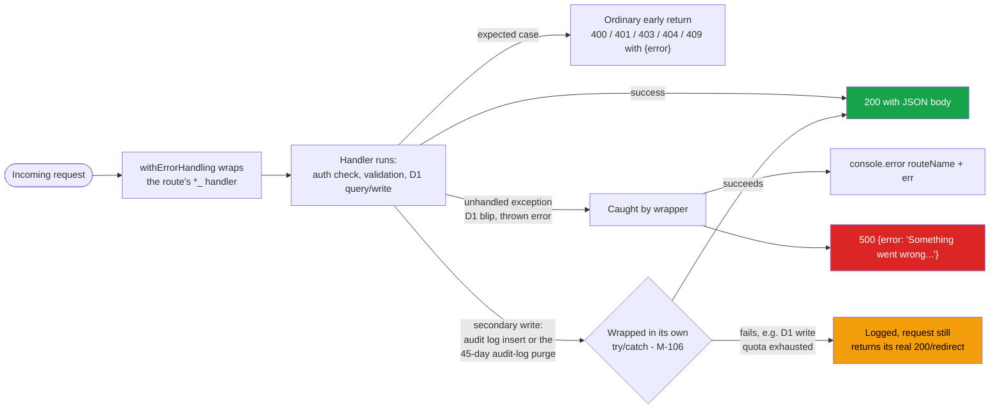

# App Flow

Mermaid diagrams of how requests move through the portal. See [CLAUDE.md](../CLAUDE.md) and
[roadmap.md](../roadmap.md) for the full architectural context behind each step.

## 1. Authentication (three login paths)

```mermaid
flowchart TD
    Start(["/login: three tabs -\nDEO (CUG), Deputy (CUG), Admin (Email)"]) --> Choice{Tab}

    Choice -->|Admin - Email| EmailInput[Enter email address]
    EmailInput --> ReqLink[Server Action: requestMagicLink]
    ReqLink --> HashEmail[Hash email SHA-256, check auth_users]
    HashEmail -->|not found| GenericErr[Generic error - do not reveal registration status]
    HashEmail -->|found + under rate limit| SendEmail[Resend sends magic link, 15-min expiry]
    SendEmail --> ClickLink[User clicks link -> /auth/verify?token=...]
    ClickLink --> VerifyEP[POST /api/auth/verify]
    VerifyEP --> CheckToken{Token valid, unused, unexpired?}
    CheckToken -->|no| LoginErr[Redirect to /login with error]
    CheckToken -->|yes| CreateSession

    Choice -->|DEO or Deputy - CUG number| CugInput["Enter 10-digit CUG number\n(expect: 'deo' or 'deputy' from the tab)"]
    CugInput --> HashCug[Browser: SHA-256 the CUG number,\nraw number never leaves the browser]
    HashCug --> IpLimit{"IP under rate limit?\n10 attempts / 5 min, login_attempts table"}
    IpLimit -->|no| RateErr[429]
    IpLimit -->|yes| CugEP[POST /api/auth/verify-cug]
    CugEP --> CheckCug{"deo_cug_hash match?\nAND row's role equals the tab's expect?\nAND role is deo or deputy, never admin/superadmin"}
    CheckCug -->|no - unknown hash, wrong tab,\nor an admin/superadmin row| CugErr["401 Invalid CUG number\n(identical body/status for every reject -\nno oracle on registration or role)"]
    CheckCug -->|yes| CreateSession

    CreateSession[createSession: insert auth_sessions row,\nset excise-session HttpOnly cookie + excise-role cookie] --> RoleCheck{Role}
    RoleCheck -->|deo| HomeDEO[Redirect to /home]
    RoleCheck -->|deputy| HomeDeputy["Redirect to /deputy-<division>"]
    RoleCheck -->|admin / superadmin| HomeAdmin[Redirect to /admin]

    style CreateSession fill:#16a34a,color:#fff
    style GenericErr fill:#f59e0b,color:#000
    style CugErr fill:#f59e0b,color:#000
    style RateErr fill:#f59e0b,color:#000
    style LoginErr fill:#f59e0b,color:#000
```

## 2. DEO workflow — gated, one step at a time

```mermaid
flowchart TD
    Login([DEO logs in]) --> HomeCheck{district_circles_sectors\nrow exists for district?}

    HomeCheck -->|no| UnitsOnly["/home shows ONLY\nCreate Circles & Sectors card"]
    UnitsOnly --> TypeStep["/units step 1: only sectors /\nonly circles / both - radio"]
    TypeStep --> UnitsPage["/units step 2: enter counts\n(only the relevant field shown)"]
    UnitsPage --> NameBoxes["/units step 3: sectors are numbered\nonly (Sector - 1, Sector - 2, confirm\nonly, no name box); circles get a\nname box, Circle N.. starts at 1 if\nno sectors else 2, inline warning if\nthe word 'circle' is typed in the box"]
    NameBoxes --> ConfirmLock[SweetAlert2: confirm - cannot change afterward]
    ConfirmLock --> PostUnits[POST /api/districts/district/units]
    PostUnits --> LockCheck{Any existing unit row?}
    LockCheck -->|yes, 409| Rejected[Rejected - already locked]
    LockCheck -->|no| BatchInsert[db.batch: insert all units + audit_log unit_registered]
    BatchInsert --> Locked[Units locked - Upload/Verify now unlock]

    Locked -.->|DEO made a mistake| ReqUnlock["/units: Request Unlock button\nSweetAlert2 textarea, reason required"]
    ReqUnlock --> PostUnlock[POST /api/districts/district/request-unlock\naudit_log unlock_requested]
    PostUnlock --> PendingBanner["/units shows pending banner\n(polls GET on load)"]
    PendingBanner -.->|Admin reviews on\n/admin/unlock-requests| Resolve{Admin: approve or deny?}
    Resolve -->|approve, note required| UnlockRows[Delete district_circles_sectors rows\naudit_log units_unlocked]
    Resolve -->|deny, note required| DenyBanner["/units shows denied banner\n+ admin's note"]
    UnlockRows --> UnitsPage

    HomeCheck -->|yes| FullNav["/home shows Upload + Verify cards\n+ nav links appear"]
    Locked --> FullNav

    FullNav --> Download["/upload: Download Current Data /\nDownload District Template - built\nclient-side via generateTemplate(),\nno dedicated API route (the old\nGET .../template only ever returned\ndata already available client-side\nand was removed)"]
    Download --> FillExcel[DEO/Inspectors fill workbook\noffline, per circle/sector]
    FillExcel --> UploadPage["/upload: select consolidated .xlsx"]
    UploadPage --> ParseBrowser[Parse in-browser with ExcelJS\nDMS-to-DD, revenue calc, UP bbox validation]
    ParseBrowser --> MandatoryCheck{validateRow: adjacentThanasRaw\nnon-blank? mandatory as of M-58}
    MandatoryCheck -->|blank| RowErrorPreflight[Row marked status=error at parse time,\nexcluded from submission - same path\nas any other validateRow failure]
    MandatoryCheck -->|filled| StageIDB
    RowErrorPreflight --> StageIDB[(Stage rows in IndexedDB\nDexie - excise-deo DB)]
    StageIDB --> ChunkUpload[POST /api/upload/chunk\n500 rows per batch]
    ChunkUpload --> DualVerify{Worker recomputes\ntotal_revenue - matches?}
    DualVerify -->|no| RowRejected[Row rejected with reason]
    DualVerify -->|yes| BatchWrite[db.batch: upsert rows + audit_log upload_chunk]

    ChunkUpload -.->|status already submitted| ChunkLocked[409 - district locked,\nno new uploads accepted]

    BatchWrite --> VerifyPage["/verify: review staged rows"]
    VerifyPage --> FlagAdjacent[Red-pill heuristic: filled-in adjacent Thana\nnames not in this district's own thanaName set\n- non-blocking, unrelated to the mandatory check above]
    FlagAdjacent --> FixFlags[DEO corrects flagged rows]
    FixFlags --> ConfirmSubmit[SweetAlert2: confirm + typed name\npromptDeoNameAndLock, liability disclaimer]
    ConfirmSubmit --> PostSubmit[POST /api/districts/district/submit\nbody: submittedByName]
    PostSubmit --> MissingCheck{All locked units\nhave uploaded rows?}
    MissingCheck -->|no| SubmitBlocked[400 - missing data for units: ...]
    MissingCheck -->|yes| SubmitBatch[db.batch: status=submitted +\ndistricts.deoName=submittedByName +\naudit_log district_submitted]
    SubmitBatch --> RespOk{response.ok?}
    RespOk -->|no| SubmitFailed[Error Swal - no cache change,\nDEO can retry]
    RespOk -->|yes| ReseedIDB[stagingDb.clearAll then re-seed\nphase1_staging from GET .../shops\nall rows marked status=uploaded]
    ReseedIDB --> Done(["/home Step 3, nav links, /verify and\n/upload all switch to locked/read-only view\n(districts.status===submitted)"])

    Done -.->|DEO finds wrong data\nfor an already-uploaded shop| ReqCorrection["/upload locked view:\nRequest Data-Correction Unlock button"]
    ReqCorrection -.-> DivisionLockCheck{Is this district's\ndivision locked? - M-103}
    DivisionLockCheck -->|yes| DivisionBlocked["409 - self-service unlock refused.\nOnly DELETE /api/admin/divisions/[div]/lock\n(admin, note required) reopens it -\na deputy cannot undo their own lock"]
    DivisionLockCheck -->|no| PostUnlock2[POST .../request-unlock\nrequestType=data_correction\nSweetAlert2 textarea, reason required]
    PostUnlock2 --> Resolve2{Admin: approve or deny?\n/admin/unlock-requests or district detail}
    Resolve2 -->|approve, note required| ResetStatus[status reset to in_progress\nNO rows deleted - phase1_raw_collection\nand district_circles_sectors untouched]
    Resolve2 -->|deny, note required| DenyBanner2["/upload shows denied banner\n+ admin's note"]
    ResetStatus --> ForceSync["Download Current Data always\nforce-refetches from D1 (M-91) -\nnever trusts a possibly-stale\nlocal sync flag for this button"]
    ForceSync --> UploadPage
    UploadPage -.->|re-uploading a file NOT shaped\nlike the DEO template, e.g. the\nadmin's Export XLSX report| WrongFileGuard["parseExcelFile() rejects it -\nmissing the hidden Reference Data\nsheet every real template has -\nwith a specific error naming the\ncorrect download buttons (M-90)"]
    UploadPage -.->|admin can also generate the\ncorrect file directly| AdminTemplate["Admin district detail page:\nDownload Re-upload Template\nbutton, same generateTemplate()\nbuilder, pre-filled from D1 (M-91)"]

    Done --> FinalNav["The moment status=submitted,\nDEO nav collapses to\nDashboard + Verify only\n(M-104: no HQ toggle, no waiting\nfor the other 74 districts)"]
    FinalNav --> FinalScreen["/verify final-verification screen:\nstat cards (clickable Circles/Sectors),\nShopExplorer - same shared component as\nadmin district detail: filters, sort,\ngroup-by-type, Circle/Sector Breakdown,\nXLSX export, RevenueCell popup - M-67"]
    FinalScreen --> SyncOnce{"localStorage verify-synced-{district}\nalready set?"}
    SyncOnce -->|yes| LocalRead[(Read straight from\nphase1_staging IndexedDB\nzero D1 hits)]
    SyncOnce -->|no| OneTimeFetch[Wipe local staging,\nGET .../shops once,\nset the localStorage flag]
    OneTimeFetch --> LocalRead
    LocalRead --> FinalChoice{DEO reviews}
    FinalChoice -->|everything correct| ConfirmVerify[SweetAlert2 confirm + typed name\nPOST .../verify]
    ConfirmVerify --> Verified["status=verified\naudit_log district_verified\nread-only, no further action"]
    FinalChoice -->|sees wrong data| ReqCorrection3["Request Unlock button\n- same request-unlock endpoint/flow\nas ReqCorrection above"]
    ReqCorrection3 -.-> DivisionLockCheck

    Verified --> DeputyReview["Deputy reviews the district on\ntheir division dashboard:\nPOST /api/deputy/districts/[d]/review\n{verdict: ok|flagged}, audit-only,\nno data mutation"]
    DeputyReview --> DeoSeesVerdict["DEO's /verify shows the verdict directly, M-115:\nGET .../status now returns deputyReview - the scan\nonly runs once status is submitted/verified, so every\nearlier-stage district's every page load skips it"]
    DeoSeesVerdict --> VerdictCheck{verdict}
    VerdictCheck -->|flagged| ReqCorrection3
    VerdictCheck -->|ok| AllOkCheck{Every district in the division\nverified AND deputy-reviewed ok?}
    AllOkCheck -->|yes, deputy locks it| DivisionLocked["POST /api/deputy/divisions/[div]/lock\n(deputy types their own name)\n-> division_locks row + audit division_locked"]
    DivisionLocked --> StateCheck{division_locks row\nfor all 18 divisions?}
    StateCheck -->|yes| StateLocked["State locked - derived, not stored\n/admin shows Division & State Lock: locked"]

    style Locked fill:#16a34a,color:#fff
    style Done fill:#16a34a,color:#fff
    style Verified fill:#16a34a,color:#fff
    style DivisionLocked fill:#16a34a,color:#fff
    style StateLocked fill:#16a34a,color:#fff
    style Rejected fill:#f59e0b,color:#000
    style RowRejected fill:#f59e0b,color:#000
    style SubmitBlocked fill:#f59e0b,color:#000
    style SubmitFailed fill:#f59e0b,color:#000
    style ChunkLocked fill:#f59e0b,color:#000
    style UnlockRows fill:#16a34a,color:#fff
    style ResetStatus fill:#16a34a,color:#fff
    style DenyBanner fill:#f59e0b,color:#000
    style DenyBanner2 fill:#f59e0b,color:#000
    style LocalRead fill:#16a34a,color:#fff
    style WrongFileGuard fill:#f59e0b,color:#000
    style AdminTemplate fill:#16a34a,color:#fff
    style DivisionBlocked fill:#f59e0b,color:#000
    style DeoSeesVerdict fill:#16a34a,color:#fff
```

**Notes:**
- `ChunkLocked` (upload rejected) and every `request-unlock` branch condition use the shared `isLocked(status)` helper (`apps/web/src/lib/status.ts`) — a `'verified'` district is rejected/routed identically to a `'submitted'` one everywhere in this diagram, not just at the points drawn explicitly.
- The district/division/state lock hierarchy (M-103) sits on top of the DEO flow shown here — see diagram 5 below for the deputy side of it in full.

## 3. Admin / HQ dashboard — data loading (IndexedDB-first)

```mermaid
flowchart TD
    AdminLogin([Admin logs in -> /admin]) --> CacheCheck{excise-admin IndexedDB\ncache fresh?}

    CacheCheck -->|fresh| UseCache[Serve from Dexie cache\nno D1 query]
    CacheCheck -->|stale/missing| Fetch[Fetch from API]

    Fetch --> Districts[GET /api/admin/districts\n75 aggregate rows - the choropleth\nderives its data from this same\nresponse, no separate map endpoint]
    Districts --> StoreCache[(Store in excise-admin IndexedDB)]
    StoreCache --> Render

    UseCache --> SelfHeal{"changed-districts?since=cache's\nfetchedAt: anything changed\nsince this entry was written?"}
    SelfHeal -->|no| Render[Render: choropleth map,\ntop-10 revenue table, divisions grid, charts]
    SelfHeal -->|yes, background upgrade| Fetch

    Render --> DrillDistricts["/admin/districts: full 75-row table\n(same cached endpoint, client-side filter/sort;\nstatus filter persisted across a detail-page visit)"]
    Render --> DrillDivisions["/admin/divisions/[division]: filtered client-side\nfrom same cached data, plus a per-district Deputy\nreview line - verified/flagged with reason/not yet\nreviewed, and the deputy's own name, M-113"]
    Render --> ClickPolygon[Click district on map]
    DrillDistricts --> ExportPdf["Export PDF button: refetches districts,\nthen builds an A4-landscape status report\nclient-side (jsPDF + autoTable) - labeled\nchoropleth cover page, one division-grouped\npage per status"]

    ClickPolygon --> DistrictDetail["/admin/districts/[district]"]
    DrillDistricts --> DistrictDetail
    DistrictDetail --> ShopsFetch["GET /api/admin/districts/district/shops\n(only endpoint that loads shop rows)"]
    ShopsFetch --> ClientOps[ShopExplorer component: filter/sort/search/\ngroup/paginate client-side with useMemo\n- zero extra API calls - shared with DEO\nfinal-verification screen, M-67]
    DistrictDetail --> VerifyCard["DEO + Deputy verification card, M-115:\nGET .../districts/district also returns\ndeputyReview - same submitted/verified\ngate as the DEO status route, so the\nscan only runs when it could apply"]
    DistrictDetail --> ClearData["Delete Shop Data button\nany admin, type-district-name\n+ reason to confirm, M-93/M-94"]
    ClearData --> ClearEP["POST /api/admin/districts/district/clear-data\ndeletes phase1_raw_collection rows only,\nresets status to pending,\naudit-logs district_data_cleared"]

    Render --> Provision["/admin/provision (District Master):\ninline edit drawer OR bulk Excel upload\n- the old Danger Zone reset-all-data button\nwas removed entirely, M-62; Delete Shop Data\n(M-93, district detail page) is the one\nremaining data-wipe path, scoped to shop\nrows only and audit-logged"]
    Provision --> PatchEP[PATCH /api/admin/districts/district\ndb.transaction: update districts + sync auth_users]
    Provision --> BulkEP[POST /api/admin/bulk-provision\ndb.transaction per row: districts + auth_users]

    Render --> SettingsCard["Admin overview: Division & State Lock card -\ndivisionsLocked/divisionsTotal from\nGET /api/admin/districts (M-103);\n'State Locked' once every division is locked -\nno admin toggle exists, this is read-only"]

    SyncAll["Navbar Sync All button\ninvalidateAllAdminCaches()"] -->|clears| StoreCache
    SyncAll -->|also actively re-fetches, M-62| ExportEP[GET /api/admin/export/all]
    ExportEP --> ExportCache[(export_cache in\nexcise-admin IndexedDB\nall shop rows + all units, state-wide)]

    Render --> ExportPage["/admin/export: full-state 80-sheet XLSX\nbuilt in-browser from ExportCache"]
    ExportPage -.->|cache empty, no Sync All yet| ExportEP

    ExportCache -.->|reused, no new D1 query| ShopTypeCard["Admin overview: Statewide Shop-Type\nBreakdown card + Circles/Sectors stat\n- card just doesn't render until\nExportCache has data, no prompt/button"]
    ExportCache -.->|reused, no new D1 query| CirclesSectorsPage["/admin/circles-sectors:\nCircle/Sector Master table\none row per circle/sector, all districts\n- plain 'click Sync All' text if empty"]
    ExportCache -.->|reused, no new D1 query| AllShopsPage["/admin/shops, M-108: every shop,\nevery district, in one ShopExplorer table -\nno refresh button of its own, Sync All\nis the only thing that ever reads D1 for it"]
    ExportCache -.->|reused, no new D1 query| ProgressBtn["Admin overview: Download Progress button\ngenerateDistrictProgressWorkbook - M-62\nlightweight 2-sheet XLSX, not the full export"]
    ProgressBtn -.->|cache empty, click fetches once| ExportEP

    style UseCache fill:#16a34a,color:#fff
    style ClientOps fill:#16a34a,color:#fff
    style ExportCache fill:#16a34a,color:#fff
    style AllShopsPage fill:#16a34a,color:#fff
    style VerifyCard fill:#16a34a,color:#fff
    style ClearData fill:#dc2626,color:#fff
    style ClearEP fill:#dc2626,color:#fff
```

**Note:** `SelfHeal`'s `changed-districts` scan (also used by `adminShopsCache` on `DistrictDetail` and `deputyDistrictsCache` on the Deputy portal, see diagram 5) checks for six audit-log event types — `district_submitted`, `district_verified`, `units_unlocked`, `data_correction_unlocked`, `district_data_cleared`, `fy_data_cleared`, and, as of M-115, `deputy_district_reviewed`. That last one was missing until M-115: it doesn't touch shop data, but `DistrictDetail` and `DrillDivisions` both now carry a district's Deputy review alongside it, and `adminShopsCache` has no TTL of its own to fall back on — this event was the only way either cache would ever learn a review changed.

## 4. API error handling (every non-trivial route)

```mermaid
flowchart LR
    Req([Incoming request]) --> Wrapped[withErrorHandling wraps\nthe route's *_ handler]
    Wrapped --> Handler[Handler runs:\nauth check, validation, D1 query/write]
    Handler -->|expected case| EarlyReturn["Ordinary early return\n400 / 401 / 403 / 404 / 409 with {error}"]
    Handler -->|success| OK["200 with JSON body"]
    Handler -->|unhandled exception\nD1 blip, thrown error| Caught[Caught by wrapper]
    Caught --> Logged[console.error routeName + err]
    Caught --> Generic["500 {error: 'Something went wrong...'}"]

    Handler -->|secondary write:\naudit log insert or the\n45-day audit-log purge| BestEffort{"Wrapped in its own\ntry/catch - M-106"}
    BestEffort -->|fails, e.g. D1 write\nquota exhausted| SwallowLog[Logged, request still\nreturns its real 200/redirect]
    BestEffort -->|succeeds| OK

    style Generic fill:#dc2626,color:#fff
    style OK fill:#16a34a,color:#fff
    style SwallowLog fill:#f59e0b,color:#000
```

**Note (M-106):** login (`POST /api/auth/verify`, `POST /api/auth/verify-cug`) and the audit-log page's opportunistic 45-day purge (`GET /api/admin/audit-log`) each do one write beyond their main job — an audit-log insert, or the purge delete. Both are wrapped in their own try/catch so a write-quota blip there can't turn an otherwise-successful login into a 500, or blank the whole audit-log page. This is narrower than `withErrorHandling` above: it protects one secondary write inside a handler that has already done its real job, not the whole route.

## 5. Deputy Excise Commissioner portal — division review and lock

```mermaid
flowchart TD
    DepLogin(["Deputy signs in with CUG number\n(expect: 'deputy') -> /deputy-division"]) --> DepData[useDeputyData hook]

    DepData --> DepCacheCheck{deputyDistrictsCache\nfor this division\nin excise-deputy IndexedDB?}
    DepCacheCheck -->|hit| DepServeCache[Serve cached district list\ninstantly, no D1 query]
    DepCacheCheck -->|miss| DepFetch["GET /api/admin/districts\nWHERE division = session.division\n(same route the admin portal uses,\ndistrictScope narrows it)"]

    DepServeCache --> DepSelfHeal["changed-districts?since=cache's fetchedAt,\nfiltered to this division only -\nincludes deputy_district_reviewed, M-115"]
    DepSelfHeal -->|nothing changed| DepRender[Render dashboard + /districts list]
    DepSelfHeal -->|something changed| DepFetch
    DepFetch --> DepStoreCache[(Store in deputyDistrictsCache\n+ deputyReviewsCache)]
    DepStoreCache --> DepRender

    DepRender --> DepOpenDistrict["/deputy-division/districts/[district]"]
    DepOpenDistrict --> DepShopCacheCheck{deputyShopsCache\nfor divisionKey:district?}
    DepShopCacheCheck -->|miss| DepShopFetch["GET .../districts/district\n+ .../districts/district/shops?pageSize=all\n(403 if the district isn't in this division)"]
    DepShopCacheCheck -->|hit, status cached\nas 'verified'| DepSkipCheck{"deputyDistrictsCache row for\nthis district also 'verified'?\nM-114"}
    DepSkipCheck -->|yes| DepServeShops[Serve cached shop rows,\nzero network calls at all]
    DepSkipCheck -->|no, or cached status\nwasn't 'verified'| DepStaleCheck["changed-districts?since=cache's\nfetchedAt - the per-visit check\nM-114 skips only for a stable verified district"]
    DepStaleCheck -->|unchanged| DepServeShops
    DepStaleCheck -->|changed| DepShopFetch
    DepShopFetch --> DepShopStoreCache[(Store in deputyShopsCache,\nkeyed divisionKey:district)]
    DepShopStoreCache --> DepServeShops

    DepServeShops --> DepReviewChoice{Deputy reviews the figures}
    DepReviewChoice -->|looks correct| DepReviewOk["POST /api/deputy/districts/district/review\n{verdict: 'ok', note?} - audit-only,\nno data mutation"]
    DepReviewChoice -->|found an issue| DepReviewFlag["POST .../review\n{verdict: 'flagged', note required}"]
    DepReviewOk --> DepReviewSaved[audit_log deputy_district_reviewed\n+ deputyReviewsCache invalidated]
    DepReviewFlag --> DepReviewSaved
    DepReviewSaved --> DeoNotified["DEO sees this verdict directly on\ntheir own /verify screen, M-115 -\nsee diagram 2 for the DEO-side branch"]

    DepRender --> DepLockCard["Dashboard: Verify & Lock Division card\nGET /api/deputy/reviews ->\neligibleToLock + blockers"]
    DepLockCard --> DepLockCheck{Every district verified\nAND latest review is 'ok'?}
    DepLockCheck -->|no| DepBlockers[Card lists which districts\nblock it: notVerified, notReviewedOk]
    DepLockCheck -->|yes| DepLockBtn["Deputy types their own name\n(same liability pattern as a DEO submit/verify)"]
    DepLockBtn --> DepLockPost["POST /api/deputy/divisions/division/lock\n-> division_locks row + audit division_locked"]
    DepLockPost --> DepLocked["Division locked - DEOs in it can no longer\nself-request a correction unlock"]
    DepLocked --> AdminUnlock["Only DELETE /api/admin/divisions/division/lock\n(any admin, note required) reopens it -\na deputy cannot undo their own lock"]

    style DepServeCache fill:#16a34a,color:#fff
    style DepServeShops fill:#16a34a,color:#fff
    style DeoNotified fill:#16a34a,color:#fff
    style DepLocked fill:#16a34a,color:#fff
    style DepBlockers fill:#f59e0b,color:#000
    style AdminUnlock fill:#dc2626,color:#fff
```

**Notes:**
- This is the diagram promised in diagram 2's note under the DEO workflow — the deputy side of the district → division → state lock hierarchy (M-102/M-103) in full.
- `districtScope()` (`apps/web/src/lib/auth.ts`) is what narrows `GET /api/admin/districts` to one division for a `deputy` session — the same route an admin session reads state-wide from.
- M-114's shortcut only applies to the shop-data cache (`deputyShopsCache`) — it never skips the district list's own staleness check, so a review or lock recorded elsewhere still reaches the dashboard/list pages on their normal schedule.
