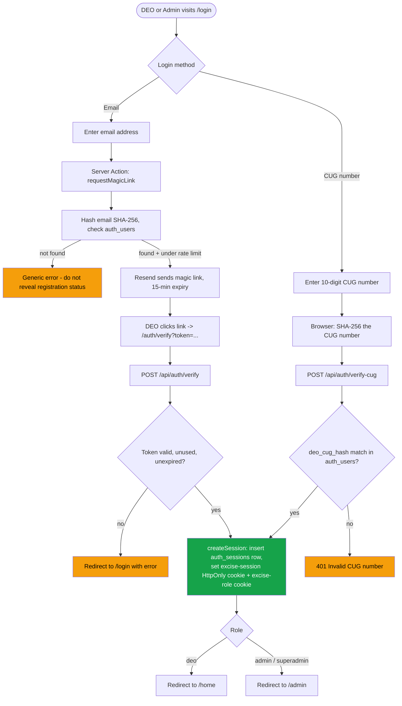
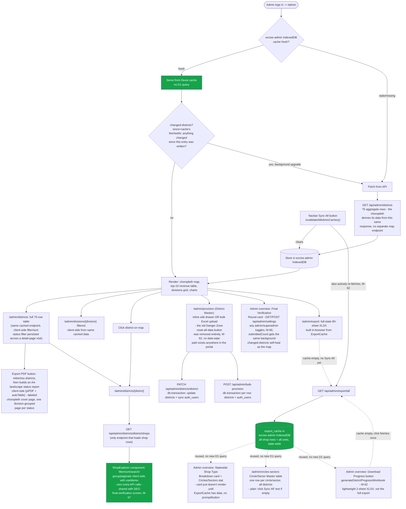
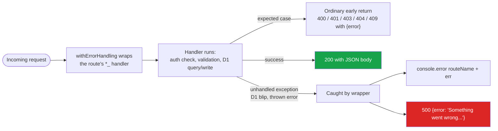

# App Flow

Mermaid diagrams of how requests move through the portal. See [CLAUDE.md](../CLAUDE.md) and
[roadmap.md](../roadmap.md) for the full architectural context behind each step.

## 1. Authentication (both login paths)

```mermaid
flowchart TD
    Start([DEO or Admin visits /login]) --> Choice{Login method}

    Choice -->|Email| EmailInput[Enter email address]
    EmailInput --> ReqLink[Server Action: requestMagicLink]
    ReqLink --> HashEmail[Hash email SHA-256, check auth_users]
    HashEmail -->|not found| GenericErr[Generic error - do not reveal registration status]
    HashEmail -->|found + under rate limit| SendEmail[Resend sends magic link, 15-min expiry]
    SendEmail --> ClickLink[DEO clicks link -> /auth/verify?token=...]
    ClickLink --> VerifyEP[POST /api/auth/verify]
    VerifyEP --> CheckToken{Token valid, unused, unexpired?}
    CheckToken -->|no| LoginErr[Redirect to /login with error]
    CheckToken -->|yes| CreateSession

    Choice -->|CUG number| CugInput[Enter 10-digit CUG number]
    CugInput --> HashCug[Browser: SHA-256 the CUG number]
    HashCug --> CugEP[POST /api/auth/verify-cug]
    CugEP --> CheckCug{deo_cug_hash match in auth_users?}
    CheckCug -->|no| CugErr[401 Invalid CUG number]
    CheckCug -->|yes| CreateSession

    CreateSession[createSession: insert auth_sessions row,\nset excise-session HttpOnly cookie + excise-role cookie] --> RoleCheck{Role}
    RoleCheck -->|deo| HomeDEO[Redirect to /home]
    RoleCheck -->|admin / superadmin| HomeAdmin[Redirect to /admin]

    style CreateSession fill:#16a34a,color:#fff
    style GenericErr fill:#f59e0b,color:#000
    style CugErr fill:#f59e0b,color:#000
    style LoginErr fill:#f59e0b,color:#000
```

## 2. DEO workflow — gated, one step at a time

```mermaid
flowchart TD
    Login([DEO logs in]) --> HomeCheck{district_circles_sectors\nrow exists for district?}

    HomeCheck -->|no| UnitsOnly["/home shows ONLY\nCreate Circles & Sectors card"]
    UnitsOnly --> TypeStep["/units step 1: only sectors /\nonly circles / both - radio"]
    TypeStep --> UnitsPage["/units step 2: enter counts\n(only the relevant field shown)"]
    UnitsPage --> NameBoxes["/units step 3: sectors are numbered\nonly (Sector - 1, Sector - 2, confirm\nonly, no name box); circles get a\nname box, Circle N.. starts at 1 if\nno sectors else 2, inline warning if\nthe word 'circle' is typed in the box"]
    NameBoxes --> ConfirmLock[SweetAlert2: confirm - cannot change afterward]
    ConfirmLock --> PostUnits[POST /api/districts/district/units]
    PostUnits --> LockCheck{Any existing unit row?}
    LockCheck -->|yes, 409| Rejected[Rejected - already locked]
    LockCheck -->|no| BatchInsert[db.batch: insert all units + audit_log unit_registered]
    BatchInsert --> Locked[Units locked - Upload/Verify now unlock]

    Locked -.->|DEO made a mistake| ReqUnlock["/units: Request Unlock button\nSweetAlert2 textarea, reason required"]
    ReqUnlock --> PostUnlock[POST /api/districts/district/request-unlock\naudit_log unlock_requested]
    PostUnlock --> PendingBanner["/units shows pending banner\n(polls GET on load)"]
    PendingBanner -.->|Admin reviews on\n/admin/unlock-requests| Resolve{Admin: approve or deny?}
    Resolve -->|approve, note required| UnlockRows[Delete district_circles_sectors rows\naudit_log units_unlocked]
    Resolve -->|deny, note required| DenyBanner["/units shows denied banner\n+ admin's note"]
    UnlockRows --> UnitsPage

    HomeCheck -->|yes| FullNav["/home shows Upload + Verify cards\n+ nav links appear"]
    Locked --> FullNav

    FullNav --> Download["/upload: Download Current Data /\nDownload District Template - built\nclient-side via generateTemplate(),\nno dedicated API route (the old\nGET .../template only ever returned\ndata already available client-side\nand was removed)"]
    Download --> FillExcel[DEO/Inspectors fill workbook\noffline, per circle/sector]
    FillExcel --> UploadPage["/upload: select consolidated .xlsx"]
    UploadPage --> ParseBrowser[Parse in-browser with ExcelJS\nDMS-to-DD, revenue calc, UP bbox validation]
    ParseBrowser --> MandatoryCheck{validateRow: adjacentThanasRaw\nnon-blank? mandatory as of M-58}
    MandatoryCheck -->|blank| RowErrorPreflight[Row marked status=error at parse time,\nexcluded from submission - same path\nas any other validateRow failure]
    MandatoryCheck -->|filled| StageIDB
    RowErrorPreflight --> StageIDB[(Stage rows in IndexedDB\nDexie - excise-deo DB)]
    StageIDB --> ChunkUpload[POST /api/upload/chunk\n500 rows per batch]
    ChunkUpload --> DualVerify{Worker recomputes\ntotal_revenue - matches?}
    DualVerify -->|no| RowRejected[Row rejected with reason]
    DualVerify -->|yes| BatchWrite[db.batch: upsert rows + audit_log upload_chunk]

    ChunkUpload -.->|status already submitted| ChunkLocked[409 - district locked,\nno new uploads accepted]

    BatchWrite --> VerifyPage["/verify: review staged rows"]
    VerifyPage --> FlagAdjacent[Red-pill heuristic: filled-in adjacent Thana\nnames not in this district's own thanaName set\n- non-blocking, unrelated to the mandatory check above]
    FlagAdjacent --> FixFlags[DEO corrects flagged rows]
    FixFlags --> ConfirmSubmit[SweetAlert2: confirm + typed name\npromptDeoNameAndLock, liability disclaimer]
    ConfirmSubmit --> PostSubmit[POST /api/districts/district/submit\nbody: submittedByName]
    PostSubmit --> MissingCheck{All locked units\nhave uploaded rows?}
    MissingCheck -->|no| SubmitBlocked[400 - missing data for units: ...]
    MissingCheck -->|yes| SubmitBatch[db.batch: status=submitted +\ndistricts.deoName=submittedByName +\naudit_log district_submitted]
    SubmitBatch --> RespOk{response.ok?}
    RespOk -->|no| SubmitFailed[Error Swal - no cache change,\nDEO can retry]
    RespOk -->|yes| ReseedIDB[stagingDb.clearAll then re-seed\nphase1_staging from GET .../shops\nall rows marked status=uploaded]
    ReseedIDB --> Done(["/home Step 3, nav links, /verify and\n/upload all switch to locked/read-only view\n(districts.status===submitted)"])

    Done -.->|DEO finds wrong data\nfor an already-uploaded shop| ReqCorrection["/upload locked view:\nRequest Data-Correction Unlock button"]
    ReqCorrection --> PostUnlock2[POST .../request-unlock\nrequestType=data_correction\nSweetAlert2 textarea, reason required]
    PostUnlock2 --> Resolve2{Admin: approve or deny?\n/admin/unlock-requests or district detail}
    Resolve2 -->|approve, note required| ResetStatus[status reset to in_progress\nNO rows deleted - phase1_raw_collection\nand district_circles_sectors untouched]
    Resolve2 -->|deny, note required| DenyBanner2["/upload shows denied banner\n+ admin's note"]
    ResetStatus --> ForceSync["Download Current Data always\nforce-refetches from D1 (M-91) -\nnever trusts a possibly-stale\nlocal sync flag for this button"]
    ForceSync --> UploadPage
    UploadPage -.->|re-uploading a file NOT shaped\nlike the DEO template, e.g. the\nadmin's Export XLSX report| WrongFileGuard["parseExcelFile() rejects it -\nmissing the hidden Reference Data\nsheet every real template has -\nwith a specific error naming the\ncorrect download buttons (M-90)"]
    UploadPage -.->|admin can also generate the\ncorrect file directly| AdminTemplate["Admin district detail page:\nDownload Re-upload Template\nbutton, same generateTemplate()\nbuilder, pre-filled from D1 (M-91)"]

    Done -.->|Admin opens the state-wide\nfinal verification round\nM-60, /admin overview toggle| VerifyRoundCheck{"GET .../status: verificationPhaseOpen=true\nAND districtStatus=submitted?"}
    VerifyRoundCheck -->|yes| FinalNav["DEO nav collapses to\nDashboard + Verify only"]
    FinalNav --> FinalScreen["/verify final-verification screen:\nstat cards (clickable Circles/Sectors),\nShopExplorer - same shared component as\nadmin district detail: filters, sort,\ngroup-by-type, Circle/Sector Breakdown,\nXLSX export, RevenueCell popup - M-67"]
    FinalScreen --> SyncOnce{"localStorage verify-synced-{district}\nalready set?"}
    SyncOnce -->|yes| LocalRead[(Read straight from\nphase1_staging IndexedDB\nzero D1 hits)]
    SyncOnce -->|no| OneTimeFetch[Wipe local staging,\nGET .../shops once,\nset the localStorage flag]
    OneTimeFetch --> LocalRead
    LocalRead --> FinalChoice{DEO reviews}
    FinalChoice -->|everything correct| ConfirmVerify[SweetAlert2 confirm + typed name\nPOST .../verify]
    ConfirmVerify --> Verified["status=verified\naudit_log district_verified\nread-only, no further action"]
    FinalChoice -->|sees wrong data| ReqCorrection3["Request Unlock button\n- same request-unlock endpoint/flow\nas ReqCorrection above"]
    ReqCorrection3 -.-> Resolve2

    style Locked fill:#16a34a,color:#fff
    style Done fill:#16a34a,color:#fff
    style Verified fill:#16a34a,color:#fff
    style Rejected fill:#f59e0b,color:#000
    style RowRejected fill:#f59e0b,color:#000
    style SubmitBlocked fill:#f59e0b,color:#000
    style SubmitFailed fill:#f59e0b,color:#000
    style ChunkLocked fill:#f59e0b,color:#000
    style UnlockRows fill:#16a34a,color:#fff
    style ResetStatus fill:#16a34a,color:#fff
    style DenyBanner fill:#f59e0b,color:#000
    style DenyBanner2 fill:#f59e0b,color:#000
    style LocalRead fill:#16a34a,color:#fff
    style WrongFileGuard fill:#f59e0b,color:#000
    style AdminTemplate fill:#16a34a,color:#fff
```

**Note:** `ChunkLocked` (upload rejected) and `ReqCorrection`/`ReqCorrection3`'s branch condition both use the shared `isLocked(status)` helper (`apps/web/src/lib/status.ts`) — a `'verified'` district is rejected/routed identically to a `'submitted'` one everywhere in this diagram, not just at the points drawn explicitly.

## 3. Admin / HQ dashboard — data loading (IndexedDB-first)

```mermaid
flowchart TD
    AdminLogin([Admin logs in -> /admin]) --> CacheCheck{excise-admin IndexedDB\ncache fresh?}

    CacheCheck -->|fresh| UseCache[Serve from Dexie cache\nno D1 query]
    CacheCheck -->|stale/missing| Fetch[Fetch from API]

    Fetch --> Districts[GET /api/admin/districts\n75 aggregate rows - the choropleth\nderives its data from this same\nresponse, no separate map endpoint]
    Districts --> StoreCache[(Store in excise-admin IndexedDB)]
    StoreCache --> Render

    UseCache --> SelfHeal{"changed-districts?since=cache's\nfetchedAt: anything changed\nsince this entry was written?"}
    SelfHeal -->|no| Render[Render: choropleth map,\ntop-10 revenue table, divisions grid, charts]
    SelfHeal -->|yes, background upgrade| Fetch

    Render --> DrillDistricts["/admin/districts: full 75-row table\n(same cached endpoint, client-side filter/sort;\nstatus filter persisted across a detail-page visit)"]
    Render --> DrillDivisions["/admin/divisions/[division]: filtered\nclient-side from same cached data"]
    Render --> ClickPolygon[Click district on map]
    DrillDistricts --> ExportPdf["Export PDF button: refetches districts,\nthen builds an A4-landscape status report\nclient-side (jsPDF + autoTable) - labeled\nchoropleth cover page, one division-grouped\npage per status"]

    ClickPolygon --> DistrictDetail["/admin/districts/[district]"]
    DrillDistricts --> DistrictDetail
    DistrictDetail --> ShopsFetch["GET /api/admin/districts/district/shops\n(only endpoint that loads shop rows)"]
    ShopsFetch --> ClientOps[ShopExplorer component: filter/sort/search/\ngroup/paginate client-side with useMemo\n- zero extra API calls - shared with DEO\nfinal-verification screen, M-67]

    Render --> Provision["/admin/provision (District Master):\ninline edit drawer OR bulk Excel upload\n- the old Danger Zone reset-all-data button\nwas removed entirely, M-62, no data-wipe\npath exists anywhere in the portal"]
    Provision --> PatchEP[PATCH /api/admin/districts/district\ndb.transaction: update districts + sync auth_users]
    Provision --> BulkEP[POST /api/admin/bulk-provision\ndb.transaction per row: districts + auth_users]

    Render --> SettingsCard["Admin overview: Final Verification\nRound card - GET/POST /api/admin/settings\nany admin/superadmin toggles, M-66;\nsubmittedCount gets the same background\nchanged-districts self-heal as the map"]

    SyncAll["Navbar Sync All button\ninvalidateAllAdminCaches()"] -->|clears| StoreCache
    SyncAll -->|also actively re-fetches, M-62| ExportEP[GET /api/admin/export/all]
    ExportEP --> ExportCache[(export_cache in\nexcise-admin IndexedDB\nall shop rows + all units, state-wide)]

    Render --> ExportPage["/admin/export: full-state 80-sheet XLSX\nbuilt in-browser from ExportCache"]
    ExportPage -.->|cache empty, no Sync All yet| ExportEP

    ExportCache -.->|reused, no new D1 query| ShopTypeCard["Admin overview: Statewide Shop-Type\nBreakdown card + Circles/Sectors stat\n- card just doesn't render until\nExportCache has data, no prompt/button"]
    ExportCache -.->|reused, no new D1 query| CirclesSectorsPage["/admin/circles-sectors:\nCircle/Sector Master table\none row per circle/sector, all districts\n- plain 'click Sync All' text if empty"]
    ExportCache -.->|reused, no new D1 query| ProgressBtn["Admin overview: Download Progress button\ngenerateDistrictProgressWorkbook - M-62\nlightweight 2-sheet XLSX, not the full export"]
    ProgressBtn -.->|cache empty, click fetches once| ExportEP

    style UseCache fill:#16a34a,color:#fff
    style ClientOps fill:#16a34a,color:#fff
    style ExportCache fill:#16a34a,color:#fff
```

## 4. API error handling (every non-trivial route)

```mermaid
flowchart LR
    Req([Incoming request]) --> Wrapped[withErrorHandling wraps\nthe route's *_ handler]
    Wrapped --> Handler[Handler runs:\nauth check, validation, D1 query/write]
    Handler -->|expected case| EarlyReturn["Ordinary early return\n400 / 401 / 403 / 404 / 409 with {error}"]
    Handler -->|success| OK["200 with JSON body"]
    Handler -->|unhandled exception\nD1 blip, thrown error| Caught[Caught by wrapper]
    Caught --> Logged[console.error routeName + err]
    Caught --> Generic["500 {error: 'Something went wrong...'}"]

    style Generic fill:#dc2626,color:#fff
    style OK fill:#16a34a,color:#fff
```
