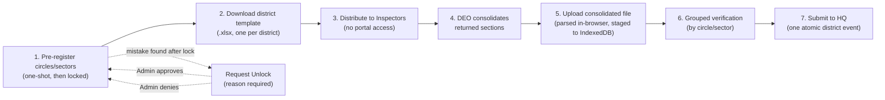
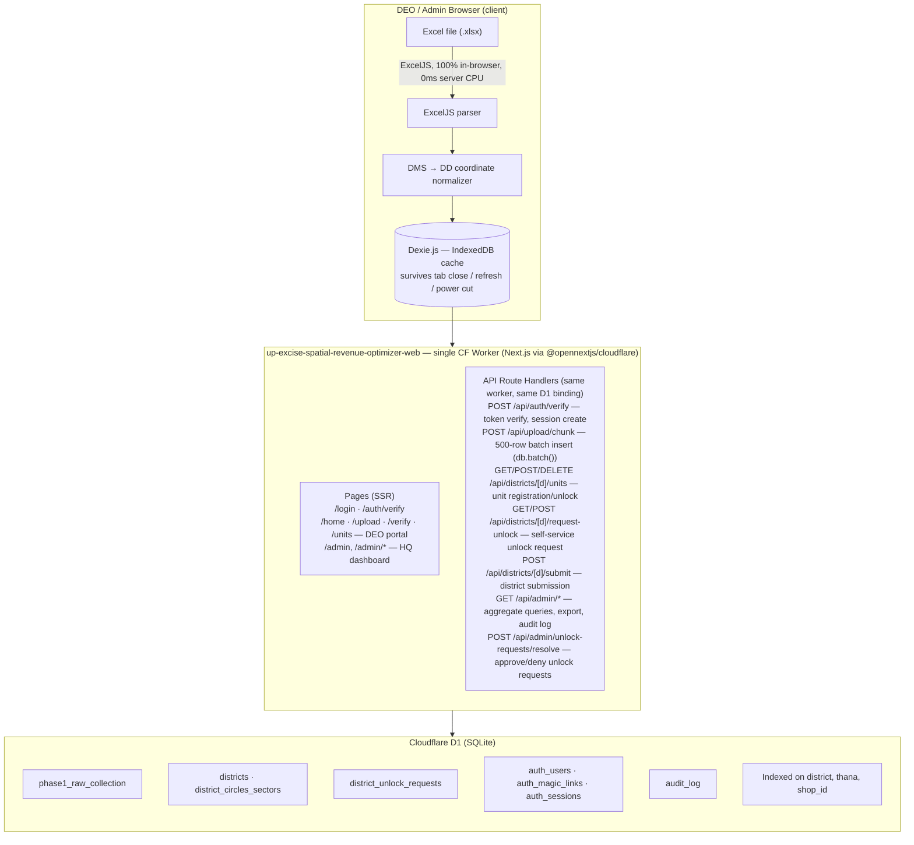
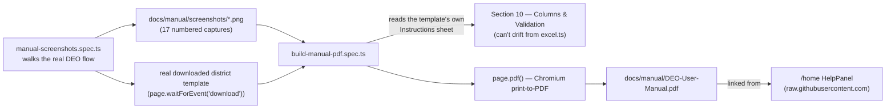

# State Excise Portal — Spatial & Revenue Optimization System
## Official Engineering Roadmap: Phase 1 — Comprehensive Data Collection Pipeline

See also [docs/app-flow.md](docs/app-flow.md) for Mermaid diagrams of the auth flow, DEO workflow, admin data loading, and API error handling.

---

| Field | Value |
|---|---|
| **Document Version** | 1.2.0 |
| **Classification** | Internal Engineering Master Document |
| **Target Phase** | Phase 1 — Comprehensive Data Harvesting & Verification |
| **Prepared By** | Subhan Raj, CSE Engineer — SIBIN Tech Solutions |
| **Consulting For** | Department of Excise, Government of Uttar Pradesh |
| **Authored** | 2026-06-25 |
| **Last Updated** | 2026-07-11 |
| **Status** | Phase 1 Code-Complete — Running on Cloudflare Free Tier — Pending Departmental DEO Rollout |

> **Authority note:** This document is the original engineering *plan* and is kept for business-rule and schema-rationale context. For the authoritative **current implementation state** — what actually shipped, exact file paths, and the live milestone log — see [CLAUDE.md](CLAUDE.md), which is updated on every change. Two architecture pivots happened after this document's early sections (§3.3–§3.12) were written and were not retrofitted into that prose everywhere it's mentioned:
> - **Auth (M-6):** Clerk was fully removed and replaced with custom HMAC magic-link auth (no external auth provider). Any reference to Clerk, `clerkMiddleware`, `publicMetadata.role`, or Clerk webhooks below describes the superseded original design — see CLAUDE.md's "Authentication Architecture" section for what's actually running.
> - **Spreadsheets (M-14):** SheetJS + hand-patched worksheet XML was fully replaced with ExcelJS as the single spreadsheet library. Any reference to SheetJS or the `xlsx` npm package below is superseded — see CLAUDE.md's "Frontend CDN Stack" section.
>
> Section 6 (Development Milestones) is up to date through M-16 as of this revision.

---

## Table of Contents

1. [Executive Summary & Phase 1 Objectives](#1-executive-summary--phase-1-objectives)
2. [Business Rules & Operational Constraints](#2-business-rules--operational-constraints)
3. [Edge Architecture & Zero-Cost Strategy](#3-edge-architecture--zero-cost-strategy)
4. [Data Dictionary & Shop Classification Matrix](#4-data-dictionary--shop-classification-matrix)
5. [Phase 1 Database Schema](#5-phase-1-database-schema)
6. [Development Milestones & Action Plan](#6-development-milestones--action-plan)

---

## 1. Executive Summary & Phase 1 Objectives

### 1.1 Strategic Context

The Department of Excise, Government of Uttar Pradesh, administers approximately **30,000 retail liquor vends** across **75 districts** and **18 administrative divisions**. The existing jurisdictional structure — circles, sectors, and Thana-level assignments for Excise Inspectors — was drawn decades ago and has not been systematically recalibrated against ground-level spatial realities, revenue density, or population shifts. The result is a fragmented administrative landscape: some Inspectors carry disproportionate geographic loads while others operate over-segmented, low-density territories. Revenue leakage, accountability gaps, and enforcement blind spots persist as a direct consequence.

This project, the **State Excise Portal Spatial & Revenue Optimization System**, is a two-phase initiative designed to correct this at scale.

### 1.2 The Two-Phase Architecture

**Phase 1 (This Document):** A state-wide data collection campaign. 75 District Excise Officers (DEOs) will upload structured spreadsheets through a browser-based portal. The system will ingest, validate, and store granular administrative, spatial, and financial metrics for every retail vend in the state. This phase produces the single authoritative dataset that everything downstream depends on.

**Phase 2 (Subsequent):** Using the Phase 1 dataset as its mathematical and spatial baseline, the system will run boundary optimization algorithms to redefine circles and sectors, reassign Excise Inspector jurisdictions, eliminate geographic redundancies, and surface revenue anomalies. Phase 2 is entirely dependent on the quality and completeness of Phase 1 data.

> **The engineering implication is direct:** every schema decision, every validation rule, and every data field defined in Phase 1 must anticipate the spatial and financial computations Phase 2 will perform. There is no tolerance for ambiguity in Phase 1 output.

### 1.3 Phase 1 Core Objectives

| # | Objective | Success Criterion |
|---|---|---|
| O-1 | **Universal Coverage** | 100% of ~30,000 retail vends across all 75 districts captured with no district gaps. |
| O-2 | **Spatial Accuracy** | Every vend has a geocoordinate stored in Decimal Degrees (DD), normalized from DEO input regardless of whether input is DMS or DD format. |
| O-3 | **Financial Precision** | Revenue fields collected at the component level (LF, MGR, BLF, MGQ, etc.), with the system computing and storing `totalRevenue` deterministically from those components. |
| O-4 | **Jurisdictional Mapping** | Every vend is anchored to a Thana, and every Thana records its adjacent Thanas within its own district boundary. |
| O-5 | **Zero Infrastructure Cost** | The entire system runs on Cloudflare's free tier. No server provisioning, no managed database licensing, no cloud compute bills during Phase 1. |
| O-6 | **Data Integrity Under Field Conditions** | Browser-side caching (IndexedDB) ensures no partial entry is lost due to connectivity issues, accidental refreshes, or tab closures in the field. |
| O-7 | **Audit Trail** | Every record carries the uploading DEO's identity and a creation timestamp for accountability. |

### 1.4 Explicit Scope Exclusions

The following are **outside the boundary of Phase 1** and must not be captured, implied, or encoded in the schema:

- High-end hotel and restaurant bars.
- Commercial lounges and banquet hall licenses.
- Wholesale distribution licenses.
- Any outlet category that does not map to the five retail classifications defined in Section 4.

Attempting to force out-of-scope data into Phase 1 fields will corrupt the Phase 2 optimization baseline. DEOs must be briefed on this boundary before the upload campaign begins.

---

## 2. Business Rules & Operational Constraints

This section defines the non-negotiable rules that govern data structure, validation logic, and UI behavior. These are not implementation preferences — they are the operational realities of excise administration in UP, and the system must enforce them without exception.

### 2.1 The Thana as the Atomic Geographic Unit

The **Thana** (police station jurisdictional area) is the smallest indivisible geographic unit in this system. All spatial analysis in Phase 2 — boundary remapping, Inspector workload balancing, contiguity checks — operates at the Thana level.

**Critical distinction:** While the Thana is borrowed from the police administrative structure as a naming convention, **Excise jurisdiction supersedes police boundaries**. A single Excise Inspector may be assigned a Thana that corresponds to multiple police sub-jurisdictions, or conversely, a Thana boundary in Excise records may differ from the police definition for the same name. Phase 1 uses the Excise-authoritative Thana names as the canonical identifier.

**Implication for schema design:** `thanaName` is stored as a free-text string, not a foreign key to a locked reference table. This is intentional. Enforcing referential integrity against a pre-seeded Thana master list would block uploads if DEOs encounter naming variations in legacy spreadsheets. Normalization of Thana name variants is a Phase 2 data-cleaning task.

### 2.2 Inspector Assignment Constraints (Phase 2 Alignment Rule)

Phase 1 does not store Inspector assignments. However, Phase 1 data collection is designed to feed Phase 2's assignment optimizer, which enforces the following hard rule:

> **One Thana → Maximum One Excise Inspector.**
> **One Inspector → Permitted Multiple Thanas.**

This rule exists to eliminate the accountability vacuum that emerges when two Inspectors share jurisdiction over a single Thana. Every vend in Phase 1 must be unambiguously anchored to exactly one Thana so that Phase 2 can compute clean, non-overlapping assignment territories.

Any vend record where `thanaName` is null, empty, or ambiguous will be flagged as a Phase 2 blocker and must be resolved before boundary optimization runs.

### 2.3 The Adjacent Thana Rule

Adjacency data is critical for Phase 2's contiguity-based remapping. If Inspector territories are to be reorganized into logical geographic clusters, the system must know which Thanas share borders. Phase 1 collects this at the Thana level: every Thana entry records a list of its bordering Thanas.

**The cross-district exclusion rule is absolute:**

> Adjacent Thanas must belong to the **same district** as the source Thana. Cross-district adjacency is ignored and must be filtered from DEO input.

**Example:** Thana BBD in Lucknow district physically borders Thana Safedabad in Barabanki district. For data entry in Lucknow's dataset, Safedabad must **not** appear in BBD's adjacent Thana list. Equally, Barabanki's dataset entry for Safedabad must **not** list BBD as adjacent. The cross-district exclusion is symmetric — neither DEO may encode cross-district adjacency, regardless of which side the border lies on.

**Rationale:** Excise administration is organized by district chains of command. Allowing cross-district adjacency in the optimization model would create pressure to merge territories across district lines, which violates administrative accountability structures. Phase 2's optimizer is district-bounded by design.

**Storage format:** Adjacent Thanas are stored in `adjacentThanasRaw` as a comma-separated string (e.g., `"Gomti Nagar,Chinhat,Alambagh"`). The frontend parses this into interactive pills for DEO review. The raw string is retained in D1 for simplicity; Phase 2 will parse and normalize it.

**Current implementation status (as of M-21) — this is the policy target above, not what runs today:** there is no state-wide Thana master list (Pre-Campaign Blocker #3 below), so nothing in the system can actually check "does this Thana belong to district X." The Worker (`api/upload/chunk/route.ts`) does not validate `adjacentThanasRaw` at all. The verify page's red-pill highlight (`app/(deo)/verify/page.tsx`) is a same-district, same-upload self-consistency heuristic only — it flags a name if it doesn't (yet) also appear as a `thanaName` elsewhere in that same DEO's own district data, which catches typos but can't detect a genuine cross-district name and can false-positive on a real same-district Thana with no shop in this particular upload. It does not block submission. Closing this gap for real requires the Thana master list.

### 2.4 Coordinate Input & Normalization Rules

Legacy Excise spreadsheets record coordinates in **Degrees, Minutes, Seconds (DMS)** format, inherited from survey maps. Modern GIS tools require **Decimal Degrees (DD)**. The system must handle both without friction.

**Rule:** The database stores coordinates **exclusively in Decimal Degrees**. The frontend performs all conversion before transmission. No DMS values reach the Cloudflare Worker.

**Supported input formats:**

| Input Format | Example | Handled By |
|---|---|---|
| Decimal Degrees (DD) | `26.8467, 80.9462` | Accepted as-is, validated for UP bounding box |
| DMS — Textual | `26°50'48.1"N, 80°56'46.3"E` | Converted to DD by frontend parser |
| DMS — Numeric fields | `26 / 50 / 48.1` (separate fields) | Converted to DD by frontend parser |

**Bounding box validation for UP:** After conversion, the frontend validates that coordinates fall within the approximate geographic envelope of Uttar Pradesh:
- Latitude: `23.8° N` to `30.4° N`
- Longitude: `77.1° E` to `84.6° E`

Records outside this bounding box are flagged with a warning and held in the DEO verification queue — they are not silently dropped or auto-corrected.

### 2.5 Data Entry Language Constraint

> **All data entered into the system must be in English.** Hindi, Devanagari script, Urdu, or any other language or script is not accepted. This constraint applies to all text fields including shop names, Thana names, district names, DEO identifiers, and any free-text notes fields that may be added in future iterations.

This constraint is enforced at the UI level with input validation and is documented here so that DEO training materials align with it from day one.

### 2.6 DEO Identity & Accountability

The District Excise Officer (DEO) is the most senior excise post at the district level. They oversee all Excise Inspectors across every circle and sector in their district. In the context of this system, the DEO is the sole authenticated portal user for their district — they download the district Excel template, distribute it to Inspectors, collect and consolidate the completed sections into a single district file, upload and verify it through the portal, and are the single entity that commits data to D1 for their district.

Every record written to D1 carries `uploadedByDeo` — a non-nullable string identifier for the submitting DEO. This is an audit tag, not an authentication mechanism. DEO identifiers will be assigned by the department and distributed alongside portal credentials.

---

### 2.7 Circle/Sector Pre-Registration & Delegated Data Collection

A district typically comprises multiple circles and sectors, each overseen by an individual Excise Inspector. The system supports a **delegated data collection model**: Inspectors fill in their portions of a standardised Excel template and hand the completed sections back to the DEO, who consolidates everything into one district file and uploads it. The DEO is always the sole portal user and the sole entity that submits data — Inspectors have no portal access and perform no upload. All data for a district is uploaded as **a single consolidated district-level Excel file** — there is no per-circle/sector file.

**Workflow:**



1. **Pre-registration — one-shot and locked (M-15):** The DEO does not add circles/sectors one at a time. The Circle/Sector Management UI first asks how many circles and how many sectors the district has, generates that exact number of pre-labelled name boxes, and the DEO fills each one in (circle names conventionally carry an area, e.g. "Circle 1 Mall, Malihabad"; sector names are usually just a number, e.g. "Sector 1", but may also carry an area). A SweetAlert2 confirmation warns this cannot be changed afterward, then the full list is submitted in a single request and stored in D1 in the `district_circles_sectors` table, scoped to the DEO's district. The registration endpoint then rejects any further attempt to add units for that district — the DEO cannot partially register, come back later, and add more. Upload and Verify are not shown to the DEO at all until this step is complete.
   - **Circle numbering convention (M-23):** sectors cover a district's urban area, circles cover its rural area. If a district has no sectors (purely rural), circle name placeholders start at "Circle 1". If a district has any sectors, "Circle 1" belongs to the sector-covered urban area and is never reused for a rural circle, so circle placeholders start at "Circle 2" instead. This is a UI placeholder-text convention only (`apps/web/app/(deo)/units/page.tsx`) — the DEO always types the real name, and neither the schema nor `POST /api/districts/[district]/units` enforces or depends on the number.
   - **Self-service unlock requests (M-24):** since there is no edit/delete path for a locked unit list, a wrong entry previously required the DEO to contact an Admin outside the app. `/units` now offers a "Request Unlock" button once locked — the DEO types a reason (required), stored in `district_unlock_requests` (409 if a pending request already exists). Admins review and resolve every request on `/admin/unlock-requests`; approving deletes the district's `district_circles_sectors` rows (same effect as the pre-existing manual admin-side unlock) and denying requires the admin's own note, same as approving.

2. **Template generation:** The portal generates **one district-wide Excel template** (`.xlsx`) with the district name pre-filled in the header and a `circle_sector_name` column included for every data row. There is one template per district — not one per circle/sector. The DEO downloads this single template and distributes blank copies to each Inspector.

3. **Inspector fill:** Each Inspector fills their section of the template with shop details for their jurisdiction, entering their circle/sector name in the `circle_sector_name` column on every row they add. They return the completed section to the DEO. Inspectors have no portal access — all portal interactions are the DEO's responsibility.

4. **DEO consolidation:** The DEO collects all returned Inspector sections and consolidates them into the single district Excel file — each row already carries its `circle_sector_name` tag from step 3.

5. **Single district upload:** The DEO uploads the consolidated district Excel file to the portal. The system parses all rows in-browser (ExcelJS, see M-14), reads the `circle_sector_name` value from each row, and writes the full dataset to IndexedDB in one operation.

6. **Grouped verification UI:** The staging interface organizes rows in tabs or collapsible sections by circle/sector (grouped by `circle_sector_name` column values). The DEO reviews each unit's data independently — correcting coordinates, removing invalid adjacency pills, verifying revenue totals.

7. **Collective district submission — confirmed (M-15):** The final submit action shows a SweetAlert2 confirmation (record count, bilingual warning) before batching all staged rows and transmitting them to the Worker as a single district submission. The Worker treats the district as one atomic unit — individual circle/sector boundaries are metadata tags on the rows, not separate submission events.

**HQ-level view:** At the headquarters dashboard, data is aggregated and displayed at the **district level only**. Circles and sectors are available as a drill-down dimension within the DEO's portal view but are not surfaced at the state-level summary. HQ sees: "Lucknow — 587 vends — ₹X total revenue."

**Completeness gate:** The submission button is active only when every registered circle/sector for the district has at least one verified row present in the staged IndexedDB dataset. The system checks the `circle_sector_name` distribution across all staged rows against the registered unit list — a registered unit with zero staged rows blocks submission. Partial district submissions are blocked — the Phase 2 optimization baseline cannot be built on incomplete district data.

---

## 3. Edge Architecture & Zero-Cost Strategy

### 3.1 The Cloudflare Free Tier Constraint

Phase 1 must operate with **zero infrastructure cost**. This is not a preference — it is a hard budget constraint for the data collection phase. The architecture is engineered specifically around Cloudflare's free tier limits:

| Resource | Free Tier Limit | Our Strategy |
|---|---|---|
| **Workers CPU Time** | 10ms per request | All heavy compute (Excel parsing, DMS conversion) runs in the browser, not the Worker. The Worker only performs inserts. |
| **Workers Request Count** | 100,000/day | Chunked batch uploads minimize request count per DEO session. |
| **D1 Write Rows** | 100,000/day | `db.batch()` groups multiple inserts into a single transaction, dramatically reducing write operation count. |
| **D1 Read Rows** | 5,000,000/day | Dashboard queries use indexed columns only (`districtName`, `thanaName`, `shopId`). Full table scans are prohibited in Phase 1. |
| **Workers Bandwidth** | 10GB/month | JS bundle is app-logic only (React + components). All libraries (DaisyUI, ExcelJS, Dexie.js, etc.) are served from jsDelivr CDN — zero bandwidth cost on Cloudflare. |
| **Workers Deployments** | Unlimited | Single Worker deployed via CI/CD on every push to `main`. Deploy frequency is never rate-limited or metered — only *runtime* usage (requests, CPU-ms, D1 reads/writes) counts against the free tier. |

**Current status (as of the latest deploy):** the project runs entirely on Cloudflare's free tier — no paid Workers, D1, or add-on plan has been purchased. At the target scale (75 DEOs, each uploading their district once, plus admin browsing), Phase 1 usage is projected to stay well within all five limits above, so **launching Phase 1 to production on the free tier — including sending magic-link invitations to real DEOs and accepting live data — is technically viable today.** The only blockers to a real campaign launch are the department-side items in "Pre-Campaign Blockers" below (DEO email list, column layout sign-off, etc.), not infrastructure capacity. If usage ever approaches a free-tier ceiling (most likely D1 write rows during a compressed bulk-upload window, or Workers CPU time if a future feature moves compute server-side), the fix is to upgrade the specific Cloudflare product hit, not to redesign the architecture.

### 3.2 System Architecture Overview



**One Worker, no Pages, no separate API worker:**
- `up-excise-spatial-revenue-optimizer-web` — Next.js app built with `@opennextjs/cloudflare`. All pages AND all 19 API route handlers live in this single Worker. Same-origin means the session cookie is sent automatically — no Bearer tokens, no CORS, no API secrets between frontend and backend.

**Build & deploy commands (from `apps/web`):**
```bash
pnpm exec opennextjs-cloudflare build   # builds Next.js → .open-next/
pnpm exec opennextjs-cloudflare deploy  # deploys .open-next/ as a Worker
```
CI runs both sequentially in the `deploy-portal` job. `wrangler.jsonc` in `apps/web` points Wrangler at `.open-next/worker.js` and declares the D1 binding.

### 3.3 The Excel Ingestion Pipeline — Step by Step

**Step 1: Client-Side Excel Parsing (SheetJS)**

The DEO selects a standardized `.xlsx` file. The browser loads SheetJS (`xlsx` package) and parses the binary workbook entirely in memory. No file data is transmitted to any server at this stage. The parser extracts rows into a typed JavaScript array matching the Phase 1 schema.

This is the critical architectural decision that keeps the Cloudflare Worker within its 10ms CPU budget. A Worker that attempted to parse a 30,000-row Excel file would time out catastrophically. By running the parse in the browser, we consume the DEO's machine CPU — which has no limits — and send the Worker only clean, structured JSON.

**Step 2: Coordinate Normalization**

Immediately after parsing, a coordinate normalizer runs over every row. The normalizer handles:
- Pure DD input: passes through with bounding box validation.
- DMS in a single text field: regex-parsed, converted via the standard formula:
  `DD = Degrees + (Minutes / 60) + (Seconds / 3600)`
- DMS in separate numeric fields: combined and converted using the same formula.
- Hemisphere indicators (`N`/`S` for latitude, `E`/`W` for longitude) are handled: Southern and Western values produce negative DD.

After normalization, `latitudeDecimal` and `longitudeDecimal` are populated for every row that had valid coordinate input. Rows with invalid or missing coordinates are flagged — not dropped — and surface in the verification UI with a visual warning.

**Step 3: IndexedDB Persistence (Dexie.js)**

The normalized dataset is immediately written to the browser's IndexedDB via Dexie.js. This local store acts as a durable staging area. The DEO can:
- Close the browser tab and reopen it — data is recovered.
- Lose network connectivity — data is safe.
- Partially submit (some chunks uploaded, session interrupted) — the IndexedDB store tracks which rows have been acknowledged by the Worker so that resumption skips already-committed rows.

**Step 4: Verification UI**

The Next.js interface renders the staged data in a paginated table. Key interactions:
- **Adjacent Thana Pills:** The `adjacentThanasRaw` string is split on commas and rendered as removable pill components. The DEO can delete incorrect adjacencies before submission. The district-boundary filter (Section 2.3) runs here — pills referencing out-of-district Thanas are highlighted in red and must be removed before the row is cleared for submission.
- **Revenue Preview:** For each row, the system computes and displays the expected `totalRevenue` based on `shopType` and `hasCl5cc` using the formulas in Section 4.3. This lets the DEO visually verify that financial inputs are correct before committing.
- **Row-Level Edit:** The DEO can correct any field inline. Changes update the IndexedDB store in real time.

**Step 5: Chunked Batch Submission**

Once the DEO approves the staged data, the frontend transmits it to the Cloudflare Worker in sequential chunks of 500 rows. Each chunk is a single HTTPS POST request with a JSON body. The Worker receives the chunk, validates structure, and calls `db.batch()` to insert all 500 rows in a single D1 transaction. The Worker returns an acknowledgment with the count of successfully inserted rows.

The frontend marks acknowledged rows in IndexedDB. If the session is interrupted mid-upload, the next session resumes from the first unacknowledged chunk.

**Why 500 rows per chunk?**

| Factor | Analysis |
|---|---|
| Worker 10ms CPU limit | At 500 rows, the Worker performs ~500 lightweight SQL inserts via `db.batch()`. D1's batch interface is specifically optimized for this pattern and keeps the Worker well within its CPU window. |
| Payload size | A 500-row JSON payload for this schema is approximately 150–200KB. Well within the 100MB Worker request body limit with massive headroom. |
| Error recovery granularity | A chunk failure affects at most 500 rows. The DEO does not lose an entire district's upload. |

### 3.4 Cloudflare Worker Implementation Notes (Hono)

The Worker is built with [Hono](https://hono.dev/) — a lightweight, TypeScript-first web framework purpose-built for Cloudflare Workers. Hono adds minimal overhead and provides clean routing, middleware, and type-safe request handling.

**Key Worker routes — DEO Portal (`/api/*`):**

| Route | Method | Purpose |
|---|---|---|
| `/api/upload/chunk` | `POST` | Accepts a 500-row batch (tagged with circle/sector), validates, inserts via `db.batch()` |
| `/api/districts` | `GET` | Returns district list for DEO dropdown (reads from `districts` table) |
| `/api/districts/:district/units` | `POST` | DEO registers a new circle or sector |
| `/api/districts/:district/units` | `GET` | Lists all circles/sectors registered for a district |
| `/api/districts/:district/template` | `GET` | Returns the single district-wide Excel template (`.xlsx`) with district name pre-filled and `circle_sector_name` column included |
| `/api/webhooks/clerk` | `POST` | Receives Clerk session events; validates SVIX signature; writes to `audit_log` |
| `/api/healthz` | `GET` | Health probe — returns `200 OK` with no body. Used by CI dry-run and uptime checks. |

**Key Worker routes — Admin Portal (`/api/admin/*`, Clerk `admin` role required):**

| Route | Method | Purpose |
|---|---|---|
| `/api/admin/districts` | `GET` | All 75 districts with summary stats (vend count, annual revenue, status) + top-level `stateTotals: { totalVendCount, totalRevenue }` — lightweight aggregate; never loads shop rows |
| `/api/admin/districts/:district` | `GET` | Single district: DEO info, circles/sectors, submission status, revenue totals |
| `/api/admin/districts/:district/shops` | `GET` | Shop rows for one district. `pageSize` accepts 10/25/50/100 or `all`; default 100; server cap 2000. Admin UI always calls `?pageSize=all` and handles all filtering, sorting, and pagination client-side via `useMemo`. Never returns data across districts in one call. |
| `/api/admin/districts/:district/export` | `GET` | Streams all shop rows for one district as CSV |
| `/api/admin/export/all` | `GET` | Streams the entire `phase1_raw_collection` as a chunked `.xlsx` Excel download. Full-state data path — triggers a file download only, never a UI table. |
| `/api/admin/search` | `GET` | Cross-district search with query params (Section 3.11) |
| `/api/admin/bulk-provision` | `POST` | Receives parsed DEO Excel data; provisions Clerk accounts + inserts `districts` rows |
| `/api/admin/audit-log` | `GET` | Paginated audit log for admin viewer (last 45 days) |
| `/api/admin/map-data` | `GET` | All 75 districts with `{ name, status, vendCount, totalRevenue, expectedVendCount }` — single lightweight call that drives both the choropleth map and the summary charts. Aggregates `phase1_raw_collection` grouped by `district_name`, joined with `districts` metadata. No shop row data returned. |

**Worker validation checklist (enforced before any D1 write):**

- `districtName`, `circleSectorName`, `thanaName`, `shopId`, `shopName`, `shopType`, `uploadedByDeo` must be non-empty strings.
- `shopType` must be one of: `MODEL_SHOP`, `COMPOSITE_SHOP`, `BHANG_SHOP`, `PRV`, `COUNTRY_LIQUOR`.
- `hasCl5cc` must be a boolean; if `true`, `shopType` must be `COUNTRY_LIQUOR`.
- `latitudeDecimal` and `longitudeDecimal`, if present, must be finite numbers within the UP bounding box.
- `totalRevenue` must match the server-side recomputed value from the financial fields — the Worker recomputes revenue independently and rejects rows where the client-sent `totalRevenue` does not match. This prevents silent data corruption.

### 3.5 D1 Database Operational Notes

**Append-only in Phase 1:** The Phase 1 collection table is write-once from a data integrity standpoint. If a DEO re-uploads a corrected dataset for their district, a `UNIQUE` constraint on `shopId` + `districtName` can be used to trigger an upsert rather than a duplicate insert. The deduplication strategy will be finalized during implementation (see Milestone M-3).

**`districts` table — the district registry:** A separate, small (75-row) reference table stores district metadata: DEO name, DEO email, DEO identifier, division, expected vend count, and submission status. This table is the authoritative registry of all districts in the system. The `phase1_raw_collection` table references districts by `district_name` (text soft-reference, not FK) for the same flexibility reasons as Thana names (Section 5.1). The `districts` table keeps district metadata out of the 30,000-row shop table and gives the admin portal a fast, metadata-only query path that never touches shop rows.

**Admin query pattern — district-by-district loading:** The admin portal default view queries `districts` and an aggregation over `phase1_raw_collection` grouped by `district_name` — this gives totals without loading any individual shop rows. Shop-level data is only fetched when the admin drills into a specific district (`/api/admin/districts/:district/shops`). Full-state shop data is never loaded into the UI; the only full-state operation is a streamed CSV export.

**Index strategy:** Three indexes cover the primary query patterns for Phase 1 dashboards:
- `p1_district_idx` — powers district-level summary queries (total vends per district, total revenue per district).
- `p1_thana_idx` — powers Thana-level aggregation queries (vend count per Thana, for Phase 2 load-balancing).
- `p1_shop_idx` — powers individual vend lookups and deduplication checks.

Full-table scans are expected during Phase 2 analysis but are not a production concern during Phase 1 data collection.

---

### 3.6 Security Architecture & Constraints

Security is applied at every layer. No single control is treated as sufficient.

**Transmission Security:**
- All mutations (upload chunk, circle/sector registration, district submission) use HTTP POST with a JSON body. No sensitive or structured data is ever transmitted via URL query parameters. GET endpoints return only read-only reference data.
- All traffic is HTTPS-only. Mixed content is blocked by CSP. The Worker rejects any non-HTTPS origin.
- The Worker validates and sanitizes all inbound fields before any D1 write: string fields are trimmed and length-bounded; numeric fields are type-coerced and range-checked; enum fields are verified against an allowlist.
- Worker responses never expose stack traces or internal state. Only structured error objects are returned: `{ error: string, rejectedRows?: [...] }`.

**Secret & Credential Management:**
- No API keys, secrets, or service credentials are embedded in the frontend bundle, committed to source, or returned in API responses.
- Clerk's publishable key (safe for frontend exposure by design) is the only credential in the frontend environment. All Clerk secret keys and the Clerk webhook signing secret live in Cloudflare Workers Secrets — never in `wrangler.toml`.
- D1 is accessed exclusively via the Workers binding. It has no public connection string and is not reachable from the internet directly.

**Content Security Policy (CSP):**
Declared in `public/_headers` (served as static response headers by the portal Worker via `@opennextjs/cloudflare`):
```
/*
  Content-Security-Policy: default-src 'self'; script-src 'self' https://cdn.jsdelivr.net https://cdn.tailwindcss.com; style-src 'self' https://cdn.jsdelivr.net; connect-src 'self' https://<worker-domain>.workers.dev; img-src 'self' data: https://*.basemaps.cartocdn.com; frame-ancestors 'none'; base-uri 'self'; form-action 'self'
  X-Content-Type-Options: nosniff
  X-Frame-Options: DENY
  Referrer-Policy: strict-origin-when-cross-origin
  Permissions-Policy: camera=(), microphone=(), geolocation=()
```
No `unsafe-inline` or `unsafe-eval` directives are permitted.

**Subresource Integrity (SRI):**
Every CDN-served `<script>` and `<link>` tag must include `integrity` and `crossorigin="anonymous"` attributes. SRI hashes are pinned to a specific library version and committed to the codebase. Updating a library requires regenerating and committing the corresponding hash. A CI step fails the build if any CDN asset tag is missing its `integrity` attribute.

```html
<!-- Example — DaisyUI from jsDelivr with SRI -->
<link rel="stylesheet"
  href="https://cdn.jsdelivr.net/npm/daisyui@5/dist/full.min.css"
  integrity="sha384-<hash>"
  crossorigin="anonymous">
```

**Rate Limiting:**
Cloudflare built-in rate limiting applied to Worker routes:
- Upload endpoint: max 20 requests/minute per IP.
- Webhook receiver: max 5 requests/minute per IP.

**Session Credential Storage:**
- Clerk session tokens are stored in HttpOnly, Secure, SameSite=Strict cookies — never in localStorage or sessionStorage.
- IndexedDB stores only DEO-entered shop data. Session credentials never touch IndexedDB.

---

### 3.7 Authentication — Custom HMAC Magic-Link (No External Provider)

**Provider:** None. Authentication is implemented entirely in-house: HMAC-SHA256 session cookies, UUID magic-link tokens hashed in D1, and Resend for email delivery. No Clerk, no Auth.js, no third-party auth SDK.

**Why custom auth instead of Clerk:**
Clerk added SDK overhead, required route changes on every update, caused constant middleware redirect issues, and its free-tier session duration was fixed at 7 days (enforcing 24h required an app-level hack). With a maximum of ~90 users (75 DEOs + ~15 admins), a few hundred lines of auth code is simpler and more reliable than an external dependency.

**Two-Cookie Design:**

1. **`excise-session`** (HttpOnly, Secure, SameSite=Lax, 24h) — `rawId.hmacSig` where `hmacSig = HMAC-SHA256(rawId, SESSION_SECRET)`. The raw ID is never stored; only `sha256(rawId)` is stored in D1 `auth_sessions`. On every request, the Worker recomputes the HMAC and compares in constant time.

2. **`excise-role`** (`deo` or `admin`, client-readable) — routing hint for middleware. Not a security boundary. The real check happens in server page components via `requireAuth()` and in route handlers via `getSession()`, both of which do a full HMAC verify + D1 session lookup.

**Middleware (cookie-only, no D1 on every request):**
```typescript
// apps/web/middleware.ts
const PUBLIC = new Set(['/login', '/auth/verify']);

export default function middleware(req: NextRequest) {
  const { pathname } = req.nextUrl;
  if (PUBLIC.has(pathname) || pathname.startsWith('/api/') || pathname.startsWith('/_next/'))
    return NextResponse.next();

  const sessionCookie = req.cookies.get('excise-session')?.value;
  if (!sessionCookie) return NextResponse.redirect(new URL('/login', req.url));

  const role = req.cookies.get('excise-role')?.value;
  if (pathname.match(/^\/admin/) && role !== 'admin') return NextResponse.redirect(new URL('/login', req.url));
  if (pathname.match(/^\/(home|upload|verify|units)/) && role !== 'deo') return NextResponse.redirect(new URL('/login', req.url));

  return NextResponse.next();
}
```

Middleware only checks cookie presence and the role cookie — no crypto, no D1. The full HMAC verification happens in `requireAuth()` (server pages) and `getSession()` (route handlers) where D1 is available.

**Magic-Link Flow:**
1. DEO enters email on `/login` → server action `requestMagicLink()`:
   - Validates email exists in `auth_users`
   - Rate-limits: 3 requests per email per 15-minute window (checked via `auth_magic_links` count)
   - Generates UUID token, stores `sha256(token)` in `auth_magic_links` with 15-minute expiry
   - Sends link via Resend (`noreply@mail.exciseup.in`, verified custom domain)
2. DEO clicks link → `/auth/verify?token=xxx` (client component, shows spinner):
   - POSTs `{ token }` to `POST /api/auth/verify` route handler
   - Route handler verifies `sha256(token)` against D1, marks link used, looks up user, calls `createSession()`, returns `{ redirect }`
   - Client does `window.location.href = redirect` (hard navigation to apply cookies)
   - **Why client component:** Next.js 15 forbids `cookies().set()` in Server Component pages. Cookie writes are only permitted in Route Handlers and Server Actions.
3. Session established: `excise-session` and `excise-role` cookies set, 24h TTL.
4. All subsequent API calls are same-origin `fetch('/api/...')` — browser sends session cookie automatically. No Authorization header needed.

**Session Security:**
- Token in URL is a one-time opaque UUID — consumed on first use, expires in 15 min.
- Session cookie value `rawId.hmacSig` — HMAC verified server-side on every protected request.
- Session hash stored in D1 — explicit deletion on logout.
- No session data in `localStorage`, `sessionStorage`, or IndexedDB.

**User Provisioning:**
- Admin seeds `auth_users` rows directly via `POST /api/admin/bulk-provision` (Excel upload) before the campaign.
- No self-registration. Accounts are created top-down by the system administrator.
- DEO `districtName` in `auth_users` scopes all data access to that district only.

**Audit Log:**
Application-level events (upload chunk, district submission, circle/sector registration, login) are written to `audit_log` directly by route handlers on every successful operation. 45-day rolling retention (cron purge deferred — see CLAUDE.md note).

**Auth tables in D1** (`packages/schema/src/auth.ts`):
- `auth_users` — email hash, name, role ('deo'|'admin'), deoId, districtName, deoCugHash (SHA-256 of CUG mobile number, unique nullable, added in migration `0002_add_deo_cug_hash.sql` — alternate login credential to magic-link email)
- `auth_magic_links` — tokenHash (sha256), expiresAt, used flag, createdAt (for rate-limit window)
- `auth_sessions` — id=sha256(rawId), userId FK, expiresAt

---

### 3.8 Frontend Asset & Bundle Strategy

The guiding principle is **CDN-first**: every substantial asset is loaded from jsDelivr (or the library's official CDN where that is faster/canonical). Cloudflare Pages serves only the Next.js JavaScript bundle, which contains React, the app's component logic, and nothing else. This minimises Cloudflare Pages bandwidth usage.

**Design System — Loaded from CDN:**

| Asset | CDN Source | Size (gzip) | Notes |
|---|---|---|---|
| DaisyUI CSS | `cdn.jsdelivr.net/npm/daisyui@5.6.3/daisyui.css` | ~25KB | Semantic component classes: `btn`, `card`, `table`, `modal`, `badge`, `drawer`, etc. Requires Tailwind v4. |
| Tailwind CSS v4 (`@tailwindcss/browser`) | `cdn.jsdelivr.net/npm/@tailwindcss/browser@4` | ~50KB | Runtime utility class generation. **Never** use `cdn.tailwindcss.com` — that serves Tailwind v3, which is incompatible with DaisyUI 5. |

Both are loaded in `<head>` via root `layout.tsx` with SRI attributes. Tailwind is not processed via PostCSS at build time — no Tailwind in the build pipeline, no purge step, no PostCSS config. The Play CDN handles this at runtime.

> **Why `@tailwindcss/browser` CDN instead of build-time?** The portal Worker (via `@opennextjs/cloudflare`) serves only the Next.js application bundle. Removing PostCSS + Tailwind from the build pipeline keeps the bundle exclusively application code. Bandwidth cost for the Tailwind CDN script is borne by jsDelivr, not by Cloudflare Workers bandwidth.

**Data, UI Feedback & Visualization Libraries — Loaded from CDN:**

| Library | CDN Source | Route Groups | Load Strategy |
|---|---|---|---|
| SheetJS (`xlsx`) | `cdn.jsdelivr.net/npm/xlsx@x/dist/xlsx.full.min.js` | DEO + Admin | Dynamic inject on upload page mount (`ssr: false`) — loads only when needed |
| Dexie.js | `cdn.jsdelivr.net/npm/dexie@x/dist/dexie.min.js` | DEO + Admin | `<script>` in root `layout.tsx` — loaded on all pages; Service Worker caches after first load |
| SweetAlert2 | `cdn.jsdelivr.net/npm/sweetalert2@x/dist/sweetalert2.all.min.js` | DEO + Admin | `<script>` in root `layout.tsx` — used across both route groups for all modal alerts, confirms, and prompts. Replaces all native `alert()`/`confirm()`. |
| Notyf | `cdn.jsdelivr.net/npm/notyf@x/notyf.min.js` + `notyf.min.css` | DEO + Admin | `<script>` + `<link>` in root `layout.tsx`. ~3KB JS. Side flash notifications (success, error, warning). Vanilla JS, no framework dependency. Official site: https://carlosroso.com/notyf/ |
| Chart.js | `cdn.jsdelivr.net/npm/chart.js@x/dist/chart.umd.min.js` | Admin only | `<script>` in root `layout.tsx` — guarded by route group; ~60KB gzip |
| Leaflet.js | `cdn.jsdelivr.net/npm/leaflet@x/dist/leaflet.js` + `leaflet.css` | Admin only | `<script>` + `<link>` in root `layout.tsx`; ~39KB JS + ~5KB CSS |

**What ships in the Next.js bundle:**
- React + Next.js App Router runtime
- App-specific TypeScript components and logic (auth, pages, hooks)
- No CSS frameworks, no chart libraries, no map libraries, no data libraries, no Excel parsers, no alert/toast libraries, no auth SDK

**SRI Pin Workflow (for library version upgrades):**
```bash
# Generate SRI hash for a CDN file
curl -s https://cdn.jsdelivr.net/npm/daisyui@5/dist/full.min.css | \
  openssl dgst -sha384 -binary | openssl base64 -A
```
Update the `integrity` attribute and commit the hash alongside the version bump. CI blocks merge if any CDN tag is missing `integrity`.

---

### 3.9 PWA & Offline Architecture

**Progressive Web App:**
The DEO portal is a full PWA. Installed on an iPad or Android tablet, it loads from the Service Worker cache with no network dependency after the first visit.

**`public/manifest.json`:**
```json
{
  "name": "UP Excise Portal",
  "short_name": "Excise Portal",
  "start_url": "/",
  "display": "standalone",
  "background_color": "#ffffff",
  "theme_color": "#1d4ed8",
  "icons": [
    { "src": "/icon-192.png", "sizes": "192x192", "type": "image/png" },
    { "src": "/icon-512.png", "sizes": "512x512", "type": "image/png" }
  ]
}
```

**Service Worker Responsibilities:**
- **App shell caching:** On install, pre-caches the Next.js static HTML, JS bundle, and all CDN assets (DaisyUI CSS, Tailwind CDN script, Dexie.js, SheetJS, SweetAlert2, Notyf). After first load, the entire app and all its dependencies run offline.
- **Offline detection:** Posts `{ type: 'connectivity', online: boolean }` messages to the active page. The connection status indicator reacts to these messages.
- **Background Sync:** When a chunk upload fails due to connectivity loss, the chunk payload is written to an IndexedDB queue and registered with the Background Sync API (`sync.register('upload-queue')`). On connectivity restoration, the Service Worker retries all queued chunks sequentially. No DEO action is required.
- **Cache invalidation:** Service Worker version is tied to the Next.js build hash. On deployment, the new Service Worker installs and takes over, replacing the cached app shell.

**IndexedDB-First Data Rules:**
- Every DEO action (row edit, pill deletion, field change, unit mark-verified) writes to IndexedDB synchronously — before any network call is made or awaited.
- The network upload is a secondary step. A failed upload changes the row status to `'error'` in IndexedDB; the data itself is never lost.
- On page load, the app always reads from IndexedDB first. Network state has no bearing on what the DEO sees.
- Connection drop, network change, tab sleep, or device screen-off never trigger a session clear, IndexedDB wipe, or logout. Only Clerk's 24-hour clock-based expiry touches the session — and even then, IndexedDB data is preserved through re-authentication.

**Supported Devices:**
| Device | Status | Notes |
|---|---|---|
| iPad (Safari, Chrome) | Fully supported — primary field device | PWA install via Safari "Add to Home Screen"; Background Sync supported in Chrome for iOS |
| Android tablet 10"+ (Chrome) | Fully supported — primary field device | Full PWA install + Background Sync |
| Desktop PC/Mac (Chrome, Firefox, Edge, Safari) | Fully supported — office use | |
| Small-screen mobile (< 768px) | Not supported | Verification table not usable. App does not break but no mobile layouts will be built. |

---

### 3.10 Accessibility, UX Standards & User Preferences

**Dark & Light Mode:**
DaisyUI's built-in theme system defines two themes: `excise-light` and `excise-dark`. Applied by setting `data-theme` on `<html>`. An inline script in `<head>` reads `localStorage` and sets the theme before first paint — no flash of wrong theme on load.

**User Preferences (localStorage):**
| Key | Values | Purpose |
|---|---|---|
| `theme` | `'excise-light' \| 'excise-dark'` | UI theme, persisted across sessions |
| `verificationPageSize` | `25 \| 50 \| 100` | Rows per page in the verification table |
| `connectionBannerDismissed` | `'true'` | Whether the DEO has acknowledged the offline banner |

**ARIA & Keyboard Accessibility:**
- All interactive elements (pill delete buttons, inline edit fields, modal dialogs, upload dropzone, accordion sections) have `aria-label` or `aria-labelledby`.
- The verification table uses `role="grid"`, `role="row"`, `role="gridcell"` for keyboard navigation.
- Dynamic updates (upload progress, live revenue recalculation, pill removal) announced via `aria-live="polite"` regions.
- After a modal closes, focus returns explicitly to the trigger element.
- Color is never the sole status indicator — coordinate warnings use color plus an icon glyph.
- Touch targets are minimum 44×44px (WCAG 2.5.8).

**Connection Status Indicator:**
Persistent banner in the app header:
- **Green — "Online"**: network available, Worker reachable.
- **Amber — "Offline — data saved locally"**: no network; all edits write to IndexedDB; nothing is lost.
- **Amber — "Slow connection"**: ping latency > 2s detected; uploads will retry automatically.
The banner is informational and does not interrupt the DEO's workflow.

**Print View:**
A `@media print` stylesheet renders a clean, paginated layout of the verification table. UI controls (edit buttons, pill delete icons, upload actions, navigation) are hidden. Revenue totals and coordinate status are preserved. DEOs can print their staged data as a paper backup before submission.

**Tablet-First Layout:**
- Minimum supported viewport: **768px** (iPad portrait). No `sm` or `xs` breakpoints are used in DEO-facing layouts.
- Breakpoints: `md` (768px) — tablet portrait; `lg` (1024px) — tablet landscape/desktop.
- Horizontal scroll on the verification table is expected on tablet — it is not a layout bug.
- All Tailwind responsive prefixes in JSX use `md:` or `lg:` only.

---

### 3.11 Search Architecture

**DEO-Level Search (Client-Side, IndexedDB):**
DEOs search their own district's staged data without any network request. Dexie.js `where()` and `filter()` APIs query the local IndexedDB store directly.

Searchable fields:
| Field | Match Type |
|---|---|
| Shop name | Substring, case-insensitive |
| Shop ID | Exact or prefix |
| Thana name | Substring |
| Shop type | Enum filter (dropdown) |
| Circle/sector | Filter from registered units |
| Row status | `pending \| uploaded \| error` |

Results render inline in the verification table. Zero Worker calls.

**Admin/HQ Search (Server-Side, D1):**
Admin users access the `(admin)` route group. Search queries go to `GET /api/admin/search` (Worker, guarded by Clerk `admin` role middleware):

| Parameter | Type | Description |
|---|---|---|
| `district` | string | Filter by district name (indexed) |
| `thana` | string | Filter by Thana name (indexed) |
| `shopType` | string | Enum filter |
| `circleSector` | string | Filter by circle/sector name |
| `q` | string | Free-text shop name (SQLite `LIKE '%q%'`) |
| `page` | integer | Pagination, default 50 rows/page |

Free-text `LIKE` requires a column scan on `shop_name`. Acceptable at 30,000 rows for infrequent admin use. If response time exceeds 1s, a SQLite FTS5 virtual table (`phase1_fts`) will be added in a post-Phase-1 migration.

---

### 3.12 Admin/HQ Portal — Route Group Architecture

The DEO portal and Admin/HQ portal are **route groups within a single Next.js application** (`apps/web`). There is one portal Worker deployment (`up-excise-portal`), one build pipeline, and one `middleware.ts`. Both route groups are served from the same Worker.

```
apps/web/app/
├── page.tsx    # Pure redirect → /login (server component, no auth check)
├── login/
│   ├── page.tsx              # Server component: auth() check → role-redirect or render LoginForm
│   └── _components/
│       └── LoginForm.tsx     # 'use client' — Clerk <SignIn> widget (fallbackRedirectUrl="/login")
├── (deo)/
│   └── home/  # DEO home page (URL: /home) — middleware enforces role: 'deo'
├── (admin)/
│   └── admin/ # Admin home page (URL: /admin) — middleware enforces role: 'admin'
```

`page.tsx` at the root is a pure `redirect('/login')` with no auth logic. Role-based routing lives in `login/page.tsx` (a server component): it calls `auth()`, reads `publicMetadata.role` from the JWT, and redirects `admin` → `/admin` or `deo` → `/home`. If the user is authenticated but has no recognised role, it shows an "Account not provisioned" message. Unauthenticated users see the Clerk `<SignIn>` widget via `LoginForm`. The middleware reads `publicMetadata.role` and enforces route group access. A `deo` user hitting any `(admin)` route is redirected to `/login`; an `admin` hitting a `(deo)` route is also redirected. Both groups share the same Clerk project and the same API Worker endpoint.

**`NEXT_PUBLIC_CLERK_SIGN_IN_URL=/login`** must be set at build time so that Clerk's internal redirects use `/login` instead of the default `/sign-in`. Set in `.env.local` for local dev and baked in via the GitHub Actions `deploy-portal` job. Without it, Clerk redirects go to `/sign-in` (not a public route), causing an infinite redirect loop.

| Concern | DEO route group `(deo)` | Admin route group `(admin)` |
|---|---|---|
| App | `apps/web/app/(deo)/home/` | `apps/web/app/(admin)/admin/` |
| URL | `/home` | `/admin` |
| Deployment | Single portal Worker (`up-excise-portal`) | Same Worker, same deployment |
| Auth | `publicMetadata.role: 'deo'` | `publicMetadata.role: 'admin'` |
| Worker routes | `/api/*` | `/api/admin/*` |
| Data access | Own district only (scoped by Clerk `districtName` claim) | All 75 districts, read-only |

**Admin Data Loading — District Summary List with State Totals:**

The admin portal's default view is a **district summary list** — 75 rows showing each district's name, vend count, total annual revenue, and submission status. Beneath the list is an **"All State" totals row** showing cumulative vend count and cumulative total annual revenue across all submitted districts.

The `GET /api/admin/districts` response includes both the 75 district rows and a top-level `stateTotals: { totalVendCount, totalRevenue }` object. This aggregate is pre-computed server-side on every `district_submitted` audit event (the Worker updates a lightweight running total) so the response never runs a full-table scan. On the client, the summary list and state totals are cached in admin IndexedDB (`admin_state_totals` store) with a 15-minute TTL. Page loads within the TTL window serve from IndexedDB without a D1 query.

No individual shop rows are ever fetched for the summary list view. Every number is a `COUNT` or `SUM` aggregate — the list is always O(75) rows regardless of how many shops exist in the state.

**District Drill-Down — Full District Load, Cached:**

When an admin clicks a district, the portal fetches all shop rows for that district from `/api/admin/districts/:district/shops` (100 rows/page) and renders them in a table. All pages for that district are progressively written to the admin IndexedDB (`admin_district_cache`) keyed by district name. On subsequent visits to the same district within the TTL, cached rows are served immediately while a background request checks for updates (stale-while-revalidate). A district with 500 shops loads in approximately 5 paginated requests; the cache means D1 is only queried once per TTL window per district.

Viewing all ~30,000 shop records in a single UI table is an **unsupported operation**. The only full-state data path is the Excel download (`/api/admin/export/all`), which streams the entire `phase1_raw_collection` as a chunked `.xlsx` file download — never rendered in the browser UI. The "Download Full State Data" button in the Export section triggers this route.

**Admin Route Group — IndexedDB (Dexie.js) Cache:**

Dexie.js is loaded from jsDelivr CDN in the root `layout.tsx` and is therefore available in both route groups. The `(admin)` route group maintains three Dexie stores:

| Dexie Store | Key | Contents | TTL |
|---|---|---|---|
| `admin_state_totals` | `'state'` | `{ totalVendCount: number, totalRevenue: number, fetchedAt: timestamp }` | 15 min |
| `admin_district_cache` | `districtName` | `{ rows: Phase1Row[], totalCount: number, fetchedAt: timestamp }` | 1 hour |
| `admin_search_cache` | `queryHash` | Last 10 search result pages | Session only |

The state totals are pre-computed on each `district_submitted` event (the Worker increments a running aggregate), so `GET /api/admin/districts` never triggers a full-table scan in production. The Dexie stores are client-side mirrors of the server-side aggregates.

**Admin Route Group — SheetJS Bulk DEO Provisioning:**

SheetJS is dynamically injected (not in root layout) on the bulk-provision page within the `(admin)` route group. The administrator uploads an Excel file (`.xlsx`) with columns:

| Column | Description |
|---|---|
| `District Name` | Canonical district name matching the system's `districts.name` |
| `Division` | Administrative division (e.g., "Lucknow Division") |
| `DEO Name` | Full name of the District Excise Officer |
| `DEO Email` | Department-issued email — used as Clerk account identifier |
| `DEO Identifier` | Dept-assigned string used as `uploaded_by_deo` in shop records |
| `Expected Vend Count` | Approximate total retail vends in the district (for progress %) |

SheetJS parses the file in-browser. The parsed array is previewed in the UI for admin review before submission. On confirm, it is sent to `POST /api/admin/bulk-provision`, which:
1. Inserts or upserts all 75 rows into the `districts` table.
2. Creates Clerk user accounts for each DEO email using Clerk's management API.
3. Sets the `districtName` metadata claim on each Clerk user for downstream data scoping.
4. Returns a summary of accounts created vs. already existing.

This operation is idempotent — re-running it on an already-provisioned system updates district metadata without creating duplicate Clerk accounts.

**Admin Dashboard — Charts (Chart.js via jsDelivr CDN):**

All charts are powered by a single call to `GET /api/admin/map-data`, which returns 75 district-level aggregate rows. No shop rows are loaded for charting.

| Chart | Type | Data Source |
|---|---|---|
| Submission progress | Doughnut | `submitted` vs `in_progress` vs `pending` district count |
| Revenue by district (top 20) | Horizontal bar | `totalRevenue` per district, sorted descending |
| Shop type distribution | Pie | `COUNT(*)` per `shop_type` across submitted districts |
| Upload progress by district | Stacked bar | `vendCount` vs `expectedVendCount` per district |
| Cumulative uploads over time | Line | Daily `district_submitted` event count from `audit_log` |

Charts use Chart.js direct imperative API via `useEffect` — no React wrapper library. Instances are destroyed and re-created on data refresh to prevent memory leaks.

**Admin Dashboard — Interactive UP District Map (Leaflet.js via jsDelivr CDN):**

A live choropleth map of all 75 UP districts. The primary at-a-glance view for HQ to monitor the upload campaign.

**GeoJSON boundary data:**
- Stored at `apps/web/public/geodata/up-districts.geojson` — all 75 UP district polygons, 615 KB.
- **Source:** OpenStreetMap (OSM) Overpass API, `admin_level=5` administrative boundary relations for Uttar Pradesh. Fetched via `https://maps.mail.ru/osm/tools/overpass/api/interpreter`. OSM uses `admin_level=5` for UP districts (level 6 = tehsils, 316 elements).
- **Processing pipeline** (ad-hoc Python, not committed to repo): (1) fetch Overpass JSON → (2) assemble closed rings from OSM relation ways using greedy chain algorithm → (3) export GeoJSON → (4) RDP simplification with tolerance 0.002° → 26,167 points from 368,779 raw (615 KB from 8.5 MB).
- **Name normalisations** applied to match `districts.name` in D1: Raebareli → Rae Bareli, Sant Ravidas Nagar → Bhadohi, Sharavasti → Shravasti, Siddharthnagar → Siddharth Nagar, Mahrajganj → Maharajganj.
- **Feature property:** `district` — must match `districts.name` in D1 exactly (case-sensitive). No name-map file needed.
- **Note:** The GADM source used in early milestones only covered 70 of 75 districts (missing Hapur, Shamli, Sambhal, Amethi, Kasganj). The OSM source covers all 75 and supersedes GADM.

**Map configuration (as built):**
- Tiles: CartoDB (light/dark variants, switches with `data-theme` MutationObserver); no API key required.
- Layout: full-width card (660px tall on the overview page so the full state fits vertically without excessive zoom-out), charts rendered below in a 2-column grid.
- District borders: `weight: 1.5`, `color: '#334155'` (slate-700). Status fill colours: pending `#94a3b8`, in_progress `#f59e0b`, submitted `#16a34a`. Fill opacity `0.65`.
- Permanent district name labels via `bindTooltip(name, { permanent: true, direction: 'center', className: 'district-map-label' })`. CSS selector in `layout.tsx` global style block must be `.leaflet-tooltip.district-map-label` (not the bare class) to beat Leaflet's own `.leaflet-tooltip` specificity.
- Map locked to UP bounds: `minZoom: 6`, `maxZoom: 10`, `maxBounds: [[22.5, 76.0], [31.5, 85.5]]`, `fitBounds` to `[[23.8, 77.1], [30.4, 84.6]]`.
- Click navigates to `/admin/districts/[name]`.

**Original spec tile URL:** CartoDB Positron — no API key required, neutral background:
```
https://{s}.basemaps.cartocdn.com/light_all/{z}/{x}/{y}{r}.png
```

**Choropleth colour scheme:**
| District Status | Fill | Meaning |
|---|---|---|
| `pending` | `#d1d5db` grey | No data uploaded |
| `in_progress` | `#fbbf24` amber | Some uploads, not yet submitted |
| `submitted` | gradient `#86efac` → `#15803d` | Submitted — gradient intensity = `vendCount / expectedVendCount` (light = low coverage, dark = full coverage) |

**Map interactions:**
- **Hover:** boundary highlights; tooltip shows district name, DEO name, status, vend count, total revenue.
- **Click:** navigates to district drill-down (loads that district's shop table from D1/IndexedDB cache).
- **Legend:** Leaflet control, bottom-right.
- **Zoom:** bounded to UP state extent on load; free zoom thereafter.
- **Auto-refresh:** map data polls `GET /api/admin/map-data` every 5 minutes while the dashboard is open. Last-refreshed timestamp shown below the map.

**Admin Capabilities (Phase 1) — Summary:**
- District summary list: 75 rows (name, vend count, total annual revenue, status) + "All State" totals row at the bottom. Served from IndexedDB within 15-min TTL; D1 not queried within that window.
- Interactive UP district choropleth map — live status, vend counts, revenue on hover; click to drill down.
- Summary charts — submission progress doughnut, revenue bar, shop type pie, district upload stacked bar, cumulative timeline.
- District drill-down: full district shop table (100 rows/page, all pages cached in admin IndexedDB, stale-while-revalidate).
- Cross-district D1 search, paginated, results cached per query hash.
- CSV export per-district (streamed). Full-state data: "Download Full State Data" triggers chunked `.xlsx` file download — no UI table.
- Audit log viewer — last 45 days.
- Bulk DEO provisioning via Excel upload (SheetJS in-browser → preview → submit).

**Admin Cannot (Phase 1):**
- View all ~30,000 shop records in a single browser UI table. Full-state data is available only as a file download.
- Edit, correct, or delete any vend records — Phase 1 data is read-only from admin.
- Trigger re-uploads or corrections on a DEO's behalf.
- Access DEO session tokens or Clerk credential details.

---

## 4. Data Dictionary & Shop Classification Matrix

### 4.1 Administrative Fields

| Field | Type | Rules | Notes |
|---|---|---|---|
| `districtName` | String | Non-null, English only | Canonical district name (e.g., `Lucknow`, `Kanpur Nagar`) |
| `circleSectorName` | String | Non-null, English only | The Excise circle or sector name. Free-text; not normalized against a master list in Phase 1. |
| `thanaName` | String | Non-null, English only | Excise-authoritative Thana name. See Section 2.1. |
| `adjacentThanasRaw` | String | Nullable, intra-district only | Comma-separated list of adjacent Thana names within the same district. |
| `shopId` | String | Non-null, unique per district | Alphanumeric license/registration identifier assigned by the department. |
| `shopName` | String | Non-null, English only | Official name of the retail vend. |
| `uploadedByDeo` | String | Non-null | DEO identifier assigned by the department for this upload campaign. |
| `createdAt` | Timestamp | Non-null, set by system | Unix timestamp (seconds) of record insertion. Not editable by DEO. |

### 4.2 Spatial Fields

| Field | Type | Rules | Notes |
|---|---|---|---|
| `latitudeDms` | String | Nullable | Raw DMS input as entered by DEO, retained for audit. Not used in Phase 2 computation. |
| `longitudeDms` | String | Nullable | Raw DMS input as entered by DEO, retained for audit. |
| `latitudeDecimal` | Real | Nullable, validated against UP bounding box | Computed from DMS or accepted as DD. This is the field used for GIS operations. |
| `longitudeDecimal` | Real | Nullable, validated against UP bounding box | Computed from DMS or accepted as DD. |

### 4.3 Shop Classification & Revenue Matrix

The five retail vend categories, their active financial fields, and their revenue calculation formulas:

> **All monetary revenue figures in this section are annual values (per license year) and are stored in Indian Rupees as whole-rupee integers (no paise).** Figures are stored as complete values — e.g., ₹1,00,00,000 is stored as `10000000`. No abbreviation or unit scaling is applied in the database; UI formatting (lakhs, crores) is a rendering concern only. Every field named below represents an annual charge unless the field description explicitly states otherwise.

#### MODEL_SHOP

| Field | Active? | Description |
|---|---|---|
| `licenseFeeLf` | Yes | Annual license fee paid to the department |
| `mgrAmount` | Yes | Annual minimum guaranteed revenue commitment |
| All other financial fields | No (default 0) | Not applicable to this shop type |

**Revenue formula (annual total):**
```
totalRevenue = licenseFeeLf + mgrAmount + ON_PREMISES_CONSUMPTION_FEE
```

`ON_PREMISES_CONSUMPTION_FEE = ₹3,00,000` — fixed annual On Premises Consumption Fee applied to all Model Shop licences. This is a **department-set constant**, not a per-shop variable. It is defined in `packages/schema/src/constants.ts` and baked into the revenue formula at both the browser (`apps/web/src/lib/revenue.ts`) and the Worker (`apps/worker/src/lib/revenue.ts`). There is no `on_premises_consumption_fee` column in the database and no such field in the Excel template — DEOs do not enter this value.

---

#### COMPOSITE_SHOP

A Composite Shop holds a combined Foreign Liquor (FL) and Beer license. Its revenue has four distinct annual components — two license fee sub-components and two MGR sub-components — that are tracked individually in the database.

| Field | Active? | Description |
|---|---|---|
| `compositeLfFl` | Yes | Annual license fee for the Foreign Liquor component |
| `compositeLfBeer` | Yes | Annual license fee for the Beer component |
| `compositeMgrFl` | Yes | Annual Minimum Guaranteed Revenue — Foreign Liquor |
| `compositeMgrBeer` | Yes | Annual Minimum Guaranteed Revenue — Beer |
| `licenseFeeLf` | Computed | Stored as `compositeLfFl + compositeLfBeer`; used for cross-type LF aggregation in SQL |
| `mgrAmount` | Computed | Stored as `compositeMgrFl + compositeMgrBeer`; used for cross-type MGR aggregation in SQL |
| All other financial fields | No (default 0) | Not applicable |

**Revenue formula (annual total):**
```
totalRevenue = compositeLfFl + compositeLfBeer + compositeMgrFl + compositeMgrBeer
```

**Storage note:** `licenseFeeLf` and `mgrAmount` are stored as the respective component sums to support uniform cross-shop-type SQL aggregation (e.g., `SUM(license_fee_lf)` across all types). The Worker validates `compositeLfFl + compositeLfBeer = licenseFeeLf` and `compositeMgrFl + compositeMgrBeer = mgrAmount` before any D1 write. The four sub-component fields are the authoritative source; the stored totals are derived.

---

#### PRV (Premium Retail Vend)

| Field | Active? | Description |
|---|---|---|
| `licenseFeeLf` | Yes | Annual license fee |
| `mgrAmount` | Yes | Minimum guaranteed revenue commitment |
| All other financial fields | No (default 0) | Not applicable |

**Revenue formula:**
```
totalRevenue = licenseFeeLf + mgrAmount
```

---

#### BHANG_SHOP

| Field | Active? | Description |
|---|---|---|
| `licenseFeeLf` | Yes | Annual license fee |
| `mgqQuantity` | Yes | Minimum guaranteed quantity (units) |
| All other financial fields | No (default 0) | Not applicable |

**Revenue formula (annual total):**
```
totalRevenue = licenseFeeLf + (mgqQuantity × BHANG_MGQ_MULTIPLIER)
```

`BHANG_MGQ_MULTIPLIER = ₹20 per unit` — this is a **per-unit price in Indian Rupees** (₹20 for each unit of minimum guaranteed quantity), not a dimensionless multiplier. `mgqQuantity` is the number of MGQ units; multiplying by ₹20/unit converts it to an annual INR contribution. This constant must be defined as a named value in the shared constants file and must never be inlined as the magic number `20`. DEO training materials must make clear that Inspectors enter the unit quantity, not a rupee amount.

---

#### COUNTRY_LIQUOR (Standard)

| Field | Active? | Description |
|---|---|---|
| `basicLicenseFeeBlf` | Yes | Basic license fee for country liquor license |
| `considerationFee` | Yes | Consideration fee component |
| All other financial fields | No (default 0) | Not applicable |

**Revenue formula:**
```
totalRevenue = basicLicenseFeeBlf + considerationFee
```

---

#### COUNTRY_LIQUOR with CL5CC Endorsement (`hasCl5cc = true`)

This is **not a separate shop type**. A Country Liquor shop with a beer endorsement is stored as `shopType = COUNTRY_LIQUOR` with `hasCl5cc = true`. The CL5CC flag activates additional revenue fields and modifies the revenue formula.

| Field | Active? | Description |
|---|---|---|
| `basicLicenseFeeBlf` | Yes | Basic license fee for country liquor license |
| `considerationFee` | Yes | Consideration fee. Note: for CL5CC shops, MGQ-related components may be embedded in the consideration fee per department conventions — verify with department before finalizing. |
| `specialBeerLf` | Yes (CL5CC only) | Special license fee for the beer endorsement |
| `specialBeerMgr` | Yes (CL5CC only) | Minimum guaranteed revenue specific to beer sales |
| All other financial fields | No (default 0) | Not applicable |

**Revenue formula:**
```
totalRevenue = basicLicenseFeeBlf + considerationFee + specialBeerLf + specialBeerMgr
```

**UI enforcement:** The frontend must dynamically show/hide financial input fields based on `shopType` and `hasCl5cc`. When `hasCl5cc` is checked, `specialBeerLf` and `specialBeerMgr` fields must become visible and required. When `hasCl5cc` is unchecked, they must be hidden and their values set to 0 before submission.

### 4.4 Complete Revenue Dispatch Table (Quick Reference)

All values are **annual figures in Indian Rupees**.

| Shop Type | `hasCl5cc` | Annual Revenue Formula |
|---|---|---|
| `MODEL_SHOP` | false | `LF + Annual MGR + ON_PREMISES_CONSUMPTION_FEE (₹3,00,000 fixed)` |
| `COMPOSITE_SHOP` | false | `LF (FL) + LF (Beer) + Annual MGR FL + Annual MGR Beer` |
| `PRV` | false | `LF + Annual MGR` |
| `BHANG_SHOP` | false | `LF + (MGQ units × ₹20/unit)` |
| `COUNTRY_LIQUOR` | false | `BLF + Consideration Fee` |
| `COUNTRY_LIQUOR` | **true** | `BLF + Consideration Fee + Special Beer LF + Special Beer Annual MGR` |

### 4.5 Data Classification Summary

| Field Name | Column Name | Type | Nullable | Default |
|---|---|---|---|---|
| Primary ID | `id` | Integer (PK, Auto) | No | — |
| District Name | `district_name` | Text | No | — |
| Circle/Sector Name | `circle_sector_name` | Text | No | — |
| Thana Name | `thana_name` | Text | No | — |
| Adjacent Thanas (Raw) | `adjacent_thanas_raw` | Text | Yes | null |
| Shop ID | `shop_id` | Text | No | — |
| Shop Name | `shop_name` | Text | No | — |
| Shop Type | `shop_type` | Text (Enum) | No | — |
| CL5CC Flag | `has_cl5cc` | Integer (Boolean) | No | 0 (false) |
| Latitude DMS | `latitude_dms` | Text | Yes | null |
| Longitude DMS | `longitude_dms` | Text | Yes | null |
| Latitude (DD) | `latitude_decimal` | Real | Yes | null |
| Longitude (DD) | `longitude_decimal` | Real | Yes | null |
| License Fee (LF) | `license_fee_lf` | Integer | Yes | 0 |
| *(removed — see note)* | ~~`premises_consideration_fee`~~ | — | — | Dropped in migration 0002. Replaced by the `ON_PREMISES_CONSUMPTION_FEE` constant (₹3,00,000) baked into the MODEL_SHOP revenue formula. No column in DB. |
| Basic License Fee (BLF) | `basic_license_fee_blf` | Integer | Yes | 0 |
| MGR Amount | `mgr_amount` | Integer | Yes | 0 |
| Composite LF — Foreign Liquor | `composite_lf_fl` | Integer | Yes | 0 |
| Composite LF — Beer | `composite_lf_beer` | Integer | Yes | 0 |
| Composite MGR — Foreign Liquor | `composite_mgr_fl` | Integer | Yes | 0 |
| Composite MGR — Beer | `composite_mgr_beer` | Integer | Yes | 0 |
| MGQ Quantity | `mgq_quantity` | Integer | Yes | 0 |
| Consideration Fee | `consideration_fee` | Integer | Yes | 0 |
| Special Beer LF | `special_beer_lf` | Integer | Yes | 0 |
| Special Beer Annual MGR | `special_beer_mgr` | Integer | Yes | 0 |
| Total Revenue (Annual) | `total_revenue` | Integer | No | 0 |
| Uploaded By DEO | `uploaded_by_deo` | Text | No | — |
| Created At | `created_at` | Integer (Timestamp) | No | — |

---

## 5. Phase 1 Database Schema

The schema is implemented in Drizzle ORM targeting Cloudflare D1 (SQLite). The design is intentionally **flat and denormalized** for Phase 1. Relational normalization of circles, sectors, and Thana boundaries is deferred to Phase 2, after name variations across 75 districts have been cleaned and reconciled.

### 5.1 Design Rationale

**Phase 1 collection table is flat and denormalized:** Strict relational foreign keys on `phase1_raw_collection` (e.g., a `thanas` reference table) would create upload blockers. District offices use legacy spreadsheets with minor naming inconsistencies — "Gomti Nagar" vs "Gomatinagar" vs "GOMTINAGAR" — that cannot be pre-predicted and pre-seeded. By accepting Thana names as free text and indexing them for fast lookups, Phase 1 completes without DEO friction. Phase 2's data cleaning pass resolves canonical names before relational constraints are enforced.

**Exception — the `districts` table (Section 5.3):** District names are standardized (set by the department, not by DEO free-text input) and will not have the variation problem that Thana names have. A `districts` reference table is therefore safe and useful: it stores DEO metadata, expected vend counts, submission status, and geographic bounding box in a 75-row table, keeping that metadata out of the 30,000-row shop table. All other tables (`phase1_raw_collection`, `district_circles_sectors`, `audit_log`) reference `districts.name` as a text soft-reference rather than a FK — maintaining upload flexibility while the district registry remains the single source of truth for district metadata.

**District bounding box as a worker-side coordinate sanity check:** The `districts` table stores four `REAL` columns (`bbox_min_lat`, `bbox_max_lat`, `bbox_min_lon`, `bbox_max_lon`) derived from the UP GeoJSON file during admin bulk-provision. The Worker performs a fast four-number comparison on every uploaded shop coordinate — if the coordinate is outside the uploading DEO's district bounding box, it attaches a warning to the response but does **not** reject the row. Full polygon precision is enforced in the browser (point-in-polygon against the GeoJSON geometry) before the DEO submits, so by the time a chunk reaches the Worker the browser has already flagged genuine anomalies. The bbox check is a server-side backstop, not a gate.

**Revenue fields are stored individually** (integers, INR, whole rupees — no paise) rather than as a JSON blob, to allow direct SQL-level aggregation: `SUM(license_fee_lf)`, `SUM(mgr_amount)`, etc. — without application-layer parsing. Figures are stored as full integers (e.g., `10000000` for one crore). All display formatting (lakhs, crores) is a UI rendering concern only.

### 5.2 Drizzle ORM Schema

```typescript
import { sqliteTable, text, integer, real, index } from 'drizzle-orm/sqlite-core';

export const phase1RawCollection = sqliteTable('phase1_raw_collection', {
  id: integer('id').primaryKey({ autoIncrement: true }),

  // Regional & Jurisdictional Identifiers
  districtName: text('district_name').notNull(),
  circleSectorName: text('circle_sector_name').notNull(),
  thanaName: text('thana_name').notNull(),

  // Adjacent Thanas saved as a comma-separated token string for frontend pill-parsing
  adjacentThanasRaw: text('adjacent_thanas_raw'),

  // Shop Classification Details
  shopId: text('shop_id').notNull(),
  shopName: text('shop_name').notNull(),
  shopType: text('shop_type').notNull(),       // MODEL_SHOP | COMPOSITE_SHOP | COUNTRY_LIQUOR | BHANG_SHOP | PRV
  hasCl5cc: integer('has_cl5cc', { mode: 'boolean' }).default(false).notNull(), // CL5CC Privilege Tracker

  // Spatial Coordinates — DMS retained for audit; DD used for all computation
  latitudeDms: text('latitude_dms'),
  longitudeDms: text('longitude_dms'),
  latitudeDecimal: real('latitude_decimal'),
  longitudeDecimal: real('longitude_decimal'),

  // Isolated Financial Variable Tracking (INR, whole rupees, no paise; all values are annual figures; stored as full integers — e.g. 10000000 for one crore)
  licenseFeeLf: integer('license_fee_lf').default(0),           // MODEL_SHOP, PRV, BHANG_SHOP; COMPOSITE_SHOP stores compositeLfFl + compositeLfBeer here
  // on_premises_consumption_fee is a fixed constant (₹3,00,000) — not stored per-row, baked into revenue formula
  basicLicenseFeeBlf: integer('basic_license_fee_blf').default(0), // COUNTRY_LIQUOR (standard & CL5CC)
  mgrAmount: integer('mgr_amount').default(0),                   // MODEL_SHOP, PRV; COMPOSITE_SHOP stores compositeMgrFl + compositeMgrBeer here
  compositeLfFl: integer('composite_lf_fl').default(0),         // COMPOSITE_SHOP: annual LF for Foreign Liquor component
  compositeLfBeer: integer('composite_lf_beer').default(0),     // COMPOSITE_SHOP: annual LF for Beer component
  compositeMgrFl: integer('composite_mgr_fl').default(0),       // COMPOSITE_SHOP: annual MGR for Foreign Liquor
  compositeMgrBeer: integer('composite_mgr_beer').default(0),   // COMPOSITE_SHOP: annual MGR for Beer
  mgqQuantity: integer('mgq_quantity').default(0),               // BHANG_SHOP (units, not INR — multiplied by BHANG_MGQ_MULTIPLIER = ₹20/unit)
  considerationFee: integer('consideration_fee').default(0),     // COUNTRY_LIQUOR (standard & CL5CC)
  specialBeerLf: integer('special_beer_lf').default(0),         // COUNTRY_LIQUOR + hasCl5cc only
  specialBeerMgr: integer('special_beer_mgr').default(0),       // COUNTRY_LIQUOR + hasCl5cc only; annual MGR for beer

  // Annual total — computed by browser, independently recomputed and validated by Worker before insert
  totalRevenue: integer('total_revenue').notNull().default(0),

  // Operational Audit Tracking
  uploadedByDeo: text('uploaded_by_deo').notNull(),
  createdAt: integer('created_at', { mode: 'timestamp' }).notNull(),

}, (table) => ({
  // High-performance read indices for state-level dashboards and Phase 2 queries
  districtIdx: index('p1_district_idx').on(table.districtName),
  thanaIdx: index('p1_thana_idx').on(table.thanaName),
  shopIdIdx: index('p1_shop_idx').on(table.shopId),
}));
```

### 5.3 Districts Reference Table

The `districts` table is the authoritative registry of all 75 districts and their associated DEO. It is a small, stable table (75 rows for the state of UP) populated once during the admin bulk-provision step before the upload campaign begins.

This table serves two purposes:
1. **District metadata store** — DEO name, email, identifier, division, and expected vend count in one place, never duplicated into the 30,000-row shop table.
2. **Admin portal query root** — the default admin dashboard queries `districts` with aggregate joins on `phase1_raw_collection`. District metadata lookups never touch shop rows directly.

```typescript
export const districts = sqliteTable('districts', {
  id: integer('id').primaryKey({ autoIncrement: true }),

  name: text('name').notNull().unique(),          // e.g. 'Lucknow', 'Kanpur Nagar'
  division: text('division'),                      // e.g. 'Lucknow Division' (18 divisions in UP)

  // DEO identity — sourced from department and loaded via admin bulk-provision
  deoName: text('deo_name'),
  deoEmail: text('deo_email').unique(),            // Clerk account email
  deoId: text('deo_id'),                          // Dept-assigned identifier → uploaded_by_deo

  expectedVendCount: integer('expected_vend_count'), // for "X of Y" progress metrics

  // District geographic bounding box — populated from GeoJSON during bulk-provision
  // Used by the Worker for a fast sanity check: are uploaded coordinates in this district?
  // Four number comparisons — no polygon math, no CPU concern.
  bboxMinLat: real('bbox_min_lat'),
  bboxMaxLat: real('bbox_max_lat'),
  bboxMinLon: real('bbox_min_lon'),
  bboxMaxLon: real('bbox_max_lon'),

  // Submission lifecycle
  status: text('status').default('pending').notNull(), // 'pending' | 'in_progress' | 'submitted'
  submittedAt: integer('submitted_at', { mode: 'timestamp' }),

  createdAt: integer('created_at', { mode: 'timestamp' }).notNull(),

}, (table) => ({
  nameIdx: index('dist_name_idx').on(table.name),
  emailIdx: index('dist_email_idx').on(table.deoEmail),
}));
```

The `district_name` field in `phase1_raw_collection`, `district_circles_sectors`, and `audit_log` all reference `districts.name` as a text soft-reference (not a FK constraint). This is consistent with the Phase 1 flexibility rationale in Section 5.1 — enforcing a FK would block shop inserts if a district row was missing, adding an unnecessary failure mode during the upload campaign.

**District-Level Coordinate Boundary Validation:**

The bounding box columns (`bbox_min_lat`, `bbox_max_lat`, `bbox_min_lon`, `bbox_max_lon`) enable a two-layer coordinate boundary check:

| Layer | Where | Check | On Mismatch |
|---|---|---|---|
| UP state bounding box | Worker (always) | Is coord inside UP? (`23.8–30.4°N`, `77.1–84.6°E`) | **Hard rejection** — coordinate is outside UP entirely |
| District bounding box | Worker (when bbox populated) | Is coord inside the uploading DEO's district? | **Warning only** — flagged in response, row is not rejected |
| Full district polygon | Browser (GeoJSON) | Precise point-in-polygon check | **Warning shown in verification UI** — DEO can review before submitting |

District bbox validation is a **warning, not a rejection**, because:
1. Simplified GeoJSON boundaries have imprecision near borders — a shop physically on a district border may appear outside the bbox.
2. Some shops (e.g., a composite shop on a district boundary road) may legitimately have coordinates that straddle a geometric district line.
3. The DEO, who knows their district, is the authoritative source — the system flags anomalies but trusts the human.

The bbox is populated during the admin bulk-provision step: for each district, the Worker (or a build script) computes `Math.min/max` over all polygon coordinate pairs in `up-districts.geojson` and stores the result. This is done once, not on every upload.

### 5.4 Circle/Sector Reference Table

The `district_circles_sectors` table stores the circles and sectors registered by each DEO before the upload campaign. It is a lightweight reference table — its rows are created by the DEO through the Circle/Sector Management UI and are then used to populate dropdowns, pre-label templates, and enforce the completeness gate at submission.

```typescript
export const districtCirclesSectors = sqliteTable('district_circles_sectors', {
  id: integer('id').primaryKey({ autoIncrement: true }),
  districtName: text('district_name').notNull(),
  name: text('name').notNull(),               // e.g. "Circle 1", "Sector A"
  type: text('type').notNull(),               // 'circle' | 'sector'
  createdByDeo: text('created_by_deo').notNull(),
  createdAt: integer('created_at', { mode: 'timestamp' }).notNull(),
}, (table) => ({
  districtIdx: index('dcs_district_idx').on(table.districtName),
}));
```

The `circle_sector_name` field in `phase1_raw_collection` (Section 5.2) references a value from this table by name (not by FK, consistent with the flexibility rationale in Section 5.1). The Worker validates that the `circleSectorName` on each uploaded chunk matches a registered unit for the DEO's district before inserting.

### 5.5 Audit Log Table

Every significant event in the system — DEO login, session revocation, upload chunk, district submission, circle/sector registration — is recorded here. Clerk webhook events and application-level events both write to this table. Records are purged after 45 days by the Cron Trigger defined in Section 3.7.

```typescript
export const auditLog = sqliteTable('audit_log', {
  id: integer('id').primaryKey({ autoIncrement: true }),

  // 'login' | 'logout' | 'login_cug' | 'upload_chunk' | 'district_submitted' | 'unit_registered'
  // | 'units_unlocked' | 'district_master_updated' | 'bulk_provision' | 'unlock_requested'
  // | 'unlock_request_denied'
  eventType: text('event_type').notNull(),

  deoId: text('deo_id').notNull(),
  districtName: text('district_name'),

  // Captured from the request context on every Worker event
  ipAddress: text('ip_address'),
  userAgent: text('user_agent'),

  // JSON string for event-specific detail (e.g., chunk index, row count, unit name)
  metadata: text('metadata'),

  // Admin/superadmin actor identity, captured at write time (added M-20) — null for DEO-actor
  // events, where deoId already identifies the actor.
  actorName: text('actor_name'),
  actorDesignation: text('actor_designation'),

  createdAt: integer('created_at', { mode: 'timestamp' }).notNull(),

}, (table) => ({
  deoIdx: index('al_deo_idx').on(table.deoId),
  // Indexed for efficient range-delete in the daily cron purge
  createdAtIdx: index('al_created_at_idx').on(table.createdAt),
}));
```

### 5.5a District Unlock Requests Table (M-24)

Since a locked `district_circles_sectors` list has no DEO-facing edit/delete path, a DEO who spots a mistake previously had no in-app recourse beyond contacting an Admin outside the portal. This table (migration `0005_add_unlock_requests.sql`, additive, applied directly to prod D1) lets the DEO submit a reason in-app; an Admin reviews and resolves it on `/admin/unlock-requests`. Mirrors the sibling `excise-revenue-recovery-portal` project's `unlock_requests` table, minus the PDF-attachment column — this project has no R2 binding and none was requested.

```typescript
export const districtUnlockRequests = sqliteTable('district_unlock_requests', {
  id: integer('id').primaryKey({ autoIncrement: true }),
  districtName: text('district_name').notNull(),
  reason: text('reason').notNull(),
  status: text('status').default('pending').notNull(), // 'pending' | 'approved' | 'denied'
  requestedByDeo: text('requested_by_deo').notNull(),
  requestedAt: integer('requested_at', { mode: 'timestamp' }).notNull(),
  resolvedAt: integer('resolved_at', { mode: 'timestamp' }),
  resolvedBy: text('resolved_by'),   // resolving admin's display name
  adminNote: text('admin_note'),
}, (table) => ({
  districtIdx: index('dur_district_idx').on(table.districtName),
  statusIdx: index('dur_status_idx').on(table.status),
}));
```

"Only one pending request per district" is enforced in application code (a check-then-insert in `POST /api/districts/[district]/request-unlock`), not a DB constraint — same TOCTOU trade-off the sibling project accepts for the same reason (low-stakes race, worst case two pending rows which the admin UI just shows both of). Approving a request (`POST /api/admin/unlock-requests/resolve`) deletes the district's `district_circles_sectors` rows — identical effect to the pre-existing manual `DELETE /api/districts/[district]/units` unlock — and both approve/deny require the resolving admin to type their own note.

### 5.6 Schema Notes & Constraints

**`shopType` enum enforcement:** Drizzle ORM on SQLite does not enforce CHECK constraints via the ORM layer by default. The Worker validation layer (Section 3.4) enforces the enum at runtime. A migration file will include an explicit `CHECK (shop_type IN (...))` constraint for defense-in-depth.

**`totalRevenue` dual-verification:** This field is computed by the browser using the formulas in Section 4.3, transmitted with the row, and then **independently recomputed by the Worker** before insert. If the values differ by more than a tolerance of 0 (exact match required), the Worker rejects the row. This prevents silent data corruption from formula bugs in the frontend that could compromise Phase 2 revenue analysis.

**`mgqQuantity` is units, not INR:** For `BHANG_SHOP`, `mgqQuantity` stores the number of MGQ units (quantity), not a rupee amount. `BHANG_MGQ_MULTIPLIER = ₹20 per unit` — this is a per-unit price in Indian Rupees, not a dimensionless constant. Multiplying units × ₹20/unit produces the annual INR contribution to `totalRevenue`. DEO training materials must make clear that Inspectors enter the unit quantity (e.g., 50 units), not a pre-calculated rupee value.

**COMPOSITE_SHOP sub-components and stored totals:** For `COMPOSITE_SHOP`, the DEO enters four values (`compositeLfFl`, `compositeLfBeer`, `compositeMgrFl`, `compositeMgrBeer`). The Worker validates two additional constraints before insert: `compositeLfFl + compositeLfBeer = licenseFeeLf` and `compositeMgrFl + compositeMgrBeer = mgrAmount`. The stored totals (`licenseFeeLf`, `mgrAmount`) exist to allow uniform cross-type SQL aggregation (e.g., `SUM(license_fee_lf)` across all shop types). The four sub-component fields are the source of truth for COMPOSITE_SHOP revenue.

**`ON_PREMISES_CONSUMPTION_FEE` is a code constant, not a DB column:** The annual On Premises Consumption Fee (₹3,00,000) for Model Shops is a fixed department-set value. It is defined in `packages/schema/src/constants.ts` as `ON_PREMISES_CONSUMPTION_FEE = 300000 as const` and added to the MODEL_SHOP revenue formula in both browser and Worker. There is no `premises_consideration_fee` column — the consolidated `migrations/0001_initial.sql` was never written with it.

**Coordinate nullability:** Both DMS and DD coordinate pairs are nullable. Not all vends in legacy records have coordinates. Phase 1 does not block uploads on missing coordinates — it surfaces them in a "missing coordinates" dashboard view so the department can prioritize ground-truth verification in Phase 2.

**`createdAt` as Unix timestamp (seconds):** Stored as an integer in seconds-since-epoch rather than a formatted string, for efficient range queries in D1.

---

## 6. Development Milestones & Action Plan

Phase 1 development is organized into seven milestones. Each milestone has a clear entry criterion (what must be true before it starts) and exit criterion (what must be delivered before the next begins).

### Milestone Overview

```
M-0: Foundation & Repo Setup              [Week 1]          ✅ Complete
M-1: Schema, Migrations & Worker Skeleton [Week 1-2]        ✅ Complete
M-2: Excel Ingestion & Coordinate Engine  [Week 2-3]        ✅ Complete
M-3: Verification UI & IndexedDB Layer    [Week 3-4]        ✅ Complete
M-4: Worker Batch API & D1 Integration    [Week 4-5]        ✅ Complete
M-5: Dashboard, Testing & DEO Handoff     [Week 5-6]        ✅ Complete
M-6: Auth Migration + Single Worker       [Post-M5]         ✅ Complete
```

---

### M-0: Foundation & Repository Setup

**Objective:** Establish the development environment, project structure, and CI baseline.

**Deliverables:**

- [x] Monorepo structure initialized (`apps/web`, `packages/schema`). Route groups `(deo)` and `(admin)` stubbed inside `apps/web/app/`.
- [x] `wrangler.jsonc` configured for single Cloudflare Worker + D1 binding.
- [x] Drizzle ORM configured with D1 adapter.
- [x] GitHub Actions CI pipeline: type-check, tests, build & deploy on every push to `main`.
- [x] Single Cloudflare Pages project created for `apps/web`; preview deploys enabled. Domain configuration (custom subdomain vs. Pages default) deferred — TBD.
- [x] D1 database provisioned (`phase1-dev` and `phase1-prod`).
- [x] All secrets (Clerk secret key, Clerk webhook signing secret) stored in Cloudflare Workers Secrets — not in `wrangler.toml` or source.
- [x] Clerk project created: magic-link auth enabled, single-session enforcement configured, `publicMetadata.role` set to `'deo'` or `'admin'` for each provisioned user (no Clerk Organizations — free tier caps orgs at 20 members).
- [x] `public/_headers` committed with full CSP, `X-Frame-Options: DENY`, `X-Content-Type-Options: nosniff`, `Referrer-Policy`, `Permissions-Policy`.
- [x] `public/manifest.json` committed with PWA metadata (name, icons, display: standalone, theme color).
- [x] Service Worker skeleton (`public/sw.js`) committed: app shell cache strategy stubbed, registered in root `layout.tsx`.
- [x] Root `layout.tsx` stubbed with CDN `<link>` and `<script>` tags (all with SRI placeholders) for: DaisyUI CSS, Tailwind Play CDN, Dexie.js, SweetAlert2, Notyf JS + CSS. SheetJS is excluded from root layout (dynamic inject on upload pages only). Chart.js and Leaflet.js tags are in the `(admin)` layout, not the root.

**Exit criterion:** `wrangler deploy --dry-run` passes on CI. `GET /healthz` returns `200 OK`. CI fails if any CDN tag is missing an `integrity` attribute. PWA manifest validates in Chrome DevTools Lighthouse.

---

### M-1: Schema, Migrations & Worker Skeleton

**Objective:** Establish the database schema in D1 and a functional Worker that can receive requests.

**Deliverables:**

- [x] Drizzle schema file (`packages/schema/src/phase1.ts`) finalized per Sections 5.2–5.6 — all four tables: `phase1_raw_collection`, `districts`, `district_circles_sectors`, `audit_log`. The `districts` table includes the four `bbox_*` bounding box columns (nullable `REAL`).
- [x] Migration file generated and applied to `phase1-dev` and `phase1-prod` — covers all four tables including bbox columns.
- [x] SQLite `CHECK` constraint for `shop_type` added to migration.
- [x] Hono Worker skeleton: `/api/upload/chunk`, `/api/districts`, `/api/districts/:district/units` (GET + POST), `/api/webhooks/clerk`, `/api/healthz`, CORS configured for Pages preview domains.
- [x] Admin Worker skeleton: `/api/admin/districts` (GET), `/api/admin/districts/:district/shops` (GET, paginated), `/api/admin/bulk-provision` (POST), all guarded by Clerk `admin` role middleware.
- [x] Clerk webhook Worker route: validates SVIX signature, writes auth events to `audit_log`, updates `districts.status` on `district_submitted` events.
- [x] Cron Trigger Worker function: deletes `audit_log` rows older than 45 days.
- [x] Worker unit tests: revenue recomputation, SRI hash validation helper, Clerk role guard, `districts.status` state machine.

**Exit criterion:** All four D1 tables exist with correct column names. Clerk webhook fires and a test event appears in `audit_log`. Cron Trigger purge deletes test records in local dev. `GET /api/admin/districts` returns an empty array (no data yet) with correct schema.

---

### M-2: Excel Ingestion & Coordinate Conversion Engine

**Objective:** Build the browser-side data processing pipeline — the most critical component of the architecture.

**Deliverables:**

- [x] SheetJS integrated in `apps/web` as a client-side-only import (dynamic import with `ssr: false`).
- [x] Excel column-to-schema field mapping defined and documented. The standardized DEO spreadsheet template columns are mapped to `phase1_raw_collection` fields.
- [x] Coordinate normalizer implemented and unit-tested:
  - Parses DMS strings (e.g., `26°50'48.12"N`) to DD.
  - Parses space/slash-separated DMS numeric fields to DD.
  - Accepts pure DD input directly.
  - Validates against UP bounding box.
  - Returns structured result: `{ latitudeDecimal, longitudeDecimal, warning?: string }`.
- [x] Revenue calculator implemented and unit-tested for all six formula variants (Section 4.4).
- [x] Row-level validation function implemented: checks required fields, enum values, cross-field constraints (e.g., `hasCl5cc = true` requires `shopType = COUNTRY_LIQUOR`).
- [x] Standardized district Excel template (`.xlsx`) created and version-controlled in `docs/templates/`. The template has one row per shop, includes a `circle_sector_name` column for per-row tagging, and pre-fills the district name in a designated header cell.
- [x] Single district template generation: Worker route `GET /api/districts/:district/template` returns the template with the district name pre-filled. One file per district — no per-unit variants.
- [x] District bounding box populated during admin bulk-provision: for each district row in `up-districts.geojson`, compute `Math.min/max` over all polygon coordinate pairs and write the four `bbox_*` values to the `districts` row via `POST /api/admin/bulk-provision`.
- [x] Worker upload chunk handler reads the DEO's district row from `districts`, checks uploaded shop coordinates against `bbox_*` columns, and appends a `coordinateWarning` field to any row that falls outside the district bbox. The row is inserted regardless — this is a warning, not a rejection.
- [x] Browser verification UI reads `coordinateWarning` from the upload response and highlights affected rows with an amber warning pill before the DEO proceeds to district-level submission.

**Exit criterion:** A test Excel file with 100 rows covering all shop types and both DMS/DD input formats parses correctly in a Storybook/JSDOM test. Revenue totals match expected values. Coordinate conversions match reference values to 4 decimal places. A generated per-circle/sector template downloads with correct pre-filled headers. A shop row with coordinates outside the district bbox returns `coordinateWarning` in the upload response without being rejected.

---

### M-3: Verification UI & IndexedDB Persistence Layer

**Objective:** Build the DEO-facing frontend — the staging, review, and submission interface.

**Deliverables:**

- [x] Clerk magic-link auth integrated in DEO portal login page. Post-auth redirect to verification UI. Unauthenticated routes redirect to login.
- [x] Single-session enforcement verified: authenticating in Browser B invalidates the session in Browser A.
- [x] Dexie.js configured: `phase1_staging` IndexedDB table mirrors the schema. Each row carries `status: 'pending' | 'uploaded' | 'error'` and `circleSectorName`.
- [x] Circle/Sector Management UI: DEO creates and lists circles/sectors for their district. A "Download District Template" button fetches the single district-wide Excel from `GET /api/districts/:district/template`.
- [x] File upload component: DEO uploads the single consolidated district Excel file — drag-and-drop + click-to-upload, triggers SheetJS parse (loaded from jsDelivr CDN dynamically), reads `circle_sector_name` column from each row, writes all rows to IndexedDB tagged with their respective unit.
- [x] Parse progress indicator (parsing 5,000 rows can take 1–2 seconds; shown as a DaisyUI progress bar).
- [x] Verification table component — grouped by circle/sector (DaisyUI tab or collapse components):
  - Paginated display (user-preference rows per page: 25/50/100).
  - Inline edit for all DEO-editable fields.
  - Revenue preview column (computed live from financial inputs).
  - Coordinate status indicator — color + icon glyph (never color alone).
- [x] Adjacent Thana pill component:
  - Parses `adjacentThanasRaw` into removable DaisyUI badge/pill components.
  - Cross-district pills highlighted red; must be removed before the row is marked clean.
  - Deletion updates `adjacentThanasRaw` in IndexedDB immediately.
- [x] Shop type field toggling: financial inputs show/hide based on `shopType` and `hasCl5cc`.
- [x] Completeness gate: district submit button disabled until all registered circles/sectors have at least one verified row in the IndexedDB staging data (checked by comparing registered unit names against `circleSectorName` values across all staged rows). Per-unit row-count summary panel displayed.
- [x] Session recovery: on page load, IndexedDB is read first; staged data and UI state are restored regardless of network.
- [x] Service Worker fully implemented: app shell cache, CDN asset cache (DaisyUI, Tailwind CDN, Dexie.js, SweetAlert2, Notyf, SheetJS), offline detection message relay.
- [x] Background Sync registered on failed chunk uploads; retries transparently on reconnect.
- [x] Dark/light mode toggle (DaisyUI themes); `localStorage` persistence; inline `<head>` script to apply theme before first paint.
- [x] User preferences (theme, page size) read and written to `localStorage` on every change.
- [x] Connection status indicator (Online / Offline / Slow) in app header using DaisyUI alert component.
- [x] `@media print` stylesheet for verification table.
- [x] ARIA attributes on all interactive components (pill buttons, edit fields, upload dropzone, modals).
- [x] PWA install prompt surfaced on iPad Safari and Android Chrome.
- [x] Client-side search in the verification UI (IndexedDB-powered, no network call).
- [x] Audit events written: `upload_chunk` and `unit_registered` events logged to `audit_log` via Worker.

**Exit criterion:** DEO can register two circles, download the district template containing dropdowns for both circles, upload a single consolidated district Excel (parsed from jsDelivr-served SheetJS), review grouped rows, remove a red adjacency pill, toggle dark mode, force-refresh the page, and see all data and theme preference restored from IndexedDB/localStorage. Submit button is blocked until all registered circles are verified. PWA install prompt appears on an iPad browser.

---

### M-4: Worker Batch API & D1 Integration

**Objective:** Complete the server-side ingestion path — Worker validation, batch insert, and acknowledgment.

**Deliverables:**

- [x] `/api/upload/chunk` Worker route fully implemented:
  - Accepts JSON body: `{ rows: Phase1Row[], deoId: string, circleSectorName: string, chunkIndex: number }`.
  - Validates that `circleSectorName` matches a registered unit for the DEO's district (`district_circles_sectors` lookup).
  - Validates each row per the checklist in Section 3.4.
  - Recomputes `totalRevenue` per row and rejects mismatches.
  - Calls `db.batch()` for atomic insert of the entire chunk.
  - Returns `{ accepted: number, rejected: [{ rowIndex, reason }] }`.
- [x] Upsert strategy implemented: if `shopId` + `districtName` already exists, update rather than duplicate. Strategy to be confirmed with department (overwrite vs. versioning).
- [x] Frontend upload orchestrator:
  - Splits IndexedDB `pending` rows per circle/sector into 500-row chunks.
  - Sends chunks sequentially across all units (not parallel — prevents Worker rate-limit pressure).
  - Marks rows as `'uploaded'` in IndexedDB on acknowledgment.
  - Marks rows as `'error'` on rejection, surfaces rejection reason in UI.
  - Progress bar shows both per-unit progress and overall district progress.
- [x] End-to-end integration test: upload 1,000 test rows across 2 circles via the full browser → Worker → D1 path in a Wrangler local dev environment.

**Exit criterion:** 1,000 test rows across 2 circles appear in D1 after a full upload cycle. IndexedDB shows all rows as `'uploaded'`. A forced mid-upload interruption followed by session recovery and resume results in no duplicate rows in D1. A circle not yet uploaded prevents final district submission.

---

### M-5: Dashboard, Testing & DEO Handoff

**Objective:** Deliver monitoring visibility, complete testing coverage, and prepare DEO training materials.

**Deliverables:**

- [x] `apps/web/middleware.ts` using `clerkMiddleware` — all routes are auth-protected; only `/login` and `/api/webhooks/clerk` are public. Middleware reads `publicMetadata.role` and redirects on route group mismatch. No landing page, no public home.
- [x] Admin/HQ route group (`apps/web/app/(admin)/`) fully functional:
  - Default view: district summary list (75 rows, aggregate query only — no shop rows loaded).
  - Interactive UP district choropleth map (Leaflet.js + CartoDB tiles): districts colour-coded by submission status and coverage; hover tooltip; click-to-drill-down. GeoJSON at `apps/web/public/geodata/up-districts.geojson`. Map polls `GET /api/admin/map-data` every 5 minutes.
  - Summary charts (Chart.js): submission progress doughnut, revenue horizontal bar (top 20), shop type pie, upload stacked bar, cumulative uploads line chart.
  - District drill-down: paginated shop table (IndexedDB-cached, stale-while-revalidate).
  - Cross-district D1 search, paginated, results cached by query hash.
  - Per-district CSV export (streamed). Full-state CSV export in Export section (file download, not UI table).
  - Audit log viewer: read-only, paginated, last 45 days.
  - Bulk DEO provisioning: admin uploads Excel (SheetJS in-browser parse) → preview → `bulk-provision` API → Clerk accounts + `districts` rows upserted.
  - IndexedDB district cache with 1-hour TTL and manual refresh.
- [x] DEO accounts provisioned in Clerk via admin bulk-provision flow.
- [x] End-to-end test suite (Playwright):
  - Happy path: login via magic link → register circle/sector → download template → upload Inspector Excel → verify → submit, for each of the 5 shop types.
  - Multi-file district submission: register 2 circles, upload separate Excels, verify grouped view, complete submission.
  - Completeness gate: submission blocked when one circle is missing — verified.
  - CL5CC endorsement flow: `specialBeerLf` and `specialBeerMgr` visible and contributing to `totalRevenue`.
  - Cross-district adjacency pill rejection.
  - Session recovery: forced page refresh mid-verification — all data and theme preference restored.
  - Session invalidation: second login from a different browser revokes the first session.
  - Offline scenario: disconnect network mid-verification, continue editing, reconnect — Background Sync retries queued upload chunks.
  - Mid-upload interruption and resume (no duplicate rows in D1).
  - PWA offline: installed app shell loads with no network.
- [x] Load test: 75 simultaneous DEO sessions each uploading 500 rows. Worker stays within free tier CPU and D1 write quota.
- [x] SRI audit: CI build fails if any CDN `<script>` or `<link>` tag is missing `integrity`. All SRI hashes verified against live jsDelivr responses.
- [x] Lighthouse audit on DEO portal: PWA score ≥ 90, Accessibility score ≥ 90.
- [x] ARIA audit using axe-core: all critical violations resolved.
- [x] Audit log verified: login, upload chunk, and submission events written correctly. 45-day purge cron tested.
- [x] DEO training documentation (`docs/deo-guide.md`):
  - Screenshot-annotated walkthrough: magic-link login → circle/sector registration → template download → Inspector distribution → per-unit upload → grouped verification → district submission.
  - Excel template column specifications.
  - Coordinate input instructions (DMS and DD with examples).
  - Adjacent Thana instructions with symmetric cross-district exclusion rule explained plainly.
  - PWA install instructions for iPad and Android tablet.
  - Dark/light mode toggle and preference saving.
  - Offline usage: what works without internet, what requires connectivity.
  - Contact and escalation procedure for upload errors.
- [x] Standardized Excel templates distributed to all 75 district offices.
- [x] DEO pilot: 3–5 districts complete the full workflow before state-wide rollout.

**Exit criterion:** Pilot districts complete upload with zero Worker errors. Admin dashboard reflects accurate counts. Lighthouse PWA and Accessibility scores ≥ 90. Department signs off on data completeness for pilot districts. System cleared for state-wide rollout.

---

### M-6: Auth Migration + Single Worker ✅ Complete

**Objective:** Remove Clerk dependency entirely; replace with custom HMAC magic-link auth. Consolidate two separate Cloudflare Workers into one.

**Deliverables:**

- [x] Clerk removed from all dependencies, middleware, and pages.
- [x] Custom HMAC magic-link auth implemented: `auth_users`, `auth_magic_links`, `auth_sessions` tables in D1; Resend for email delivery; `SESSION_SECRET` HMAC for session cookie signing.
- [x] `apps/worker` (Hono API) deleted. All 19 API route handlers migrated to Next.js Route Handlers in `apps/web/app/api/`.
- [x] Single Worker `up-excise-spatial-revenue-optimizer-web` serves both pages and API. Same-origin eliminates Bearer tokens, CORS, and cross-worker secrets.
- [x] `apps/web/middleware.ts` rewritten to cookie-based routing (no D1 on every request).
- [x] `useSession()` hook simplified — no `getToken()`, no Authorization header in API calls.
- [x] `/auth/verify` converted to client component (Next.js 15 forbids `cookies().set()` in server component pages); verification logic moved to `POST /api/auth/verify` route handler.
- [x] Migration files at `migrations/0001–0003.sql` applied to prod D1.
- [x] All 4 CF Worker Secrets set on `up-excise-spatial-revenue-optimizer-web`.
- [x] Admin and demo DEO users seeded in `auth_users`.
- [x] CLAUDE.md and roadmap.md updated to reflect new architecture.
- [x] Deployed and live at `https://up-excise-spatial-revenue-optimizer-web.shubhanraj2002.workers.dev`.

**Exit criterion:** Admin can log in via magic link, verify session, access `/admin` dashboard. DEO can log in and access `/home`.

---

### M-7: Admin Portal UI Overhaul ✅ Complete

**Objective:** Replace the placeholder admin view with a production-quality district detail interface covering all Phase 1 fields.

**Deliverables:**

- [x] District detail page (`/admin/districts/[district]`): all `phase1_raw_collection` fields rendered — shop ID, name, circle/sector, thana, adjacent thanas (flex-wrap pills, no expand/collapse), type badge + CL5CC sub-badge, coordinates, collapsible revenue breakdown (`<details>/<summary>`).
- [x] Full type labels: "Composite Shop (FL + Beer)", "PRV (Premium Retail Vend)".
- [x] Per-type breakdown bar with CL5CC card (radio-style: CL5CC only active alongside Country Liquor, disabled for other types).
- [x] Client-side search, type filter, circle/sector filter, sortable columns, group-by-type with per-group inner pagination.
- [x] Rows per page selector (10/25/50/100/All); preference persisted to `localStorage` (`admin-page-size`).
- [x] Group-by-type persisted to `localStorage` (`admin-group-by-type`); per-group open/close persisted to `localStorage` (`admin-group-{districtName}`).
- [x] `HelpPanel` balloon popover on all admin pages (dashboard, provision, audit, export, district detail). Background blur (`backdrop-blur-[2px]`), closes on Escape/outside click.
- [x] `ViewPrefsPanel` FAB (bottom-right): theme (Light/Auto/Dark — Auto resolves via `matchMedia`), font size, row density, content width; all persisted to `localStorage` (`excise-view-prefs-v1`). Separate `ThemeToggle` component retired.
- [x] UP GeoJSON replaced: GADM 70-district source removed; OSM Overpass `admin_level=5` source provides all 75 districts. RDP-simplified to 615 KB. See GeoJSON section above.
- [x] Map: full-width layout, CartoDB tiles with dark/light switching, locked UP bounds, slate-700 borders, status fill colours, permanent district name labels.
- [x] Government colour palette applied across admin portal.

**Exit criterion:** Admin can drill into any district and see all shop fields; filters and group-by-type work fully client-side without additional API calls.

---

### M-8: Admin Portal Navigation & Divisions ✅ Complete

**Objective:** Add dedicated districts and divisions pages, fix navigation, make breadcrumbs clickable, and implement functional navbar search.

**Deliverables:**

- [x] `/admin/districts` — full 75-district sortable table with search, division filter, status filter, and summary stat chips. Fetches same `GET /api/admin/districts` endpoint; no new API route.
- [x] `/admin/divisions` — 18 division cards with submission progress bars and revenue; derived client-side from district data.
- [x] `/admin/divisions/[division]` — division detail page: summary stats (districts, submitted, vends, revenue) + districts table sorted by revenue.
- [x] Overview (`/admin`) updated: district table shows top-10 by revenue only with "View all 75 →" link; divisions grid added below charts.
- [x] Admin layout (`app/(admin)/layout.tsx`): all breadcrumb segments now link-clickable (`<Link>` with hover underline); nav links (including Sign out) use `btn-ghost` for visual consistency; active-state highlighting.
- [x] `SearchBar` component in layout: live dropdown across districts + divisions, results grouped, keyboard nav (↑↓/Enter/Escape), clear button, module-level `searchCache` (one fetch per session). No search results page — navigates directly.
- [x] Map layout: full-width on overview; charts below in 2-column grid; chart `maxHeight` 220px.
- [x] District name permanent labels on choropleth (`district-map-label` CSS class in `layout.tsx` global style block).

- [x] SPA navigation: all `window.location.href` and `<a href>` replaced with Next.js `<Link>` and `router.push()` across all admin pages — eliminates full-page reloads.
- [x] Navbar `z-[1000]` to remain above Leaflet tooltip pane (z=650) — fixes content scrolling over sticky header.
- [x] Density CSS rules use `!important` to beat DaisyUI/Tailwind specificity.
- [x] Leaflet map district click uses `router.push()` via a stable `routerRef` to avoid stale closure inside `useEffect`.

**Exit criterion:** Admin can navigate Overview → Divisions → division detail → district detail using nav links, breadcrumbs, and the search dropdown. All breadcrumbs are clickable. Navigation is full SPA (no page reloads).

---

### M-9: SPA Navigation Parity & Polish ✅ Complete

**Objective:** Finish SPA-navigation parity on the DEO portal, fix HelpPanel/theme/map UX defects reported after M-8, and surface IndexedDB-backed stats that were previously dead placeholders.

**Deliverables:**

- [x] DEO layout (`app/(deo)/layout.tsx`) rewritten to match the admin layout: logo/brand links to `/home`, all nav items use `<Link>`, retired `ThemeToggle` removed (the global `ViewPrefsPanel` is now the single theme source on both portals), `btn-ghost` nav styling, `z-[1000]` sticky navbar.
- [x] Admin layout brand/logo wrapped in `<Link href="/admin">` — clicking the site name/logo returns to the portal home on both portals.
- [x] DEO home page (`app/(deo)/home/page.tsx`) action cards converted from `<a href>` to `<Link>`.
- [x] `HelpPanel.tsx`: balloon auto-flips `left-0`→`right-0` via a `useLayoutEffect` viewport-overflow check so it never renders off-screen; content wrapped in `overflow-y-auto max-h-64` so long help text scrolls instead of overflowing; z-index raised (backdrop `z-[1001]`, balloon `z-[1002]`) above the sticky navbar and Leaflet's tooltip/popup panes (650/700) — fixes the balloon being half-hidden behind the overview map.
- [x] Districts table (`/admin/districts`) gains bbox-midpoint coordinate columns (`centerLat`/`centerLon`, computed server-side in `GET /api/admin/districts` from `districts.bboxMinLat/MaxLat/MinLon/MaxLon`). Read-only on this page (inline editing was added later — see M-10).
- [x] District detail page: "Division" stat card links to `/admin/divisions/[division]`.
- [x] Dark-mode fix: the anti-flash inline script in `layout.tsx` now resolves `localStorage.theme === 'system'`/unset via `matchMedia('(prefers-color-scheme:dark)')` before first paint (previously defaulted unconditionally to light, causing a flash to white on refresh and ignoring system preference). `ViewPrefsPanel` re-applies the resolved theme on every mount and attaches a `matchMedia` change listener so a live OS theme flip is reflected immediately when `'system'` mode is active.
- [x] DEO home page stat cards extracted into `HomeStats.tsx` (client component) — reads live `Circles/Sectors` count from `GET /api/districts/[district]/units`, `Shops Staged` from `stagingDb.count()`, and `Shops Uploaded` from `stagingDb.getByStatus('uploaded')` instead of static `—` placeholders.
- [x] Overview map enlarged to `height: 660` (from 500) so the full state is visible without excessive zoom-out; card header retitled "District Status — Uttar Pradesh" with a descriptive subtitle.
- [x] District map label CSS fixed: selector scoped to `.leaflet-tooltip.district-map-label` (bare class lost the specificity battle against Leaflet's own `.leaflet-tooltip` base styles, leaving labels invisible); font-size and text-shadow layering increased for legibility.

**Exit criterion:** Both portals navigate as a pure SPA with no full-page reloads; HelpPanel never clips off-screen or hides behind the map; dark mode persists correctly across refresh and respects system preference live; DEO home page reflects real local/staged/uploaded counts.

---

### M-10: District Master & Migration Consolidation ✅ Complete

**Objective:** Seed the `districts` table with the real 75 UP districts and 18 divisions (the bbox columns existed since M-9 but were never populated for real data, only for the ad-hoc Demo District), add an inline edit path for district/DEO master data so minor corrections don't require a full Excel re-upload, and consolidate the migration files now that nothing in prod needs preserving.

**Deliverables:**

- [x] Migrations consolidated: `0001_initial.sql`, `0002_drop_premises_consideration_fee.sql`, and `0003_auth.sql` collapsed into a single `migrations/0001_initial.sql` matching `packages/schema` exactly (all 7 tables: `phase1_raw_collection`, `districts`, `district_circles_sectors`, `audit_log`, `auth_users`, `auth_magic_links`, `auth_sessions`), reapplied to prod D1 via `wrangler d1 execute --remote --file=...` (wrangler's `migrations apply` tracks by filename, not content, so it reported "No migrations to apply!" for the rewritten same-named file).
- [x] `scripts/seed-districts.ts` (`pnpm seed:districts`): seeds all 75 UP districts with their correct `division` and bbox (`bboxMinLat/MaxLat/MinLon/MaxLon`, computed from `apps/web/public/geodata/up-districts.geojson`). The district→division mapping was sourced from Wikipedia's "Administrative divisions of Uttar Pradesh" and cross-verified by set-equality against the 75 GeoJSON district names (exact match, no gaps/duplicates) before writing. Idempotent upsert by district name — safe to re-run.
- [x] `UP_DIVISIONS` constant (the 18 bare division names) added to `packages/schema/src/constants.ts` as the single source of truth for the District Master dropdown and the seed script.
- [x] `PATCH /api/admin/districts/[district]` route added: edits division, DEO name/email/identifier, expected vend count, and bbox in one atomic `db.transaction` that also syncs the `auth_users` row (deletes the old email's row if the email changed, upserts the new one).
- [x] `/admin/provision` renamed to "District Master" in the nav and breadcrumbs (URL/file path unchanged) and rebuilt: an all-75-district table with a per-row edit icon opening a right-side drawer (division dropdown from `UP_DIVISIONS`, DEO name/email/identifier, expected vend count, bbox coordinates) wired to the new PATCH route, with the existing bulk-Excel-provision flow retained below it. The drawer supports optionally clearing coordinates and features detailed field-specific validation. `generateProvisionTemplate()` now accepts the live district list and pre-fills District Name + Division in the downloaded `.xlsx`.
- [x] `/admin/districts` table: DEO email column removed from display (decluttering — search still matches on email, it's just not rendered) and the subtitle wording professionalized.
- [x] Demo DEO test account corrected: `seed-demo.ts`'s `DEO_EMAIL` changed from the fake `deodemo+clerk_test@up-excise.dev` to a real `+deo` Gmail alias, `DIVISION` changed from `'Lucknow Division'` to the bare `'Lucknow'` (matching the real-75-district seed's naming convention so Demo District groups correctly), and the script now also inserts/upserts the matching `auth_users` row — previously the demo DEO account had no `auth_users` row and could never actually complete a magic-link login.

**Exit criterion:** All 75 districts and 18 divisions are visible and correctly grouped throughout the admin portal; an admin can correct a district's division, DEO assignment, vend count, or coordinates from a drawer without touching Excel; the demo DEO account logs in successfully end-to-end; the repo has one canonical migration file per environment-reset, not three.

---

### M-11: PII Email Hashing & Superadmin Config ✅ Complete

**Objective:** Ensure that zero plaintext email addresses are stored in the database or hardcoded in the codebase, preventing unauthorized disclosure of DEO and Admin identities.

**Deliverables:**
- [x] Schema modified to use `email_hash` and `deo_email_hash` in `auth_users`, `auth_magic_links`, and `districts` tables.
- [x] Login flow dynamically hashes plaintext emails and only searches D1 by hash.
- [x] Superadmin config transitioned to the `.env` variable `SUPERADMIN_EMAIL_HASH`, completely removing the developer's email string from the codebase.
- [x] SessionStorage implemented for storing the plaintext email temporarily in the frontend after login submission.

**Exit criterion:** The entire system works using hashed PII, meaning no plaintext emails exist in D1.

---

### M-12a: E2E Playwright Automation ✅ Complete
**Objective:** Enforce the IndexedDB-first caching pattern across all remaining admin pages to eliminate unnecessary Cloudflare Worker CPU execution and D1 read operations.

**Deliverables:**

- [x] Upgraded Dexie.js admin schema (`excise-admin`) to version 3 in `apps/web/src/lib/db.ts`.
- [x] Added new object stores and cache wrappers for `map_cache` (5m TTL), `shops_cache` (5m TTL), and `audit_cache` (1m TTL).
- [x] Refactored `apps/web/app/(admin)/admin/page.tsx` (Overview map/charts) to check `adminMapCache` before fetching.
- [x] Refactored `apps/web/app/(admin)/admin/districts/[district]/page.tsx` (District Detail) to check `adminShopsCache` before fetching shop rows.
- [x] Refactored `apps/web/app/(admin)/admin/audit/page.tsx` (Audit Log) to use `adminAuditCache` for paginated results.

**Exit criterion:** Admin pages load instantaneously on subsequent visits and do not issue direct database queries on every render, complying fully with the zero-cost architecture rule.

---

### M-12b: Excel Template UX & Developer QoL ✅ Complete

**Objective:** Improve the DEO user experience when interacting with the downloaded template and improve developer workflow for testing.

**Deliverables:**

- [x] Refactored `apps/web/src/lib/excel.ts` to output a multi-sheet workbook: Data Entry, Demo Data, Instructions, Reference Data.
- [x] Consolidated the 4 verbose coordinate columns into 2 dynamic columns (`latitude` and `longitude`) that securely process either DD or DMS via the existing `normalizeCoordinates` function.
- [x] Added a seamless role override in the `createSession` middleware to dynamically grant `superadmin` access to the developer email (`shubhanraj2002@gmail.com`), bypassing DB resets to test both `/deo` and `/admin` portals interchangeably.

**Exit criterion:** DEO templates are cleaner and self-documenting. Developers can test the full platform lifecycle without manually toggling roles in the D1 database.

---

### M-13: Admin UX Refresh & Excel Enhancements ✅ Complete

**Objective:** Remove unnecessary polling from the admin portal and make district exports and DEO uploads more resilient.

**Deliverables:**

- [x] Removed 5-minute auto-polling TTLs from the admin IndexedDB cache in favor of an explicit manual "Sync from Server" button on every admin page that reads district/shop data.
- [x] District Detail XLSX export gained auto-filters, frozen panes, and an injected TOTAL row.
- [x] DEO district upload/verify actions disabled client-side when no circles/sectors are registered yet.
- [x] Fixed a JSZip-based XML validation injection in the DEO Excel template generator; added merged title rows, frozen top panes, and dynamic circle/sector dropdowns fed by a hidden "Reference Data" sheet.

**Exit criterion:** Admin pages never silently re-fetch on a timer; every network round-trip is an explicit user action.

---

### M-14: Single-Library Spreadsheet Rewrite ✅ Complete

**Objective:** Eliminate SheetJS and hand-patched worksheet XML in favor of one spreadsheet library across the entire app.

**Deliverables:**

- [x] Replaced SheetJS (reads) + JSZip-XML-patching (writes) with ExcelJS everywhere — the single CDN global `window.ExcelJS` now handles every read, write, and export in `apps/web/src/lib/excel.ts`.
- [x] Fixed the corrupted DEO Excel template output (missing workbook-level `_xlnm.Print_Titles` defined name from the old hand-edited XML).
- [x] Every generated/exported workbook now gets landscape orientation, fit-to-width printing, a repeated header row, frozen header panes, and wrapped cell text for free.
- [x] Removed `xlsx` and `jszip` from the CDN stack, Service Worker precache list, and dependencies.

**Exit criterion:** There is exactly one spreadsheet library in the codebase, and no code manually edits OOXML.

---

### M-15: Foolproof Gated DEO Workflow ✅ Complete

**Objective:** Make the DEO's Circles & Sectors → Upload → Verify workflow impossible to get lost in, and impossible to accidentally re-order.

**Deliverables:**

- [x] `POST /api/districts/[district]/units` made bulk-only (`{ circles, sectors }`); rejects with 409 once any unit row exists — lock derived from row existence, no schema flag.
- [x] `/units` rebuilt as a 2-step wizard: enter counts → fill pre-generated name boxes → SweetAlert2-confirmed one-shot submit.
- [x] `/home` and the DEO nav bar hide Upload/Verify entirely (not merely disabled) until units are locked.
- [x] SweetAlert2 confirmation added before final `/verify` district submission.
- [x] Bilingual (English/Hindi) subtitles added to DEO portal page titles and step headings — DEO portal only, admin stays English-only.

**Exit criterion:** A first-time DEO cannot reach Upload or Verify before registering circles/sectors, and cannot accidentally re-submit a locked unit list.

---

### M-16: DEO Portal Polish & Bilingual Excel Template Overhaul ✅ Complete

**Objective:** Close remaining UX gaps in the gated DEO workflow (silent freezes, no recovery path for mistakes) and make the downloaded Excel template genuinely usable by non-technical field staff.

**Deliverables:**

- [x] `HelpPanel` (`app/_components/HelpPanel.tsx`) gained optional `titleHi`/`childrenHi` props with an English/हिन्दी tab switcher, shown only when Hindi content is supplied — all four DEO help panels (home, units, upload, verify) fully translated; all seven admin help panels left English-only by design.
- [x] `/units` circle/sector submission now shows a blocking "Locking circles & sectors…" loader overlay instead of freezing silently; the locked view tells the DEO to contact Admin/HQ for corrections.
- [x] Added `DELETE /api/districts/[district]/units` (admin/superadmin only, audit-logged as `units_unlocked`) and an "Unlock Circles/Sectors" action on the admin district detail page, giving admins an actual recovery path for DEO mistakes.
- [x] DEO Excel template (`apps/web/src/lib/excel.ts`) header row replaced raw snake_case DB column names (`basic_license_fee_blf`) with bilingual, human-readable labels (`Basic License Fee (BLF) ₹ / मूल लाइसेंस शुल्क (BLF) ₹`); parsing switched from header-text matching to fixed column-position mapping so the visible label is fully decoupled from field identity.
- [x] Added per-cell Excel data validation gating every financial column to the shop types it applies to per the Revenue Formulas table (e.g. `basic_license_fee_blf` only accepts a value when `shop_type = COUNTRY_LIQUOR`) — enforced by Excel itself, not just the Worker on upload.
- [x] Shop Type dropdown shows friendly labels ("Model Shop", "Country Liquor"...) instead of the raw `MODEL_SHOP`/`COUNTRY_LIQUOR` enum constants; `parseExcelFile` maps the label back to the exact enum string before it reaches the Worker, so the enum contract in §4.3/CLAUDE.md is unchanged. `has_cl5cc` gated the same way as the financial fields — Excel rejects `true` unless Shop Type is Country Liquor.
- [x] "Reference Data" sheet hidden and sheet-protected read-only (still feeds the circle/sector dropdown, no longer editable or a visible redundant tab — it's rebuilt fresh from the live units list on every download, so there's no legitimate reason to edit it). Instructions sheet fully translated to Hindi, with Thana Name / Adjacent Thanas copy corrected twice: first to drop a non-enforced "Excise-authoritative, not police" distinction and stop describing adjacency as district-wide, then again to stop overclaiming server-side rejection — the portal has no state-wide Thana-to-district master list (§2.7 Pre-Campaign Blockers item 3), so the actual check is the Verify page flagging (not blocking) any adjacent-Thana name not already present in that district's own uploaded data.

**Exit criterion:** A DEO never sees an unexplained freeze during a mutating action, has a documented path to recover from a locking mistake, and can fill the Excel template correctly without needing to understand the underlying data model.

---

### M-17: CUG Login, API Error Handling & Atomicity Hardening ✅ Complete

**Objective:** Add a login path that doesn't depend on Resend's unverified sending domain, and close gaps found in an audit for unhandled-error responses and non-atomic multi-writes.

**Deliverables:**

- [x] `auth_users.deo_cug_hash` column added (migration `0002_add_deo_cug_hash.sql`, unique, nullable) — SHA-256 of a DEO's 10-digit department CUG mobile number, hashed client-side (`apps/web/src/lib/crypto-client.ts`) so the raw number never reaches the server.
- [x] `POST /api/auth/verify-cug` — looks up the hash, creates the same session as the magic-link path, audit-logs `login_cug`. `/login` (`app/login/_components/LoginForm.tsx`) gained an Email/CUG toggle.
- [x] `scripts/seed-deo-accounts.ts` — parses department contact sheets (`scripts/data/deo-contact.csv`, `deo-emails.csv`; raw PII, gitignored, never committed), maps Hindi district designations to English `districts.name`, hashes CUG + email, and upserts `auth_users` + `districts`. Seeded all 75 real DEO accounts into prod D1, including Bhadohi (mapped from its pre-renaming "Sant Ravidas Nagar, Bhadohi" designation string to the current `Bhadohi` name used throughout D1). DEO names stored as an English placeholder (`"<District> DEO"`) since the source names are Hindi and §2.9/CLAUDE.md's Data Language rule requires English-only stored data.
- [x] `apps/web/src/lib/with-error-handling.ts` (`withErrorHandling`) added and applied to all 25 non-trivial API routes (all but `/api/healthz`) — an unhandled exception now returns this app's `{ error }` JSON 500 instead of Next's default non-JSON error page, which previously broke every client-side `res.json()` caller on an unexpected failure.
- [x] Atomicity audit across all API routes found one gap: `bulk-provision`'s per-row `districts` insert and `auth_users` insert were two separate `await`s — a partial failure could leave them inconsistent. Wrapped in `db.transaction`. Every other multi-write route already used `db.batch()` correctly.
- [x] `/login`'s CUG/Email toggle defaults to the CUG tab (DEOs are the primary audience; Email is labeled "Email (Admin)"), matching the sibling `excise-revenue-recovery-portal` project's login page.
- [x] Test CUG number seeded for the existing "Demo DEO Officer" `auth_users` row (`deo_id = DEO-DEMO-001`, `district_name = Demo District` — distinct from the owner's own admin/superadmin row, which shares the same district name but is a different `auth_users` row). Raw digits live only in the `DEMO_CUG` Cloudflare Worker secret, never in source or docs — mirrors the sibling project's `DEMO_CUG` convention exactly, including reusing the same demo number (confirmed by matching SHA-256 hash). Its `role` was changed from `deo` to `admin` so this one login can reach both portals for testing — `middleware.ts` already lets `role: 'admin'` through the DEO route gates (`/home`, `/upload`, `/verify`, `/units`), the same mechanism the owner's superadmin bypass relies on, so this doesn't need a new code path. Verified end-to-end against prod: `POST /api/auth/verify-cug` with this hash returns `{ redirect: "/admin" }`, and the account can still reach the DEO pages (via the DEO layout's "HQ Admin" link in reverse, or direct navigation).

**Exit criterion:** A DEO can log in even if magic-link email delivery is unavailable; any unhandled server error returns a parseable JSON response instead of breaking the client; no route performs two related writes outside a single atomic operation.

---

### M-20: Audit Actor Identity & Owner-Only District Master ✅ Complete

**Objective:** Close four gaps found by comparing this project against UX/accountability work already done in the sibling `excise-revenue-recovery-portal` project.

**Deliverables:**

- [x] `audit_log.actor_name`/`actor_designation` columns added (migration `0004_add_audit_actor_identity.sql`, nullable, additive, applied to prod D1 before the code deploy). Populated at write time for every admin/superadmin-initiated event (`login`, `logout`, `login_cug`, `units_unlocked`, `district_master_updated`, `bulk_provision`); left `null` for DEO-actor events, where `deoId` already identifies the actor. `/admin/audit`'s new `describeActor()` prefers `actorName`(+`actorDesignation`), falling back to `deoId` — previously that column showed the raw (and, for admin actions, empty) `deoId` for every row.
- [x] `login` (magic link) and `logout` events, previously only documented in the schema comment and the audit page's label map, are now actually written — `api/auth/verify/route.ts` and `api/auth/logout/route.ts` each insert an `audit_log` row. `logout` fetches the session (for actor identity) before deleting it.
- [x] `PATCH /api/admin/districts/[district]` now writes a `district_master_updated` audit row (metadata: which fields changed, whether the email changed — never the raw email itself, keeping the Zero-Knowledge PII rule intact in audit metadata too) as part of the same `db.batch`. `POST /api/admin/bulk-provision` writes one summary `bulk_provision` row per run (total/provisioned/failed counts, no raw emails).
- [x] District Master (`/admin/provision`) restricted to `role: 'superadmin'` — it reassigns any district's DEO and bulk-provisions real accounts with real magic-link emails, which should not be available to every department admin account now that more than one exists. Nav link hidden for a plain `admin` session; direct navigation renders a restricted message; `PATCH /api/admin/districts/[district]` and `POST /api/admin/bulk-provision` independently 403 non-superadmins server-side — the actual security boundary, not just the UI hide.

**Exit criterion:** Every admin-initiated audit row shows a human-readable actor (name + designation); login and logout are both audit-logged; District Master's two mutating routes reject a plain `admin` session with 403.

---

### M-21: DEO Excel Template Overhaul, Admin Navbar Fix & Adjacent-Thana Honesty Fix ✅ Complete

**Objective:** Fix three issues found in live use — a confusing/unlocked DEO Excel template, a broken navbar layout, and a misleading claim about how strictly the Adjacent Thana check is enforced.

**Deliverables:**

- [x] **Excel template** (`apps/web/src/lib/excel.ts`, `generateTemplate`): removed the "Demo Data" sheet (DEOs mistook its example rows for a second copy of their own data) — now 3 sheets instead of 4 (Data Entry, Instructions, Reference Data). Data Entry's header row is now locked via sheet protection (no password — a guardrail, not a security boundary, same pattern as the Reference Data sheet); every data cell stays unlocked via a column-level default set *before* the header cells are styled — this ordering matters, since ExcelJS's `Column.protection` setter (verified against the pinned exceljs@4.4.0 by inspecting the generated OOXML directly) walks every already-existing cell in that column and overwrites its protection, so setting column protection after styling the header would silently unlock the header too. Every header cell now carries a hover tooltip (`cell.note`, an Excel cell comment) with that field's rules, derived programmatically from `COLUMN_GUIDE` so the two data sources can't drift apart. `adjacent_thanas_raw`'s header label and Instructions-sheet Notes column both gained a concrete example (`e.g. Kotwali, Hazratganj`). Verified end-to-end by downloading the real template from a running dev server via Playwright and inspecting the resulting XML/comments/styles directly — not just typecheck/build.
- [x] **Admin + DEO navbar layout bug:** `app/(admin)/layout.tsx` and `app/(deo)/layout.tsx` both had their nav-button container styled `flex-none gap-1` with no `display:flex` of its own. `flex-none` only controls how a div behaves *as a child* of its parent's flex layout — it doesn't make that div's own children lay out as a flex row — so the nav buttons rendered as plain inline content and wrapped like ordinary text once total width ran out (visible in production as the admin identity pill + "Sign out" breaking onto a second line). Predates this milestone (confirmed via `git diff` against M-20's own edits to the same file) but was reported live and fixed here: both containers are now `flex-none flex items-center flex-wrap justify-end gap-1`. Verified via a real Playwright screenshot of the fix running locally.
- [x] **Adjacent-Thana enforcement honesty fix:** the verify page's red-pill tooltip read "Cross-district adjacency — must be removed," and CLAUDE.md's own "Adjacent Thana Cross-District Rule" claimed this was "enforced... by the Worker" — both false. `districtThanas` (`app/(deo)/verify/page.tsx`) is built only from the current DEO's own district's own rows (staged or already-uploaded); it never touches any other district's data, and there is no state-wide Thana master list (Pre-Campaign Blocker #3) to check against — nor does the Worker (`api/upload/chunk/route.ts`) validate `adjacentThanasRaw` at all. A red pill only means the name doesn't yet appear as a `thanaName` elsewhere in that same district's own dataset — a same-district, same-upload typo-catching heuristic, not cross-district detection — and it does not block submission. Reworded the tooltip, the `districtThanas` code comment, both English/Hindi Help Panel paragraphs on `/verify`, CLAUDE.md's "Adjacent Thana Cross-District Rule" section, this roadmap's §2.3, and — caught in a follow-up pass, since it feeds both the DEO Excel template's Instructions sheet row and the new header hover tooltip (`HEADER_HELP` is derived from `COLUMN_GUIDE`) — the `adjacent_thanas_raw` entry in `excel.ts`'s `COLUMN_GUIDE`, which still read "the portal flags any name it doesn't recognize" without clarifying it's same-district-only, non-blocking, and not checked against any master list.

**Exit criterion:** Downloading the DEO template produces exactly 3 sheets with a locked, tooltip-annotated header row; the admin and DEO navbars render all items on one row at normal viewport widths; every place documenting the Adjacent Thana check (code comments, UI copy, CLAUDE.md, this roadmap) describes it as a same-district heuristic, not an enforced cross-district rule.

---

### M-22: Prod Go-Live Cleanup & Custom Domain ✅ Complete

**Objective:** Clear all demo/test state out of prod D1 ahead of the real campaign, remove the now-orphaned dual-portal testing affordance, and move the Worker from its `*.workers.dev` URL to a real custom domain.

**Deliverables:**

- [x] **Prod D1 fresh start:** deleted every `phase1_raw_collection` row, every `district_circles_sectors` row (test units under Ayodhya, Lucknow, and Demo District), and every `audit_log` row. Deleted the "Demo DEO Officer" `auth_users` row entirely — along with its `auth_sessions`/`auth_magic_links` rows first, since `auth_sessions.user_id` has an FK to `auth_users.id` that rejects the parent delete otherwise — and deleted the `Demo District` row from `districts` outright rather than just truncating it, since the demo phase is over. All 75 real districts' master data (bbox, DEO name/email/CUG hash) and all 6 admin accounts were left untouched. The owner's own `auth_users` row also carried a stale `deo_id`/`district_name` pointing at the now-deleted Demo District (leftover from when the owner's account doubled as the dual-portal test login) — nulled out. `districts.status` reset to `pending` across all rows.
- [x] **Admin navbar cleanup:** removed the "DEO Portal" quick-switch `<Link>` from `app/(admin)/layout.tsx` — it existed solely to reach the DEO pages via the Demo DEO Officer's `role: 'admin'` bypass account, which no longer exists.
- [x] **Custom domain — `sro.exciseup.in`:** Cloudflare's onboarding only accepts root/registrable domains for a new zone, not bare subdomains, so getting a subdomain on Cloudflare required migrating the whole `exciseup.in` zone's nameservers — not just delegating the one subdomain. `exciseup.in` also carries Google Workspace email (MX/SPF/DMARC on the root) and was DNSSEC-signed, both of which had to survive: DNSSEC was disabled at the registrar before the nameserver switch and re-enabled via Cloudflare afterward (skipping this ordering would break domain resolution mid-migration for validating resolvers), and Workspace's MX/SPF/DMARC were verified byte-for-byte identical post-migration. Hit one real regression in the process: Cloudflare's DNS auto-scan did not correctly preserve `mail.exciseup.in`'s original `CNAME → ext-sq.squarespace.com` record (Resend's sending domain) — documented in DEPLOY.md as a known gotcha for any future domain migration. `apps/web/wrangler.jsonc` gained `routes: [{ pattern: "sro.exciseup.in", custom_domain: true }]`; `wrangler deploy` provisions the domain and TLS cert automatically, no manual DNS record needed. The name "SRO" (Spatial Revenue Optimizer) was chosen deliberately over "Excise Portal," since the sibling `excise-revenue-recovery-portal` project already owns that branding. `apps/web/app/login/actions.ts`'s `ALLOWED_HOSTS`/`FALLBACK_HOST` (the open-redirect guard used to build magic-link email URLs) updated to `sro.exciseup.in`. The old `*.workers.dev` URL is now disabled — Cloudflare's default behavior once a `custom_domain` route exists.

**Exit criterion:** Prod D1 has zero shop/unit/audit rows and no demo district or demo account, while all 75 real districts and all admin accounts are intact; the admin navbar has no dead link to a nonexistent test account; `https://sro.exciseup.in` serves the live Worker with a valid cert and correctly redirects unauthenticated requests to `/login`.

---

### M-23: Circle Numbering Convention (Rural vs. Urban) ✅ Complete

**Objective:** Fix `/units`' circle name placeholders to match the department's real numbering rule — sectors cover a district's urban area, circles cover the rural area, so "Circle 1" conceptually belongs to the sector-covered urban zone.

**Deliverables:**

- [x] `circleNumber(i)` placeholder helper (`apps/web/app/(deo)/units/page.tsx`) — circle placeholders start at "Circle 1" only when a district registers zero sectors; once any sectors exist, circle placeholders start at "Circle 2" instead. Pure client-side placeholder-text convention — the DEO always types the real name, and neither the schema nor `POST /api/districts/[district]/units` depends on or enforces the number.
- [x] Both English and Hindi help-panel copy on `/units` updated to state the rule explicitly.

**Exit criterion:** A district with any sectors never shows "Circle 1" as a placeholder; a purely rural district (zero sectors) still starts circle numbering at 1.

---

### M-24: Self-Service Unlock Requests & Login-Page ViewPrefs Cleanup ✅ Complete

**Objective:** Give a locked-out DEO an in-app way to request a unit-list unlock instead of only a "contact your Admin" message — mirroring the sibling `excise-revenue-recovery-portal` project's unlock-request feature — and stop showing the view-customization FAB before a user is signed in.

**Deliverables:**

- [x] New `district_unlock_requests` table (migration `0005_add_unlock_requests.sql`, additive, applied directly to prod D1 — verified all 75 `districts` rows and existing data untouched before and after). See Section 5.5a for the full schema. No PDF-attachment column — this project has no R2 binding and none was requested, unlike the sibling project's version of this table.
- [x] `GET`/`POST /api/districts/[district]/request-unlock` — DEO-only, scoped to the caller's own `session.districtName` (403 otherwise). `POST` rejects (409) if the district isn't locked yet, or if a pending request already exists for it; stores the reason and audit-logs `unlock_requested`.
- [x] `/units`' locked view now shows a "Request Unlock" button (SweetAlert2 textarea, reason required, bilingual copy) instead of only static contact text, and polls its own latest request on load to show a pending (info banner) or denied (with the admin's note) state.
- [x] New `/admin/unlock-requests` page — nav link added to `app/(admin)/layout.tsx` (open to plain `admin`, not owner/superadmin-gated, same access level as the pre-existing manual unlock), IndexedDB-first per the project's Admin Data Loading rule (`adminUnlockRequestsCache` in `db.ts`, manual "Sync from Server" button, same convention as `/admin/audit`). Lists every request with a pending/all filter.
- [x] `POST /api/admin/unlock-requests/resolve` — `{ id, action: 'approve'|'deny', note }`, both actions require the admin's own note. Approving deletes the district's `district_circles_sectors` rows (identical effect to the pre-existing manual `DELETE /api/districts/[district]/units` unlock) and audit-logs `units_unlocked` (reusing the existing event type so `/admin/audit`'s label mapping needed no new entry for the approval path); denying audit-logs the new `unlock_request_denied` event. Re-checks the request's status server-side before resolving (rejects 409 if already resolved) to close a double-resolve race.
- [x] `/admin/audit`'s `EVENT_LABELS`/`METADATA_KEY_LABELS` extended with `unlock_requested`, `unlock_request_denied`, and the `reason`/`note` metadata keys.
- [x] **Login-page ViewPrefs cleanup:** the theme/font-size/density/width customization FAB (`ViewPrefsPanel.tsx`) was rendering on `/login` and `/auth/verify` — pages reached before a session exists, where a customization control serves no purpose. It now reads `usePathname()` and renders nothing on those two routes; the anti-flash inline script in `layout.tsx` (untouched) still resolves the correct theme from `localStorage`/OS preference before first paint on every route, so login/verify still respect the device's theme, just without a visible FAB.

**Exit criterion:** A DEO whose district is locked can submit a reason-required unlock request from `/units`; an admin can approve (which unlocks the district, same as the manual path) or deny (with a required note) from `/admin/unlock-requests`; both outcomes are visible back on `/units` and in the audit log. `/login` and `/auth/verify` show no view-customization FAB, on any theme/device.

---

### M-25: Bilingual DEO User Manual (PDF) & Manual-Generation E2E Tests ✅ Complete

**Objective:** Give DEOs a detailed, self-contained reference document beyond the portal's own brief in-app `HelpPanel` text — with real screenshots, in both English and Hindi — and generate it from the actual running app rather than hand-authoring it, so it can't silently drift from what the portal actually does.



**Deliverables:**

- [x] `apps/web/tests/manual-screenshots.spec.ts` — walks the full DEO flow (login → home → circles/sectors wizard → lock confirmation → download template → upload → verify → submit → unlock request) against a real seeded district (Agra, since Demo District no longer exists post-M-22) on local D1, saving 17 numbered screenshots to `docs/manual/screenshots/`. Also captures the actual district template download (`page.waitForEvent('download')`) so the manual's template documentation is read from the real generated file, not a hand-maintained copy.
- [x] `apps/web/tests/build-manual-pdf.spec.ts` — turns the screenshots (plus the downloaded template's own "Instructions" sheet) into `docs/manual/DEO-User-Manual.pdf` via Chromium's own `page.pdf()`. No new PDF library — reuses the Playwright/Chromium already installed for e2e testing.
- [x] PDF content: sections 1–9 walk the UI screen-by-screen (bilingual captions under each screenshot); **Section 10** is a full column-by-column table (Field / Description / Required For / Notes) read directly from the real template's "Instructions" sheet, plus a dedicated callout clarifying the Adjacent Thanas comma-separated multi-name format (e.g. `Fatehabad, Hariparvat, Sadar Bazar` — spaces are fine *inside* one Thana's name, but multiple names need commas); **Section 11** documents the per-shop-type revenue formulas (mirrors CLAUDE.md's "Revenue Formulas" table exactly) and the browser/server dual-verification check; sections 12–17 continue the walkthrough (parse, verify, submit, unlock request).
- [x] **Bug found and fixed:** `getSession()` (`apps/web/src/lib/auth.ts`) hardcoded the superadmin-bypass session's `districtName` to `'Demo District'` unconditionally, inconsistent with the login route's own `user.districtName ?? 'Demo District'` fallback — since Demo District no longer exists in prod (M-22), this silently broke the bypass account's ability to reach any DEO page in production. Fixed to `row.districtName ?? 'Demo District'`.
- [x] `playwright.config.ts`'s `baseURL` now reads `PLAYWRIGHT_TEST_BASE_URL` (falls back to `http://localhost:3000`) — these new specs run against the OpenNext Cloudflare **preview** server (real D1/secrets bindings via a local-only `.dev.vars`), not plain `next dev`, which has no Cloudflare bindings at all. Documented in TEST.md along with full regeneration steps.
- [x] `/home`'s `HelpPanel` now links to the manual (bilingual copy, opens in a new tab) — fetched from `raw.githubusercontent.com` (public repo) rather than served from the Worker, since it's a static reference doc regenerated ad hoc, not something that needs bundling into the app or a redeploy to update.
- [x] Removed the "SIBIN Tech Solutions" co-branding line from the magic-link email footer (`apps/web/src/lib/email.ts`) and the manual's own cover page, per instruction — retained only in `.md` docs.

**Exit criterion:** `docs/manual/DEO-User-Manual.pdf` exists, is regeneratable from the live app via the two new Playwright specs, and is linked from the DEO Dashboard's Help panel.

---

### M-26: Fixed Circle/Sector Number Prefix, Excel Column Resize Fix & SW Cache Bump ✅ Complete

**Objective:** Close two DEO-reported gaps: (1) many DEOs were typing only an Inspector-supplied area name into the `/units` circle/sector boxes and dropping the circle/sector number entirely, leaving no way to tell which unit a shop belongs to; (2) the downloaded DEO Excel template silently blocked column-width changes.

**Deliverables:**

- [x] **Fixed, non-editable unit number** (`apps/web/app/(deo)/units/page.tsx`) — went through two iterations. The first attempt pre-filled the Step 2 box with a real (still free-text) `Sector 1 - ` value and regex-validated that a DEO couldn't edit the number away. The user rejected this as still too easy to break ("so much spoon feeding") and asked for a simpler, hard-guaranteed design: each row now shows a fixed `Sector N -` / `Circle N -` label as plain UI text, with the input box holding **only** the area name (mandatory — `allFilled`/`canSubmit` require every box non-blank, no regex needed since the number is never part of the editable value). `submitUnits()` assembles the full stored unit name itself: `` `Sector ${i+1} - ${areaName.trim()}` `` / `` `Circle ${circleNumber(i)} - ${areaName.trim()}` ``. The DEO literally cannot drop, edit, or mistype the number now.
- [x] **Excel template column resize** (`apps/web/src/lib/excel.ts`, `buildShopDataSheet`): the Data Entry sheet's `ws.protect(...)` call had `formatColumns: false`, the OOXML sheet-protection flag that disables Excel's "Format → Column Width" even on unlocked data cells. Changed to `formatColumns: true`. Header cells remain uneditable regardless — `formatColumns` only governs resize permission, not cell-edit locking, which is set independently per-cell via `cell.protection = { locked: true }` in `styleHeaderRow()`.
- [x] **Service worker cache bump** (`apps/web/public/sw.js`): `CACHE` constant bumped `excise-v2` → `excise-v3`. Found while investigating a reported `/verify`-page hang: the underlying infinite-toggle bug had already been fixed in M-(prior, `b79320c`, 2026-07-11), but that fix shipped without a cache-name bump, so a browser that had the app's JS cached from before the fix could keep running the stale, buggy bundle indefinitely (the SW's fetch handler opportunistically caches every same-origin GET, including `_next/static/*` chunks, under one static cache name — see CLAUDE.md's "PWA & Offline" section, which only documents CDN-asset pre-caching and doesn't mention this). Bumping the cache name forces every open tab to pick up fresh JS on next activation.

**Exit criterion:** `/units` boxes cannot be locked in with a circle/sector missing its assigned number, and the number can never be edited or deleted by the DEO; the downloaded DEO Excel template allows column-width resizing without allowing header edits; `pnpm typecheck` and `next build` pass.

---

### M-27: /units Locked-View Redesign & "Invalid Date" Fix ✅ Complete

**Objective:** Fix a low-contrast "Request Unlock" button reported on `/units`, and an "Invalid Date" display bug reported on `/admin/audit` and `/admin/unlock-requests`.

**Deliverables:**

- [x] **Locked-view redesign** (`apps/web/app/(deo)/units/page.tsx`): "Request Unlock" previously sat inside the `alert-warning` banner styled `btn-outline btn-warning` — an outline button sharing its parent alert's own color family, nearly invisible especially in dark theme (confirmed via a real Playwright screenshot check in both themes before and after). Moved to a standalone button in the card header, separate from any colored alert, styled `btn-outline btn-primary`. The pending/denied unlock-request banner now renders above the Sectors/Circles list instead of below it, so a DEO sees their request's status before scrolling past their own data. Sector/circle entries now render as a numbered badge + area name (new `splitUnitName()` helper) instead of one plain string.
- [x] **"Invalid Date" root cause:** `audit_log.createdAt` and `district_unlock_requests.requestedAt`/`resolvedAt` are Drizzle `mode: 'timestamp'` columns — Drizzle hydrates these as JS `Date` objects server-side, and `Date` objects serialize to ISO strings (not epoch seconds) when a Route Handler does `NextResponse.json(...)`. `/admin/audit` and `/admin/unlock-requests` were both doing `new Date(r.createdAt * 1000)`, assuming raw epoch-seconds — multiplying an ISO string by `1000` yields `NaN`, and `new Date(NaN)` renders as "Invalid Date". Fixed both pages: retyped the field `string`, dropped the `* 1000`. This also silently fixed the audit page's oldest/newest sort toggle (`a.createdAt - b.createdAt` on what was actually a string had been quietly no-opping).
- [x] **Bug-class sweep:** searched the rest of the codebase for the same pattern (any other consumer of a Drizzle `mode: 'timestamp'` field doing raw-epoch math, or typing one `number` when it's actually a JSON-serialized `Date`). Found two more instances — `districts.submittedAt` typed `number` in `apps/web/src/hooks/useAdminDistricts.ts` and `apps/web/app/(admin)/admin/page.tsx` — both dead code today (no visible bug yet) but fixed anyway since they were a landmine for whoever reads them next.
- [x] **Badge overflow fix:** the audit log's event-type badge (e.g. "Circles/Sectors registered") was wrapping to two lines inside DaisyUI's fixed-height `badge-sm`, overflowing its own pill outline. Added the `h-auto py-1 px-2 whitespace-nowrap` pattern already used elsewhere in the app for multi-word badges.

**Exit criterion:** "Request Unlock" is clearly visible in both light and dark theme; no date field anywhere in the admin portal renders "Invalid Date"; the audit log's sort toggle actually re-sorts; `pnpm typecheck` and `next build` pass.

---

### M-28: Single Global Admin "Sync All" Button ✅ Complete

**Objective:** Replace five separate per-page "Sync from Server" buttons (introduced piecemeal across M-13, M-18, and M-24, each invalidating a different IndexedDB cache table) with one button that syncs the whole admin portal, and make the audit log always show fresh data without a manual step.

**Deliverables:**

- [x] **`invalidateAllAdminCaches()`** (`apps/web/src/lib/db.ts`) — clears every admin cache table (districts, map, shops, audit, unlock requests, export) in one call. Added missing `invalidate()` methods to `adminMapCache` and `adminShopsCache`, which previously only had `get`/`set`.
- [x] **`SyncAllButton`** (`apps/web/app/(admin)/layout.tsx`) — one button in the shared admin navbar. Calls `invalidateAllAdminCaches()`, then does a full `window.location.reload()` so whichever admin page is currently open refetches fresh from D1. A full reload, not `router.refresh()`, since every admin page is a client component reading its own already-resolved React state — `router.refresh()` only re-renders server components, which none of these are.
- [x] **Removed the five per-page buttons**: `/admin/districts`, `/admin` (overview map), `/admin/districts/[district]`, and `/admin/unlock-requests` all had their own "Sync from Server" button — all removed, along with now-dead local `sync()` functions and an unused `refresh` destructure from `useAdminDistricts()`.
- [x] **Audit log auto-syncs on load**: `/admin/audit` no longer checks its cache before fetching — it always hits `GET /api/admin/audit-log` fresh on every page load/pagination change, and no longer has a manual sync button. It's a live activity feed (logins, uploads, unlocks), so a stale cached page would be actively misleading; every other admin page's data changes far less often, which is why they keep the cache-first + global-button pattern instead.

**Exit criterion:** exactly one "Sync" control exists across the entire admin portal (the navbar's Sync All button), except `/admin/audit`, which has none and always shows live data; `pnpm typecheck` and `next build` pass.

---

### M-29: SEO Metadata, robots.txt, Favicon & Social-Preview Image ✅ Complete

**Objective:** Bring this project's SEO/meta setup to parity with the sibling `excise-revenue-recovery-portal` project's (robots.txt, meta tags, Open Graph/Twitter card, favicon, social-preview image), adapted for this app's actual routes and its OpenNext Cloudflare Worker deployment model (the sibling project ships as a static export; this one doesn't).

**Deliverables:**

- [x] **`apps/web/public/robots.txt`** (new) — path-specific `Disallow` on every authenticated route (`/home`, `/upload`, `/verify`, `/units`, `/admin`, `/api`), `Allow` on `/login` and `/auth/verify` — the only routes actually reachable without a session, per CLAUDE.md's "Auth Facade" section.
- [x] **`app/layout.tsx` metadata** — expanded the previously bare `title`/`description` into a full `Metadata` object: `metadataBase` (`https://sro.exciseup.in`), a bilingual title/description, `keywords`, an `openGraph` block, and a `twitter` summary-large-image card.
- [x] **`app/icon.svg`** (new) — reuses the same building/institution glyph already used in both portal navbars, for brand consistency, on a navy (`#0f2a44`) background matching the app's actual primary color.
- [x] **`app/opengraph-image.tsx`** (new, via `next/og`'s `ImageResponse`) — confirmed to prerender as a **static** asset at build time (`○` in the Next.js route table, not `ƒ`), so it costs zero Worker CPU-ms per request; also confirmed the real `npx @opennextjs/cloudflare build` (not just plain `next build`) compiles cleanly with it present — `next/og` routes have historically required an edge runtime, which this project's OpenNext setup explicitly forbids declaring (see "Pinned Versions and CDN URLs Are Deliberate" below), but no such declaration was needed since neither new file has dynamic route params.
- [x] **Bug found and fixed:** `public/manifest.json`'s `icons` array pointed at `/icons/icon-192.png` and `icon-512.png` — neither file ever existed in this repo, silently breaking the PWA install icon since the manifest was added. Repointed at the new `/icon.svg` (`"sizes": "any"`, valid per the current Web App Manifest spec for a scalable icon). Also updated the manifest's stale generic `"UP Excise Portal"` name and `#1d4ed8` theme color to the app's actual "UP Excise SRO" branding and navy palette.

**Exit criterion:** `robots.txt`, `icon.svg`, and `opengraph-image` are all reachable and correct at their conventional URLs; the manifest's icon reference resolves to a real file; `pnpm typecheck`, `next build`, and the real `@opennextjs/cloudflare build` all pass.

---

### M-30: District Detail Circles/Sectors Modal ✅ Complete

**Objective:** The admin district detail page (`/admin/districts/[district]`) already fetched each district's registered circle/sector units on every load (`GET /api/admin/districts/[district]` returns `units: { name, type }[]`) but never surfaced them anywhere in the UI — an admin had no way to see a district's unit names without going through the DEO's own `/units` page.

**Deliverables:**

- [x] New clickable "Circles & Sectors" `StatCard` in the summary row, showing the total unit count and a sectors/circles split (e.g. "12 sectors · 5 circles"); not clickable when a district has zero units.
- [x] `UnitsModal` component — sectors and circles shown as separate labeled sections, each unit rendered as a row (numbered badge + area name, via the same `splitUnitName()` convention already used on the DEO `/units` page) rather than a single raw string.
- [x] `StatCard` gained an optional `onClick` prop (rendering a `<button>` instead of a `<div>` when present) with an explicit `cursor-pointer` class — Tailwind's preflight resets button cursor to `default`, so the pointer cursor doesn't appear for free on a clickable `<button>`.
- [x] Modal polish pass: gradient header with a live unit-count summary, sectioned sector/circle groups, Escape-to-close, and a fade/scale-in animation (new `fadeIn`/`modalIn` `@keyframes` added to `app/layout.tsx`'s global `<style>` block, since Tailwind's arbitrary `animate-[...]` values need the keyframes actually defined somewhere).

**Exit criterion:** every district detail page shows its registered unit count and names without navigating away; verified via Playwright screenshot in both light and dark theme.

---

### M-31: Fixed has_cl5cc Excel Validation Always Rejecting Both TRUE and FALSE ✅ Complete

**Objective:** The DEO Excel template's `has_cl5cc` column rejected every entry — typing `true` or `false` both produced a data-validation error, on every shop type including Country Liquor, and the cell had no dropdown/autofill unlike every other constrained column (`shop_type`, `circle_sector_name`).

**Root cause:** Excel silently auto-converts a manually typed `true`/`false` token into a native Boolean cell value (not text) — this is standard Excel behavior, not a bug in this app. The column's custom data-validation formula compared that Boolean against the *quoted text* `"true"`/`"false"`, which never matches a Boolean value in Excel's type system. Confirmed empirically via LibreOffice formula recalculation before touching any code: the quoted-text comparison returned `FALSE` (rejected) for every legitimately valid entry, and — worse — returned `TRUE` (accepted) for the one combination that was actually supposed to be rejected (CL5CC true on a non-Country-Liquor row) — a complete inversion of the intended rule. The user separately confirmed the same failure in real Excel (2016 through 2024), not just LibreOffice, matching the expectation that LibreOffice's formula engine mirrors Excel's OOXML comparison semantics for this case.

**Fix:**

- [x] `has_cl5cc` is now a plain `TRUE,FALSE` **List** data-validation dropdown (`apps/web/src/lib/excel.ts`), matching `shop_type`'s UX exactly — dropdown arrow and autofill included. A `list`-type validation's own value matching doesn't have the quoted-string bug the old `custom`-type formula did.
- [x] The "TRUE only valid when Shop Type = Country Liquor" rule is no longer gated client-side inside the cell — a `list` validation can't also carry a conditional formula the way the old `custom` validation did. This isn't a new gap in practice: the Worker already independently rejects any other combination server-side (CLAUDE.md's "CL5CC Rule" — `has_cl5cc = true` requires `shop_type = COUNTRY_LIQUOR`), so no invalid combination can reach the database either way. `COLUMN_GUIDE`'s `has_cl5cc` row and the cell's input-message tooltip were reworded to say this plainly, rather than repeating the old (and now removed) claim that "the cell will reject it" — same honesty-over-overclaiming precedent as M-21's Adjacent Thana fix.
- [x] The same quoted-Boolean bug existed a second time in the `special_beer_lf`/`special_beer_mgr` field gates (`FIELD_GATES` loop, `requireCl5cc` condition), which depended on `has_cl5cc`'s value via an identical `="true"` comparison — fixed to the unquoted `=TRUE` boolean literal.
- [x] Verified the fix (not just the failure) empirically the same way: generated the exact post-fix formula strings in a throwaway script, wrote them into a real `.xlsx` via ExcelJS, and had LibreOffice recalculate — all four test rows (CL5CC true+Country Liquor, CL5CC false+other type, the two invalid combinations) now evaluate correctly.
- [x] Bumped `apps/web/public/sw.js`'s `CACHE` constant (`excise-v3` → `excise-v4`) so a browser tab with the buggy template-generation JS already cached (per the "PWA & Offline" section's opportunistic same-origin GET caching) picks up the fix immediately rather than continuing to serve the broken bundle — same reasoning as M-26's cache bump.

**Exit criterion:** `pnpm typecheck` and `next build` pass; the `has_cl5cc` column shows a working dropdown with autofill; entering either `TRUE` or `FALSE` from the dropdown no longer raises a validation error for any shop type; the `special_beer_lf`/`special_beer_mgr` gates correctly still reject a value when `has_cl5cc` isn't `TRUE`.

---

## Backlog / Not Started

- [x] ~~Verify `exciseup.in` in Resend and switch `RESEND_FROM_EMAIL`~~ — Done. `mail.exciseup.in` verified; `RESEND_FROM_EMAIL` set to `noreply@mail.exciseup.in` on this project's Worker, and the same address set as `FROM_EMAIL` on the sibling `excise-revenue-recovery-portal` project's Worker (different env var name there, same Resend account/domain). Magic-link email is now the Admin/HQ login channel only (DEOs use CUG login as of M-17).
- [x] ~~Portal's own final subdomain~~ — Done as of M-22. `sro.exciseup.in` ("SRO" = Spatial Revenue Optimizer, distinct from the sibling project's "Excise Portal" branding). `exciseup.in`'s DNS zone migrated to Cloudflare nameservers to support this; see CLAUDE.md's M-22 entry and DEPLOY.md's "Custom Domain Migration" section for the full process. `mail.exciseup.in` (Resend) is unaffected — it remains the sending domain, separate from the portal's own URL.
- [ ] **SMS OTP login for DEOs**, replacing (or added alongside) the current CUG-hash login — department is in talks with DoT for template approval on a login-OTP text. Mirrors the sibling `excise-revenue-recovery-portal` project's identical backlog item (see its ROADMAP.md). Two shapes to choose between once this is scoped: (a) real OTP-based auth — send OTP → verify OTP → issue the same session, needs a new `otp`/`otp_expires_at` column (or table) plus per-number rate-limiting, closer to the existing magic-link flow than the CUG flow; or (b) keep CUG-hash as the identity check and use SMS only as a notification/confirmation channel, no new auth flow. (a) is the stronger login (today's CUG hash is effectively a shared static secret, not a one-time code); (b) is the smaller diff. Needs its own scoping pass — new migration, SMS vendor API key as a new Worker secret, rate-limiting story — not a drop-in addition to the current CUG flow. Not a launch blocker: CUG-hash login already works for the DEO campaign.

  **Draft DLT template text** (for DoT/TRAI submission — 3 variables, standard `{#var#}` DLT placeholder syntax):

  ```
  Dear DEO {#var#}, your OTP for login to {#var#} is {#var#}. Valid for 10 min. Do not share this OTP with anyone. - UP Excise Dept
  ```

  Variable order: 1) District name, 2) Site domain, 3) 6-digit numeric OTP. Filled example, using the now-live `sro.exciseup.in` domain (finalized as of M-22 — deliberately kept short to minimize DLT character/segment count, unlike the retired `workers.dev` URL):
  `Dear DEO Lucknow, your OTP for login to sro.exciseup.in is 482913. Valid for 10 min. Do not share this OTP with anyone. - UP Excise Dept`
  (91 chars with this example — comfortably one SMS segment at 160 GSM-7 chars, with headroom for the longest district name (`Sant Kabir Nagar`, 16 chars)). The "Valid for 10 min. Do not share." disclaimer is included because DLT OTP-category templates are typically rejected without a security/validity line.

- [ ] **Self-service admin provisioning UI** — as of M-19, additional `role: 'admin'` accounts (department officials beyond the one superadmin-bypass owner) are supported by the schema/session/UI (name + designation display), but adding one is still a direct D1 insert, not a form. A small addition to `/admin/provision` (name, email, designation fields, hashes client-side, one `INSERT`) would close this — same shape as the existing DEO bulk-provision flow, just single-row and admin-role.

---

### Timeline Summary

| Milestone | Duration | Key Dependency |
|---|---|---|
| M-0: Foundation & Repo Setup | 4 days | Cloudflare account access, GitHub repo, DEO email list from department |
| M-1: Schema, Migrations & Worker Skeleton | 5 days | M-0 complete |
| M-2: Excel Ingestion & Coordinate Engine | 5 days | DEO Excel template finalized with department |
| M-3: Verification UI, Auth, PWA & IndexedDB | 10 days | M-2 complete |
| M-4: Worker Batch API & D1 Integration | 5 days | M-3 complete |
| M-5: Admin Portal, Testing & DEO Handoff | 10 days | M-4 complete, pilot district identified |
| M-6: Auth Migration + Single Worker | 3 days | M-5 complete |
| M-7: Admin Portal UI Overhaul | 5 days | M-6 complete |
| M-8: Admin Portal Navigation & Divisions | 3 days | M-7 complete |
| M-9: SPA Navigation Parity & Polish | 2 days | M-8 complete |
| M-10: District Master & Migration Consolidation | 3 days | M-9 complete |
| M-11: PII Email Hashing & Superadmin Config | 2 days | M-10 complete |
| M-12a: E2E Playwright Automation | 2 days | M-11 complete |
| M-12b: Excel Template UX & Developer QoL | 2 days | M-11 complete |
| M-13: Admin UX Refresh & Excel Enhancements | 3 days | M-12b complete |
| M-14: Single-Library Spreadsheet Rewrite | 2 days | M-13 complete |
| M-15: Foolproof Gated DEO Workflow | 3 days | M-14 complete |
| M-16: DEO Portal Polish & Bilingual Excel Template Overhaul | 2 days | M-15 complete |
| **Total** | **~70 working days** | |

### Pre-Campaign Blockers

The following require department action before the upload campaign can begin:

1. **DEO email addresses:** All 75 DEO department emails must be provided to the administrator before accounts can be provisioned via `POST /api/admin/bulk-provision`.
2. **Excel template column layout:** Column names, order, and data types must be confirmed before the column mapping is finalized.
3. **Thana master list (best-effort):** A reference list of Thana names per district for the adjacent Thana cross-district filter. If unavailable, the filter uses a runtime check against already-uploaded Thana names.
4. **Shop count estimates per district:** Allows the dashboard to display accurate "X of Y uploaded" progress metrics.
5. **DEO credential and identifier assignment:** DEOs must complete circle/sector pre-registration before distributing templates to Inspectors.
6. ~~**Circle/sector naming convention**~~ — Resolved (M-23): sectors cover the urban area, circles cover the rural area. Circle numbering starts at "Circle 1" only when a district has no sectors; if it has any sectors, "Circle 1" belongs to the urban area and rural circles start at "Circle 2".
7. **Upsert vs. versioning decision:** If a DEO re-uploads corrected data, does the system overwrite or version records? Resolved to upsert (`UNIQUE` constraint on `shop_id + district_name`, `ON CONFLICT DO UPDATE`).
8. ~~**Custom email domain**~~ — Resolved: `mail.exciseup.in` verified in Resend, `RESEND_FROM_EMAIL` is `noreply@mail.exciseup.in`.

---

## Appendix A: Technology Stack Summary

| Layer | Technology | Rationale |
|---|---|---|
| Frontend Framework | Next.js (App Router) + `@opennextjs/cloudflare` v1.20.1 | SSR-first, deployed as a single Cloudflare Worker. Build: `pnpm exec opennextjs-cloudflare build`. Deploy: `pnpm exec opennextjs-cloudflare deploy`. `wrangler.jsonc` in `apps/web`. Note: never use `export const runtime = 'edge'` — OpenNext rejects it. |
| Deployment | Single Cloudflare Worker (`up-excise-spatial-revenue-optimizer-web`) | All pages AND API Route Handlers in one Worker. No Cloudflare Pages. Live: `up-excise-spatial-revenue-optimizer-web.shubhanraj2002.workers.dev` |
| API Layer | Next.js Route Handlers (`app/api/**`) | 19 route handlers in same worker as pages. Same-origin means session cookie sent automatically — no Bearer tokens, no CORS. |
| Database | Cloudflare D1 (SQLite) | Serverless SQLite at the edge, native `db.batch()`, free tier covers Phase 1 |
| ORM | Drizzle ORM | Type-safe, SQLite-native, generates clean migrations, zero runtime overhead |
| Authentication | Custom HMAC magic-link | HMAC-SHA256 session cookies + UUID tokens hashed in D1 + Resend email. No external auth provider. Session cookie `excise-session` (HttpOnly, 24h); role cookie `excise-role` (client-readable). |
| Email | Resend | Magic-link delivery. `noreply@mail.exciseup.in` (verified custom domain), reused across all UP Excise projects on the same Resend account. Key set as CF Worker Secret. |
| UI Components | DaisyUI 5.6.3 | Requires Tailwind v4. Semantic component classes, zero JS runtime, loaded from jsDelivr CDN. |
| CSS Utilities | Tailwind v4 Browser CDN | `@tailwindcss/browser@4` — runtime utility generation; loaded from CDN, no PostCSS build step. |
| Excel I/O | ExcelJS 4.4.0 | Loaded from jsDelivr CDN, never bundled. Single library for reading uploads, generating templates, and exporting — replaced SheetJS + hand-patched worksheet XML in M-14 because that combination produced corrupted `.xlsx` output. |
| Local Persistence | Dexie.js 4.0.10 (IndexedDB) | Loaded from jsDelivr CDN; offline-first staging layer for all DEO-entered data |
| Offline / PWA | Service Worker + Background Sync | App shell cache, CDN asset cache, transparent upload retry on reconnect |
| Scheduled Tasks | Deferred | Cron purge (45-day audit log) deferred — @opennextjs/cloudflare v1 does not expose `scheduled` export hook. |
| Modal Alerts | SweetAlert2 11.14.5 | Loaded from jsDelivr CDN. All modal alerts, confirmation dialogs, and prompts. |
| Toast Notifications | Notyf 3.10.0 | Loaded from jsDelivr CDN (~3KB). Side flash notifications. |
| Charts | Chart.js 4.4.7 | Admin route group only. Loaded from jsDelivr CDN. |
| Maps | Leaflet.js + CartoDB tiles | Admin/HQ route group only. Loaded from jsDelivr CDN (~39KB JS + 5KB CSS). Interactive UP district choropleth. No API key required. |
| Coordinate Conversion | Custom utility | DMS-to-DD is a 3-line formula; no library needed |
| Testing | Vitest + Playwright | Unit tests for business logic; E2E for full upload and auth flows |

## Appendix B: Glossary

| Term | Definition |
|---|---|
| DEO | District Excise Officer. The most senior excise post at the district level, overseeing all Excise Inspectors across every circle and sector in their district. The sole authenticated portal user for their district. |
| Inspector | Excise Inspector. The ground-level officer assigned to one or more circles/sectors. Fills the Excel template for their jurisdiction and hands it to the DEO. No portal access. |
| Thana | The atomic geographic unit. Named after police station jurisdictions but interpreted under Excise administrative authority. |
| DD | Decimal Degrees. Coordinate format used for all GIS operations (e.g., `26.8467°N`). |
| DMS | Degrees, Minutes, Seconds. Legacy coordinate format in historical Excise records (e.g., `26°50'48.1"N`). Converted to DD by the frontend before any data leaves the browser. |
| LF | License Fee. Annual fee for Model Shop, Composite Shop, PRV, and Bhang Shop licenses. |
| MGR | Minimum Guaranteed Revenue. Revenue floor commitment for Model Shop, Composite Shop, and PRV. |
| MGQ | Minimum Guaranteed Quantity. Unit-based floor for Bhang Shop, multiplied by `BHANG_MGQ_MULTIPLIER` (20) to derive INR value. |
| BLF | Basic License Fee. Base fee for Country Liquor licenses. |
| CL5CC | Country Liquor license with beer endorsement. Stored as `COUNTRY_LIQUOR` with `hasCl5cc = true`. |
| Magic Link | A single-use, time-limited authentication link sent to the DEO's email. Clicking it in the same browser establishes a 24-hour session. No password is ever set. |
| PWA | Progressive Web App. The DEO portal is installable on iPad or Android tablet and functions offline via Service Worker + IndexedDB. |
| Service Worker | A browser background script that caches the app shell and CDN assets, detects connectivity changes, and retries queued uploads via Background Sync when connectivity is restored. |
| Background Sync | A Web API that queues failed network requests (upload chunks) and retries them automatically when the browser regains connectivity. Requires Service Worker. |
| SRI | Subresource Integrity. A browser security mechanism that verifies CDN-served assets against a cryptographic hash before executing them. All CDN assets in this project include SRI attributes. |
| CSP | Content Security Policy. An HTTP header that restricts which scripts, styles, and connections the browser allows. Declared in `public/_headers`, served as static response headers by the portal Worker. |
| Audit Log | The `audit_log` D1 table. Records every DEO login, session event, upload chunk, and district submission. Purged after 45 days by Cron Trigger. |
| Admin Portal | The `(admin)` route group inside `apps/web`. Same portal Worker deployment as the DEO portal. URL: `/admin`. Read-only access to all district data; used by HQ/department administration. Loads data district-by-district; full-state table view is not available in the UI. |
| Districts Table | The `districts` D1 reference table. 75 rows, one per UP district. Stores DEO name, email, identifier, division, expected vend count, and submission status. The admin dashboard queries this table for metadata; shop rows are loaded separately on demand. |
| Admin District Cache | The `excise-admin` Dexie (IndexedDB) database, with cache-wrapper objects (`adminShopsCache`, `adminMapCache`, `adminAuditCache`, etc.) in `apps/web/src/lib/db.ts`. Caches district/shop/map/audit data after first fetch. TTL-based auto-polling was removed in M-13 in favor of an explicit "Sync from Server" button on every admin page — reduces repeat D1 reads without silently going stale. |
| Bulk Provision | A one-time admin operation: upload a DEO Excel file (parsed in-browser with ExcelJS) → preview → submit to `POST /api/admin/bulk-provision` → `auth_users` rows (magic-link accounts) created + `districts` rows upserted. Idempotent. |
| Choropleth | A map where geographic areas are shaded based on a data variable. In this system, UP districts are coloured by submission status and vend coverage. Rendered with Leaflet.js. |
| Auth Facade | The rule that every route is behind auth except `/login`, `/auth/verify`, and `/api/healthz`. Enforced by `middleware.ts` (cookie presence + role routing) plus `requireAuth()` in server layouts (full HMAC verification + D1 session lookup) — custom magic-link auth, no external auth provider (see §3.7). |
| `map-data` | The `GET /api/admin/map-data` Worker route. Returns 75 aggregate district rows (status, vendCount, totalRevenue, expectedVendCount). Powers both the Leaflet choropleth and the Chart.js dashboard charts in a single request. |
| D1 | Cloudflare D1. Serverless SQLite database at the edge. |
| Workers | Cloudflare Workers. Serverless TypeScript runtime. 10ms CPU limit per request. |
| `db.batch()` | D1 API for executing multiple SQL statements in a single transaction. Used to minimize write operation count against the free tier quota. |
| Phase 2 | The subsequent boundary optimization phase. Uses Phase 1 data to remap Inspector jurisdictions. Out of scope for this document. |

---

*Document maintained by SIBIN Tech Solutions. For technical queries contact the engineering team. For scope or business rule queries escalate to the Department of Excise, Government of Uttar Pradesh.*
