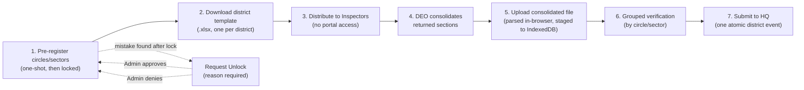
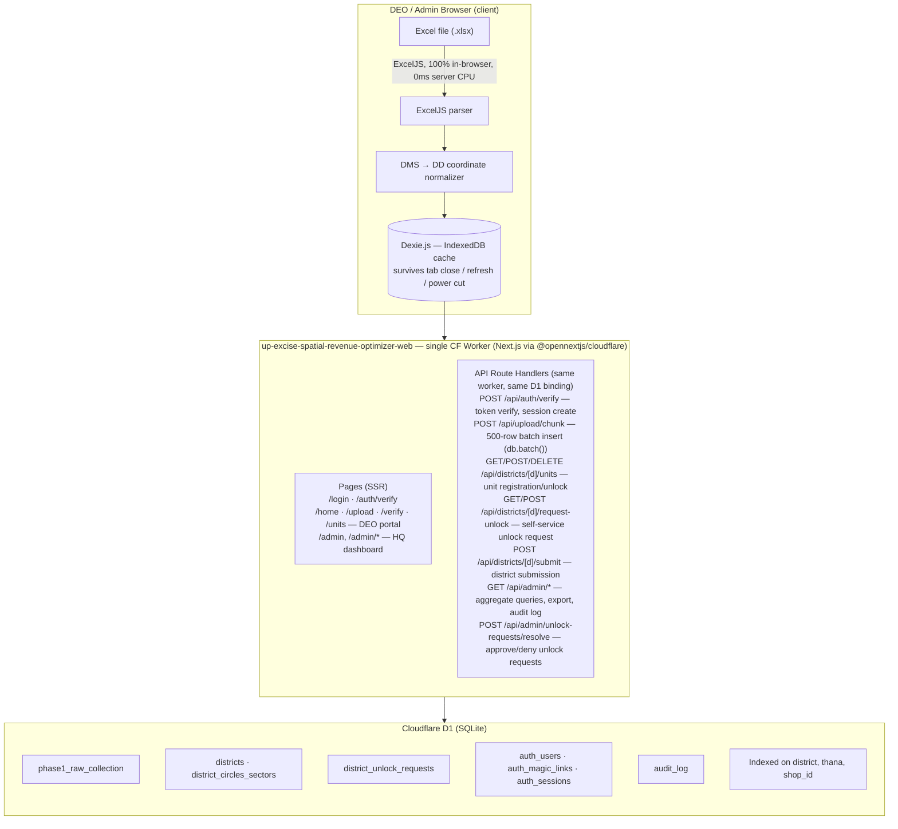

# State Excise Portal — Spatial & Revenue Optimization System
## Official Engineering Roadmap: Phase 1 — Comprehensive Data Collection Pipeline

See also [docs/app-flow.md](docs/app-flow.md) for Mermaid diagrams of the auth flow, DEO workflow, admin data loading, and API error handling.

---

| Field | Value |
|---|---|
| **Document Version** | 1.2.0 |
| **Classification** | Internal Engineering Master Document |
| **Target Phase** | Phase 1 — Comprehensive Data Harvesting & Verification |
| **Prepared By** | Subhan Raj, CSE Engineer — SIBIN Tech Solutions |
| **Consulting For** | Department of Excise, Government of Uttar Pradesh |
| **Authored** | 2026-06-25 |
| **Last Updated** | 2026-07-11 |
| **Status** | Phase 1 Code-Complete — Running on Cloudflare Free Tier — Pending Departmental DEO Rollout |

> **Authority note:** This document is the original engineering *plan* and is kept for business-rule and schema-rationale context. For the authoritative **current implementation state** — what actually shipped, exact file paths, and the live milestone log — see [CLAUDE.md](CLAUDE.md), which is updated on every change. Two architecture pivots happened after this document's early sections (§3.3–§3.12) were written and were not retrofitted into that prose everywhere it's mentioned:
> - **Auth (M-6):** Clerk was fully removed and replaced with custom HMAC magic-link auth (no external auth provider). Any reference to Clerk, `clerkMiddleware`, `publicMetadata.role`, or Clerk webhooks below describes the superseded original design — see CLAUDE.md's "Authentication Architecture" section for what's actually running.
> - **Spreadsheets (M-14):** SheetJS + hand-patched worksheet XML was fully replaced with ExcelJS as the single spreadsheet library. Any reference to SheetJS or the `xlsx` npm package below is superseded — see CLAUDE.md's "Frontend CDN Stack" section.
>
> Section 6 (Development Milestones) is up to date through M-16 as of this revision.

---

## Table of Contents

1. [Executive Summary & Phase 1 Objectives](#1-executive-summary--phase-1-objectives)
2. [Business Rules & Operational Constraints](#2-business-rules--operational-constraints)
3. [Edge Architecture & Zero-Cost Strategy](#3-edge-architecture--zero-cost-strategy)
4. [Data Dictionary & Shop Classification Matrix](#4-data-dictionary--shop-classification-matrix)
5. [Phase 1 Database Schema](#5-phase-1-database-schema)
6. [Development Milestones & Action Plan](#6-development-milestones--action-plan)

---

## 1. Executive Summary & Phase 1 Objectives

### 1.1 Strategic Context

The Department of Excise, Government of Uttar Pradesh, administers approximately **30,000 retail liquor vends** across **75 districts** and **18 administrative divisions**. The existing jurisdictional structure — circles, sectors, and Thana-level assignments for Excise Inspectors — was drawn decades ago and has not been systematically recalibrated against ground-level spatial realities, revenue density, or population shifts. The result is a fragmented administrative landscape: some Inspectors carry disproportionate geographic loads while others operate over-segmented, low-density territories. Revenue leakage, accountability gaps, and enforcement blind spots persist as a direct consequence.

This project, the **State Excise Portal Spatial & Revenue Optimization System**, is a two-phase initiative designed to correct this at scale.

### 1.2 The Two-Phase Architecture

**Phase 1 (This Document):** A state-wide data collection campaign. 75 District Excise Officers (DEOs) will upload structured spreadsheets through a browser-based portal. The system will ingest, validate, and store granular administrative, spatial, and financial metrics for every retail vend in the state. This phase produces the single authoritative dataset that everything downstream depends on.

**Phase 2 (Subsequent):** Using the Phase 1 dataset as its mathematical and spatial baseline, the system will run boundary optimization algorithms to redefine circles and sectors, reassign Excise Inspector jurisdictions, eliminate geographic redundancies, and surface revenue anomalies. Phase 2 is entirely dependent on the quality and completeness of Phase 1 data.

> **The engineering implication is direct:** every schema decision, every validation rule, and every data field defined in Phase 1 must anticipate the spatial and financial computations Phase 2 will perform. There is no tolerance for ambiguity in Phase 1 output.

### 1.3 Phase 1 Core Objectives

| # | Objective | Success Criterion |
|---|---|---|
| O-1 | **Universal Coverage** | 100% of ~30,000 retail vends across all 75 districts captured with no district gaps. |
| O-2 | **Spatial Accuracy** | Every vend has a geocoordinate stored in Decimal Degrees (DD), normalized from DEO input regardless of whether input is DMS or DD format. |
| O-3 | **Financial Precision** | Revenue fields collected at the component level (LF, MGR, BLF, MGQ, etc.), with the system computing and storing `totalRevenue` deterministically from those components. |
| O-4 | **Jurisdictional Mapping** | Every vend is anchored to a Thana, and every Thana records its adjacent Thanas within its own district boundary. |
| O-5 | **Zero Infrastructure Cost** | The entire system runs on Cloudflare's free tier. No server provisioning, no managed database licensing, no cloud compute bills during Phase 1. |
| O-6 | **Data Integrity Under Field Conditions** | Browser-side caching (IndexedDB) ensures no partial entry is lost due to connectivity issues, accidental refreshes, or tab closures in the field. |
| O-7 | **Audit Trail** | Every record carries the uploading DEO's identity and a creation timestamp for accountability. |

### 1.4 Explicit Scope Exclusions

The following are **outside the boundary of Phase 1** and must not be captured, implied, or encoded in the schema:

- High-end hotel and restaurant bars.
- Commercial lounges and banquet hall licenses.
- Wholesale distribution licenses.
- Any outlet category that does not map to the five retail classifications defined in Section 4.

Attempting to force out-of-scope data into Phase 1 fields will corrupt the Phase 2 optimization baseline. DEOs must be briefed on this boundary before the upload campaign begins.

---

## 2. Business Rules & Operational Constraints

This section defines the non-negotiable rules that govern data structure, validation logic, and UI behavior. These are not implementation preferences — they are the operational realities of excise administration in UP, and the system must enforce them without exception.

### 2.1 The Thana as the Atomic Geographic Unit

The **Thana** (police station jurisdictional area) is the smallest indivisible geographic unit in this system. All spatial analysis in Phase 2 — boundary remapping, Inspector workload balancing, contiguity checks — operates at the Thana level.

**Critical distinction:** While the Thana is borrowed from the police administrative structure as a naming convention, **Excise jurisdiction supersedes police boundaries**. A single Excise Inspector may be assigned a Thana that corresponds to multiple police sub-jurisdictions, or conversely, a Thana boundary in Excise records may differ from the police definition for the same name. Phase 1 uses the Excise-authoritative Thana names as the canonical identifier.

**Implication for schema design:** `thanaName` is stored as a free-text string, not a foreign key to a locked reference table. This is intentional. Enforcing referential integrity against a pre-seeded Thana master list would block uploads if DEOs encounter naming variations in legacy spreadsheets. Normalization of Thana name variants is a Phase 2 data-cleaning task.

### 2.2 Inspector Assignment Constraints (Phase 2 Alignment Rule)

Phase 1 does not store Inspector assignments. However, Phase 1 data collection is designed to feed Phase 2's assignment optimizer, which enforces the following hard rule:

> **One Thana → Maximum One Excise Inspector.**
> **One Inspector → Permitted Multiple Thanas.**

This rule exists to eliminate the accountability vacuum that emerges when two Inspectors share jurisdiction over a single Thana. Every vend in Phase 1 must be unambiguously anchored to exactly one Thana so that Phase 2 can compute clean, non-overlapping assignment territories.

Any vend record where `thanaName` is null, empty, or ambiguous will be flagged as a Phase 2 blocker and must be resolved before boundary optimization runs.

### 2.3 The Adjacent Thana Rule

Adjacency data is critical for Phase 2's contiguity-based remapping. If Inspector territories are to be reorganized into logical geographic clusters, the system must know which Thanas share borders. Phase 1 collects this at the Thana level: every Thana entry records a list of its bordering Thanas.

**The cross-district exclusion rule is absolute:**

> Adjacent Thanas must belong to the **same district** as the source Thana. Cross-district adjacency is ignored and must be filtered from DEO input.

**Example:** Thana BBD in Lucknow district physically borders Thana Safedabad in Barabanki district. For data entry in Lucknow's dataset, Safedabad must **not** appear in BBD's adjacent Thana list. Equally, Barabanki's dataset entry for Safedabad must **not** list BBD as adjacent. The cross-district exclusion is symmetric — neither DEO may encode cross-district adjacency, regardless of which side the border lies on.

**Rationale:** Excise administration is organized by district chains of command. Allowing cross-district adjacency in the optimization model would create pressure to merge territories across district lines, which violates administrative accountability structures. Phase 2's optimizer is district-bounded by design.

**Storage format:** Adjacent Thanas are stored in `adjacentThanasRaw` as a comma-separated string (e.g., `"Gomti Nagar,Chinhat,Alambagh"`). The frontend parses this into interactive pills for DEO review. The raw string is retained in D1 for simplicity; Phase 2 will parse and normalize it.

**Current implementation status (as of M-21) — this is the policy target above, not what runs today:** there is no state-wide Thana master list (Pre-Campaign Blocker #3 below), so nothing in the system can actually check "does this Thana belong to district X." The Worker (`api/upload/chunk/route.ts`) does not validate `adjacentThanasRaw` at all. The verify page's red-pill highlight (`app/(deo)/verify/page.tsx`) is a same-district, same-upload self-consistency heuristic only — it flags a name if it doesn't (yet) also appear as a `thanaName` elsewhere in that same DEO's own district data, which catches typos but can't detect a genuine cross-district name and can false-positive on a real same-district Thana with no shop in this particular upload. It does not block submission. Closing this gap for real requires the Thana master list.

### 2.4 Coordinate Input & Normalization Rules

Legacy Excise spreadsheets record coordinates in **Degrees, Minutes, Seconds (DMS)** format, inherited from survey maps. Modern GIS tools require **Decimal Degrees (DD)**. The system must handle both without friction.

**Rule:** The database stores coordinates **exclusively in Decimal Degrees**. The frontend performs all conversion before transmission. No DMS values reach the Cloudflare Worker.

**Supported input formats:**

| Input Format | Example | Handled By |
|---|---|---|
| Decimal Degrees (DD) | `26.8467, 80.9462` | Accepted as-is, validated for UP bounding box |
| DMS — Textual | `26°50'48.1"N, 80°56'46.3"E` | Converted to DD by frontend parser |
| DMS — Numeric fields | `26 / 50 / 48.1` (separate fields) | Converted to DD by frontend parser |

**Bounding box validation for UP:** After conversion, the frontend validates that coordinates fall within the approximate geographic envelope of Uttar Pradesh:
- Latitude: `23.8° N` to `30.4° N`
- Longitude: `77.1° E` to `84.6° E`

Records outside this bounding box are flagged with a warning and held in the DEO verification queue — they are not silently dropped or auto-corrected.

### 2.5 Data Entry Language Constraint

> **All data entered into the system must be in English.** Hindi, Devanagari script, Urdu, or any other language or script is not accepted. This constraint applies to all text fields including shop names, Thana names, district names, DEO identifiers, and any free-text notes fields that may be added in future iterations.

This constraint is enforced at the UI level with input validation and is documented here so that DEO training materials align with it from day one.

### 2.6 DEO Identity & Accountability

The District Excise Officer (DEO) is the most senior excise post at the district level. They oversee all Excise Inspectors across every circle and sector in their district. In the context of this system, the DEO is the sole authenticated portal user for their district — they download the district Excel template, distribute it to Inspectors, collect and consolidate the completed sections into a single district file, upload and verify it through the portal, and are the single entity that commits data to D1 for their district.

Every record written to D1 carries `uploadedByDeo` — a non-nullable string identifier for the submitting DEO. This is an audit tag, not an authentication mechanism. DEO identifiers will be assigned by the department and distributed alongside portal credentials.

---

### 2.7 Circle/Sector Pre-Registration & Delegated Data Collection

A district typically comprises multiple circles and sectors, each overseen by an individual Excise Inspector. The system supports a **delegated data collection model**: Inspectors fill in their portions of a standardised Excel template and hand the completed sections back to the DEO, who consolidates everything into one district file and uploads it. The DEO is always the sole portal user and the sole entity that submits data — Inspectors have no portal access and perform no upload. All data for a district is uploaded as **a single consolidated district-level Excel file** — there is no per-circle/sector file.

**Workflow:**



1. **Pre-registration — one-shot and locked (M-15):** The DEO does not add circles/sectors one at a time. The Circle/Sector Management UI first asks how many circles and how many sectors the district has, generates that exact number of pre-labelled name boxes, and the DEO fills each one in (circle names conventionally carry an area, e.g. "Circle 1 Mall, Malihabad"; sector names are usually just a number, e.g. "Sector 1", but may also carry an area). A SweetAlert2 confirmation warns this cannot be changed afterward, then the full list is submitted in a single request and stored in D1 in the `district_circles_sectors` table, scoped to the DEO's district. The registration endpoint then rejects any further attempt to add units for that district — the DEO cannot partially register, come back later, and add more. Upload and Verify are not shown to the DEO at all until this step is complete.
   - **Circle numbering convention (M-23):** sectors cover a district's urban area, circles cover its rural area. If a district has no sectors (purely rural), circle name placeholders start at "Circle 1". If a district has any sectors, "Circle 1" belongs to the sector-covered urban area and is never reused for a rural circle, so circle placeholders start at "Circle 2" instead. This is a UI placeholder-text convention only (`apps/web/app/(deo)/units/page.tsx`) — the DEO always types the real name, and neither the schema nor `POST /api/districts/[district]/units` enforces or depends on the number.
   - **Self-service unlock requests (M-24):** since there is no edit/delete path for a locked unit list, a wrong entry previously required the DEO to contact an Admin outside the app. `/units` now offers a "Request Unlock" button once locked — the DEO types a reason (required), stored in `district_unlock_requests` (409 if a pending request already exists). Admins review and resolve every request on `/admin/unlock-requests`; approving deletes the district's `district_circles_sectors` rows (same effect as the pre-existing manual admin-side unlock) and denying requires the admin's own note, same as approving.

2. **Template generation:** The portal generates **one district-wide Excel template** (`.xlsx`) with the district name pre-filled in the header and a `circle_sector_name` column included for every data row. There is one template per district — not one per circle/sector. The DEO downloads this single template and distributes blank copies to each Inspector.

3. **Inspector fill:** Each Inspector fills their section of the template with shop details for their jurisdiction, entering their circle/sector name in the `circle_sector_name` column on every row they add. They return the completed section to the DEO. Inspectors have no portal access — all portal interactions are the DEO's responsibility.

4. **DEO consolidation:** The DEO collects all returned Inspector sections and consolidates them into the single district Excel file — each row already carries its `circle_sector_name` tag from step 3.

5. **Single district upload:** The DEO uploads the consolidated district Excel file to the portal. The system parses all rows in-browser (ExcelJS, see M-14), reads the `circle_sector_name` value from each row, and writes the full dataset to IndexedDB in one operation.

6. **Grouped verification UI:** The staging interface organizes rows in tabs or collapsible sections by circle/sector (grouped by `circle_sector_name` column values). The DEO reviews each unit's data independently — correcting coordinates, removing invalid adjacency pills, verifying revenue totals.

7. **Collective district submission — confirmed (M-15):** The final submit action shows a SweetAlert2 confirmation (record count, bilingual warning) before batching all staged rows and transmitting them to the Worker as a single district submission. The Worker treats the district as one atomic unit — individual circle/sector boundaries are metadata tags on the rows, not separate submission events.

**HQ-level view:** At the headquarters dashboard, data is aggregated and displayed at the **district level only**. Circles and sectors are available as a drill-down dimension within the DEO's portal view but are not surfaced at the state-level summary. HQ sees: "Lucknow — 587 vends — ₹X total revenue."

**Completeness gate:** The submission button is active only when every registered circle/sector for the district has at least one verified row present in the staged IndexedDB dataset. The system checks the `circle_sector_name` distribution across all staged rows against the registered unit list — a registered unit with zero staged rows blocks submission. Partial district submissions are blocked — the Phase 2 optimization baseline cannot be built on incomplete district data.

---

## 3. Edge Architecture & Zero-Cost Strategy

### 3.1 The Cloudflare Free Tier Constraint

Phase 1 must operate with **zero infrastructure cost**. This is not a preference — it is a hard budget constraint for the data collection phase. The architecture is engineered specifically around Cloudflare's free tier limits:

| Resource | Free Tier Limit | Our Strategy |
|---|---|---|
| **Workers CPU Time** | 10ms per request | All heavy compute (Excel parsing, DMS conversion) runs in the browser, not the Worker. The Worker only performs inserts. |
| **Workers Request Count** | 100,000/day | Chunked batch uploads minimize request count per DEO session. |
| **D1 Write Rows** | 100,000/day | `db.batch()` groups multiple inserts into a single transaction, dramatically reducing write operation count. |
| **D1 Read Rows** | 5,000,000/day | Dashboard queries use indexed columns only (`districtName`, `thanaName`, `shopId`). Full table scans are prohibited in Phase 1. |
| **Workers Bandwidth** | 10GB/month | JS bundle is app-logic only (React + components). All libraries (DaisyUI, ExcelJS, Dexie.js, etc.) are served from jsDelivr CDN — zero bandwidth cost on Cloudflare. |
| **Workers Deployments** | Unlimited | Single Worker deployed via CI/CD on every push to `main`. Deploy frequency is never rate-limited or metered — only *runtime* usage (requests, CPU-ms, D1 reads/writes) counts against the free tier. |

**Current status (as of the latest deploy):** the project runs entirely on Cloudflare's free tier — no paid Workers, D1, or add-on plan has been purchased. At the target scale (75 DEOs, each uploading their district once, plus admin browsing), Phase 1 usage is projected to stay well within all five limits above, so **launching Phase 1 to production on the free tier — including sending magic-link invitations to real DEOs and accepting live data — is technically viable today.** The only blockers to a real campaign launch are the department-side items in "Pre-Campaign Blockers" below (DEO email list, column layout sign-off, etc.), not infrastructure capacity. If usage ever approaches a free-tier ceiling (most likely D1 write rows during a compressed bulk-upload window, or Workers CPU time if a future feature moves compute server-side), the fix is to upgrade the specific Cloudflare product hit, not to redesign the architecture.

### 3.2 System Architecture Overview



**One Worker, no Pages, no separate API worker:**
- `up-excise-spatial-revenue-optimizer-web` — Next.js app built with `@opennextjs/cloudflare`. All pages AND all 19 API route handlers live in this single Worker. Same-origin means the session cookie is sent automatically — no Bearer tokens, no CORS, no API secrets between frontend and backend.

**Build & deploy commands (from `apps/web`):**
```bash
pnpm exec opennextjs-cloudflare build   # builds Next.js → .open-next/
pnpm exec opennextjs-cloudflare deploy  # deploys .open-next/ as a Worker
```
CI runs both sequentially in the `deploy-portal` job. `wrangler.jsonc` in `apps/web` points Wrangler at `.open-next/worker.js` and declares the D1 binding.

### 3.3 The Excel Ingestion Pipeline — Step by Step

**Step 1: Client-Side Excel Parsing (SheetJS)**

The DEO selects a standardized `.xlsx` file. The browser loads SheetJS (`xlsx` package) and parses the binary workbook entirely in memory. No file data is transmitted to any server at this stage. The parser extracts rows into a typed JavaScript array matching the Phase 1 schema.

This is the critical architectural decision that keeps the Cloudflare Worker within its 10ms CPU budget. A Worker that attempted to parse a 30,000-row Excel file would time out catastrophically. By running the parse in the browser, we consume the DEO's machine CPU — which has no limits — and send the Worker only clean, structured JSON.

**Step 2: Coordinate Normalization**

Immediately after parsing, a coordinate normalizer runs over every row. The normalizer handles:
- Pure DD input: passes through with bounding box validation.
- DMS in a single text field: regex-parsed, converted via the standard formula:
  `DD = Degrees + (Minutes / 60) + (Seconds / 3600)`
- DMS in separate numeric fields: combined and converted using the same formula.
- Hemisphere indicators (`N`/`S` for latitude, `E`/`W` for longitude) are handled: Southern and Western values produce negative DD.

After normalization, `latitudeDecimal` and `longitudeDecimal` are populated for every row that had valid coordinate input. Rows with invalid or missing coordinates are flagged — not dropped — and surface in the verification UI with a visual warning.

**Step 3: IndexedDB Persistence (Dexie.js)**

The normalized dataset is immediately written to the browser's IndexedDB via Dexie.js. This local store acts as a durable staging area. The DEO can:
- Close the browser tab and reopen it — data is recovered.
- Lose network connectivity — data is safe.
- Partially submit (some chunks uploaded, session interrupted) — the IndexedDB store tracks which rows have been acknowledged by the Worker so that resumption skips already-committed rows.

**Step 4: Verification UI**

The Next.js interface renders the staged data in a paginated table. Key interactions:
- **Adjacent Thana Pills:** The `adjacentThanasRaw` string is split on commas and rendered as removable pill components. The DEO can delete incorrect adjacencies before submission. The district-boundary filter (Section 2.3) runs here — pills referencing out-of-district Thanas are highlighted in red and must be removed before the row is cleared for submission.
- **Revenue Preview:** For each row, the system computes and displays the expected `totalRevenue` based on `shopType` and `hasCl5cc` using the formulas in Section 4.3. This lets the DEO visually verify that financial inputs are correct before committing.
- **Row-Level Edit:** The DEO can correct any field inline. Changes update the IndexedDB store in real time.

**Step 5: Chunked Batch Submission**

Once the DEO approves the staged data, the frontend transmits it to the Cloudflare Worker in sequential chunks of 500 rows. Each chunk is a single HTTPS POST request with a JSON body. The Worker receives the chunk, validates structure, and calls `db.batch()` to insert all 500 rows in a single D1 transaction. The Worker returns an acknowledgment with the count of successfully inserted rows.

The frontend marks acknowledged rows in IndexedDB. If the session is interrupted mid-upload, the next session resumes from the first unacknowledged chunk.

**Why 500 rows per chunk?**

| Factor | Analysis |
|---|---|
| Worker 10ms CPU limit | At 500 rows, the Worker performs ~500 lightweight SQL inserts via `db.batch()`. D1's batch interface is specifically optimized for this pattern and keeps the Worker well within its CPU window. |
| Payload size | A 500-row JSON payload for this schema is approximately 150–200KB. Well within the 100MB Worker request body limit with massive headroom. |
| Error recovery granularity | A chunk failure affects at most 500 rows. The DEO does not lose an entire district's upload. |

### 3.4 Cloudflare Worker Implementation Notes (Hono)

The Worker is built with [Hono](https://hono.dev/) — a lightweight, TypeScript-first web framework purpose-built for Cloudflare Workers. Hono adds minimal overhead and provides clean routing, middleware, and type-safe request handling.

**Key Worker routes — DEO Portal (`/api/*`):**

| Route | Method | Purpose |
|---|---|---|
| `/api/upload/chunk` | `POST` | Accepts a 500-row batch (tagged with circle/sector), validates, inserts via `db.batch()` |
| `/api/districts` | `GET` | Returns district list for DEO dropdown (reads from `districts` table) |
| `/api/districts/:district/units` | `POST` | DEO registers a new circle or sector |
| `/api/districts/:district/units` | `GET` | Lists all circles/sectors registered for a district |
| `/api/districts/:district/template` | `GET` | Returns the single district-wide Excel template (`.xlsx`) with district name pre-filled and `circle_sector_name` column included |
| `/api/webhooks/clerk` | `POST` | Receives Clerk session events; validates SVIX signature; writes to `audit_log` |
| `/api/healthz` | `GET` | Health probe — returns `200 OK` with no body. Used by CI dry-run and uptime checks. |

**Key Worker routes — Admin Portal (`/api/admin/*`, Clerk `admin` role required):**

| Route | Method | Purpose |
|---|---|---|
| `/api/admin/districts` | `GET` | All 75 districts with summary stats (vend count, annual revenue, status) + top-level `stateTotals: { totalVendCount, totalRevenue }` — lightweight aggregate; never loads shop rows |
| `/api/admin/districts/:district` | `GET` | Single district: DEO info, circles/sectors, submission status, revenue totals |
| `/api/admin/districts/:district/shops` | `GET` | Shop rows for one district. `pageSize` accepts 10/25/50/100 or `all`; default 100; server cap 2000. Admin UI always calls `?pageSize=all` and handles all filtering, sorting, and pagination client-side via `useMemo`. Never returns data across districts in one call. |
| `/api/admin/districts/:district/export` | `GET` | Streams all shop rows for one district as CSV |
| `/api/admin/export/all` | `GET` | Streams the entire `phase1_raw_collection` as a chunked `.xlsx` Excel download. Full-state data path — triggers a file download only, never a UI table. |
| `/api/admin/search` | `GET` | Cross-district search with query params (Section 3.11) |
| `/api/admin/bulk-provision` | `POST` | Receives parsed DEO Excel data; provisions Clerk accounts + inserts `districts` rows |
| `/api/admin/audit-log` | `GET` | Paginated audit log for admin viewer (last 45 days) |
| `/api/admin/map-data` | `GET` | All 75 districts with `{ name, status, vendCount, totalRevenue, expectedVendCount }` — single lightweight call that drives both the choropleth map and the summary charts. Aggregates `phase1_raw_collection` grouped by `district_name`, joined with `districts` metadata. No shop row data returned. |

**Worker validation checklist (enforced before any D1 write):**

- `districtName`, `circleSectorName`, `thanaName`, `shopId`, `shopName`, `shopType`, `uploadedByDeo` must be non-empty strings.
- `shopType` must be one of: `MODEL_SHOP`, `COMPOSITE_SHOP`, `BHANG_SHOP`, `PRV`, `COUNTRY_LIQUOR`.
- `hasCl5cc` must be a boolean; if `true`, `shopType` must be `COUNTRY_LIQUOR`.
- `latitudeDecimal` and `longitudeDecimal`, if present, must be finite numbers within the UP bounding box.
- `totalRevenue` must match the server-side recomputed value from the financial fields — the Worker recomputes revenue independently and rejects rows where the client-sent `totalRevenue` does not match. This prevents silent data corruption.

### 3.5 D1 Database Operational Notes

**Append-only in Phase 1:** The Phase 1 collection table is write-once from a data integrity standpoint. If a DEO re-uploads a corrected dataset for their district, a `UNIQUE` constraint on `shopId` + `districtName` can be used to trigger an upsert rather than a duplicate insert. The deduplication strategy will be finalized during implementation (see Milestone M-3).

**`districts` table — the district registry:** A separate, small (75-row) reference table stores district metadata: DEO name, DEO email, DEO identifier, division, expected vend count, and submission status. This table is the authoritative registry of all districts in the system. The `phase1_raw_collection` table references districts by `district_name` (text soft-reference, not FK) for the same flexibility reasons as Thana names (Section 5.1). The `districts` table keeps district metadata out of the 30,000-row shop table and gives the admin portal a fast, metadata-only query path that never touches shop rows.

**Admin query pattern — district-by-district loading:** The admin portal default view queries `districts` and an aggregation over `phase1_raw_collection` grouped by `district_name` — this gives totals without loading any individual shop rows. Shop-level data is only fetched when the admin drills into a specific district (`/api/admin/districts/:district/shops`). Full-state shop data is never loaded into the UI; the only full-state operation is a streamed CSV export.

**Index strategy:** Three indexes cover the primary query patterns for Phase 1 dashboards:
- `p1_district_idx` — powers district-level summary queries (total vends per district, total revenue per district).
- `p1_thana_idx` — powers Thana-level aggregation queries (vend count per Thana, for Phase 2 load-balancing).
- `p1_shop_idx` — powers individual vend lookups and deduplication checks.

Full-table scans are expected during Phase 2 analysis but are not a production concern during Phase 1 data collection.

---

### 3.6 Security Architecture & Constraints

Security is applied at every layer. No single control is treated as sufficient.

**Transmission Security:**
- All mutations (upload chunk, circle/sector registration, district submission) use HTTP POST with a JSON body. No sensitive or structured data is ever transmitted via URL query parameters. GET endpoints return only read-only reference data.
- All traffic is HTTPS-only. Mixed content is blocked by CSP. The Worker rejects any non-HTTPS origin.
- The Worker validates and sanitizes all inbound fields before any D1 write: string fields are trimmed and length-bounded; numeric fields are type-coerced and range-checked; enum fields are verified against an allowlist.
- Worker responses never expose stack traces or internal state. Only structured error objects are returned: `{ error: string, rejectedRows?: [...] }`.

**Secret & Credential Management:**
- No API keys, secrets, or service credentials are embedded in the frontend bundle, committed to source, or returned in API responses.
- Clerk's publishable key (safe for frontend exposure by design) is the only credential in the frontend environment. All Clerk secret keys and the Clerk webhook signing secret live in Cloudflare Workers Secrets — never in `wrangler.toml`.
- D1 is accessed exclusively via the Workers binding. It has no public connection string and is not reachable from the internet directly.

**Content Security Policy (CSP):**
Declared in `public/_headers` (served as static response headers by the portal Worker via `@opennextjs/cloudflare`):
```
/*
  Content-Security-Policy: default-src 'self'; script-src 'self' https://cdn.jsdelivr.net https://cdn.tailwindcss.com; style-src 'self' https://cdn.jsdelivr.net; connect-src 'self' https://<worker-domain>.workers.dev; img-src 'self' data: https://*.basemaps.cartocdn.com; frame-ancestors 'none'; base-uri 'self'; form-action 'self'
  X-Content-Type-Options: nosniff
  X-Frame-Options: DENY
  Referrer-Policy: strict-origin-when-cross-origin
  Permissions-Policy: camera=(), microphone=(), geolocation=()
```
No `unsafe-inline` or `unsafe-eval` directives are permitted.

**Subresource Integrity (SRI):**
Every CDN-served `<script>` and `<link>` tag must include `integrity` and `crossorigin="anonymous"` attributes. SRI hashes are pinned to a specific library version and committed to the codebase. Updating a library requires regenerating and committing the corresponding hash. A CI step fails the build if any CDN asset tag is missing its `integrity` attribute.

```html
<!-- Example — DaisyUI from jsDelivr with SRI -->
<link rel="stylesheet"
  href="https://cdn.jsdelivr.net/npm/daisyui@5/dist/full.min.css"
  integrity="sha384-<hash>"
  crossorigin="anonymous">
```

**Rate Limiting:**
Cloudflare built-in rate limiting applied to Worker routes:
- Upload endpoint: max 20 requests/minute per IP.
- Webhook receiver: max 5 requests/minute per IP.

**Session Credential Storage:**
- Clerk session tokens are stored in HttpOnly, Secure, SameSite=Strict cookies — never in localStorage or sessionStorage.
- IndexedDB stores only DEO-entered shop data. Session credentials never touch IndexedDB.

---

### 3.7 Authentication — Custom HMAC Magic-Link (No External Provider)

**Provider:** None. Authentication is implemented entirely in-house: HMAC-SHA256 session cookies, UUID magic-link tokens hashed in D1, and Resend for email delivery. No Clerk, no Auth.js, no third-party auth SDK.

**Why custom auth instead of Clerk:**
Clerk added SDK overhead, required route changes on every update, caused constant middleware redirect issues, and its free-tier session duration was fixed at 7 days (enforcing 24h required an app-level hack). With a maximum of ~90 users (75 DEOs + ~15 admins), a few hundred lines of auth code is simpler and more reliable than an external dependency.

**Two-Cookie Design:**

1. **`excise-session`** (HttpOnly, Secure, SameSite=Lax, 24h) — `rawId.hmacSig` where `hmacSig = HMAC-SHA256(rawId, SESSION_SECRET)`. The raw ID is never stored; only `sha256(rawId)` is stored in D1 `auth_sessions`. On every request, the Worker recomputes the HMAC and compares in constant time.

2. **`excise-role`** (`deo` or `admin`, client-readable) — routing hint for middleware. Not a security boundary. The real check happens in server page components via `requireAuth()` and in route handlers via `getSession()`, both of which do a full HMAC verify + D1 session lookup.

**Middleware (cookie-only, no D1 on every request):**
```typescript
// apps/web/middleware.ts
const PUBLIC = new Set(['/login', '/auth/verify']);

export default function middleware(req: NextRequest) {
  const { pathname } = req.nextUrl;
  if (PUBLIC.has(pathname) || pathname.startsWith('/api/') || pathname.startsWith('/_next/'))
    return NextResponse.next();

  const sessionCookie = req.cookies.get('excise-session')?.value;
  if (!sessionCookie) return NextResponse.redirect(new URL('/login', req.url));

  const role = req.cookies.get('excise-role')?.value;
  if (pathname.match(/^\/admin/) && role !== 'admin') return NextResponse.redirect(new URL('/login', req.url));
  if (pathname.match(/^\/(home|upload|verify|units)/) && role !== 'deo') return NextResponse.redirect(new URL('/login', req.url));

  return NextResponse.next();
}
```

Middleware only checks cookie presence and the role cookie — no crypto, no D1. The full HMAC verification happens in `requireAuth()` (server pages) and `getSession()` (route handlers) where D1 is available.

**Magic-Link Flow:**
1. DEO enters email on `/login` → server action `requestMagicLink()`:
   - Validates email exists in `auth_users`
   - Rate-limits: 3 requests per email per 15-minute window (checked via `auth_magic_links` count)
   - Generates UUID token, stores `sha256(token)` in `auth_magic_links` with 15-minute expiry
   - Sends link via Resend (`noreply@mail.exciseup.in`, verified custom domain)
2. DEO clicks link → `/auth/verify?token=xxx` (client component, shows spinner):
   - POSTs `{ token }` to `POST /api/auth/verify` route handler
   - Route handler verifies `sha256(token)` against D1, marks link used, looks up user, calls `createSession()`, returns `{ redirect }`
   - Client does `window.location.href = redirect` (hard navigation to apply cookies)
   - **Why client component:** Next.js 15 forbids `cookies().set()` in Server Component pages. Cookie writes are only permitted in Route Handlers and Server Actions.
3. Session established: `excise-session` and `excise-role` cookies set, 24h TTL.
4. All subsequent API calls are same-origin `fetch('/api/...')` — browser sends session cookie automatically. No Authorization header needed.

**Session Security:**
- Token in URL is a one-time opaque UUID — consumed on first use, expires in 15 min.
- Session cookie value `rawId.hmacSig` — HMAC verified server-side on every protected request.
- Session hash stored in D1 — explicit deletion on logout.
- No session data in `localStorage`, `sessionStorage`, or IndexedDB.

**User Provisioning:**
- Admin seeds `auth_users` rows directly via `POST /api/admin/bulk-provision` (Excel upload) before the campaign.
- No self-registration. Accounts are created top-down by the system administrator.
- DEO `districtName` in `auth_users` scopes all data access to that district only.

**Audit Log:**
Application-level events (upload chunk, district submission, circle/sector registration, login) are written to `audit_log` directly by route handlers on every successful operation. 45-day rolling retention (cron purge deferred — see CLAUDE.md note).

**Auth tables in D1** (`packages/schema/src/auth.ts`):
- `auth_users` — email hash, name, role ('deo'|'admin'), deoId, districtName, deoCugHash (SHA-256 of CUG mobile number, unique nullable, added in migration `0002_add_deo_cug_hash.sql` — alternate login credential to magic-link email)
- `auth_magic_links` — tokenHash (sha256), expiresAt, used flag, createdAt (for rate-limit window)
- `auth_sessions` — id=sha256(rawId), userId FK, expiresAt

---

### 3.8 Frontend Asset & Bundle Strategy

The guiding principle is **CDN-first**: every substantial asset is loaded from jsDelivr (or the library's official CDN where that is faster/canonical). Cloudflare Pages serves only the Next.js JavaScript bundle, which contains React, the app's component logic, and nothing else. This minimises Cloudflare Pages bandwidth usage.

**Design System — Loaded from CDN:**

| Asset | CDN Source | Size (gzip) | Notes |
|---|---|---|---|
| DaisyUI CSS | `cdn.jsdelivr.net/npm/daisyui@5.6.3/daisyui.css` | ~25KB | Semantic component classes: `btn`, `card`, `table`, `modal`, `badge`, `drawer`, etc. Requires Tailwind v4. |
| Tailwind CSS v4 (`@tailwindcss/browser`) | `cdn.jsdelivr.net/npm/@tailwindcss/browser@4` | ~50KB | Runtime utility class generation. **Never** use `cdn.tailwindcss.com` — that serves Tailwind v3, which is incompatible with DaisyUI 5. |

Both are loaded in `<head>` via root `layout.tsx` with SRI attributes. Tailwind is not processed via PostCSS at build time — no Tailwind in the build pipeline, no purge step, no PostCSS config. The Play CDN handles this at runtime.

> **Why `@tailwindcss/browser` CDN instead of build-time?** The portal Worker (via `@opennextjs/cloudflare`) serves only the Next.js application bundle. Removing PostCSS + Tailwind from the build pipeline keeps the bundle exclusively application code. Bandwidth cost for the Tailwind CDN script is borne by jsDelivr, not by Cloudflare Workers bandwidth.

**Data, UI Feedback & Visualization Libraries — Loaded from CDN:**

| Library | CDN Source | Route Groups | Load Strategy |
|---|---|---|---|
| SheetJS (`xlsx`) | `cdn.jsdelivr.net/npm/xlsx@x/dist/xlsx.full.min.js` | DEO + Admin | Dynamic inject on upload page mount (`ssr: false`) — loads only when needed |
| Dexie.js | `cdn.jsdelivr.net/npm/dexie@x/dist/dexie.min.js` | DEO + Admin | `<script>` in root `layout.tsx` — loaded on all pages; Service Worker caches after first load |
| SweetAlert2 | `cdn.jsdelivr.net/npm/sweetalert2@x/dist/sweetalert2.all.min.js` | DEO + Admin | `<script>` in root `layout.tsx` — used across both route groups for all modal alerts, confirms, and prompts. Replaces all native `alert()`/`confirm()`. |
| Notyf | `cdn.jsdelivr.net/npm/notyf@x/notyf.min.js` + `notyf.min.css` | DEO + Admin | `<script>` + `<link>` in root `layout.tsx`. ~3KB JS. Side flash notifications (success, error, warning). Vanilla JS, no framework dependency. Official site: https://carlosroso.com/notyf/ |
| Chart.js | `cdn.jsdelivr.net/npm/chart.js@x/dist/chart.umd.min.js` | Admin only | `<script>` in root `layout.tsx` — guarded by route group; ~60KB gzip |
| Leaflet.js | `cdn.jsdelivr.net/npm/leaflet@x/dist/leaflet.js` + `leaflet.css` | Admin only | `<script>` + `<link>` in root `layout.tsx`; ~39KB JS + ~5KB CSS |

**What ships in the Next.js bundle:**
- React + Next.js App Router runtime
- App-specific TypeScript components and logic (auth, pages, hooks)
- No CSS frameworks, no chart libraries, no map libraries, no data libraries, no Excel parsers, no alert/toast libraries, no auth SDK

**SRI Pin Workflow (for library version upgrades):**
```bash
# Generate SRI hash for a CDN file
curl -s https://cdn.jsdelivr.net/npm/daisyui@5/dist/full.min.css | \
  openssl dgst -sha384 -binary | openssl base64 -A
```
Update the `integrity` attribute and commit the hash alongside the version bump. CI blocks merge if any CDN tag is missing `integrity`.

---

### 3.9 PWA & Offline Architecture

**Progressive Web App:**
The DEO portal is a full PWA. Installed on an iPad or Android tablet, it loads from the Service Worker cache with no network dependency after the first visit.

**`public/manifest.json`:**
```json
{
  "name": "UP Excise Portal",
  "short_name": "Excise Portal",
  "start_url": "/",
  "display": "standalone",
  "background_color": "#ffffff",
  "theme_color": "#1d4ed8",
  "icons": [
    { "src": "/icon-192.png", "sizes": "192x192", "type": "image/png" },
    { "src": "/icon-512.png", "sizes": "512x512", "type": "image/png" }
  ]
}
```

**Service Worker Responsibilities:**
- **App shell caching:** On install, pre-caches the Next.js static HTML, JS bundle, and all CDN assets (DaisyUI CSS, Tailwind CDN script, Dexie.js, SheetJS, SweetAlert2, Notyf). After first load, the entire app and all its dependencies run offline.
- **Offline detection:** Posts `{ type: 'connectivity', online: boolean }` messages to the active page. The connection status indicator reacts to these messages.
- **Background Sync:** When a chunk upload fails due to connectivity loss, the chunk payload is written to an IndexedDB queue and registered with the Background Sync API (`sync.register('upload-queue')`). On connectivity restoration, the Service Worker retries all queued chunks sequentially. No DEO action is required.
- **Cache invalidation:** Service Worker version is tied to the Next.js build hash. On deployment, the new Service Worker installs and takes over, replacing the cached app shell.

**IndexedDB-First Data Rules:**
- Every DEO action (row edit, pill deletion, field change, unit mark-verified) writes to IndexedDB synchronously — before any network call is made or awaited.
- The network upload is a secondary step. A failed upload changes the row status to `'error'` in IndexedDB; the data itself is never lost.
- On page load, the app always reads from IndexedDB first. Network state has no bearing on what the DEO sees.
- Connection drop, network change, tab sleep, or device screen-off never trigger a session clear, IndexedDB wipe, or logout. Only Clerk's 24-hour clock-based expiry touches the session — and even then, IndexedDB data is preserved through re-authentication.

**Supported Devices:**
| Device | Status | Notes |
|---|---|---|
| iPad (Safari, Chrome) | Fully supported — primary field device | PWA install via Safari "Add to Home Screen"; Background Sync supported in Chrome for iOS |
| Android tablet 10"+ (Chrome) | Fully supported — primary field device | Full PWA install + Background Sync |
| Desktop PC/Mac (Chrome, Firefox, Edge, Safari) | Fully supported — office use | |
| Small-screen mobile (< 768px) | Not supported | Verification table not usable. App does not break but no mobile layouts will be built. |

---

### 3.10 Accessibility, UX Standards & User Preferences

**Dark & Light Mode:**
DaisyUI's built-in theme system defines two themes: `excise-light` and `excise-dark`. Applied by setting `data-theme` on `<html>`. An inline script in `<head>` reads `localStorage` and sets the theme before first paint — no flash of wrong theme on load.

**User Preferences (localStorage):**
| Key | Values | Purpose |
|---|---|---|
| `theme` | `'excise-light' \| 'excise-dark'` | UI theme, persisted across sessions |
| `verificationPageSize` | `25 \| 50 \| 100` | Rows per page in the verification table |
| `connectionBannerDismissed` | `'true'` | Whether the DEO has acknowledged the offline banner |

**ARIA & Keyboard Accessibility:**
- All interactive elements (pill delete buttons, inline edit fields, modal dialogs, upload dropzone, accordion sections) have `aria-label` or `aria-labelledby`.
- The verification table uses `role="grid"`, `role="row"`, `role="gridcell"` for keyboard navigation.
- Dynamic updates (upload progress, live revenue recalculation, pill removal) announced via `aria-live="polite"` regions.
- After a modal closes, focus returns explicitly to the trigger element.
- Color is never the sole status indicator — coordinate warnings use color plus an icon glyph.
- Touch targets are minimum 44×44px (WCAG 2.5.8).

**Connection Status Indicator:**
Persistent banner in the app header:
- **Green — "Online"**: network available, Worker reachable.
- **Amber — "Offline — data saved locally"**: no network; all edits write to IndexedDB; nothing is lost.
- **Amber — "Slow connection"**: ping latency > 2s detected; uploads will retry automatically.
The banner is informational and does not interrupt the DEO's workflow.

**Print View:**
A `@media print` stylesheet renders a clean, paginated layout of the verification table. UI controls (edit buttons, pill delete icons, upload actions, navigation) are hidden. Revenue totals and coordinate status are preserved. DEOs can print their staged data as a paper backup before submission.

**Tablet-First Layout:**
- Minimum supported viewport: **768px** (iPad portrait). No `sm` or `xs` breakpoints are used in DEO-facing layouts.
- Breakpoints: `md` (768px) — tablet portrait; `lg` (1024px) — tablet landscape/desktop.
- Horizontal scroll on the verification table is expected on tablet — it is not a layout bug.
- All Tailwind responsive prefixes in JSX use `md:` or `lg:` only.

---

### 3.11 Search Architecture

**DEO-Level Search (Client-Side, IndexedDB):**
DEOs search their own district's staged data without any network request. Dexie.js `where()` and `filter()` APIs query the local IndexedDB store directly.

Searchable fields:
| Field | Match Type |
|---|---|
| Shop name | Substring, case-insensitive |
| Shop ID | Exact or prefix |
| Thana name | Substring |
| Shop type | Enum filter (dropdown) |
| Circle/sector | Filter from registered units |
| Row status | `pending \| uploaded \| error` |

Results render inline in the verification table. Zero Worker calls.

**Admin/HQ Search (Server-Side, D1):**
Admin users access the `(admin)` route group. Search queries go to `GET /api/admin/search` (Worker, guarded by Clerk `admin` role middleware):

| Parameter | Type | Description |
|---|---|---|
| `district` | string | Filter by district name (indexed) |
| `thana` | string | Filter by Thana name (indexed) |
| `shopType` | string | Enum filter |
| `circleSector` | string | Filter by circle/sector name |
| `q` | string | Free-text shop name (SQLite `LIKE '%q%'`) |
| `page` | integer | Pagination, default 50 rows/page |

Free-text `LIKE` requires a column scan on `shop_name`. Acceptable at 30,000 rows for infrequent admin use. If response time exceeds 1s, a SQLite FTS5 virtual table (`phase1_fts`) will be added in a post-Phase-1 migration.

---

### 3.12 Admin/HQ Portal — Route Group Architecture

The DEO portal and Admin/HQ portal are **route groups within a single Next.js application** (`apps/web`). There is one portal Worker deployment (`up-excise-portal`), one build pipeline, and one `middleware.ts`. Both route groups are served from the same Worker.

```
apps/web/app/
├── page.tsx    # Pure redirect → /login (server component, no auth check)
├── login/
│   ├── page.tsx              # Server component: auth() check → role-redirect or render LoginForm
│   └── _components/
│       └── LoginForm.tsx     # 'use client' — Clerk <SignIn> widget (fallbackRedirectUrl="/login")
├── (deo)/
│   └── home/  # DEO home page (URL: /home) — middleware enforces role: 'deo'
├── (admin)/
│   └── admin/ # Admin home page (URL: /admin) — middleware enforces role: 'admin'
```

`page.tsx` at the root is a pure `redirect('/login')` with no auth logic. Role-based routing lives in `login/page.tsx` (a server component): it calls `auth()`, reads `publicMetadata.role` from the JWT, and redirects `admin` → `/admin` or `deo` → `/home`. If the user is authenticated but has no recognised role, it shows an "Account not provisioned" message. Unauthenticated users see the Clerk `<SignIn>` widget via `LoginForm`. The middleware reads `publicMetadata.role` and enforces route group access. A `deo` user hitting any `(admin)` route is redirected to `/login`; an `admin` hitting a `(deo)` route is also redirected. Both groups share the same Clerk project and the same API Worker endpoint.

**`NEXT_PUBLIC_CLERK_SIGN_IN_URL=/login`** must be set at build time so that Clerk's internal redirects use `/login` instead of the default `/sign-in`. Set in `.env.local` for local dev and baked in via the GitHub Actions `deploy-portal` job. Without it, Clerk redirects go to `/sign-in` (not a public route), causing an infinite redirect loop.

| Concern | DEO route group `(deo)` | Admin route group `(admin)` |
|---|---|---|
| App | `apps/web/app/(deo)/home/` | `apps/web/app/(admin)/admin/` |
| URL | `/home` | `/admin` |
| Deployment | Single portal Worker (`up-excise-portal`) | Same Worker, same deployment |
| Auth | `publicMetadata.role: 'deo'` | `publicMetadata.role: 'admin'` |
| Worker routes | `/api/*` | `/api/admin/*` |
| Data access | Own district only (scoped by Clerk `districtName` claim) | All 75 districts, read-only |

**Admin Data Loading — District Summary List with State Totals:**

The admin portal's default view is a **district summary list** — 75 rows showing each district's name, vend count, total annual revenue, and submission status. Beneath the list is an **"All State" totals row** showing cumulative vend count and cumulative total annual revenue across all submitted districts.

The `GET /api/admin/districts` response includes both the 75 district rows and a top-level `stateTotals: { totalVendCount, totalRevenue }` object. This aggregate is pre-computed server-side on every `district_submitted` audit event (the Worker updates a lightweight running total) so the response never runs a full-table scan. On the client, the summary list and state totals are cached in admin IndexedDB (`admin_state_totals` store) with a 15-minute TTL. Page loads within the TTL window serve from IndexedDB without a D1 query.

No individual shop rows are ever fetched for the summary list view. Every number is a `COUNT` or `SUM` aggregate — the list is always O(75) rows regardless of how many shops exist in the state.

**District Drill-Down — Full District Load, Cached:**

When an admin clicks a district, the portal fetches all shop rows for that district from `/api/admin/districts/:district/shops` (100 rows/page) and renders them in a table. All pages for that district are progressively written to the admin IndexedDB (`admin_district_cache`) keyed by district name. On subsequent visits to the same district within the TTL, cached rows are served immediately while a background request checks for updates (stale-while-revalidate). A district with 500 shops loads in approximately 5 paginated requests; the cache means D1 is only queried once per TTL window per district.

Viewing all ~30,000 shop records in a single UI table is an **unsupported operation**. The only full-state data path is the Excel download (`/api/admin/export/all`), which streams the entire `phase1_raw_collection` as a chunked `.xlsx` file download — never rendered in the browser UI. The "Download Full State Data" button in the Export section triggers this route.

**Admin Route Group — IndexedDB (Dexie.js) Cache:**

Dexie.js is loaded from jsDelivr CDN in the root `layout.tsx` and is therefore available in both route groups. The `(admin)` route group maintains three Dexie stores:

| Dexie Store | Key | Contents | TTL |
|---|---|---|---|
| `admin_state_totals` | `'state'` | `{ totalVendCount: number, totalRevenue: number, fetchedAt: timestamp }` | 15 min |
| `admin_district_cache` | `districtName` | `{ rows: Phase1Row[], totalCount: number, fetchedAt: timestamp }` | 1 hour |
| `admin_search_cache` | `queryHash` | Last 10 search result pages | Session only |

The state totals are pre-computed on each `district_submitted` event (the Worker increments a running aggregate), so `GET /api/admin/districts` never triggers a full-table scan in production. The Dexie stores are client-side mirrors of the server-side aggregates.

**Admin Route Group — SheetJS Bulk DEO Provisioning:**

SheetJS is dynamically injected (not in root layout) on the bulk-provision page within the `(admin)` route group. The administrator uploads an Excel file (`.xlsx`) with columns:

| Column | Description |
|---|---|
| `District Name` | Canonical district name matching the system's `districts.name` |
| `Division` | Administrative division (e.g., "Lucknow Division") |
| `DEO Name` | Full name of the District Excise Officer |
| `DEO Email` | Department-issued email — used as Clerk account identifier |
| `DEO Identifier` | Dept-assigned string used as `uploaded_by_deo` in shop records |
| `Expected Vend Count` | Approximate total retail vends in the district (for progress %) |

SheetJS parses the file in-browser. The parsed array is previewed in the UI for admin review before submission. On confirm, it is sent to `POST /api/admin/bulk-provision`, which:
1. Inserts or upserts all 75 rows into the `districts` table.
2. Creates Clerk user accounts for each DEO email using Clerk's management API.
3. Sets the `districtName` metadata claim on each Clerk user for downstream data scoping.
4. Returns a summary of accounts created vs. already existing.

This operation is idempotent — re-running it on an already-provisioned system updates district metadata without creating duplicate Clerk accounts.

**Admin Dashboard — Charts (Chart.js via jsDelivr CDN):**

All charts are powered by a single call to `GET /api/admin/map-data`, which returns 75 district-level aggregate rows. No shop rows are loaded for charting.

| Chart | Type | Data Source |
|---|---|---|
| Submission progress | Doughnut | `submitted` vs `in_progress` vs `pending` district count |
| Revenue by district (top 20) | Horizontal bar | `totalRevenue` per district, sorted descending |
| Shop type distribution | Pie | `COUNT(*)` per `shop_type` across submitted districts |
| Upload progress by district | Stacked bar | `vendCount` vs `expectedVendCount` per district |
| Cumulative uploads over time | Line | Daily `district_submitted` event count from `audit_log` |

Charts use Chart.js direct imperative API via `useEffect` — no React wrapper library. Instances are destroyed and re-created on data refresh to prevent memory leaks.

**Admin Dashboard — Interactive UP District Map (Leaflet.js via jsDelivr CDN):**

A live choropleth map of all 75 UP districts. The primary at-a-glance view for HQ to monitor the upload campaign.

**GeoJSON boundary data:**
- Stored at `apps/web/public/geodata/up-districts.geojson` — all 75 UP district polygons, 615 KB.
- **Source:** OpenStreetMap (OSM) Overpass API, `admin_level=5` administrative boundary relations for Uttar Pradesh. Fetched via `https://maps.mail.ru/osm/tools/overpass/api/interpreter`. OSM uses `admin_level=5` for UP districts (level 6 = tehsils, 316 elements).
- **Processing pipeline** (ad-hoc Python, not committed to repo): (1) fetch Overpass JSON → (2) assemble closed rings from OSM relation ways using greedy chain algorithm → (3) export GeoJSON → (4) RDP simplification with tolerance 0.002° → 26,167 points from 368,779 raw (615 KB from 8.5 MB).
- **Name normalisations** applied to match `districts.name` in D1: Raebareli → Rae Bareli, Sant Ravidas Nagar → Bhadohi, Sharavasti → Shravasti, Siddharthnagar → Siddharth Nagar, Mahrajganj → Maharajganj.
- **Feature property:** `district` — must match `districts.name` in D1 exactly (case-sensitive). No name-map file needed.
- **Note:** The GADM source used in early milestones only covered 70 of 75 districts (missing Hapur, Shamli, Sambhal, Amethi, Kasganj). The OSM source covers all 75 and supersedes GADM.

**Map configuration (as built):**
- Tiles: CartoDB (light/dark variants, switches with `data-theme` MutationObserver); no API key required.
- Layout: full-width card (660px tall on the overview page so the full state fits vertically without excessive zoom-out), charts rendered below in a 2-column grid.
- District borders: `weight: 1.5`, `color: '#334155'` (slate-700). Status fill colours: pending `#94a3b8`, in_progress `#f59e0b`, submitted `#16a34a`. Fill opacity `0.65`.
- Permanent district name labels via `bindTooltip(name, { permanent: true, direction: 'center', className: 'district-map-label' })`. CSS selector in `layout.tsx` global style block must be `.leaflet-tooltip.district-map-label` (not the bare class) to beat Leaflet's own `.leaflet-tooltip` specificity.
- Map locked to UP bounds: `minZoom: 6`, `maxZoom: 10`, `maxBounds: [[22.5, 76.0], [31.5, 85.5]]`, `fitBounds` to `[[23.8, 77.1], [30.4, 84.6]]`.
- Click navigates to `/admin/districts/[name]`.

**Original spec tile URL:** CartoDB Positron — no API key required, neutral background:
```
https://{s}.basemaps.cartocdn.com/light_all/{z}/{x}/{y}{r}.png
```

**Choropleth colour scheme:**
| District Status | Fill | Meaning |
|---|---|---|
| `pending` | `#d1d5db` grey | No data uploaded |
| `in_progress` | `#fbbf24` amber | Some uploads, not yet submitted |
| `submitted` | gradient `#86efac` → `#15803d` | Submitted — gradient intensity = `vendCount / expectedVendCount` (light = low coverage, dark = full coverage) |

**Map interactions:**
- **Hover:** boundary highlights; tooltip shows district name, DEO name, status, vend count, total revenue.
- **Click:** navigates to district drill-down (loads that district's shop table from D1/IndexedDB cache).
- **Legend:** Leaflet control, bottom-right.
- **Zoom:** bounded to UP state extent on load; free zoom thereafter.
- **Auto-refresh:** map data polls `GET /api/admin/map-data` every 5 minutes while the dashboard is open. Last-refreshed timestamp shown below the map.

**Admin Capabilities (Phase 1) — Summary:**
- District summary list: 75 rows (name, vend count, total annual revenue, status) + "All State" totals row at the bottom. Served from IndexedDB within 15-min TTL; D1 not queried within that window.
- Interactive UP district choropleth map — live status, vend counts, revenue on hover; click to drill down.
- Summary charts — submission progress doughnut, revenue bar, shop type pie, district upload stacked bar, cumulative timeline.
- District drill-down: full district shop table (100 rows/page, all pages cached in admin IndexedDB, stale-while-revalidate).
- Cross-district D1 search, paginated, results cached per query hash.
- CSV export per-district (streamed). Full-state data: "Download Full State Data" triggers chunked `.xlsx` file download — no UI table.
- Audit log viewer — last 45 days.
- Bulk DEO provisioning via Excel upload (SheetJS in-browser → preview → submit).

**Admin Cannot (Phase 1):**
- View all ~30,000 shop records in a single browser UI table. Full-state data is available only as a file download.
- Edit, correct, or delete any vend records — Phase 1 data is read-only from admin.
- Trigger re-uploads or corrections on a DEO's behalf.
- Access DEO session tokens or Clerk credential details.

---

## 4. Data Dictionary & Shop Classification Matrix

### 4.1 Administrative Fields

| Field | Type | Rules | Notes |
|---|---|---|---|
| `districtName` | String | Non-null, English only | Canonical district name (e.g., `Lucknow`, `Kanpur Nagar`) |
| `circleSectorName` | String | Non-null, English only | The Excise circle or sector name. Free-text; not normalized against a master list in Phase 1. |
| `thanaName` | String | Non-null, English only | Excise-authoritative Thana name. See Section 2.1. |
| `adjacentThanasRaw` | String | Nullable, intra-district only | Comma-separated list of adjacent Thana names within the same district. |
| `shopId` | String | Non-null, unique per district | Alphanumeric license/registration identifier assigned by the department. |
| `shopName` | String | Non-null, English only | Official name of the retail vend. |
| `uploadedByDeo` | String | Non-null | DEO identifier assigned by the department for this upload campaign. |
| `createdAt` | Timestamp | Non-null, set by system | Unix timestamp (seconds) of record insertion. Not editable by DEO. |

### 4.2 Spatial Fields

| Field | Type | Rules | Notes |
|---|---|---|---|
| `latitudeDms` | String | Nullable | Raw DMS input as entered by DEO, retained for audit. Not used in Phase 2 computation. |
| `longitudeDms` | String | Nullable | Raw DMS input as entered by DEO, retained for audit. |
| `latitudeDecimal` | Real | Nullable, validated against UP bounding box | Computed from DMS or accepted as DD. This is the field used for GIS operations. |
| `longitudeDecimal` | Real | Nullable, validated against UP bounding box | Computed from DMS or accepted as DD. |

### 4.3 Shop Classification & Revenue Matrix

The five retail vend categories, their active financial fields, and their revenue calculation formulas:

> **All monetary revenue figures in this section are annual values (per license year) and are stored in Indian Rupees as whole-rupee integers (no paise).** Figures are stored as complete values — e.g., ₹1,00,00,000 is stored as `10000000`. No abbreviation or unit scaling is applied in the database; UI formatting (lakhs, crores) is a rendering concern only. Every field named below represents an annual charge unless the field description explicitly states otherwise.

#### MODEL_SHOP

| Field | Active? | Description |
|---|---|---|
| `licenseFeeLf` | Yes | Annual license fee paid to the department |
| `mgrAmount` | Yes | Annual minimum guaranteed revenue commitment |
| All other financial fields | No (default 0) | Not applicable to this shop type |

**Revenue formula (annual total):**
```
totalRevenue = licenseFeeLf + mgrAmount + ON_PREMISES_CONSUMPTION_FEE
```

`ON_PREMISES_CONSUMPTION_FEE = ₹3,00,000` — fixed annual On Premises Consumption Fee applied to all Model Shop licences. This is a **department-set constant**, not a per-shop variable. It is defined in `packages/schema/src/constants.ts` and baked into the revenue formula at both the browser (`apps/web/src/lib/revenue.ts`) and the Worker (`apps/worker/src/lib/revenue.ts`). There is no `on_premises_consumption_fee` column in the database and no such field in the Excel template — DEOs do not enter this value.

---

#### COMPOSITE_SHOP

A Composite Shop holds a combined Foreign Liquor (FL) and Beer license. Its revenue has four distinct annual components — two license fee sub-components and two MGR sub-components — that are tracked individually in the database.

| Field | Active? | Description |
|---|---|---|
| `compositeLfFl` | Yes | Annual license fee for the Foreign Liquor component |
| `compositeLfBeer` | Yes | Annual license fee for the Beer component |
| `compositeMgrFl` | Yes | Annual Minimum Guaranteed Revenue — Foreign Liquor |
| `compositeMgrBeer` | Yes | Annual Minimum Guaranteed Revenue — Beer |
| `licenseFeeLf` | Computed | Stored as `compositeLfFl + compositeLfBeer`; used for cross-type LF aggregation in SQL |
| `mgrAmount` | Computed | Stored as `compositeMgrFl + compositeMgrBeer`; used for cross-type MGR aggregation in SQL |
| All other financial fields | No (default 0) | Not applicable |

**Revenue formula (annual total):**
```
totalRevenue = compositeLfFl + compositeLfBeer + compositeMgrFl + compositeMgrBeer
```

**Storage note:** `licenseFeeLf` and `mgrAmount` are stored as the respective component sums to support uniform cross-shop-type SQL aggregation (e.g., `SUM(license_fee_lf)` across all types). The Worker validates `compositeLfFl + compositeLfBeer = licenseFeeLf` and `compositeMgrFl + compositeMgrBeer = mgrAmount` before any D1 write. The four sub-component fields are the authoritative source; the stored totals are derived.

---

#### PRV (Premium Retail Vend)

| Field | Active? | Description |
|---|---|---|
| `licenseFeeLf` | Yes | Annual license fee |
| `mgrAmount` | Yes | Minimum guaranteed revenue commitment |
| All other financial fields | No (default 0) | Not applicable |

**Revenue formula:**
```
totalRevenue = licenseFeeLf + mgrAmount
```

---

#### BHANG_SHOP

| Field | Active? | Description |
|---|---|---|
| `licenseFeeLf` | Yes | Annual license fee |
| `mgqQuantity` | Yes | Minimum guaranteed quantity (units) |
| All other financial fields | No (default 0) | Not applicable |

**Revenue formula (annual total):**
```
totalRevenue = licenseFeeLf + (mgqQuantity × BHANG_MGQ_MULTIPLIER)
```

`BHANG_MGQ_MULTIPLIER = ₹20 per unit` — this is a **per-unit price in Indian Rupees** (₹20 for each unit of minimum guaranteed quantity), not a dimensionless multiplier. `mgqQuantity` is the number of MGQ units; multiplying by ₹20/unit converts it to an annual INR contribution. This constant must be defined as a named value in the shared constants file and must never be inlined as the magic number `20`. DEO training materials must make clear that Inspectors enter the unit quantity, not a rupee amount.

---

#### COUNTRY_LIQUOR (Standard)

| Field | Active? | Description |
|---|---|---|
| `basicLicenseFeeBlf` | Yes | Basic license fee for country liquor license |
| `considerationFee` | Yes | Consideration fee component |
| All other financial fields | No (default 0) | Not applicable |

**Revenue formula:**
```
totalRevenue = basicLicenseFeeBlf + considerationFee
```

---

#### COUNTRY_LIQUOR with CL5CC Endorsement (`hasCl5cc = true`)

This is **not a separate shop type**. A Country Liquor shop with a beer endorsement is stored as `shopType = COUNTRY_LIQUOR` with `hasCl5cc = true`. The CL5CC flag activates additional revenue fields and modifies the revenue formula.

| Field | Active? | Description |
|---|---|---|
| `basicLicenseFeeBlf` | Yes | Basic license fee for country liquor license |
| `considerationFee` | Yes | Consideration fee. Note: for CL5CC shops, MGQ-related components may be embedded in the consideration fee per department conventions — verify with department before finalizing. |
| `specialBeerLf` | Yes (CL5CC only) | Special license fee for the beer endorsement |
| `specialBeerMgr` | Yes (CL5CC only) | Minimum guaranteed revenue specific to beer sales |
| All other financial fields | No (default 0) | Not applicable |

**Revenue formula:**
```
totalRevenue = basicLicenseFeeBlf + considerationFee + specialBeerLf + specialBeerMgr
```

**UI enforcement:** The frontend must dynamically show/hide financial input fields based on `shopType` and `hasCl5cc`. When `hasCl5cc` is checked, `specialBeerLf` and `specialBeerMgr` fields must become visible and required. When `hasCl5cc` is unchecked, they must be hidden and their values set to 0 before submission.

### 4.4 Complete Revenue Dispatch Table (Quick Reference)

All values are **annual figures in Indian Rupees**.

| Shop Type | `hasCl5cc` | Annual Revenue Formula |
|---|---|---|
| `MODEL_SHOP` | false | `LF + Annual MGR + ON_PREMISES_CONSUMPTION_FEE (₹3,00,000 fixed)` |
| `COMPOSITE_SHOP` | false | `LF (FL) + LF (Beer) + Annual MGR FL + Annual MGR Beer` |
| `PRV` | false | `LF + Annual MGR` |
| `BHANG_SHOP` | false | `LF + (MGQ units × ₹20/unit)` |
| `COUNTRY_LIQUOR` | false | `BLF + Consideration Fee` |
| `COUNTRY_LIQUOR` | **true** | `BLF + Consideration Fee + Special Beer LF + Special Beer Annual MGR` |

### 4.5 Data Classification Summary

| Field Name | Column Name | Type | Nullable | Default |
|---|---|---|---|---|
| Primary ID | `id` | Integer (PK, Auto) | No | — |
| District Name | `district_name` | Text | No | — |
| Circle/Sector Name | `circle_sector_name` | Text | No | — |
| Thana Name | `thana_name` | Text | No | — |
| Adjacent Thanas (Raw) | `adjacent_thanas_raw` | Text | Yes | null |
| Shop ID | `shop_id` | Text | No | — |
| Shop Name | `shop_name` | Text | No | — |
| Shop Type | `shop_type` | Text (Enum) | No | — |
| CL5CC Flag | `has_cl5cc` | Integer (Boolean) | No | 0 (false) |
| Latitude DMS | `latitude_dms` | Text | Yes | null |
| Longitude DMS | `longitude_dms` | Text | Yes | null |
| Latitude (DD) | `latitude_decimal` | Real | Yes | null |
| Longitude (DD) | `longitude_decimal` | Real | Yes | null |
| License Fee (LF) | `license_fee_lf` | Integer | Yes | 0 |
| *(removed — see note)* | ~~`premises_consideration_fee`~~ | — | — | Dropped in migration 0002. Replaced by the `ON_PREMISES_CONSUMPTION_FEE` constant (₹3,00,000) baked into the MODEL_SHOP revenue formula. No column in DB. |
| Basic License Fee (BLF) | `basic_license_fee_blf` | Integer | Yes | 0 |
| MGR Amount | `mgr_amount` | Integer | Yes | 0 |
| Composite LF — Foreign Liquor | `composite_lf_fl` | Integer | Yes | 0 |
| Composite LF — Beer | `composite_lf_beer` | Integer | Yes | 0 |
| Composite MGR — Foreign Liquor | `composite_mgr_fl` | Integer | Yes | 0 |
| Composite MGR — Beer | `composite_mgr_beer` | Integer | Yes | 0 |
| MGQ Quantity | `mgq_quantity` | Integer | Yes | 0 |
| Consideration Fee | `consideration_fee` | Integer | Yes | 0 |
| Special Beer LF | `special_beer_lf` | Integer | Yes | 0 |
| Special Beer Annual MGR | `special_beer_mgr` | Integer | Yes | 0 |
| Total Revenue (Annual) | `total_revenue` | Integer | No | 0 |
| Uploaded By DEO | `uploaded_by_deo` | Text | No | — |
| Created At | `created_at` | Integer (Timestamp) | No | — |

---

## 5. Phase 1 Database Schema

The schema is implemented in Drizzle ORM targeting Cloudflare D1 (SQLite). The design is intentionally **flat and denormalized** for Phase 1. Relational normalization of circles, sectors, and Thana boundaries is deferred to Phase 2, after name variations across 75 districts have been cleaned and reconciled.

### 5.1 Design Rationale

**Phase 1 collection table is flat and denormalized:** Strict relational foreign keys on `phase1_raw_collection` (e.g., a `thanas` reference table) would create upload blockers. District offices use legacy spreadsheets with minor naming inconsistencies — "Gomti Nagar" vs "Gomatinagar" vs "GOMTINAGAR" — that cannot be pre-predicted and pre-seeded. By accepting Thana names as free text and indexing them for fast lookups, Phase 1 completes without DEO friction. Phase 2's data cleaning pass resolves canonical names before relational constraints are enforced.

**Exception — the `districts` table (Section 5.3):** District names are standardized (set by the department, not by DEO free-text input) and will not have the variation problem that Thana names have. A `districts` reference table is therefore safe and useful: it stores DEO metadata, expected vend counts, submission status, and geographic bounding box in a 75-row table, keeping that metadata out of the 30,000-row shop table. All other tables (`phase1_raw_collection`, `district_circles_sectors`, `audit_log`) reference `districts.name` as a text soft-reference rather than a FK — maintaining upload flexibility while the district registry remains the single source of truth for district metadata.

**District bounding box as a worker-side coordinate sanity check:** The `districts` table stores four `REAL` columns (`bbox_min_lat`, `bbox_max_lat`, `bbox_min_lon`, `bbox_max_lon`) derived from the UP GeoJSON file during admin bulk-provision. The Worker performs a fast four-number comparison on every uploaded shop coordinate — if the coordinate is outside the uploading DEO's district bounding box, it attaches a warning to the response but does **not** reject the row. Full polygon precision is enforced in the browser (point-in-polygon against the GeoJSON geometry) before the DEO submits, so by the time a chunk reaches the Worker the browser has already flagged genuine anomalies. The bbox check is a server-side backstop, not a gate.

**Revenue fields are stored individually** (integers, INR, whole rupees — no paise) rather than as a JSON blob, to allow direct SQL-level aggregation: `SUM(license_fee_lf)`, `SUM(mgr_amount)`, etc. — without application-layer parsing. Figures are stored as full integers (e.g., `10000000` for one crore). All display formatting (lakhs, crores) is a UI rendering concern only.

### 5.2 Drizzle ORM Schema

```typescript
import { sqliteTable, text, integer, real, index } from 'drizzle-orm/sqlite-core';

export const phase1RawCollection = sqliteTable('phase1_raw_collection', {
  id: integer('id').primaryKey({ autoIncrement: true }),

  // Regional & Jurisdictional Identifiers
  districtName: text('district_name').notNull(),
  circleSectorName: text('circle_sector_name').notNull(),
  thanaName: text('thana_name').notNull(),

  // Adjacent Thanas saved as a comma-separated token string for frontend pill-parsing
  adjacentThanasRaw: text('adjacent_thanas_raw'),

  // Shop Classification Details
  shopId: text('shop_id').notNull(),
  shopName: text('shop_name').notNull(),
  shopType: text('shop_type').notNull(),       // MODEL_SHOP | COMPOSITE_SHOP | COUNTRY_LIQUOR | BHANG_SHOP | PRV
  hasCl5cc: integer('has_cl5cc', { mode: 'boolean' }).default(false).notNull(), // CL5CC Privilege Tracker

  // Spatial Coordinates — DMS retained for audit; DD used for all computation
  latitudeDms: text('latitude_dms'),
  longitudeDms: text('longitude_dms'),
  latitudeDecimal: real('latitude_decimal'),
  longitudeDecimal: real('longitude_decimal'),

  // Isolated Financial Variable Tracking (INR, whole rupees, no paise; all values are annual figures; stored as full integers — e.g. 10000000 for one crore)
  licenseFeeLf: integer('license_fee_lf').default(0),           // MODEL_SHOP, PRV, BHANG_SHOP; COMPOSITE_SHOP stores compositeLfFl + compositeLfBeer here
  // on_premises_consumption_fee is a fixed constant (₹3,00,000) — not stored per-row, baked into revenue formula
  basicLicenseFeeBlf: integer('basic_license_fee_blf').default(0), // COUNTRY_LIQUOR (standard & CL5CC)
  mgrAmount: integer('mgr_amount').default(0),                   // MODEL_SHOP, PRV; COMPOSITE_SHOP stores compositeMgrFl + compositeMgrBeer here
  compositeLfFl: integer('composite_lf_fl').default(0),         // COMPOSITE_SHOP: annual LF for Foreign Liquor component
  compositeLfBeer: integer('composite_lf_beer').default(0),     // COMPOSITE_SHOP: annual LF for Beer component
  compositeMgrFl: integer('composite_mgr_fl').default(0),       // COMPOSITE_SHOP: annual MGR for Foreign Liquor
  compositeMgrBeer: integer('composite_mgr_beer').default(0),   // COMPOSITE_SHOP: annual MGR for Beer
  mgqQuantity: integer('mgq_quantity').default(0),               // BHANG_SHOP (units, not INR — multiplied by BHANG_MGQ_MULTIPLIER = ₹20/unit)
  considerationFee: integer('consideration_fee').default(0),     // COUNTRY_LIQUOR (standard & CL5CC)
  specialBeerLf: integer('special_beer_lf').default(0),         // COUNTRY_LIQUOR + hasCl5cc only
  specialBeerMgr: integer('special_beer_mgr').default(0),       // COUNTRY_LIQUOR + hasCl5cc only; annual MGR for beer

  // Annual total — computed by browser, independently recomputed and validated by Worker before insert
  totalRevenue: integer('total_revenue').notNull().default(0),

  // Operational Audit Tracking
  uploadedByDeo: text('uploaded_by_deo').notNull(),
  createdAt: integer('created_at', { mode: 'timestamp' }).notNull(),

}, (table) => ({
  // High-performance read indices for state-level dashboards and Phase 2 queries
  districtIdx: index('p1_district_idx').on(table.districtName),
  thanaIdx: index('p1_thana_idx').on(table.thanaName),
  shopIdIdx: index('p1_shop_idx').on(table.shopId),
}));
```

### 5.3 Districts Reference Table

The `districts` table is the authoritative registry of all 75 districts and their associated DEO. It is a small, stable table (75 rows for the state of UP) populated once during the admin bulk-provision step before the upload campaign begins.

This table serves two purposes:
1. **District metadata store** — DEO name, email, identifier, division, and expected vend count in one place, never duplicated into the 30,000-row shop table.
2. **Admin portal query root** — the default admin dashboard queries `districts` with aggregate joins on `phase1_raw_collection`. District metadata lookups never touch shop rows directly.

```typescript
export const districts = sqliteTable('districts', {
  id: integer('id').primaryKey({ autoIncrement: true }),

  name: text('name').notNull().unique(),          // e.g. 'Lucknow', 'Kanpur Nagar'
  division: text('division'),                      // e.g. 'Lucknow Division' (18 divisions in UP)

  // DEO identity — sourced from department and loaded via admin bulk-provision
  deoName: text('deo_name'),
  deoEmail: text('deo_email').unique(),            // Clerk account email
  deoId: text('deo_id'),                          // Dept-assigned identifier → uploaded_by_deo

  expectedVendCount: integer('expected_vend_count'), // for "X of Y" progress metrics

  // District geographic bounding box — populated from GeoJSON during bulk-provision
  // Used by the Worker for a fast sanity check: are uploaded coordinates in this district?
  // Four number comparisons — no polygon math, no CPU concern.
  bboxMinLat: real('bbox_min_lat'),
  bboxMaxLat: real('bbox_max_lat'),
  bboxMinLon: real('bbox_min_lon'),
  bboxMaxLon: real('bbox_max_lon'),

  // Submission lifecycle
  status: text('status').default('pending').notNull(), // 'pending' | 'in_progress' | 'submitted'
  submittedAt: integer('submitted_at', { mode: 'timestamp' }),

  createdAt: integer('created_at', { mode: 'timestamp' }).notNull(),

}, (table) => ({
  nameIdx: index('dist_name_idx').on(table.name),
  emailIdx: index('dist_email_idx').on(table.deoEmail),
}));
```

The `district_name` field in `phase1_raw_collection`, `district_circles_sectors`, and `audit_log` all reference `districts.name` as a text soft-reference (not a FK constraint). This is consistent with the Phase 1 flexibility rationale in Section 5.1 — enforcing a FK would block shop inserts if a district row was missing, adding an unnecessary failure mode during the upload campaign.

**District-Level Coordinate Boundary Validation:**

The bounding box columns (`bbox_min_lat`, `bbox_max_lat`, `bbox_min_lon`, `bbox_max_lon`) enable a two-layer coordinate boundary check:

| Layer | Where | Check | On Mismatch |
|---|---|---|---|
| UP state bounding box | Worker (always) | Is coord inside UP? (`23.8–30.4°N`, `77.1–84.6°E`) | **Hard rejection** — coordinate is outside UP entirely |
| District bounding box | Worker (when bbox populated) | Is coord inside the uploading DEO's district? | **Warning only** — flagged in response, row is not rejected |
| Full district polygon | Browser (GeoJSON) | Precise point-in-polygon check | **Warning shown in verification UI** — DEO can review before submitting |

District bbox validation is a **warning, not a rejection**, because:
1. Simplified GeoJSON boundaries have imprecision near borders — a shop physically on a district border may appear outside the bbox.
2. Some shops (e.g., a composite shop on a district boundary road) may legitimately have coordinates that straddle a geometric district line.
3. The DEO, who knows their district, is the authoritative source — the system flags anomalies but trusts the human.

The bbox is populated during the admin bulk-provision step: for each district, the Worker (or a build script) computes `Math.min/max` over all polygon coordinate pairs in `up-districts.geojson` and stores the result. This is done once, not on every upload.

### 5.4 Circle/Sector Reference Table

The `district_circles_sectors` table stores the circles and sectors registered by each DEO before the upload campaign. It is a lightweight reference table — its rows are created by the DEO through the Circle/Sector Management UI and are then used to populate dropdowns, pre-label templates, and enforce the completeness gate at submission.

```typescript
export const districtCirclesSectors = sqliteTable('district_circles_sectors', {
  id: integer('id').primaryKey({ autoIncrement: true }),
  districtName: text('district_name').notNull(),
  name: text('name').notNull(),               // e.g. "Circle 1", "Sector A"
  type: text('type').notNull(),               // 'circle' | 'sector'
  createdByDeo: text('created_by_deo').notNull(),
  createdAt: integer('created_at', { mode: 'timestamp' }).notNull(),
}, (table) => ({
  districtIdx: index('dcs_district_idx').on(table.districtName),
}));
```

The `circle_sector_name` field in `phase1_raw_collection` (Section 5.2) references a value from this table by name (not by FK, consistent with the flexibility rationale in Section 5.1). The Worker validates that the `circleSectorName` on each uploaded chunk matches a registered unit for the DEO's district before inserting.

### 5.5 Audit Log Table

Every significant event in the system — DEO login, session revocation, upload chunk, district submission, circle/sector registration — is recorded here. Clerk webhook events and application-level events both write to this table. Records are purged after 45 days by the Cron Trigger defined in Section 3.7.

```typescript
export const auditLog = sqliteTable('audit_log', {
  id: integer('id').primaryKey({ autoIncrement: true }),

  // 'login' | 'logout' | 'login_cug' | 'upload_chunk' | 'district_submitted' | 'unit_registered'
  // | 'units_unlocked' | 'district_master_updated' | 'bulk_provision' | 'unlock_requested'
  // | 'unlock_request_denied'
  eventType: text('event_type').notNull(),

  deoId: text('deo_id').notNull(),
  districtName: text('district_name'),

  // Captured from the request context on every Worker event
  ipAddress: text('ip_address'),
  userAgent: text('user_agent'),

  // JSON string for event-specific detail (e.g., chunk index, row count, unit name)
  metadata: text('metadata'),

  // Admin/superadmin actor identity, captured at write time (added M-20) — null for DEO-actor
  // events, where deoId already identifies the actor.
  actorName: text('actor_name'),
  actorDesignation: text('actor_designation'),

  createdAt: integer('created_at', { mode: 'timestamp' }).notNull(),

}, (table) => ({
  deoIdx: index('al_deo_idx').on(table.deoId),
  // Indexed for efficient range-delete in the daily cron purge
  createdAtIdx: index('al_created_at_idx').on(table.createdAt),
}));
```

### 5.5a District Unlock Requests Table (M-24)

Since a locked `district_circles_sectors` list has no DEO-facing edit/delete path, a DEO who spots a mistake previously had no in-app recourse beyond contacting an Admin outside the portal. This table (migration `0005_add_unlock_requests.sql`, additive, applied directly to prod D1) lets the DEO submit a reason in-app; an Admin reviews and resolves it on `/admin/unlock-requests`. Mirrors the sibling `excise-revenue-recovery-portal` project's `unlock_requests` table, minus the PDF-attachment column — this project has no R2 binding and none was requested.

```typescript
export const districtUnlockRequests = sqliteTable('district_unlock_requests', {
  id: integer('id').primaryKey({ autoIncrement: true }),
  districtName: text('district_name').notNull(),
  reason: text('reason').notNull(),
  status: text('status').default('pending').notNull(), // 'pending' | 'approved' | 'denied'
  requestedByDeo: text('requested_by_deo').notNull(),
  requestedAt: integer('requested_at', { mode: 'timestamp' }).notNull(),
  resolvedAt: integer('resolved_at', { mode: 'timestamp' }),
  resolvedBy: text('resolved_by'),   // resolving admin's display name
  adminNote: text('admin_note'),
}, (table) => ({
  districtIdx: index('dur_district_idx').on(table.districtName),
  statusIdx: index('dur_status_idx').on(table.status),
}));
```

"Only one pending request per district" is enforced in application code (a check-then-insert in `POST /api/districts/[district]/request-unlock`), not a DB constraint — same TOCTOU trade-off the sibling project accepts for the same reason (low-stakes race, worst case two pending rows which the admin UI just shows both of). Approving a request (`POST /api/admin/unlock-requests/resolve`) deletes the district's `district_circles_sectors` rows — identical effect to the pre-existing manual `DELETE /api/districts/[district]/units` unlock — and both approve/deny require the resolving admin to type their own note.

### 5.6 Schema Notes & Constraints

**`shopType` enum enforcement:** Drizzle ORM on SQLite does not enforce CHECK constraints via the ORM layer by default. The Worker validation layer (Section 3.4) enforces the enum at runtime. A migration file will include an explicit `CHECK (shop_type IN (...))` constraint for defense-in-depth.

**`totalRevenue` dual-verification:** This field is computed by the browser using the formulas in Section 4.3, transmitted with the row, and then **independently recomputed by the Worker** before insert. If the values differ by more than a tolerance of 0 (exact match required), the Worker rejects the row. This prevents silent data corruption from formula bugs in the frontend that could compromise Phase 2 revenue analysis.

**`mgqQuantity` is units, not INR:** For `BHANG_SHOP`, `mgqQuantity` stores the number of MGQ units (quantity), not a rupee amount. `BHANG_MGQ_MULTIPLIER = ₹20 per unit` — this is a per-unit price in Indian Rupees, not a dimensionless constant. Multiplying units × ₹20/unit produces the annual INR contribution to `totalRevenue`. DEO training materials must make clear that Inspectors enter the unit quantity (e.g., 50 units), not a pre-calculated rupee value.

**COMPOSITE_SHOP sub-components and stored totals:** For `COMPOSITE_SHOP`, the DEO enters four values (`compositeLfFl`, `compositeLfBeer`, `compositeMgrFl`, `compositeMgrBeer`). The Worker validates two additional constraints before insert: `compositeLfFl + compositeLfBeer = licenseFeeLf` and `compositeMgrFl + compositeMgrBeer = mgrAmount`. The stored totals (`licenseFeeLf`, `mgrAmount`) exist to allow uniform cross-type SQL aggregation (e.g., `SUM(license_fee_lf)` across all shop types). The four sub-component fields are the source of truth for COMPOSITE_SHOP revenue.

**`ON_PREMISES_CONSUMPTION_FEE` is a code constant, not a DB column:** The annual On Premises Consumption Fee (₹3,00,000) for Model Shops is a fixed department-set value. It is defined in `packages/schema/src/constants.ts` as `ON_PREMISES_CONSUMPTION_FEE = 300000 as const` and added to the MODEL_SHOP revenue formula in both browser and Worker. There is no `premises_consideration_fee` column — the consolidated `migrations/0001_initial.sql` was never written with it.

**Coordinate nullability:** Both DMS and DD coordinate pairs are nullable. Not all vends in legacy records have coordinates. Phase 1 does not block uploads on missing coordinates — it surfaces them in a "missing coordinates" dashboard view so the department can prioritize ground-truth verification in Phase 2.

**`createdAt` as Unix timestamp (seconds):** Stored as an integer in seconds-since-epoch rather than a formatted string, for efficient range queries in D1.

---

## 6. Development Milestones & Action Plan

Full per-milestone write-ups (Objective, Deliverables, Exit Criterion) for every milestone from M-0 through the current one, plus the backlog and original timeline estimates, now live in **[summary.md](summary.md)** — split out so this document can stay focused on technical and business-logic specification rather than growing as a delivery log. See CLAUDE.md's "Milestone Progress" table for the current at-a-glance status.

| Milestone | Status |
|---|---|
| [M-0: Foundation & Repository Setup](summary.md#m-0-foundation--repository-setup) | ✅ Complete |
| [M-1: Schema, Migrations & Worker Skeleton](summary.md#m-1-schema-migrations--worker-skeleton) | ✅ Complete |
| [M-2: Excel Ingestion & Coordinate Conversion Engine](summary.md#m-2-excel-ingestion--coordinate-conversion-engine) | ✅ Complete |
| [M-3: Verification UI & IndexedDB Persistence Layer](summary.md#m-3-verification-ui--indexeddb-persistence-layer) | ✅ Complete |
| [M-4: Worker Batch API & D1 Integration](summary.md#m-4-worker-batch-api--d1-integration) | ✅ Complete |
| [M-5: Dashboard, Testing & DEO Handoff](summary.md#m-5-dashboard-testing--deo-handoff) | ✅ Complete |
| [M-6: Auth Migration + Single Worker](summary.md#m-6-auth-migration--single-worker--complete) | ✅ Complete |
| [M-7: Admin Portal UI Overhaul](summary.md#m-7-admin-portal-ui-overhaul--complete) | ✅ Complete |
| [M-8: Admin Portal Navigation & Divisions](summary.md#m-8-admin-portal-navigation--divisions--complete) | ✅ Complete |
| [M-9: SPA Navigation Parity & Polish](summary.md#m-9-spa-navigation-parity--polish--complete) | ✅ Complete |
| [M-10: District Master & Migration Consolidation](summary.md#m-10-district-master--migration-consolidation--complete) | ✅ Complete |
| [M-11: PII Email Hashing & Superadmin Config](summary.md#m-11-pii-email-hashing--superadmin-config--complete) | ✅ Complete |
| [M-12a: E2E Playwright Automation](summary.md#m-12a-e2e-playwright-automation--complete) | ✅ Complete |
| [M-12b: Excel Template UX & Developer QoL](summary.md#m-12b-excel-template-ux--developer-qol--complete) | ✅ Complete |
| [M-13: Admin UX Refresh & Excel Enhancements](summary.md#m-13-admin-ux-refresh--excel-enhancements--complete) | ✅ Complete |
| [M-14: Single-Library Spreadsheet Rewrite](summary.md#m-14-single-library-spreadsheet-rewrite--complete) | ✅ Complete |
| [M-15: Foolproof Gated DEO Workflow](summary.md#m-15-foolproof-gated-deo-workflow--complete) | ✅ Complete |
| [M-16: DEO Portal Polish & Bilingual Excel Template Overhaul](summary.md#m-16-deo-portal-polish--bilingual-excel-template-overhaul--complete) | ✅ Complete |
| [M-17: CUG Login, API Error Handling & Atomicity Hardening](summary.md#m-17-cug-login-api-error-handling--atomicity-hardening--complete) | ✅ Complete |
| [M-18: Audit Log UI Overhaul](summary.md#m-18-audit-log-ui-overhaul--complete) | ✅ Complete |
| [M-19: Admin Name/Designation Display](summary.md#m-19-admin-namedesignation-display--complete) | ✅ Complete |
| [M-20: Audit Actor Identity & Owner-Only District Master](summary.md#m-20-audit-actor-identity--owner-only-district-master--complete) | ✅ Complete |
| [M-21: DEO Excel Template Overhaul, Admin Navbar Fix & Adjacent-Thana Honesty Fix](summary.md#m-21-deo-excel-template-overhaul-admin-navbar-fix--adjacent-thana-honesty-fix--complete) | ✅ Complete |
| [M-22: Prod Go-Live Cleanup & Custom Domain](summary.md#m-22-prod-go-live-cleanup--custom-domain--complete) | ✅ Complete |
| [M-23: Circle Numbering Convention (Rural vs. Urban)](summary.md#m-23-circle-numbering-convention-rural-vs-urban--complete) | ✅ Complete |
| [M-24: Self-Service Unlock Requests & Login-Page ViewPrefs Cleanup](summary.md#m-24-self-service-unlock-requests--login-page-viewprefs-cleanup--complete) | ✅ Complete |
| [M-25: Bilingual DEO User Manual (PDF) & Manual-Generation E2E Tests](summary.md#m-25-bilingual-deo-user-manual-pdf--manual-generation-e2e-tests--complete) | ✅ Complete |
| [M-26: Fixed Circle/Sector Number Prefix, Excel Column Resize Fix & SW Cache Bump](summary.md#m-26-fixed-circlesector-number-prefix-excel-column-resize-fix--sw-cache-bump--complete) | ✅ Complete |
| [M-27: /units Locked-View Redesign & "Invalid Date" Fix](summary.md#m-27-units-locked-view-redesign--invalid-date-fix--complete) | ✅ Complete |
| [M-28: Single Global Admin "Sync All" Button](summary.md#m-28-single-global-admin-sync-all-button--complete) | ✅ Complete |
| [M-29: SEO Metadata, robots.txt, Favicon & Social-Preview Image](summary.md#m-29-seo-metadata-robotstxt-favicon--social-preview-image--complete) | ✅ Complete |
| [M-30: District Detail Circles/Sectors Modal](summary.md#m-30-district-detail-circlessectors-modal--complete) | ✅ Complete |
| [M-31: Fixed has_cl5cc Excel Validation Always Rejecting Both TRUE and FALSE](summary.md#m-31-fixed-has_cl5cc-excel-validation-always-rejecting-both-true-and-false--complete) | ✅ Complete |

See summary.md's "Backlog / Not Started" section for planned future work (SMS OTP login, self-service admin provisioning UI), and its "Timeline Summary" / "Pre-Campaign Blockers" sections for the original estimates and department-side blockers as originally written. For the live, current-status blockers list, see CLAUDE.md.

---

## Appendix A: Technology Stack Summary

| Layer | Technology | Rationale |
|---|---|---|
| Frontend Framework | Next.js (App Router) + `@opennextjs/cloudflare` v1.20.1 | SSR-first, deployed as a single Cloudflare Worker. Build: `pnpm exec opennextjs-cloudflare build`. Deploy: `pnpm exec opennextjs-cloudflare deploy`. `wrangler.jsonc` in `apps/web`. Note: never use `export const runtime = 'edge'` — OpenNext rejects it. |
| Deployment | Single Cloudflare Worker (`up-excise-spatial-revenue-optimizer-web`) | All pages AND API Route Handlers in one Worker. No Cloudflare Pages. Live: `up-excise-spatial-revenue-optimizer-web.shubhanraj2002.workers.dev` |
| API Layer | Next.js Route Handlers (`app/api/**`) | 19 route handlers in same worker as pages. Same-origin means session cookie sent automatically — no Bearer tokens, no CORS. |
| Database | Cloudflare D1 (SQLite) | Serverless SQLite at the edge, native `db.batch()`, free tier covers Phase 1 |
| ORM | Drizzle ORM | Type-safe, SQLite-native, generates clean migrations, zero runtime overhead |
| Authentication | Custom HMAC magic-link | HMAC-SHA256 session cookies + UUID tokens hashed in D1 + Resend email. No external auth provider. Session cookie `excise-session` (HttpOnly, 24h); role cookie `excise-role` (client-readable). |
| Email | Resend | Magic-link delivery. `noreply@mail.exciseup.in` (verified custom domain), reused across all UP Excise projects on the same Resend account. Key set as CF Worker Secret. |
| UI Components | DaisyUI 5.6.3 | Requires Tailwind v4. Semantic component classes, zero JS runtime, loaded from jsDelivr CDN. |
| CSS Utilities | Tailwind v4 Browser CDN | `@tailwindcss/browser@4` — runtime utility generation; loaded from CDN, no PostCSS build step. |
| Excel I/O | ExcelJS 4.4.0 | Loaded from jsDelivr CDN, never bundled. Single library for reading uploads, generating templates, and exporting — replaced SheetJS + hand-patched worksheet XML in M-14 because that combination produced corrupted `.xlsx` output. |
| Local Persistence | Dexie.js 4.0.10 (IndexedDB) | Loaded from jsDelivr CDN; offline-first staging layer for all DEO-entered data |
| Offline / PWA | Service Worker + Background Sync | App shell cache, CDN asset cache, transparent upload retry on reconnect |
| Scheduled Tasks | Deferred | Cron purge (45-day audit log) deferred — @opennextjs/cloudflare v1 does not expose `scheduled` export hook. |
| Modal Alerts | SweetAlert2 11.14.5 | Loaded from jsDelivr CDN. All modal alerts, confirmation dialogs, and prompts. |
| Toast Notifications | Notyf 3.10.0 | Loaded from jsDelivr CDN (~3KB). Side flash notifications. |
| Charts | Chart.js 4.4.7 | Admin route group only. Loaded from jsDelivr CDN. |
| Maps | Leaflet.js + CartoDB tiles | Admin/HQ route group only. Loaded from jsDelivr CDN (~39KB JS + 5KB CSS). Interactive UP district choropleth. No API key required. |
| Coordinate Conversion | Custom utility | DMS-to-DD is a 3-line formula; no library needed |
| Testing | Vitest + Playwright | Unit tests for business logic; E2E for full upload and auth flows |

## Appendix B: Glossary

| Term | Definition |
|---|---|
| DEO | District Excise Officer. The most senior excise post at the district level, overseeing all Excise Inspectors across every circle and sector in their district. The sole authenticated portal user for their district. |
| Inspector | Excise Inspector. The ground-level officer assigned to one or more circles/sectors. Fills the Excel template for their jurisdiction and hands it to the DEO. No portal access. |
| Thana | The atomic geographic unit. Named after police station jurisdictions but interpreted under Excise administrative authority. |
| DD | Decimal Degrees. Coordinate format used for all GIS operations (e.g., `26.8467°N`). |
| DMS | Degrees, Minutes, Seconds. Legacy coordinate format in historical Excise records (e.g., `26°50'48.1"N`). Converted to DD by the frontend before any data leaves the browser. |
| LF | License Fee. Annual fee for Model Shop, Composite Shop, PRV, and Bhang Shop licenses. |
| MGR | Minimum Guaranteed Revenue. Revenue floor commitment for Model Shop, Composite Shop, and PRV. |
| MGQ | Minimum Guaranteed Quantity. Unit-based floor for Bhang Shop, multiplied by `BHANG_MGQ_MULTIPLIER` (20) to derive INR value. |
| BLF | Basic License Fee. Base fee for Country Liquor licenses. |
| CL5CC | Country Liquor license with beer endorsement. Stored as `COUNTRY_LIQUOR` with `hasCl5cc = true`. |
| Magic Link | A single-use, time-limited authentication link sent to the DEO's email. Clicking it in the same browser establishes a 24-hour session. No password is ever set. |
| PWA | Progressive Web App. The DEO portal is installable on iPad or Android tablet and functions offline via Service Worker + IndexedDB. |
| Service Worker | A browser background script that caches the app shell and CDN assets, detects connectivity changes, and retries queued uploads via Background Sync when connectivity is restored. |
| Background Sync | A Web API that queues failed network requests (upload chunks) and retries them automatically when the browser regains connectivity. Requires Service Worker. |
| SRI | Subresource Integrity. A browser security mechanism that verifies CDN-served assets against a cryptographic hash before executing them. All CDN assets in this project include SRI attributes. |
| CSP | Content Security Policy. An HTTP header that restricts which scripts, styles, and connections the browser allows. Declared in `public/_headers`, served as static response headers by the portal Worker. |
| Audit Log | The `audit_log` D1 table. Records every DEO login, session event, upload chunk, and district submission. Purged after 45 days by Cron Trigger. |
| Admin Portal | The `(admin)` route group inside `apps/web`. Same portal Worker deployment as the DEO portal. URL: `/admin`. Read-only access to all district data; used by HQ/department administration. Loads data district-by-district; full-state table view is not available in the UI. |
| Districts Table | The `districts` D1 reference table. 75 rows, one per UP district. Stores DEO name, email, identifier, division, expected vend count, and submission status. The admin dashboard queries this table for metadata; shop rows are loaded separately on demand. |
| Admin District Cache | The `excise-admin` Dexie (IndexedDB) database, with cache-wrapper objects (`adminShopsCache`, `adminMapCache`, `adminAuditCache`, etc.) in `apps/web/src/lib/db.ts`. Caches district/shop/map/audit data after first fetch. TTL-based auto-polling was removed in M-13 in favor of an explicit "Sync from Server" button on every admin page — reduces repeat D1 reads without silently going stale. |
| Bulk Provision | A one-time admin operation: upload a DEO Excel file (parsed in-browser with ExcelJS) → preview → submit to `POST /api/admin/bulk-provision` → `auth_users` rows (magic-link accounts) created + `districts` rows upserted. Idempotent. |
| Choropleth | A map where geographic areas are shaded based on a data variable. In this system, UP districts are coloured by submission status and vend coverage. Rendered with Leaflet.js. |
| Auth Facade | The rule that every route is behind auth except `/login`, `/auth/verify`, and `/api/healthz`. Enforced by `middleware.ts` (cookie presence + role routing) plus `requireAuth()` in server layouts (full HMAC verification + D1 session lookup) — custom magic-link auth, no external auth provider (see §3.7). |
| `map-data` | The `GET /api/admin/map-data` Worker route. Returns 75 aggregate district rows (status, vendCount, totalRevenue, expectedVendCount). Powers both the Leaflet choropleth and the Chart.js dashboard charts in a single request. |
| D1 | Cloudflare D1. Serverless SQLite database at the edge. |
| Workers | Cloudflare Workers. Serverless TypeScript runtime. 10ms CPU limit per request. |
| `db.batch()` | D1 API for executing multiple SQL statements in a single transaction. Used to minimize write operation count against the free tier quota. |
| Phase 2 | The subsequent boundary optimization phase. Uses Phase 1 data to remap Inspector jurisdictions. Out of scope for this document. |

---

*Document maintained by SIBIN Tech Solutions. For technical queries contact the engineering team. For scope or business rule queries escalate to the Department of Excise, Government of Uttar Pradesh.*
