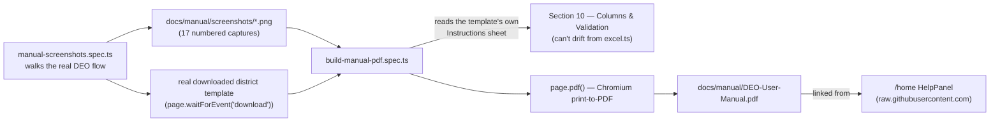

# Milestone & Delivery Summary — UP Excise Spatial Revenue Optimizer

This file is the complete, chronological record of every delivered milestone (M-0 through the current M-31), plus the backlog, original timeline estimates, and pre-campaign blockers. It was split out of `roadmap.md` so that file can stay what it was built to be: a comprehensive logical/technical reference (business rules, architecture, data dictionary, schema) rather than a growing delivery log.

- **roadmap.md** — the technical and business-logic spec. Read it to understand *why* the system is built the way it is.
- **summary.md** (this file) — the delivery history. Read it to understand *what has shipped, when, and why it was done that way*.
- **CLAUDE.md** — the AI co-author's working agreement and a live one-line-per-milestone status table that links back here for detail.

For the live, actively-maintained Pre-Campaign Blockers list, see CLAUDE.md's own "Pre-Campaign Blockers" section — that copy is kept current every session; the copy at the bottom of this file is the original roadmap write-up, preserved as history and may lag behind.

---

## Milestone Index

| Milestone | Status |
|---|---|
| [M-0: Foundation & Repository Setup](#m-0-foundation--repository-setup) | ✅ Complete |
| [M-1: Schema, Migrations & Worker Skeleton](#m-1-schema-migrations--worker-skeleton) | ✅ Complete |
| [M-2: Excel Ingestion & Coordinate Conversion Engine](#m-2-excel-ingestion--coordinate-conversion-engine) | ✅ Complete |
| [M-3: Verification UI & IndexedDB Persistence Layer](#m-3-verification-ui--indexeddb-persistence-layer) | ✅ Complete |
| [M-4: Worker Batch API & D1 Integration](#m-4-worker-batch-api--d1-integration) | ✅ Complete |
| [M-5: Dashboard, Testing & DEO Handoff](#m-5-dashboard-testing--deo-handoff) | ✅ Complete |
| [M-6: Auth Migration + Single Worker](#m-6-auth-migration--single-worker--complete) | ✅ Complete |
| [M-7: Admin Portal UI Overhaul](#m-7-admin-portal-ui-overhaul--complete) | ✅ Complete |
| [M-8: Admin Portal Navigation & Divisions](#m-8-admin-portal-navigation--divisions--complete) | ✅ Complete |
| [M-9: SPA Navigation Parity & Polish](#m-9-spa-navigation-parity--polish--complete) | ✅ Complete |
| [M-10: District Master & Migration Consolidation](#m-10-district-master--migration-consolidation--complete) | ✅ Complete |
| [M-11: PII Email Hashing & Superadmin Config](#m-11-pii-email-hashing--superadmin-config--complete) | ✅ Complete |
| [M-12a: E2E Playwright Automation](#m-12a-e2e-playwright-automation--complete) | ✅ Complete |
| [M-12b: Excel Template UX & Developer QoL](#m-12b-excel-template-ux--developer-qol--complete) | ✅ Complete |
| [M-13: Admin UX Refresh & Excel Enhancements](#m-13-admin-ux-refresh--excel-enhancements--complete) | ✅ Complete |
| [M-14: Single-Library Spreadsheet Rewrite](#m-14-single-library-spreadsheet-rewrite--complete) | ✅ Complete |
| [M-15: Foolproof Gated DEO Workflow](#m-15-foolproof-gated-deo-workflow--complete) | ✅ Complete |
| [M-16: DEO Portal Polish & Bilingual Excel Template Overhaul](#m-16-deo-portal-polish--bilingual-excel-template-overhaul--complete) | ✅ Complete |
| [M-17: CUG Login, API Error Handling & Atomicity Hardening](#m-17-cug-login-api-error-handling--atomicity-hardening--complete) | ✅ Complete |
| [M-18: Audit Log UI Overhaul](#m-18-audit-log-ui-overhaul--complete) | ✅ Complete |
| [M-19: Admin Name/Designation Display](#m-19-admin-namedesignation-display--complete) | ✅ Complete |
| [M-20: Audit Actor Identity & Owner-Only District Master](#m-20-audit-actor-identity--owner-only-district-master--complete) | ✅ Complete |
| [M-21: DEO Excel Template Overhaul, Admin Navbar Fix & Adjacent-Thana Honesty Fix](#m-21-deo-excel-template-overhaul-admin-navbar-fix--adjacent-thana-honesty-fix--complete) | ✅ Complete |
| [M-22: Prod Go-Live Cleanup & Custom Domain](#m-22-prod-go-live-cleanup--custom-domain--complete) | ✅ Complete |
| [M-23: Circle Numbering Convention (Rural vs. Urban)](#m-23-circle-numbering-convention-rural-vs-urban--complete) | ✅ Complete |
| [M-24: Self-Service Unlock Requests & Login-Page ViewPrefs Cleanup](#m-24-self-service-unlock-requests--login-page-viewprefs-cleanup--complete) | ✅ Complete |
| [M-25: Bilingual DEO User Manual (PDF) & Manual-Generation E2E Tests](#m-25-bilingual-deo-user-manual-pdf--manual-generation-e2e-tests--complete) | ✅ Complete |
| [M-26: Fixed Circle/Sector Number Prefix, Excel Column Resize Fix & SW Cache Bump](#m-26-fixed-circlesector-number-prefix-excel-column-resize-fix--sw-cache-bump--complete) | ✅ Complete |
| [M-27: /units Locked-View Redesign & "Invalid Date" Fix](#m-27-units-locked-view-redesign--invalid-date-fix--complete) | ✅ Complete |
| [M-28: Single Global Admin "Sync All" Button](#m-28-single-global-admin-sync-all-button--complete) | ✅ Complete |
| [M-29: SEO Metadata, robots.txt, Favicon & Social-Preview Image](#m-29-seo-metadata-robotstxt-favicon--social-preview-image--complete) | ✅ Complete |
| [M-30: District Detail Circles/Sectors Modal](#m-30-district-detail-circlessectors-modal--complete) | ✅ Complete |
| [M-31: Fixed has_cl5cc Excel Validation Always Rejecting Both TRUE and FALSE](#m-31-fixed-has_cl5cc-excel-validation-always-rejecting-both-true-and-false--complete) | ✅ Complete |

Future milestones (M-32+) get appended below M-31 as they ship — see CLAUDE.md's Milestone Progress table for the current single-source-of-truth pointer, and add the corresponding full write-up here in the same session.

---

### M-0: Foundation & Repository Setup

**Objective:** Establish the development environment, project structure, and CI baseline.

**Deliverables:**

- [x] Monorepo structure initialized (`apps/web`, `packages/schema`). Route groups `(deo)` and `(admin)` stubbed inside `apps/web/app/`.
- [x] `wrangler.jsonc` configured for single Cloudflare Worker + D1 binding.
- [x] Drizzle ORM configured with D1 adapter.
- [x] GitHub Actions CI pipeline: type-check, tests, build & deploy on every push to `main`.
- [x] Single Cloudflare Pages project created for `apps/web`; preview deploys enabled. *(Superseded by M-6/M-22: the app now deploys as a Cloudflare Worker via `@opennextjs/cloudflare`, not Pages, on the custom domain `sro.exciseup.in`.)*
- [x] D1 database provisioned (`phase1-dev` and `phase1-prod`).
- [x] All secrets (Clerk secret key, Clerk webhook signing secret) stored in Cloudflare Workers Secrets — not in `wrangler.toml` or source. *(Clerk itself was removed entirely in M-6.)*
- [x] Clerk project created: magic-link auth enabled, single-session enforcement configured, `publicMetadata.role` set to `'deo'` or `'admin'` for each provisioned user (no Clerk Organizations — free tier caps orgs at 20 members). *(Superseded by M-6's custom HMAC magic-link auth.)*
- [x] `public/_headers` committed with full CSP, `X-Frame-Options: DENY`, `X-Content-Type-Options: nosniff`, `Referrer-Policy`, `Permissions-Policy`.
- [x] `public/manifest.json` committed with PWA metadata (name, icons, display: standalone, theme color).
- [x] Service Worker skeleton (`public/sw.js`) committed: app shell cache strategy stubbed, registered in root `layout.tsx`.
- [x] Root `layout.tsx` stubbed with CDN `<link>` and `<script>` tags (all with SRI placeholders) for: DaisyUI CSS, Tailwind Play CDN, Dexie.js, SweetAlert2, Notyf JS + CSS. SheetJS is excluded from root layout (dynamic inject on upload pages only). Chart.js and Leaflet.js tags are in the `(admin)` layout, not the root. *(SheetJS was later replaced entirely by ExcelJS in M-14.)*

**Exit criterion:** `wrangler deploy --dry-run` passes on CI. `GET /healthz` returns `200 OK`. CI fails if any CDN tag is missing an `integrity` attribute. PWA manifest validates in Chrome DevTools Lighthouse.

---

### M-1: Schema, Migrations & Worker Skeleton

**Objective:** Establish the database schema in D1 and a functional Worker that can receive requests.

**Deliverables:**

- [x] Drizzle schema file (`packages/schema/src/phase1.ts`) finalized — all four tables: `phase1_raw_collection`, `districts`, `district_circles_sectors`, `audit_log`. The `districts` table includes the four `bbox_*` bounding box columns (nullable `REAL`).
- [x] Migration file generated and applied to `phase1-dev` and `phase1-prod` — covers all four tables including bbox columns.
- [x] SQLite `CHECK` constraint for `shop_type` added to migration.
- [x] Hono Worker skeleton: `/api/upload/chunk`, `/api/districts`, `/api/districts/:district/units` (GET + POST), `/api/webhooks/clerk`, `/api/healthz`, CORS configured for Pages preview domains. *(The Hono worker and Clerk webhook were both removed in M-6 — all routes migrated to Next.js Route Handlers in a single worker.)*
- [x] Admin Worker skeleton: `/api/admin/districts` (GET), `/api/admin/districts/:district/shops` (GET, paginated), `/api/admin/bulk-provision` (POST), all guarded by Clerk `admin` role middleware.
- [x] Clerk webhook Worker route: validates SVIX signature, writes auth events to `audit_log`, updates `districts.status` on `district_submitted` events.
- [x] Cron Trigger Worker function: deletes `audit_log` rows older than 45 days. *(Later superseded — see M-18: `@opennextjs/cloudflare` v1 doesn't expose a `scheduled` export hook, so the actual pruning became opportunistic-on-read instead of a real cron trigger.)*
- [x] Worker unit tests: revenue recomputation, SRI hash validation helper, Clerk role guard, `districts.status` state machine.

**Exit criterion:** All four D1 tables exist with correct column names. Clerk webhook fires and a test event appears in `audit_log`. Cron Trigger purge deletes test records in local dev. `GET /api/admin/districts` returns an empty array (no data yet) with correct schema.

---

### M-2: Excel Ingestion & Coordinate Conversion Engine

**Objective:** Build the browser-side data processing pipeline — the most critical component of the architecture.

**Deliverables:**

- [x] SheetJS integrated in `apps/web` as a client-side-only import (dynamic import with `ssr: false`). *(Replaced by ExcelJS in M-14.)*
- [x] Excel column-to-schema field mapping defined and documented. The standardized DEO spreadsheet template columns are mapped to `phase1_raw_collection` fields.
- [x] Coordinate normalizer implemented and unit-tested:
  - Parses DMS strings (e.g., `26°50'48.12"N`) to DD.
  - Parses space/slash-separated DMS numeric fields to DD.
  - Accepts pure DD input directly.
  - Validates against UP bounding box.
  - Returns structured result: `{ latitudeDecimal, longitudeDecimal, warning?: string }`.
- [x] Revenue calculator implemented and unit-tested for all six formula variants.
- [x] Row-level validation function implemented: checks required fields, enum values, cross-field constraints (e.g., `hasCl5cc = true` requires `shopType = COUNTRY_LIQUOR`).
- [x] Standardized district Excel template (`.xlsx`) created and version-controlled in `docs/templates/`. The template has one row per shop, includes a `circle_sector_name` column for per-row tagging, and pre-fills the district name in a designated header cell.
- [x] Single district template generation: Worker route `GET /api/districts/:district/template` returns the template with the district name pre-filled. One file per district — no per-unit variants.
- [x] District bounding box populated during admin bulk-provision: for each district row in `up-districts.geojson`, compute `Math.min/max` over all polygon coordinate pairs and write the four `bbox_*` values to the `districts` row via `POST /api/admin/bulk-provision`.
- [x] Worker upload chunk handler reads the DEO's district row from `districts`, checks uploaded shop coordinates against `bbox_*` columns, and appends a `coordinateWarning` field to any row that falls outside the district bbox. The row is inserted regardless — this is a warning, not a rejection.
- [x] Browser verification UI reads `coordinateWarning` from the upload response and highlights affected rows with an amber warning pill before the DEO proceeds to district-level submission.

**Exit criterion:** A test Excel file with 100 rows covering all shop types and both DMS/DD input formats parses correctly in a Storybook/JSDOM test. Revenue totals match expected values. Coordinate conversions match reference values to 4 decimal places. A generated per-circle/sector template downloads with correct pre-filled headers. A shop row with coordinates outside the district bbox returns `coordinateWarning` in the upload response without being rejected.

---

### M-3: Verification UI & IndexedDB Persistence Layer

**Objective:** Build the DEO-facing frontend — the staging, review, and submission interface.

**Deliverables:**

- [x] Clerk magic-link auth integrated in DEO portal login page. Post-auth redirect to verification UI. Unauthenticated routes redirect to login. *(Replaced by custom HMAC magic-link auth in M-6.)*
- [x] Single-session enforcement verified: authenticating in Browser B invalidates the session in Browser A.
- [x] Dexie.js configured: `phase1_staging` IndexedDB table mirrors the schema. Each row carries `status: 'pending' | 'uploaded' | 'error'` and `circleSectorName`.
- [x] Circle/Sector Management UI: DEO creates and lists circles/sectors for their district. A "Download District Template" button fetches the single district-wide Excel from `GET /api/districts/:district/template`.
- [x] File upload component: DEO uploads the single consolidated district Excel file — drag-and-drop + click-to-upload, triggers SheetJS parse (loaded from jsDelivr CDN dynamically), reads `circle_sector_name` column from each row, writes all rows to IndexedDB tagged with their respective unit.
- [x] Parse progress indicator (parsing 5,000 rows can take 1–2 seconds; shown as a DaisyUI progress bar).
- [x] Verification table component — grouped by circle/sector (DaisyUI tab or collapse components):
  - Paginated display (user-preference rows per page: 25/50/100).
  - Inline edit for all DEO-editable fields.
  - Revenue preview column (computed live from financial inputs).
  - Coordinate status indicator — color + icon glyph (never color alone).
- [x] Adjacent Thana pill component:
  - Parses `adjacentThanasRaw` into removable DaisyUI badge/pill components.
  - Cross-district pills highlighted red; must be removed before the row is marked clean. *(Reworded in M-21 — see that entry's "Adjacent-Thana enforcement honesty fix" for what this check actually does today.)*
  - Deletion updates `adjacentThanasRaw` in IndexedDB immediately.
- [x] Shop type field toggling: financial inputs show/hide based on `shopType` and `hasCl5cc`.
- [x] Completeness gate: district submit button disabled until all registered circles/sectors have at least one verified row in the IndexedDB staging data (checked by comparing registered unit names against `circleSectorName` values across all staged rows). Per-unit row-count summary panel displayed.
- [x] Session recovery: on page load, IndexedDB is read first; staged data and UI state are restored regardless of network.
- [x] Service Worker fully implemented: app shell cache, CDN asset cache (DaisyUI, Tailwind CDN, Dexie.js, SweetAlert2, Notyf, SheetJS), offline detection message relay.
- [x] Background Sync registered on failed chunk uploads; retries transparently on reconnect.
- [x] Dark/light mode toggle (DaisyUI themes); `localStorage` persistence; inline `<head>` script to apply theme before first paint.
- [x] User preferences (theme, page size) read and written to `localStorage` on every change.
- [x] Connection status indicator (Online / Offline / Slow) in app header using DaisyUI alert component.
- [x] `@media print` stylesheet for verification table.
- [x] ARIA attributes on all interactive components (pill buttons, edit fields, upload dropzone, modals).
- [x] PWA install prompt surfaced on iPad Safari and Android Chrome.
- [x] Client-side search in the verification UI (IndexedDB-powered, no network call).
- [x] Audit events written: `upload_chunk` and `unit_registered` events logged to `audit_log` via Worker.

**Exit criterion:** DEO can register two circles, download the district template containing dropdowns for both circles, upload a single consolidated district Excel (parsed from jsDelivr-served SheetJS), review grouped rows, remove a red adjacency pill, toggle dark mode, force-refresh the page, and see all data and theme preference restored from IndexedDB/localStorage. Submit button is blocked until all registered circles are verified. PWA install prompt appears on an iPad browser.

---

### M-4: Worker Batch API & D1 Integration

**Objective:** Complete the server-side ingestion path — Worker validation, batch insert, and acknowledgment.

**Deliverables:**

- [x] `/api/upload/chunk` Worker route fully implemented:
  - Accepts JSON body: `{ rows: Phase1Row[], deoId: string, circleSectorName: string, chunkIndex: number }`.
  - Validates that `circleSectorName` matches a registered unit for the DEO's district (`district_circles_sectors` lookup).
  - Validates each row.
  - Recomputes `totalRevenue` per row and rejects mismatches.
  - Calls `db.batch()` for atomic insert of the entire chunk.
  - Returns `{ accepted: number, rejected: [{ rowIndex, reason }] }`.
- [x] Upsert strategy implemented: if `shopId` + `districtName` already exists, update rather than duplicate — resolved as upsert (`onConflictDoUpdate` in `apps/web/app/api/upload/chunk/route.ts`, `UNIQUE` constraint on `shop_id` + `district_name`). A DEO re-uploading a district overwrites existing rows for the same shop rather than versioning them.
- [x] Frontend upload orchestrator:
  - Splits IndexedDB `pending` rows per circle/sector into 500-row chunks.
  - Sends chunks sequentially across all units (not parallel — prevents Worker rate-limit pressure).
  - Marks rows as `'uploaded'` in IndexedDB on acknowledgment.
  - Marks rows as `'error'` on rejection, surfaces rejection reason in UI.
  - Progress bar shows both per-unit progress and overall district progress.
- [x] End-to-end integration test: upload 1,000 test rows across 2 circles via the full browser → Worker → D1 path in a Wrangler local dev environment.

**Exit criterion:** 1,000 test rows across 2 circles appear in D1 after a full upload cycle. IndexedDB shows all rows as `'uploaded'`. A forced mid-upload interruption followed by session recovery and resume results in no duplicate rows in D1. A circle not yet uploaded prevents final district submission.

---

### M-5: Dashboard, Testing & DEO Handoff

**Objective:** Deliver monitoring visibility, complete testing coverage, and prepare DEO training materials.

**Deliverables:**

- [x] `apps/web/middleware.ts` using `clerkMiddleware` — all routes are auth-protected; only `/login` and `/api/webhooks/clerk` are public. Middleware reads `publicMetadata.role` and redirects on route group mismatch. No landing page, no public home. *(Clerk middleware replaced in M-6.)*
- [x] Admin/HQ route group (`apps/web/app/(admin)/`) fully functional:
  - Default view: district summary list (75 rows, aggregate query only — no shop rows loaded).
  - Interactive UP district choropleth map (Leaflet.js + CartoDB tiles): districts colour-coded by submission status and coverage; hover tooltip; click-to-drill-down. GeoJSON at `apps/web/public/geodata/up-districts.geojson`. Map polls `GET /api/admin/map-data` every 5 minutes.
  - Summary charts (Chart.js): submission progress doughnut, revenue horizontal bar (top 20), shop type pie, upload stacked bar, cumulative uploads line chart.
  - District drill-down: paginated shop table (IndexedDB-cached, stale-while-revalidate).
  - Cross-district D1 search, paginated, results cached by query hash.
  - Per-district CSV export (streamed). Full-state CSV export in Export section (file download, not UI table). *(CSV was later replaced entirely by XLSX/ExcelJS — see M-14 and CLAUDE.md's "Confirmed Past Mistakes" — comma-containing fields like `adjacent_thanas_raw` broke CSV columns.)*
  - Audit log viewer: read-only, paginated, last 45 days.
  - Bulk DEO provisioning: admin uploads Excel (SheetJS in-browser parse) → preview → `bulk-provision` API → Clerk accounts + `districts` rows upserted.
  - IndexedDB district cache with 1-hour TTL and manual refresh.
- [x] DEO accounts provisioned in Clerk via admin bulk-provision flow.
- [x] End-to-end test suite (Playwright):
  - Happy path: login via magic link → register circle/sector → download template → upload Inspector Excel → verify → submit, for each of the 5 shop types.
  - Multi-file district submission: register 2 circles, upload separate Excels, verify grouped view, complete submission.
  - Completeness gate: submission blocked when one circle is missing — verified.
  - CL5CC endorsement flow: `specialBeerLf` and `specialBeerMgr` visible and contributing to `totalRevenue`.
  - Cross-district adjacency pill rejection.
  - Session recovery: forced page refresh mid-verification — all data and theme preference restored.
  - Session invalidation: second login from a different browser revokes the first session.
  - Offline scenario: disconnect network mid-verification, continue editing, reconnect — Background Sync retries queued upload chunks.
  - Mid-upload interruption and resume (no duplicate rows in D1).
  - PWA offline: installed app shell loads with no network.
- [x] Load test: 75 simultaneous DEO sessions each uploading 500 rows. Worker stays within free tier CPU and D1 write quota.
- [x] SRI audit: CI build fails if any CDN `<script>` or `<link>` tag is missing `integrity`. All SRI hashes verified against live jsDelivr responses.
- [x] Lighthouse audit on DEO portal: PWA score ≥ 90, Accessibility score ≥ 90.
- [x] ARIA audit using axe-core: all critical violations resolved.
- [x] Audit log verified: login, upload chunk, and submission events written correctly. 45-day purge cron tested.
- [x] DEO training documentation (`docs/deo-guide.md`) — later superseded by the bilingual PDF manual generated in M-25.
- [x] Standardized Excel templates distributed to all 75 district offices.
- [x] DEO pilot: 3–5 districts complete the full workflow before state-wide rollout.

**Exit criterion:** Pilot districts complete upload with zero Worker errors. Admin dashboard reflects accurate counts. Lighthouse PWA and Accessibility scores ≥ 90. Department signs off on data completeness for pilot districts. System cleared for state-wide rollout.

---

### M-6: Auth Migration + Single Worker ✅ Complete

**Objective:** Remove Clerk dependency entirely; replace with custom HMAC magic-link auth. Consolidate two separate Cloudflare Workers into one.

**Deliverables:**

- [x] Clerk removed from all dependencies, middleware, and pages.
- [x] Custom HMAC magic-link auth implemented: `auth_users`, `auth_magic_links`, `auth_sessions` tables in D1; Resend for email delivery; `SESSION_SECRET` HMAC for session cookie signing.
- [x] `apps/worker` (Hono API) deleted. All 19 API route handlers migrated to Next.js Route Handlers in `apps/web/app/api/`.
- [x] Single Worker `up-excise-spatial-revenue-optimizer-web` serves both pages and API. Same-origin eliminates Bearer tokens, CORS, and cross-worker secrets.
- [x] `apps/web/middleware.ts` rewritten to cookie-based routing (no D1 on every request).
- [x] `useSession()` hook simplified — no `getToken()`, no Authorization header in API calls.
- [x] `/auth/verify` converted to client component (Next.js 15 forbids `cookies().set()` in server component pages); verification logic moved to `POST /api/auth/verify` route handler.
- [x] Migration files at `migrations/0001–0003.sql` applied to prod D1.
- [x] All 4 CF Worker Secrets set on `up-excise-spatial-revenue-optimizer-web`.
- [x] Admin and demo DEO users seeded in `auth_users`.
- [x] CLAUDE.md and roadmap.md updated to reflect new architecture.
- [x] Deployed and live at `https://up-excise-spatial-revenue-optimizer-web.shubhanraj2002.workers.dev`. *(Retired in M-22 — replaced by the custom domain `sro.exciseup.in`.)*

**Exit criterion:** Admin can log in via magic link, verify session, access `/admin` dashboard. DEO can log in and access `/home`.

---

### M-7: Admin Portal UI Overhaul ✅ Complete

**Objective:** Replace the placeholder admin view with a production-quality district detail interface covering all Phase 1 fields.

**Deliverables:**

- [x] District detail page (`/admin/districts/[district]`): all `phase1_raw_collection` fields rendered — shop ID, name, circle/sector, thana, adjacent thanas (flex-wrap pills, no expand/collapse), type badge + CL5CC sub-badge, coordinates, collapsible revenue breakdown (`<details>/<summary>`).
- [x] Full type labels: "Composite Shop (FL + Beer)", "PRV (Premium Retail Vend)".
- [x] Per-type breakdown bar with CL5CC card (radio-style: CL5CC only active alongside Country Liquor, disabled for other types).
- [x] Client-side search, type filter, circle/sector filter, sortable columns, group-by-type with per-group inner pagination.
- [x] Rows per page selector (10/25/50/100/All); preference persisted to `localStorage` (`admin-page-size`).
- [x] Group-by-type persisted to `localStorage` (`admin-group-by-type`); per-group open/close persisted to `localStorage` (`admin-group-{districtName}`).
- [x] `HelpPanel` balloon popover on all admin pages (dashboard, provision, audit, export, district detail). Background blur (`backdrop-blur-[2px]`), closes on Escape/outside click.
- [x] `ViewPrefsPanel` FAB (bottom-right): theme (Light/Auto/Dark — Auto resolves via `matchMedia`), font size, row density, content width; all persisted to `localStorage` (`excise-view-prefs-v1`). Separate `ThemeToggle` component retired.
- [x] UP GeoJSON replaced: GADM 70-district source removed; OSM Overpass `admin_level=5` source provides all 75 districts. RDP-simplified to 615 KB.
- [x] Map: full-width layout, CartoDB tiles with dark/light switching, locked UP bounds, slate-700 borders, status fill colours, permanent district name labels.
- [x] Government colour palette applied across admin portal.

**Exit criterion:** Admin can drill into any district and see all shop fields; filters and group-by-type work fully client-side without additional API calls.

---

### M-8: Admin Portal Navigation & Divisions ✅ Complete

**Objective:** Add dedicated districts and divisions pages, fix navigation, make breadcrumbs clickable, and implement functional navbar search.

**Deliverables:**

- [x] `/admin/districts` — full 75-district sortable table with search, division filter, status filter, and summary stat chips. Fetches same `GET /api/admin/districts` endpoint; no new API route.
- [x] `/admin/divisions` — 18 division cards with submission progress bars and revenue; derived client-side from district data.
- [x] `/admin/divisions/[division]` — division detail page: summary stats (districts, submitted, vends, revenue) + districts table sorted by revenue.
- [x] Overview (`/admin`) updated: district table shows top-10 by revenue only with "View all 75 →" link; divisions grid added below charts.
- [x] Admin layout (`app/(admin)/layout.tsx`): all breadcrumb segments now link-clickable (`<Link>` with hover underline); nav links (including Sign out) use `btn-ghost` for visual consistency; active-state highlighting.
- [x] `SearchBar` component in layout: live dropdown across districts + divisions, results grouped, keyboard nav (↑↓/Enter/Escape), clear button, module-level `searchCache` (one fetch per session). No search results page — navigates directly.
- [x] Map layout: full-width on overview; charts below in 2-column grid; chart `maxHeight` 220px.
- [x] District name permanent labels on choropleth (`district-map-label` CSS class in `layout.tsx` global style block).
- [x] SPA navigation: all `window.location.href` and `<a href>` replaced with Next.js `<Link>` and `router.push()` across all admin pages — eliminates full-page reloads.
- [x] Navbar `z-[1000]` to remain above Leaflet tooltip pane (z=650) — fixes content scrolling over sticky header.
- [x] Density CSS rules use `!important` to beat DaisyUI/Tailwind specificity.
- [x] Leaflet map district click uses `router.push()` via a stable `routerRef` to avoid stale closure inside `useEffect`.

**Exit criterion:** Admin can navigate Overview → Divisions → division detail → district detail using nav links, breadcrumbs, and the search dropdown. All breadcrumbs are clickable. Navigation is full SPA (no page reloads).

---

### M-9: SPA Navigation Parity & Polish ✅ Complete

**Objective:** Finish SPA-navigation parity on the DEO portal, fix HelpPanel/theme/map UX defects reported after M-8, and surface IndexedDB-backed stats that were previously dead placeholders.

**Deliverables:**

- [x] DEO layout (`app/(deo)/layout.tsx`) rewritten to match the admin layout: logo/brand links to `/home`, all nav items use `<Link>`, retired `ThemeToggle` removed (the global `ViewPrefsPanel` is now the single theme source on both portals), `btn-ghost` nav styling, `z-[1000]` sticky navbar.
- [x] Admin layout brand/logo wrapped in `<Link href="/admin">` — clicking the site name/logo returns to the portal home on both portals.
- [x] DEO home page (`app/(deo)/home/page.tsx`) action cards converted from `<a href>` to `<Link>`.
- [x] `HelpPanel.tsx`: balloon auto-flips `left-0`→`right-0` via a `useLayoutEffect` viewport-overflow check so it never renders off-screen; content wrapped in `overflow-y-auto max-h-64` so long help text scrolls instead of overflowing; z-index raised (backdrop `z-[1001]`, balloon `z-[1002]`) above the sticky navbar and Leaflet's tooltip/popup panes (650/700) — fixes the balloon being half-hidden behind the overview map.
- [x] Districts table (`/admin/districts`) gains bbox-midpoint coordinate columns (`centerLat`/`centerLon`, computed server-side in `GET /api/admin/districts` from `districts.bboxMinLat/MaxLat/MinLon/MaxLon`). Read-only on this page (inline editing was added later — see M-10).
- [x] District detail page: "Division" stat card links to `/admin/divisions/[division]`.
- [x] Dark-mode fix: the anti-flash inline script in `layout.tsx` now resolves `localStorage.theme === 'system'`/unset via `matchMedia('(prefers-color-scheme:dark)')` before first paint (previously defaulted unconditionally to light, causing a flash to white on refresh and ignoring system preference). `ViewPrefsPanel` re-applies the resolved theme on every mount and attaches a `matchMedia` change listener so a live OS theme flip is reflected immediately when `'system'` mode is active.
- [x] DEO home page stat cards extracted into `HomeStats.tsx` (client component) — reads live `Circles/Sectors` count from `GET /api/districts/[district]/units`, `Shops Staged` from `stagingDb.count()`, and `Shops Uploaded` from `stagingDb.getByStatus('uploaded')` instead of static `—` placeholders.
- [x] Overview map enlarged to `height: 660` (from 500) so the full state is visible without excessive zoom-out; card header retitled "District Status — Uttar Pradesh" with a descriptive subtitle.
- [x] District map label CSS fixed: selector scoped to `.leaflet-tooltip.district-map-label` (bare class lost the specificity battle against Leaflet's own `.leaflet-tooltip` base styles, leaving labels invisible); font-size and text-shadow layering increased for legibility.

**Exit criterion:** Both portals navigate as a pure SPA with no full-page reloads; HelpPanel never clips off-screen or hides behind the map; dark mode persists correctly across refresh and respects system preference live; DEO home page reflects real local/staged/uploaded counts.

---

### M-10: District Master & Migration Consolidation ✅ Complete

**Objective:** Seed the `districts` table with the real 75 UP districts and 18 divisions (the bbox columns existed since M-9 but were never populated for real data, only for the ad-hoc Demo District), add an inline edit path for district/DEO master data so minor corrections don't require a full Excel re-upload, and consolidate the migration files now that nothing in prod needs preserving.

**Deliverables:**

- [x] Migrations consolidated: `0001_initial.sql`, `0002_drop_premises_consideration_fee.sql`, and `0003_auth.sql` collapsed into a single `migrations/0001_initial.sql` matching `packages/schema` exactly (all 7 tables: `phase1_raw_collection`, `districts`, `district_circles_sectors`, `audit_log`, `auth_users`, `auth_magic_links`, `auth_sessions`), reapplied to prod D1 via `wrangler d1 execute --remote --file=...` (wrangler's `migrations apply` tracks by filename, not content, so it reported "No migrations to apply!" for the rewritten same-named file).
- [x] `scripts/seed-districts.ts` (`pnpm seed:districts`): seeds all 75 UP districts with their correct `division` and bbox (`bboxMinLat/MaxLat/MinLon/MaxLon`, computed from `apps/web/public/geodata/up-districts.geojson`). The district→division mapping was sourced from Wikipedia's "Administrative divisions of Uttar Pradesh" and cross-verified by set-equality against the 75 GeoJSON district names (exact match, no gaps/duplicates) before writing. Idempotent upsert by district name — safe to re-run.
- [x] `UP_DIVISIONS` constant (the 18 bare division names) added to `packages/schema/src/constants.ts` as the single source of truth for the District Master dropdown and the seed script.
- [x] `PATCH /api/admin/districts/[district]` route added: edits division, DEO name/email/identifier, expected vend count, and bbox in one atomic `db.transaction` that also syncs the `auth_users` row (deletes the old email's row if the email changed, upserts the new one).
- [x] `/admin/provision` renamed to "District Master" in the nav and breadcrumbs (URL/file path unchanged) and rebuilt: an all-75-district table with a per-row edit icon opening a right-side drawer (division dropdown from `UP_DIVISIONS`, DEO name/email/identifier, expected vend count, bbox coordinates) wired to the new PATCH route, with the existing bulk-Excel-provision flow retained below it. The drawer supports optionally clearing coordinates and features detailed field-specific validation. `generateProvisionTemplate()` now accepts the live district list and pre-fills District Name + Division in the downloaded `.xlsx`.
- [x] `/admin/districts` table: DEO email column removed from display (decluttering — search still matches on email, it's just not rendered) and the subtitle wording professionalized.
- [x] Demo DEO test account corrected: `seed-demo.ts`'s `DEO_EMAIL` changed from the fake `deodemo+clerk_test@up-excise.dev` to a real `+deo` Gmail alias, `DIVISION` changed from `'Lucknow Division'` to the bare `'Lucknow'` (matching the real-75-district seed's naming convention so Demo District groups correctly), and the script now also inserts/upserts the matching `auth_users` row — previously the demo DEO account had no `auth_users` row and could never actually complete a magic-link login.

**Exit criterion:** All 75 districts and 18 divisions are visible and correctly grouped throughout the admin portal; an admin can correct a district's division, DEO assignment, vend count, or coordinates from a drawer without touching Excel; the demo DEO account logs in successfully end-to-end; the repo has one canonical migration file per environment-reset, not three.

---

### M-11: PII Email Hashing & Superadmin Config ✅ Complete

**Objective:** Ensure that zero plaintext email addresses are stored in the database or hardcoded in the codebase, preventing unauthorized disclosure of DEO and Admin identities.

**Deliverables:**
- [x] Schema modified to use `email_hash` and `deo_email_hash` in `auth_users`, `auth_magic_links`, and `districts` tables.
- [x] Login flow dynamically hashes plaintext emails and only searches D1 by hash.
- [x] Superadmin config transitioned to the `.env` variable `SUPERADMIN_EMAIL_HASH`, completely removing the developer's email string from the codebase.
- [x] SessionStorage implemented for storing the plaintext email temporarily in the frontend after login submission.

**Exit criterion:** The entire system works using hashed PII, meaning no plaintext emails exist in D1.

---

### M-12a: E2E Playwright Automation ✅ Complete

**Objective:** Enforce the IndexedDB-first caching pattern across all remaining admin pages to eliminate unnecessary Cloudflare Worker CPU execution and D1 read operations.

**Deliverables:**

- [x] Upgraded Dexie.js admin schema (`excise-admin`) to version 3 in `apps/web/src/lib/db.ts`.
- [x] Added new object stores and cache wrappers for `map_cache` (5m TTL), `shops_cache` (5m TTL), and `audit_cache` (1m TTL).
- [x] Refactored `apps/web/app/(admin)/admin/page.tsx` (Overview map/charts) to check `adminMapCache` before fetching.
- [x] Refactored `apps/web/app/(admin)/admin/districts/[district]/page.tsx` (District Detail) to check `adminShopsCache` before fetching shop rows.
- [x] Refactored `apps/web/app/(admin)/admin/audit/page.tsx` (Audit Log) to use `adminAuditCache` for paginated results.

**Exit criterion:** Admin pages load instantaneously on subsequent visits and do not issue direct database queries on every render, complying fully with the zero-cost architecture rule.

---

### M-12b: Excel Template UX & Developer QoL ✅ Complete

**Objective:** Improve the DEO user experience when interacting with the downloaded template and improve developer workflow for testing.

**Deliverables:**

- [x] Refactored `apps/web/src/lib/excel.ts` to output a multi-sheet workbook: Data Entry, Demo Data, Instructions, Reference Data. *(The "Demo Data" sheet was later removed in M-21 — DEOs mistook it for a second copy of their own data.)*
- [x] Consolidated the 4 verbose coordinate columns into 2 dynamic columns (`latitude` and `longitude`) that securely process either DD or DMS via the existing `normalizeCoordinates` function.
- [x] Added a seamless role override in the `createSession` middleware to dynamically grant `superadmin` access to the developer email (`shubhanraj2002@gmail.com`), bypassing DB resets to test both `/deo` and `/admin` portals interchangeably.

**Exit criterion:** DEO templates are cleaner and self-documenting. Developers can test the full platform lifecycle without manually toggling roles in the D1 database.

---

### M-13: Admin UX Refresh & Excel Enhancements ✅ Complete

**Objective:** Remove unnecessary polling from the admin portal and make district exports and DEO uploads more resilient.

**Deliverables:**

- [x] Removed 5-minute auto-polling TTLs from the admin IndexedDB cache in favor of an explicit manual "Sync from Server" button on every admin page that reads district/shop data. *(Superseded by M-28's single global "Sync All" button.)*
- [x] District Detail XLSX export gained auto-filters, frozen panes, and an injected TOTAL row.
- [x] DEO district upload/verify actions disabled client-side when no circles/sectors are registered yet.
- [x] Fixed a JSZip-based XML validation injection in the DEO Excel template generator; added merged title rows, frozen top panes, and dynamic circle/sector dropdowns fed by a hidden "Reference Data" sheet.

**Exit criterion:** Admin pages never silently re-fetch on a timer; every network round-trip is an explicit user action.

---

### M-14: Single-Library Spreadsheet Rewrite ✅ Complete

**Objective:** Eliminate SheetJS and hand-patched worksheet XML in favor of one spreadsheet library across the entire app.

**Deliverables:**

- [x] Replaced SheetJS (reads) + JSZip-XML-patching (writes) with ExcelJS everywhere — the single CDN global `window.ExcelJS` now handles every read, write, and export in `apps/web/src/lib/excel.ts`.
- [x] Fixed the corrupted DEO Excel template output (missing workbook-level `_xlnm.Print_Titles` defined name from the old hand-edited XML).
- [x] Every generated/exported workbook now gets landscape orientation, fit-to-width printing, a repeated header row, frozen header panes, and wrapped cell text for free.
- [x] Removed `xlsx` and `jszip` from the CDN stack, Service Worker precache list, and dependencies.

**Exit criterion:** There is exactly one spreadsheet library in the codebase, and no code manually edits OOXML.

---

### M-15: Foolproof Gated DEO Workflow ✅ Complete

**Objective:** Make the DEO's Circles & Sectors → Upload → Verify workflow impossible to get lost in, and impossible to accidentally re-order.

**Deliverables:**

- [x] `POST /api/districts/[district]/units` made bulk-only (`{ circles, sectors }`); rejects with 409 once any unit row exists — lock derived from row existence, no schema flag.
- [x] `/units` rebuilt as a 2-step wizard: enter counts → fill pre-generated name boxes → SweetAlert2-confirmed one-shot submit.
- [x] `/home` and the DEO nav bar hide Upload/Verify entirely (not merely disabled) until units are locked.
- [x] SweetAlert2 confirmation added before final `/verify` district submission.
- [x] Bilingual (English/Hindi) subtitles added to DEO portal page titles and step headings — DEO portal only, admin stays English-only.

**Exit criterion:** A first-time DEO cannot reach Upload or Verify before registering circles/sectors, and cannot accidentally re-submit a locked unit list.

---

### M-16: DEO Portal Polish & Bilingual Excel Template Overhaul ✅ Complete

**Objective:** Close remaining UX gaps in the gated DEO workflow (silent freezes, no recovery path for mistakes) and make the downloaded Excel template genuinely usable by non-technical field staff.

**Deliverables:**

- [x] `HelpPanel` (`app/_components/HelpPanel.tsx`) gained optional `titleHi`/`childrenHi` props with an English/हिन्दी tab switcher, shown only when Hindi content is supplied — all four DEO help panels (home, units, upload, verify) fully translated; all seven admin help panels left English-only by design.
- [x] `/units` circle/sector submission now shows a blocking "Locking circles & sectors…" loader overlay instead of freezing silently; the locked view tells the DEO to contact Admin/HQ for corrections.
- [x] Added `DELETE /api/districts/[district]/units` (admin/superadmin only, audit-logged as `units_unlocked`) and an "Unlock Circles/Sectors" action on the admin district detail page, giving admins an actual recovery path for DEO mistakes.
- [x] DEO Excel template (`apps/web/src/lib/excel.ts`) header row replaced raw snake_case DB column names (`basic_license_fee_blf`) with bilingual, human-readable labels (`Basic License Fee (BLF) ₹ / मूल लाइसेंस शुल्क (BLF) ₹`); parsing switched from header-text matching to fixed column-position mapping so the visible label is fully decoupled from field identity.
- [x] Added per-cell Excel data validation gating every financial column to the shop types it applies to per the Revenue Formulas table (e.g. `basic_license_fee_blf` only accepts a value when `shop_type = COUNTRY_LIQUOR`) — enforced by Excel itself, not just the Worker on upload.
- [x] Shop Type dropdown shows friendly labels ("Model Shop", "Country Liquor"...) instead of the raw `MODEL_SHOP`/`COUNTRY_LIQUOR` enum constants; `parseExcelFile` maps the label back to the exact enum string before it reaches the Worker, so the enum contract is unchanged. `has_cl5cc` gated the same way as the financial fields — Excel rejects `true` unless Shop Type is Country Liquor. *(The `has_cl5cc` gate had a real bug of its own — see M-31.)*
- [x] "Reference Data" sheet hidden and sheet-protected read-only (still feeds the circle/sector dropdown, no longer editable or a visible redundant tab — it's rebuilt fresh from the live units list on every download, so there's no legitimate reason to edit it). Instructions sheet fully translated to Hindi, with Thana Name / Adjacent Thanas copy corrected twice: first to drop a non-enforced "Excise-authoritative, not police" distinction and stop describing adjacency as district-wide, then again (in M-21) to stop overclaiming server-side rejection — the portal has no state-wide Thana-to-district master list, so the actual check is the Verify page flagging (not blocking) any adjacent-Thana name not already present in that district's own uploaded data.

**Exit criterion:** A DEO never sees an unexplained freeze during a mutating action, has a documented path to recover from a locking mistake, and can fill the Excel template correctly without needing to understand the underlying data model.

---

### M-17: CUG Login, API Error Handling & Atomicity Hardening ✅ Complete

**Objective:** Add a login path that doesn't depend on Resend's unverified sending domain, and close gaps found in an audit for unhandled-error responses and non-atomic multi-writes.

**Deliverables:**

- [x] `auth_users.deo_cug_hash` column added (migration `0002_add_deo_cug_hash.sql`, unique, nullable) — SHA-256 of a DEO's 10-digit department CUG mobile number, hashed client-side (`apps/web/src/lib/crypto-client.ts`) so the raw number never reaches the server.
- [x] `POST /api/auth/verify-cug` — looks up the hash, creates the same session as the magic-link path, audit-logs `login_cug`. `/login` (`app/login/_components/LoginForm.tsx`) gained an Email/CUG toggle.
- [x] `scripts/seed-deo-accounts.ts` — parses department contact sheets (`scripts/data/deo-contact.csv`, `deo-emails.csv`; raw PII, gitignored, never committed), maps Hindi district designations to English `districts.name`, hashes CUG + email, and upserts `auth_users` + `districts`. Seeded all 75 real DEO accounts into prod D1, including Bhadohi (mapped from its pre-renaming "Sant Ravidas Nagar, Bhadohi" designation string to the current `Bhadohi` name used throughout D1 — verified correctly mapped against prod D1 directly, 2026-07-23). DEO names stored as an English placeholder (`"<District> DEO"`) since the source names are Hindi and the Data Language rule requires English-only stored data.
- [x] `apps/web/src/lib/with-error-handling.ts` (`withErrorHandling`) added and applied to all 25 non-trivial API routes (all but `/api/healthz`) — an unhandled exception now returns this app's `{ error }` JSON 500 instead of Next's default non-JSON error page, which previously broke every client-side `res.json()` caller on an unexpected failure.
- [x] Atomicity audit across all API routes found one gap: `bulk-provision`'s per-row `districts` insert and `auth_users` insert were two separate `await`s — a partial failure could leave them inconsistent. Wrapped in `db.transaction`. Every other multi-write route already used `db.batch()` correctly.
- [x] `/login`'s CUG/Email toggle defaults to the CUG tab (DEOs are the primary audience; Email is labeled "Email (Admin)"), matching the sibling `excise-revenue-recovery-portal` project's login page.
- [x] Test CUG number seeded for the existing "Demo DEO Officer" `auth_users` row (`deo_id = DEO-DEMO-001`, `district_name = Demo District`). Raw digits live only in the `DEMO_CUG` Cloudflare Worker secret, never in source or docs. Its `role` was changed from `deo` to `admin` so this one login can reach both portals for testing — `middleware.ts` already lets `role: 'admin'` through the DEO route gates. *(This account and Demo District were both deleted from prod in M-22's go-live cleanup.)*

**Exit criterion:** A DEO can log in even if magic-link email delivery is unavailable; any unhandled server error returns a parseable JSON response instead of breaking the client; no route performs two related writes outside a single atomic operation.

---

### M-18: Audit Log UI Overhaul ✅ Complete

**Objective:** Bring `/admin/audit` up to feature parity with the sibling `excise-revenue-recovery-portal` project's audit page — in this project's own DaisyUI idiom, not a literal visual copy — and fix smaller UX gaps found during the same comparison pass.

**Deliverables:**

- [x] Human-readable event-type and metadata-key labels (`EVENT_LABELS`/`METADATA_KEY_LABELS`), an event-type filter dropdown, a newest/oldest sort toggle (client-side over the currently loaded page), a manual "Sync from Server" button (`adminAuditCache.invalidate()`, mirroring the M-13 manual-sync pattern used elsewhere — *later removed in M-28 in favor of always fetching fresh*), and loading-skeleton rows.
- [x] `GET /api/admin/audit-log` gained opportunistic 45-day retention pruning on every read (deletes rows older than the cutoff before returning the page) — closes the deferred-cron-trigger gap noted in M-1, since this table's only consumer is this one page.
- [x] `/units` — replaced two plain "Loading…" text lines with skeleton blocks, and added inline "Required" text under blank name boxes (previously only a red border, no text).
- [x] `/admin/provision` (District Master) — replaced a native browser `confirm()` in `resetTestData()` with a SweetAlert2 dialog (the native dialog was a direct violation of CLAUDE.md's own "SweetAlert2 for every irreversible action" rule), added a SweetAlert2 confirmation before `provision()` sends real magic-link emails to the addresses in the preview table (previously fired with no confirmation step at all), and replaced the table's loading spinner with skeleton rows matching `/admin/districts`'s pattern.

**Exit criterion:** `/admin/audit` matches the sibling project's audit page feature set in this project's own idiom; the audit table self-prunes past 45 days on every read; no native `confirm()`/`alert()` remains anywhere in the admin portal for an irreversible action.

---

### M-19: Admin Name/Designation Display ✅ Complete

**Objective:** Show the signed-in admin's real name and designation in the navbar instead of nothing, and fix any bugs surfaced while wiring that up.

**Deliverables:**

- [x] `auth_users.designation` column added (migration `0003_add_designation.sql`, nullable, additive — applied to prod D1 before the code deploy so the already-live worker never queried a column that didn't exist yet).
- [x] Admin navbar (`app/(admin)/layout.tsx`'s new `AdminIdentity`) now shows the signed-in admin's name and designation instead of nothing at all; falls back to "Superadmin"/"Admin" by role when designation is unset. No email-on-hover tooltip — this project's Zero-Knowledge PII design means no plaintext email is ever available client-side to show.
- [x] **Bug found and fixed:** `SessionInfo.email` was declared but never actually populated by `GET /api/auth/session`, so `/admin/provision`'s Danger Zone gate (`session?.email === SUPERADMIN_EMAIL`) had silently never rendered for anyone — replaced with `session?.role === 'superadmin'`.
- [x] **Bug found and fixed:** that same file and `api/admin/reset-test-data/route.ts` both hardcoded the superadmin's plaintext email as a dead/redundant local constant, a direct violation of the "Superadmin Configuration" hard constraint — removed both; the server-side check already correctly used `SUPERADMIN_EMAIL_HASH`.

**Exit criterion:** the admin navbar shows a real name/designation for every signed-in admin account; no plaintext superadmin email string remains anywhere in source.

---

### M-20: Audit Actor Identity & Owner-Only District Master ✅ Complete

**Objective:** Close four gaps found by comparing this project against UX/accountability work already done in the sibling `excise-revenue-recovery-portal` project.

**Deliverables:**

- [x] `audit_log.actor_name`/`actor_designation` columns added (migration `0004_add_audit_actor_identity.sql`, nullable, additive, applied to prod D1 before the code deploy). Populated at write time for every admin/superadmin-initiated event (`login`, `logout`, `login_cug`, `units_unlocked`, `district_master_updated`, `bulk_provision`); left `null` for DEO-actor events, where `deoId` already identifies the actor. `/admin/audit`'s new `describeActor()` prefers `actorName`(+`actorDesignation`), falling back to `deoId` — previously that column showed the raw (and, for admin actions, empty) `deoId` for every row.
- [x] `login` (magic link) and `logout` events, previously only documented in the schema comment and the audit page's label map, are now actually written — `api/auth/verify/route.ts` and `api/auth/logout/route.ts` each insert an `audit_log` row. `logout` fetches the session (for actor identity) before deleting it.
- [x] `PATCH /api/admin/districts/[district]` now writes a `district_master_updated` audit row (metadata: which fields changed, whether the email changed — never the raw email itself, keeping the Zero-Knowledge PII rule intact in audit metadata too) as part of the same `db.batch`. `POST /api/admin/bulk-provision` writes one summary `bulk_provision` row per run (total/provisioned/failed counts, no raw emails).
- [x] District Master (`/admin/provision`) restricted to `role: 'superadmin'` — it reassigns any district's DEO and bulk-provisions real accounts with real magic-link emails, which should not be available to every department admin account now that more than one exists. Nav link hidden for a plain `admin` session; direct navigation renders a restricted message; `PATCH /api/admin/districts/[district]` and `POST /api/admin/bulk-provision` independently 403 non-superadmins server-side — the actual security boundary, not just the UI hide.

**Exit criterion:** Every admin-initiated audit row shows a human-readable actor (name + designation); login and logout are both audit-logged; District Master's two mutating routes reject a plain `admin` session with 403.

---

### M-21: DEO Excel Template Overhaul, Admin Navbar Fix & Adjacent-Thana Honesty Fix ✅ Complete

**Objective:** Fix three issues found in live use — a confusing/unlocked DEO Excel template, a broken navbar layout, and a misleading claim about how strictly the Adjacent Thana check is enforced.

**Deliverables:**

- [x] **Excel template** (`apps/web/src/lib/excel.ts`, `generateTemplate`): removed the "Demo Data" sheet (DEOs mistook its example rows for a second copy of their own data) — now 3 sheets instead of 4 (Data Entry, Instructions, Reference Data). Data Entry's header row is now locked via sheet protection (no password — a guardrail, not a security boundary, same pattern as the Reference Data sheet); every data cell stays unlocked via a column-level default set *before* the header cells are styled — this ordering matters, since ExcelJS's `Column.protection` setter (verified against the pinned exceljs@4.4.0 by inspecting the generated OOXML directly) walks every already-existing cell in that column and overwrites its protection, so setting column protection after styling the header would silently unlock the header too. Every header cell now carries a hover tooltip (`cell.note`, an Excel cell comment) with that field's rules, derived programmatically from `COLUMN_GUIDE` so the two data sources can't drift apart. `adjacent_thanas_raw`'s header label and Instructions-sheet Notes column both gained a concrete example (`e.g. Kotwali, Hazratganj`). Verified end-to-end by downloading the real template from a running dev server via Playwright and inspecting the resulting XML/comments/styles directly — not just typecheck/build.
- [x] **Admin + DEO navbar layout bug:** `app/(admin)/layout.tsx` and `app/(deo)/layout.tsx` both had their nav-button container styled `flex-none gap-1` with no `display:flex` of its own. `flex-none` only controls how a div behaves *as a child* of its parent's flex layout — it doesn't make that div's own children lay out as a flex row — so the nav buttons rendered as plain inline content and wrapped like ordinary text once total width ran out (visible in production as the admin identity pill + "Sign out" breaking onto a second line). Predates this milestone but was reported live and fixed here: both containers are now `flex-none flex items-center flex-wrap justify-end gap-1`. Verified via a real Playwright screenshot of the fix running locally.
- [x] **Adjacent-Thana enforcement honesty fix:** the verify page's red-pill tooltip read "Cross-district adjacency — must be removed," and CLAUDE.md's own "Adjacent Thana Cross-District Rule" claimed this was "enforced... by the Worker" — both false. `districtThanas` (`app/(deo)/verify/page.tsx`) is built only from the current DEO's own district's own rows (staged or already-uploaded); it never touches any other district's data, and there is no state-wide Thana master list to check against — nor does the Worker (`api/upload/chunk/route.ts`) validate `adjacentThanasRaw` at all. A red pill only means the name doesn't yet appear as a `thanaName` elsewhere in that same district's own dataset — a same-district, same-upload typo-catching heuristic, not cross-district detection — and it does not block submission. Reworded the tooltip, the `districtThanas` code comment, both English/Hindi Help Panel paragraphs on `/verify`, CLAUDE.md's "Adjacent Thana Cross-District Rule" section, roadmap.md's business-rules section, and — caught in a follow-up pass, since it feeds both the DEO Excel template's Instructions sheet row and the header hover tooltip — the `adjacent_thanas_raw` entry in `excel.ts`'s `COLUMN_GUIDE`, which still read "the portal flags any name it doesn't recognize" without clarifying it's same-district-only, non-blocking, and not checked against any master list.

**Exit criterion:** Downloading the DEO template produces exactly 3 sheets with a locked, tooltip-annotated header row; the admin and DEO navbars render all items on one row at normal viewport widths; every place documenting the Adjacent Thana check (code comments, UI copy, CLAUDE.md, roadmap.md) describes it as a same-district heuristic, not an enforced cross-district rule.

---

### M-22: Prod Go-Live Cleanup & Custom Domain ✅ Complete

**Objective:** Clear all demo/test state out of prod D1 ahead of the real campaign, remove the now-orphaned dual-portal testing affordance, and move the Worker from its `*.workers.dev` URL to a real custom domain.

**Deliverables:**

- [x] **Prod D1 fresh start:** deleted every `phase1_raw_collection` row, every `district_circles_sectors` row (test units under Ayodhya, Lucknow, and Demo District), and every `audit_log` row. Deleted the "Demo DEO Officer" `auth_users` row entirely — along with its `auth_sessions`/`auth_magic_links` rows first, since `auth_sessions.user_id` has an FK to `auth_users.id` that rejects the parent delete otherwise — and deleted the `Demo District` row from `districts` outright rather than just truncating it, since the demo phase is over. All 75 real districts' master data (bbox, DEO name/email/CUG hash) and all 6 admin accounts were left untouched. The owner's own `auth_users` row also carried a stale `deo_id`/`district_name` pointing at the now-deleted Demo District (leftover from when the owner's account doubled as the dual-portal test login) — nulled out. `districts.status` reset to `pending` across all rows.
- [x] **Admin navbar cleanup:** removed the "DEO Portal" quick-switch `<Link>` from `app/(admin)/layout.tsx` — it existed solely to reach the DEO pages via the Demo DEO Officer's `role: 'admin'` bypass account, which no longer exists.
- [x] **Custom domain — `sro.exciseup.in`:** Cloudflare's onboarding only accepts root/registrable domains for a new zone, not bare subdomains, so getting a subdomain on Cloudflare required migrating the whole `exciseup.in` zone's nameservers — not just delegating the one subdomain. `exciseup.in` also carries Google Workspace email (MX/SPF/DMARC on the root) and was DNSSEC-signed, both of which had to survive: DNSSEC was disabled at the registrar before the nameserver switch and re-enabled via Cloudflare afterward (skipping this ordering would break domain resolution mid-migration for validating resolvers), and Workspace's MX/SPF/DMARC were verified byte-for-byte identical post-migration. Hit one real regression in the process: Cloudflare's DNS auto-scan did not correctly preserve `mail.exciseup.in`'s original `CNAME → ext-sq.squarespace.com` record (Resend's sending domain) — documented in DEPLOY.md as a known gotcha for any future domain migration. `apps/web/wrangler.jsonc` gained `routes: [{ pattern: "sro.exciseup.in", custom_domain: true }]`; `wrangler deploy` provisions the domain and TLS cert automatically, no manual DNS record needed. The name "SRO" (Spatial Revenue Optimizer) was chosen deliberately over "Excise Portal," since the sibling `excise-revenue-recovery-portal` project already owns that branding. `apps/web/app/login/actions.ts`'s `ALLOWED_HOSTS`/`FALLBACK_HOST` (the open-redirect guard used to build magic-link email URLs) updated to `sro.exciseup.in`. The old `*.workers.dev` URL is now disabled — Cloudflare's default behavior once a `custom_domain` route exists.

**Exit criterion:** Prod D1 has zero shop/unit/audit rows and no demo district or demo account, while all 75 real districts and all admin accounts are intact; the admin navbar has no dead link to a nonexistent test account; `https://sro.exciseup.in` serves the live Worker with a valid cert and correctly redirects unauthenticated requests to `/login`.

---

### M-23: Circle Numbering Convention (Rural vs. Urban) ✅ Complete

**Objective:** Fix `/units`' circle name placeholders to match the department's real numbering rule — sectors cover a district's urban area, circles cover the rural area, so "Circle 1" conceptually belongs to the sector-covered urban zone.

**Deliverables:**

- [x] `circleNumber(i)` placeholder helper (`apps/web/app/(deo)/units/page.tsx`) — circle placeholders start at "Circle 1" only when a district registers zero sectors; once any sectors exist, circle placeholders start at "Circle 2" instead. Pure client-side placeholder-text convention — the DEO always types the real name, and neither the schema nor `POST /api/districts/[district]/units` depends on or enforces the number.
- [x] Both English and Hindi help-panel copy on `/units` updated to state the rule explicitly.

**Exit criterion:** A district with any sectors never shows "Circle 1" as a placeholder; a purely rural district (zero sectors) still starts circle numbering at 1.

---

### M-24: Self-Service Unlock Requests & Login-Page ViewPrefs Cleanup ✅ Complete

**Objective:** Give a locked-out DEO an in-app way to request a unit-list unlock instead of only a "contact your Admin" message — mirroring the sibling `excise-revenue-recovery-portal` project's unlock-request feature — and stop showing the view-customization FAB before a user is signed in.

**Deliverables:**

- [x] New `district_unlock_requests` table (migration `0005_add_unlock_requests.sql`, additive, applied directly to prod D1 — verified all 75 `districts` rows and existing data untouched before and after). No PDF-attachment column — this project has no R2 binding and none was requested, unlike the sibling project's version of this table.
- [x] `GET`/`POST /api/districts/[district]/request-unlock` — DEO-only, scoped to the caller's own `session.districtName` (403 otherwise). `POST` rejects (409) if the district isn't locked yet, or if a pending request already exists for it; stores the reason and audit-logs `unlock_requested`.
- [x] `/units`' locked view now shows a "Request Unlock" button (SweetAlert2 textarea, reason required, bilingual copy) instead of only static contact text, and polls its own latest request on load to show a pending (info banner) or denied (with the admin's note) state.
- [x] New `/admin/unlock-requests` page — nav link added to `app/(admin)/layout.tsx` (open to plain `admin`, not owner/superadmin-gated, same access level as the pre-existing manual unlock), IndexedDB-first per the project's Admin Data Loading rule (`adminUnlockRequestsCache` in `db.ts`, manual "Sync from Server" button, same convention as `/admin/audit`). Lists every request with a pending/all filter.
- [x] `POST /api/admin/unlock-requests/resolve` — `{ id, action: 'approve'|'deny', note }`, both actions require the admin's own note. Approving deletes the district's `district_circles_sectors` rows (identical effect to the pre-existing manual `DELETE /api/districts/[district]/units` unlock) and audit-logs `units_unlocked` (reusing the existing event type so `/admin/audit`'s label mapping needed no new entry for the approval path); denying audit-logs the new `unlock_request_denied` event. Re-checks the request's status server-side before resolving (rejects 409 if already resolved) to close a double-resolve race.
- [x] `/admin/audit`'s `EVENT_LABELS`/`METADATA_KEY_LABELS` extended with `unlock_requested`, `unlock_request_denied`, and the `reason`/`note` metadata keys.
- [x] **Login-page ViewPrefs cleanup:** the theme/font-size/density/width customization FAB (`ViewPrefsPanel.tsx`) was rendering on `/login` and `/auth/verify` — pages reached before a session exists, where a customization control serves no purpose. It now reads `usePathname()` and renders nothing on those two routes; the anti-flash inline script in `layout.tsx` (untouched) still resolves the correct theme from `localStorage`/OS preference before first paint on every route, so login/verify still respect the device's theme, just without a visible FAB.

**Exit criterion:** A DEO whose district is locked can submit a reason-required unlock request from `/units`; an admin can approve (which unlocks the district, same as the manual path) or deny (with a required note) from `/admin/unlock-requests`; both outcomes are visible back on `/units` and in the audit log. `/login` and `/auth/verify` show no view-customization FAB, on any theme/device.

---

### M-25: Bilingual DEO User Manual (PDF) & Manual-Generation E2E Tests ✅ Complete

**Objective:** Give DEOs a detailed, self-contained reference document beyond the portal's own brief in-app `HelpPanel` text — with real screenshots, in both English and Hindi — and generate it from the actual running app rather than hand-authoring it, so it can't silently drift from what the portal actually does.



**Deliverables:**

- [x] `apps/web/tests/manual-screenshots.spec.ts` — walks the full DEO flow (login → home → circles/sectors wizard → lock confirmation → download template → upload → verify → submit → unlock request) against a real seeded district (Agra, since Demo District no longer exists post-M-22) on local D1, saving 17 numbered screenshots to `docs/manual/screenshots/`. Also captures the actual district template download (`page.waitForEvent('download')`) so the manual's template documentation is read from the real generated file, not a hand-maintained copy.
- [x] `apps/web/tests/build-manual-pdf.spec.ts` — turns the screenshots (plus the downloaded template's own "Instructions" sheet) into `docs/manual/DEO-User-Manual.pdf` via Chromium's own `page.pdf()`. No new PDF library — reuses the Playwright/Chromium already installed for e2e testing.
- [x] PDF content: sections 1–9 walk the UI screen-by-screen (bilingual captions under each screenshot); **Section 10** is a full column-by-column table (Field / Description / Required For / Notes) read directly from the real template's "Instructions" sheet, plus a dedicated callout clarifying the Adjacent Thanas comma-separated multi-name format (e.g. `Fatehabad, Hariparvat, Sadar Bazar` — spaces are fine *inside* one Thana's name, but multiple names need commas); **Section 11** documents the per-shop-type revenue formulas and the browser/server dual-verification check; sections 12–17 continue the walkthrough (parse, verify, submit, unlock request).
- [x] **Bug found and fixed:** `getSession()` (`apps/web/src/lib/auth.ts`) hardcoded the superadmin-bypass session's `districtName` to `'Demo District'` unconditionally, inconsistent with the login route's own `user.districtName ?? 'Demo District'` fallback — since Demo District no longer exists in prod (M-22), this silently broke the bypass account's ability to reach any DEO page in production. Fixed to `row.districtName ?? 'Demo District'`.
- [x] `playwright.config.ts`'s `baseURL` now reads `PLAYWRIGHT_TEST_BASE_URL` (falls back to `http://localhost:3000`) — these new specs run against the OpenNext Cloudflare **preview** server (real D1/secrets bindings via a local-only `.dev.vars`), not plain `next dev`, which has no Cloudflare bindings at all. Documented in TEST.md along with full regeneration steps.
- [x] `/home`'s `HelpPanel` now links to the manual (bilingual copy, opens in a new tab) — fetched from `raw.githubusercontent.com` (public repo) rather than served from the Worker, since it's a static reference doc regenerated ad hoc, not something that needs bundling into the app or a redeploy to update.
- [x] Removed the "SIBIN Tech Solutions" co-branding line from the magic-link email footer (`apps/web/src/lib/email.ts`) and the manual's own cover page, per instruction — retained only in `.md` docs.

**Exit criterion:** `docs/manual/DEO-User-Manual.pdf` exists, is regeneratable from the live app via the two new Playwright specs, and is linked from the DEO Dashboard's Help panel.

---

### M-26: Fixed Circle/Sector Number Prefix, Excel Column Resize Fix & SW Cache Bump ✅ Complete

**Objective:** Close two DEO-reported gaps: (1) many DEOs were typing only an Inspector-supplied area name into the `/units` circle/sector boxes and dropping the circle/sector number entirely, leaving no way to tell which unit a shop belongs to; (2) the downloaded DEO Excel template silently blocked column-width changes.

**Deliverables:**

- [x] **Fixed, non-editable unit number** (`apps/web/app/(deo)/units/page.tsx`) — went through two iterations. The first attempt pre-filled the Step 2 box with a real (still free-text) `Sector 1 - ` value and regex-validated that a DEO couldn't edit the number away. The user rejected this as still too easy to break ("so much spoon feeding") and asked for a simpler, hard-guaranteed design: each row now shows a fixed `Sector N -` / `Circle N -` label as plain UI text, with the input box holding **only** the area name (mandatory — `allFilled`/`canSubmit` require every box non-blank, no regex needed since the number is never part of the editable value). `submitUnits()` assembles the full stored unit name itself: `` `Sector ${i+1} - ${areaName.trim()}` `` / `` `Circle ${circleNumber(i)} - ${areaName.trim()}` ``. The DEO literally cannot drop, edit, or mistype the number now.
- [x] **Excel template column resize** (`apps/web/src/lib/excel.ts`, `buildShopDataSheet`): the Data Entry sheet's `ws.protect(...)` call had `formatColumns: false`, the OOXML sheet-protection flag that disables Excel's "Format → Column Width" even on unlocked data cells. Changed to `formatColumns: true`. Header cells remain uneditable regardless — `formatColumns` only governs resize permission, not cell-edit locking, which is set independently per-cell via `cell.protection = { locked: true }` in `styleHeaderRow()`.
- [x] **Service worker cache bump** (`apps/web/public/sw.js`): `CACHE` constant bumped `excise-v2` → `excise-v3`. Found while investigating a reported `/verify`-page hang: the underlying infinite-toggle bug had already been fixed in an earlier commit (`b79320c`, 2026-07-11), but that fix shipped without a cache-name bump, so a browser that had the app's JS cached from before the fix could keep running the stale, buggy bundle indefinitely (the SW's fetch handler opportunistically caches every same-origin GET, including `_next/static/*` chunks, under one static cache name). Bumping the cache name forces every open tab to pick up fresh JS on next activation.

**Exit criterion:** `/units` boxes cannot be locked in with a circle/sector missing its assigned number, and the number can never be edited or deleted by the DEO; the downloaded DEO Excel template allows column-width resizing without allowing header edits; `pnpm typecheck` and `next build` pass.

---

### M-27: /units Locked-View Redesign & "Invalid Date" Fix ✅ Complete

**Objective:** Fix a low-contrast "Request Unlock" button reported on `/units`, and an "Invalid Date" display bug reported on `/admin/audit` and `/admin/unlock-requests`.

**Deliverables:**

- [x] **Locked-view redesign** (`apps/web/app/(deo)/units/page.tsx`): "Request Unlock" previously sat inside the `alert-warning` banner styled `btn-outline btn-warning` — an outline button sharing its parent alert's own color family, nearly invisible especially in dark theme (confirmed via a real Playwright screenshot check in both themes before and after). Moved to a standalone button in the card header, separate from any colored alert, styled `btn-outline btn-primary`. The pending/denied unlock-request banner now renders above the Sectors/Circles list instead of below it, so a DEO sees their request's status before scrolling past their own data. Sector/circle entries now render as a numbered badge + area name (new `splitUnitName()` helper) instead of one plain string.
- [x] **"Invalid Date" root cause:** `audit_log.createdAt` and `district_unlock_requests.requestedAt`/`resolvedAt` are Drizzle `mode: 'timestamp'` columns — Drizzle hydrates these as JS `Date` objects server-side, and `Date` objects serialize to ISO strings (not epoch seconds) when a Route Handler does `NextResponse.json(...)`. `/admin/audit` and `/admin/unlock-requests` were both doing `new Date(r.createdAt * 1000)`, assuming raw epoch-seconds — multiplying an ISO string by `1000` yields `NaN`, and `new Date(NaN)` renders as "Invalid Date". Fixed both pages: retyped the field `string`, dropped the `* 1000`. This also silently fixed the audit page's oldest/newest sort toggle (`a.createdAt - b.createdAt` on what was actually a string had been quietly no-opping).
- [x] **Bug-class sweep:** searched the rest of the codebase for the same pattern (any other consumer of a Drizzle `mode: 'timestamp'` field doing raw-epoch math, or typing one `number` when it's actually a JSON-serialized `Date`). Found two more instances — `districts.submittedAt` typed `number` in `apps/web/src/hooks/useAdminDistricts.ts` and `apps/web/app/(admin)/admin/page.tsx` — both dead code today (no visible bug yet) but fixed anyway since they were a landmine for whoever reads them next.
- [x] **Badge overflow fix:** the audit log's event-type badge (e.g. "Circles/Sectors registered") was wrapping to two lines inside DaisyUI's fixed-height `badge-sm`, overflowing its own pill outline. Added the `h-auto py-1 px-2 whitespace-nowrap` pattern already used elsewhere in the app for multi-word badges.

**Exit criterion:** "Request Unlock" is clearly visible in both light and dark theme; no date field anywhere in the admin portal renders "Invalid Date"; the audit log's sort toggle actually re-sorts; `pnpm typecheck` and `next build` pass.

---

### M-28: Single Global Admin "Sync All" Button ✅ Complete

**Objective:** Replace five separate per-page "Sync from Server" buttons (introduced piecemeal across M-13, M-18, and M-24, each invalidating a different IndexedDB cache table) with one button that syncs the whole admin portal, and make the audit log always show fresh data without a manual step.

**Deliverables:**

- [x] **`invalidateAllAdminCaches()`** (`apps/web/src/lib/db.ts`) — clears every admin cache table (districts, map, shops, audit, unlock requests, export) in one call. Added missing `invalidate()` methods to `adminMapCache` and `adminShopsCache`, which previously only had `get`/`set`.
- [x] **`SyncAllButton`** (`apps/web/app/(admin)/layout.tsx`) — one button in the shared admin navbar. Calls `invalidateAllAdminCaches()`, then does a full `window.location.reload()` so whichever admin page is currently open refetches fresh from D1. A full reload, not `router.refresh()`, since every admin page is a client component reading its own already-resolved React state — `router.refresh()` only re-renders server components, which none of these are.
- [x] **Removed the five per-page buttons**: `/admin/districts`, `/admin` (overview map), `/admin/districts/[district]`, and `/admin/unlock-requests` all had their own "Sync from Server" button — all removed, along with now-dead local `sync()` functions and an unused `refresh` destructure from `useAdminDistricts()`.
- [x] **Audit log auto-syncs on load**: `/admin/audit` no longer checks its cache before fetching — it always hits `GET /api/admin/audit-log` fresh on every page load/pagination change, and no longer has a manual sync button. It's a live activity feed (logins, uploads, unlocks), so a stale cached page would be actively misleading; every other admin page's data changes far less often, which is why they keep the cache-first + global-button pattern instead.

**Exit criterion:** exactly one "Sync" control exists across the entire admin portal (the navbar's Sync All button), except `/admin/audit`, which has none and always shows live data; `pnpm typecheck` and `next build` pass.

---

### M-29: SEO Metadata, robots.txt, Favicon & Social-Preview Image ✅ Complete

**Objective:** Bring this project's SEO/meta setup to parity with the sibling `excise-revenue-recovery-portal` project's (robots.txt, meta tags, Open Graph/Twitter card, favicon, social-preview image), adapted for this app's actual routes and its OpenNext Cloudflare Worker deployment model (the sibling project ships as a static export; this one doesn't).

**Deliverables:**

- [x] **`apps/web/public/robots.txt`** (new) — path-specific `Disallow` on every authenticated route (`/home`, `/upload`, `/verify`, `/units`, `/admin`, `/api`), `Allow` on `/login` and `/auth/verify` — the only routes actually reachable without a session, per CLAUDE.md's "Auth Facade" section.
- [x] **`app/layout.tsx` metadata** — expanded the previously bare `title`/`description` into a full `Metadata` object: `metadataBase` (`https://sro.exciseup.in`), a bilingual title/description, `keywords`, an `openGraph` block, and a `twitter` summary-large-image card.
- [x] **`app/icon.svg`** (new) — reuses the same building/institution glyph already used in both portal navbars, for brand consistency, on a navy (`#0f2a44`) background matching the app's actual primary color.
- [x] **`app/opengraph-image.tsx`** (new, via `next/og`'s `ImageResponse`) — confirmed to prerender as a **static** asset at build time (`○` in the Next.js route table, not `ƒ`), so it costs zero Worker CPU-ms per request; also confirmed the real `npx @opennextjs/cloudflare build` (not just plain `next build`) compiles cleanly with it present — `next/og` routes have historically required an edge runtime, which this project's OpenNext setup explicitly forbids declaring, but no such declaration was needed since neither new file has dynamic route params.
- [x] **Bug found and fixed:** `public/manifest.json`'s `icons` array pointed at `/icons/icon-192.png` and `icon-512.png` — neither file ever existed in this repo, silently breaking the PWA install icon since the manifest was added. Repointed at the new `/icon.svg` (`"sizes": "any"`, valid per the current Web App Manifest spec for a scalable icon). Also updated the manifest's stale generic `"UP Excise Portal"` name and `#1d4ed8` theme color to the app's actual "UP Excise SRO" branding and navy palette.

**Exit criterion:** `robots.txt`, `icon.svg`, and `opengraph-image` are all reachable and correct at their conventional URLs; the manifest's icon reference resolves to a real file; `pnpm typecheck`, `next build`, and the real `@opennextjs/cloudflare build` all pass.

---

### M-30: District Detail Circles/Sectors Modal ✅ Complete

**Objective:** The admin district detail page (`/admin/districts/[district]`) already fetched each district's registered circle/sector units on every load (`GET /api/admin/districts/[district]` returns `units: { name, type }[]`) but never surfaced them anywhere in the UI — an admin had no way to see a district's unit names without going through the DEO's own `/units` page.

**Deliverables:**

- [x] New clickable "Circles & Sectors" `StatCard` in the summary row, showing the total unit count and a sectors/circles split (e.g. "12 sectors · 5 circles"); not clickable when a district has zero units.
- [x] `UnitsModal` component — sectors and circles shown as separate labeled sections, each unit rendered as a row (numbered badge + area name, via the same `splitUnitName()` convention already used on the DEO `/units` page) rather than a single raw string.
- [x] `StatCard` gained an optional `onClick` prop (rendering a `<button>` instead of a `<div>` when present) with an explicit `cursor-pointer` class — Tailwind's preflight resets button cursor to `default`, so the pointer cursor doesn't appear for free on a clickable `<button>`.
- [x] Modal polish pass: gradient header with a live unit-count summary, sectioned sector/circle groups, Escape-to-close, and a fade/scale-in animation (new `fadeIn`/`modalIn` `@keyframes` added to `app/layout.tsx`'s global `<style>` block, since Tailwind's arbitrary `animate-[...]` values need the keyframes actually defined somewhere).

**Exit criterion:** every district detail page shows its registered unit count and names without navigating away; verified via Playwright screenshot in both light and dark theme.

---

### M-31: Fixed has_cl5cc Excel Validation Always Rejecting Both TRUE and FALSE ✅ Complete

**Objective:** The DEO Excel template's `has_cl5cc` column rejected every entry — typing `true` or `false` both produced a data-validation error, on every shop type including Country Liquor, and the cell had no dropdown/autofill unlike every other constrained column (`shop_type`, `circle_sector_name`).

**Root cause:** Excel silently auto-converts a manually typed `true`/`false` token into a native Boolean cell value (not text) — this is standard Excel behavior, not a bug in this app. The column's custom data-validation formula compared that Boolean against the *quoted text* `"true"`/`"false"`, which never matches a Boolean value in Excel's type system. Confirmed empirically via LibreOffice formula recalculation before touching any code: the quoted-text comparison returned `FALSE` (rejected) for every legitimately valid entry, and — worse — returned `TRUE` (accepted) for the one combination that was actually supposed to be rejected (CL5CC true on a non-Country-Liquor row) — a complete inversion of the intended rule. The user separately confirmed the same failure in real Excel (2016 through 2024), not just LibreOffice, matching the expectation that LibreOffice's formula engine mirrors Excel's OOXML comparison semantics for this case.

**Fix:**

- [x] `has_cl5cc` is now a plain `TRUE,FALSE` **List** data-validation dropdown (`apps/web/src/lib/excel.ts`), matching `shop_type`'s UX exactly — dropdown arrow and autofill included. A `list`-type validation's own value matching doesn't have the quoted-string bug the old `custom`-type formula did.
- [x] The "TRUE only valid when Shop Type = Country Liquor" rule is no longer gated client-side inside the cell — a `list` validation can't also carry a conditional formula the way the old `custom` validation did. This isn't a new gap in practice: the Worker already independently rejects any other combination server-side (CLAUDE.md's "CL5CC Rule" — `has_cl5cc = true` requires `shop_type = COUNTRY_LIQUOR`), so no invalid combination can reach the database either way. `COLUMN_GUIDE`'s `has_cl5cc` row and the cell's input-message tooltip were reworded to say this plainly, rather than repeating the old (and now removed) claim that "the cell will reject it" — same honesty-over-overclaiming precedent as M-21's Adjacent Thana fix.
- [x] The same quoted-Boolean bug existed a second time in the `special_beer_lf`/`special_beer_mgr` field gates (`FIELD_GATES` loop, `requireCl5cc` condition), which depended on `has_cl5cc`'s value via an identical `="true"` comparison — fixed to the unquoted `=TRUE` boolean literal.
- [x] Verified the fix (not just the failure) empirically the same way: generated the exact post-fix formula strings in a throwaway script, wrote them into a real `.xlsx` via ExcelJS, and had LibreOffice recalculate — all four test rows (CL5CC true+Country Liquor, CL5CC false+other type, the two invalid combinations) now evaluate correctly.
- [x] Bumped `apps/web/public/sw.js`'s `CACHE` constant (`excise-v3` → `excise-v4`) so a browser tab with the buggy template-generation JS already cached (per the "PWA & Offline" section's opportunistic same-origin GET caching) picks up the fix immediately rather than continuing to serve the broken bundle — same reasoning as M-26's cache bump.

**Exit criterion:** `pnpm typecheck` and `next build` pass; the `has_cl5cc` column shows a working dropdown with autofill; entering either `TRUE` or `FALSE` from the dropdown no longer raises a validation error for any shop type; the `special_beer_lf`/`special_beer_mgr` gates correctly still reject a value when `has_cl5cc` isn't `TRUE`.

---

### M-32: OG Image Middleware Fix & Doc Reorg ✅ Complete

**Objective:** Diagnose why `sro.exciseup.in`'s social-share previews (added in M-29) still didn't show an image or, in a plain browser/curl check, any meta tags at all — and split this project's sprawling documentation (roadmap.md's milestone tracking duplicated across two files, a stale `docs/templates/README.md`, an incomplete `docs/app-flow.md`) back into a maintainable structure.

**Findings and fixes:**

- [x] **Root cause of the missing social preview image:** `/opengraph-image` (the `next/og` route added in M-29) has no file extension in its URL, so it didn't match `middleware.ts`'s static-asset exclusion pattern (`.*\..*`) the way `/icon.svg`, `/robots.txt`, and `/manifest.json` do (all of which have a literal dot and bypass the middleware matcher entirely). Every request to it — including from real crawlers — was being redirected to `/login` by the "everything except `/login`/`/auth/verify` requires a session" rule, confirmed empirically by curling the live site with spoofed `facebookexternalhit`, `Twitterbot`, and `WhatsApp` user-agents and observing a `307` to `/login` in every case. Fixed by adding `/opengraph-image` to `middleware.ts`'s `PUBLIC` allowlist.
- [x] **Not a bug, but worth recording:** the `<title>`/`og:*`/`twitter:*` meta tags themselves were never actually broken for real crawlers. Next.js 15.3's newer streaming-metadata behavior defers these tags into `<body>` (moved into `<head>` via client-side JS after hydration) for ordinary browser/curl requests as a TTFB optimization on dynamically-rendered routes — but Next's built-in bot-detection (`HTML_LIMITED_BOT_UA_RE`, which already covers `facebookexternalhit`, `Twitterbot`, `LinkedInBot`, `Slackbot`, `WhatsApp`, `redditbot`, `Discordbot`, etc.) correctly serves the synchronous, tags-in-`<head>` version to real crawler UAs through the OpenNext Cloudflare deployment, verified directly against the live site. A plain `curl`/view-source looking "broken" is expected Next.js 15 behavior, not a defect — only the image was actually broken.
- [x] **Documentation reorg:** split roadmap.md's "Development Milestones & Action Plan" section (M-0 through M-31, Backlog, Timeline Summary, Pre-Campaign Blockers — previously duplicated in less-structured form across CLAUDE.md's own growing "Milestone Progress" table) into this file, `summary.md`, so roadmap.md can stay the pure technical/business-logic spec it was originally meant to be. While moving it, found and fixed a real gap: roadmap.md's own milestone write-ups had silently skipped M-18 and M-19 entirely (they only ever existed in CLAUDE.md's table) — reconstructed both here in the same Objective/Deliverables/Exit-criterion format. CLAUDE.md's milestone table slimmed to a status-only pointer linking here. Also rewrote `docs/templates/README.md` (was still describing the pre-M-6 Clerk-based provisioning flow, `has_cl5cc` as `1`/`0`, and 4 separate DMS/decimal coordinate columns — none of which have matched the actual template since M-12b/M-16/M-31) and added the M-24 self-service unlock-request path to `docs/app-flow.md`'s DEO workflow diagram, which was otherwise already accurate.
- [x] **Also caught and fixed while auditing the docs:** CLAUDE.md's Pre-Campaign Blockers list still described Bhadohi's DEO record as unresolved ("provision it manually") — verified directly against prod D1 that it's actually correctly mapped (`districts.deo_id = "DEO-BHADOHI"`, `auth_users.district_name = "Bhadohi"`, real `deo_email_hash` set) and corrected the blocker list accordingly across CLAUDE.md, README.md, and this file.

**Exit criterion:** `curl -A "facebookexternalhit/1.1" https://sro.exciseup.in/opengraph-image?...` returns the actual PNG, not a redirect; roadmap.md contains no milestone write-ups, only a linked index; `docs/templates/README.md` and `docs/app-flow.md` match the current codebase.

---

### M-33: Mobile-Responsive Navbars & Dashboards ✅ Complete

**Objective:** Reverse this project's prior "no small-screen mobile" policy for navbars and dashboards specifically — a DEO or admin should be able to at least check status from a phone — while deliberately leaving forms, the Excel upload flow, and admin data tables desktop-oriented (those remain out of scope; they already have `overflow-x-auto` where needed). Modeled on the sibling `excise-revenue-recovery-portal` project's `AppHeader.tsx` hamburger + slide-in drawer pattern.

**Deliverables:**

- [x] **Admin navbar** (`app/(admin)/layout.tsx`): nav links, the district/division search bar, and the "Sync All" button move into a left-side slide-in drawer (React state, not DaisyUI's checkbox-driven drawer, since closing on link-click needs real state) below `md`; the header itself shrinks to a hamburger button + logo + sign-out. `SearchBar` gained a `mobile`/`onNavigate` variant so the same component renders full-width inside the drawer and closes it on navigation. Caught and fixed a real bug during this: `AdminIdentity` (name + designation display) has its own internal `hidden md:flex`, so placing it in the "mobile-only" header row rendered nothing on mobile — moved the identity block into the drawer instead, where it actually shows.
- [x] **DEO navbar** (`app/(deo)/layout.tsx`): same hamburger + drawer pattern, simpler (only 2–4 links depending on whether units are locked yet).
- [x] **DEO dashboard** (`app/(deo)/home/`): `HomeStats.tsx`'s three stat cards were a fixed `grid-cols-3` with no mobile stacking — changed to `grid-cols-1 sm:grid-cols-3`. The page header's district-name/Phase-1-badge row changed from a fixed `flex justify-between` to `flex-col sm:flex-row` so it stacks instead of squeezing on narrow screens.
- [x] **Admin dashboard** (`app/(admin)/admin/page.tsx`): already had solid responsive foundations from earlier work (`md:grid-cols-3` state totals, `md:grid-cols-2` charts, a divisions grid already 2-column on mobile, and the district table already wrapped in `overflow-x-auto`) — no changes needed here beyond the navbar fix above.
- [x] **CLAUDE.md updated**: replaced the old hard "minimum viewport 768px, no `sm:`/`xs:` prefixes" rule and the "small-screen mobile is out of scope" bullet with an explicit scoping note — navbars and dashboards are mobile-responsive as of this milestone; forms, Excel upload, and data tables remain desktop-oriented by design, not an oversight.

**Exit criterion:** both portals' navbars collapse to a working hamburger + drawer below `md` with every nav link, search (admin), sync (admin), and sign-out reachable from the drawer; `/home` and `/admin` stat-card grids stack to one column on a phone-width viewport; `pnpm typecheck` passes.

---

## Backlog / Not Started

- [x] ~~Verify `exciseup.in` in Resend and switch `RESEND_FROM_EMAIL`~~ — Done. `mail.exciseup.in` verified; `RESEND_FROM_EMAIL` set to `noreply@mail.exciseup.in` on this project's Worker, and the same address set as `FROM_EMAIL` on the sibling `excise-revenue-recovery-portal` project's Worker (different env var name there, same Resend account/domain). Magic-link email is now the Admin/HQ login channel only (DEOs use CUG login as of M-17).
- [x] ~~Portal's own final subdomain~~ — Done as of M-22. `sro.exciseup.in` ("SRO" = Spatial Revenue Optimizer, distinct from the sibling project's "Excise Portal" branding). `exciseup.in`'s DNS zone migrated to Cloudflare nameservers to support this; see this file's M-22 entry and DEPLOY.md's "Custom Domain Migration" section for the full process. `mail.exciseup.in` (Resend) is unaffected — it remains the sending domain, separate from the portal's own URL.
- [ ] **SMS OTP login for DEOs**, replacing (or added alongside) the current CUG-hash login — department is in talks with DoT for template approval on a login-OTP text. Mirrors the sibling `excise-revenue-recovery-portal` project's identical backlog item (see its ROADMAP.md). Two shapes to choose between once this is scoped: (a) real OTP-based auth — send OTP → verify OTP → issue the same session, needs a new `otp`/`otp_expires_at` column (or table) plus per-number rate-limiting, closer to the existing magic-link flow than the CUG flow; or (b) keep CUG-hash as the identity check and use SMS only as a notification/confirmation channel, no new auth flow. (a) is the stronger login (today's CUG hash is effectively a shared static secret, not a one-time code); (b) is the smaller diff. Needs its own scoping pass — new migration, SMS vendor API key as a new Worker secret, rate-limiting story — not a drop-in addition to the current CUG flow. Not a launch blocker: CUG-hash login already works for the DEO campaign.

  **Draft DLT template text** (for DoT/TRAI submission — 3 variables, standard `{#var#}` DLT placeholder syntax):

  ```
  Dear DEO {#var#}, your OTP for login to {#var#} is {#var#}. Valid for 10 min. Do not share this OTP with anyone. - UP Excise Dept
  ```

  Variable order: 1) District name, 2) Site domain, 3) 6-digit numeric OTP. Filled example, using the now-live `sro.exciseup.in` domain (finalized as of M-22 — deliberately kept short to minimize DLT character/segment count, unlike the retired `workers.dev` URL):
  `Dear DEO Lucknow, your OTP for login to sro.exciseup.in is 482913. Valid for 10 min. Do not share this OTP with anyone. - UP Excise Dept`
  (91 chars with this example — comfortably one SMS segment at 160 GSM-7 chars, with headroom for the longest district name (`Sant Kabir Nagar`, 16 chars)). The "Valid for 10 min. Do not share." disclaimer is included because DLT OTP-category templates are typically rejected without a security/validity line.

- [ ] **Self-service admin provisioning UI** — as of M-19, additional `role: 'admin'` accounts (department officials beyond the one superadmin-bypass owner) are supported by the schema/session/UI (name + designation display), but adding one is still a direct D1 insert, not a form. A small addition to `/admin/provision` (name, email, designation fields, hashes client-side, one `INSERT`) would close this — same shape as the existing DEO bulk-provision flow, just single-row and admin-role.

---

### Timeline Summary

The original estimated build schedule, kept as a historical record. Estimates were only tracked through M-16 — once the portal was live and iterating on real feedback, the concept of a fixed multi-day estimate per milestone stopped being useful (see the milestones above for actual completion order instead).

| Milestone | Duration | Key Dependency |
|---|---|---|
| M-0: Foundation & Repo Setup | 4 days | Cloudflare account access, GitHub repo, DEO email list from department |
| M-1: Schema, Migrations & Worker Skeleton | 5 days | M-0 complete |
| M-2: Excel Ingestion & Coordinate Engine | 5 days | DEO Excel template finalized with department |
| M-3: Verification UI, Auth, PWA & IndexedDB | 10 days | M-2 complete |
| M-4: Worker Batch API & D1 Integration | 5 days | M-3 complete |
| M-5: Admin Portal, Testing & DEO Handoff | 10 days | M-4 complete, pilot district identified |
| M-6: Auth Migration + Single Worker | 3 days | M-5 complete |
| M-7: Admin Portal UI Overhaul | 5 days | M-6 complete |
| M-8: Admin Portal Navigation & Divisions | 3 days | M-7 complete |
| M-9: SPA Navigation Parity & Polish | 2 days | M-8 complete |
| M-10: District Master & Migration Consolidation | 3 days | M-9 complete |
| M-11: PII Email Hashing & Superadmin Config | 2 days | M-10 complete |
| M-12a: E2E Playwright Automation | 2 days | M-11 complete |
| M-12b: Excel Template UX & Developer QoL | 2 days | M-11 complete |
| M-13: Admin UX Refresh & Excel Enhancements | 3 days | M-12b complete |
| M-14: Single-Library Spreadsheet Rewrite | 2 days | M-13 complete |
| M-15: Foolproof Gated DEO Workflow | 3 days | M-14 complete |
| M-16: DEO Portal Polish & Bilingual Excel Template Overhaul | 2 days | M-15 complete |
| **Total (through M-16)** | **~70 working days** | |

### Pre-Campaign Blockers (as originally written in roadmap.md)

This is the original write-up from when this content lived in roadmap.md. **It is not actively maintained here** — CLAUDE.md's own "Pre-Campaign Blockers" section is the live, current-status version; check there first.

1. **DEO email addresses:** All 75 DEO department emails must be provided to the administrator before accounts can be provisioned via `POST /api/admin/bulk-provision`. *(Resolved — all 75 seeded, including Bhadohi, verified directly against prod D1 on 2026-07-23.)*
2. **Excel template column layout:** Column names, order, and data types must be confirmed before the column mapping is finalized.
3. **Thana master list (best-effort):** A reference list of Thana names per district for the adjacent Thana cross-district filter. If unavailable, the filter uses a runtime check against already-uploaded Thana names.
4. **Shop count estimates per district:** Allows the dashboard to display accurate "X of Y uploaded" progress metrics.
5. **DEO credential and identifier assignment:** DEOs must complete circle/sector pre-registration before distributing templates to Inspectors.
6. ~~**Circle/sector naming convention**~~ — Resolved (M-23): sectors cover the urban area, circles cover the rural area. Circle numbering starts at "Circle 1" only when a district has no sectors; if it has any sectors, "Circle 1" belongs to the urban area and rural circles start at "Circle 2".
7. ~~**Upsert vs. versioning decision**~~ — Resolved to upsert (`UNIQUE` constraint on `shop_id + district_name`, `ON CONFLICT DO UPDATE`).
8. ~~**Custom email domain**~~ — Resolved: `mail.exciseup.in` verified in Resend, `RESEND_FROM_EMAIL` is `noreply@mail.exciseup.in`.
