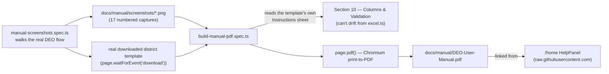

# Milestone & Delivery Summary — UP Excise Spatial Revenue Optimizer

This file is the complete, chronological record of every delivered milestone (M-0 through the current M-31), plus the backlog, original timeline estimates, and pre-campaign blockers. It was split out of `roadmap.md` so that file can stay what it was built to be: a comprehensive logical/technical reference (business rules, architecture, data dictionary, schema) rather than a growing delivery log.

- **roadmap.md** — the technical and business-logic spec. Read it to understand *why* the system is built the way it is.
- **summary.md** (this file) — the delivery history. Read it to understand *what has shipped, when, and why it was done that way*.
- **CLAUDE.md** — the AI co-author's working agreement and a live one-line-per-milestone status table that links back here for detail.

For the live, actively-maintained Pre-Campaign Blockers list, see CLAUDE.md's own "Pre-Campaign Blockers" section — that copy is kept current every session; the copy at the bottom of this file is the original roadmap write-up, preserved as history and may lag behind.

---

## Milestone Index

| Milestone | Status |
|---|---|
| [M-0: Foundation & Repository Setup](#m-0-foundation--repository-setup) | ✅ Complete |
| [M-1: Schema, Migrations & Worker Skeleton](#m-1-schema-migrations--worker-skeleton) | ✅ Complete |
| [M-2: Excel Ingestion & Coordinate Conversion Engine](#m-2-excel-ingestion--coordinate-conversion-engine) | ✅ Complete |
| [M-3: Verification UI & IndexedDB Persistence Layer](#m-3-verification-ui--indexeddb-persistence-layer) | ✅ Complete |
| [M-4: Worker Batch API & D1 Integration](#m-4-worker-batch-api--d1-integration) | ✅ Complete |
| [M-5: Dashboard, Testing & DEO Handoff](#m-5-dashboard-testing--deo-handoff) | ✅ Complete |
| [M-6: Auth Migration + Single Worker](#m-6-auth-migration--single-worker--complete) | ✅ Complete |
| [M-7: Admin Portal UI Overhaul](#m-7-admin-portal-ui-overhaul--complete) | ✅ Complete |
| [M-8: Admin Portal Navigation & Divisions](#m-8-admin-portal-navigation--divisions--complete) | ✅ Complete |
| [M-9: SPA Navigation Parity & Polish](#m-9-spa-navigation-parity--polish--complete) | ✅ Complete |
| [M-10: District Master & Migration Consolidation](#m-10-district-master--migration-consolidation--complete) | ✅ Complete |
| [M-11: PII Email Hashing & Superadmin Config](#m-11-pii-email-hashing--superadmin-config--complete) | ✅ Complete |
| [M-12a: E2E Playwright Automation](#m-12a-e2e-playwright-automation--complete) | ✅ Complete |
| [M-12b: Excel Template UX & Developer QoL](#m-12b-excel-template-ux--developer-qol--complete) | ✅ Complete |
| [M-13: Admin UX Refresh & Excel Enhancements](#m-13-admin-ux-refresh--excel-enhancements--complete) | ✅ Complete |
| [M-14: Single-Library Spreadsheet Rewrite](#m-14-single-library-spreadsheet-rewrite--complete) | ✅ Complete |
| [M-15: Foolproof Gated DEO Workflow](#m-15-foolproof-gated-deo-workflow--complete) | ✅ Complete |
| [M-16: DEO Portal Polish & Bilingual Excel Template Overhaul](#m-16-deo-portal-polish--bilingual-excel-template-overhaul--complete) | ✅ Complete |
| [M-17: CUG Login, API Error Handling & Atomicity Hardening](#m-17-cug-login-api-error-handling--atomicity-hardening--complete) | ✅ Complete |
| [M-18: Audit Log UI Overhaul](#m-18-audit-log-ui-overhaul--complete) | ✅ Complete |
| [M-19: Admin Name/Designation Display](#m-19-admin-namedesignation-display--complete) | ✅ Complete |
| [M-20: Audit Actor Identity & Owner-Only District Master](#m-20-audit-actor-identity--owner-only-district-master--complete) | ✅ Complete |
| [M-21: DEO Excel Template Overhaul, Admin Navbar Fix & Adjacent-Thana Honesty Fix](#m-21-deo-excel-template-overhaul-admin-navbar-fix--adjacent-thana-honesty-fix--complete) | ✅ Complete |
| [M-22: Prod Go-Live Cleanup & Custom Domain](#m-22-prod-go-live-cleanup--custom-domain--complete) | ✅ Complete |
| [M-23: Circle Numbering Convention (Rural vs. Urban)](#m-23-circle-numbering-convention-rural-vs-urban--complete) | ✅ Complete |
| [M-24: Self-Service Unlock Requests & Login-Page ViewPrefs Cleanup](#m-24-self-service-unlock-requests--login-page-viewprefs-cleanup--complete) | ✅ Complete |
| [M-25: Bilingual DEO User Manual (PDF) & Manual-Generation E2E Tests](#m-25-bilingual-deo-user-manual-pdf--manual-generation-e2e-tests--complete) | ✅ Complete |
| [M-26: Fixed Circle/Sector Number Prefix, Excel Column Resize Fix & SW Cache Bump](#m-26-fixed-circlesector-number-prefix-excel-column-resize-fix--sw-cache-bump--complete) | ✅ Complete |
| [M-27: /units Locked-View Redesign & "Invalid Date" Fix](#m-27-units-locked-view-redesign--invalid-date-fix--complete) | ✅ Complete |
| [M-28: Single Global Admin "Sync All" Button](#m-28-single-global-admin-sync-all-button--complete) | ✅ Complete |
| [M-29: SEO Metadata, robots.txt, Favicon & Social-Preview Image](#m-29-seo-metadata-robotstxt-favicon--social-preview-image--complete) | ✅ Complete |
| [M-30: District Detail Circles/Sectors Modal](#m-30-district-detail-circlessectors-modal--complete) | ✅ Complete |
| [M-31: Fixed has_cl5cc Excel Validation Always Rejecting Both TRUE and FALSE](#m-31-fixed-has_cl5cc-excel-validation-always-rejecting-both-true-and-false--complete) | ✅ Complete |

Future milestones (M-32+) get appended below M-31 as they ship — see CLAUDE.md's Milestone Progress table for the current single-source-of-truth pointer, and add the corresponding full write-up here in the same session.

---

### M-0: Foundation & Repository Setup

**Objective:** Establish the development environment, project structure, and CI baseline.

**Deliverables:**

- [x] Monorepo structure initialized (`apps/web`, `packages/schema`). Route groups `(deo)` and `(admin)` stubbed inside `apps/web/app/`.
- [x] `wrangler.jsonc` configured for single Cloudflare Worker + D1 binding.
- [x] Drizzle ORM configured with D1 adapter.
- [x] GitHub Actions CI pipeline: type-check, tests, build & deploy on every push to `main`.
- [x] Single Cloudflare Pages project created for `apps/web`; preview deploys enabled. *(Superseded by M-6/M-22: the app now deploys as a Cloudflare Worker via `@opennextjs/cloudflare`, not Pages, on the custom domain `sro.exciseup.in`.)*
- [x] D1 database provisioned (`phase1-dev` and `phase1-prod`).
- [x] All secrets (Clerk secret key, Clerk webhook signing secret) stored in Cloudflare Workers Secrets — not in `wrangler.toml` or source. *(Clerk itself was removed entirely in M-6.)*
- [x] Clerk project created: magic-link auth enabled, single-session enforcement configured, `publicMetadata.role` set to `'deo'` or `'admin'` for each provisioned user (no Clerk Organizations — free tier caps orgs at 20 members). *(Superseded by M-6's custom HMAC magic-link auth.)*
- [x] `public/_headers` committed with full CSP, `X-Frame-Options: DENY`, `X-Content-Type-Options: nosniff`, `Referrer-Policy`, `Permissions-Policy`.
- [x] `public/manifest.json` committed with PWA metadata (name, icons, display: standalone, theme color).
- [x] Service Worker skeleton (`public/sw.js`) committed: app shell cache strategy stubbed, registered in root `layout.tsx`.
- [x] Root `layout.tsx` stubbed with CDN `<link>` and `<script>` tags (all with SRI placeholders) for: DaisyUI CSS, Tailwind Play CDN, Dexie.js, SweetAlert2, Notyf JS + CSS. SheetJS is excluded from root layout (dynamic inject on upload pages only). Chart.js and Leaflet.js tags are in the `(admin)` layout, not the root. *(SheetJS was later replaced entirely by ExcelJS in M-14.)*

**Exit criterion:** `wrangler deploy --dry-run` passes on CI. `GET /healthz` returns `200 OK`. CI fails if any CDN tag is missing an `integrity` attribute. PWA manifest validates in Chrome DevTools Lighthouse.

---

### M-1: Schema, Migrations & Worker Skeleton

**Objective:** Establish the database schema in D1 and a functional Worker that can receive requests.

**Deliverables:**

- [x] Drizzle schema file (`packages/schema/src/phase1.ts`) finalized — all four tables: `phase1_raw_collection`, `districts`, `district_circles_sectors`, `audit_log`. The `districts` table includes the four `bbox_*` bounding box columns (nullable `REAL`).
- [x] Migration file generated and applied to `phase1-dev` and `phase1-prod` — covers all four tables including bbox columns.
- [x] SQLite `CHECK` constraint for `shop_type` added to migration.
- [x] Hono Worker skeleton: `/api/upload/chunk`, `/api/districts`, `/api/districts/:district/units` (GET + POST), `/api/webhooks/clerk`, `/api/healthz`, CORS configured for Pages preview domains. *(The Hono worker and Clerk webhook were both removed in M-6 — all routes migrated to Next.js Route Handlers in a single worker.)*
- [x] Admin Worker skeleton: `/api/admin/districts` (GET), `/api/admin/districts/:district/shops` (GET, paginated), `/api/admin/bulk-provision` (POST), all guarded by Clerk `admin` role middleware.
- [x] Clerk webhook Worker route: validates SVIX signature, writes auth events to `audit_log`, updates `districts.status` on `district_submitted` events.
- [x] Cron Trigger Worker function: deletes `audit_log` rows older than 45 days. *(Later superseded — see M-18: `@opennextjs/cloudflare` v1 doesn't expose a `scheduled` export hook, so the actual pruning became opportunistic-on-read instead of a real cron trigger.)*
- [x] Worker unit tests: revenue recomputation, SRI hash validation helper, Clerk role guard, `districts.status` state machine.

**Exit criterion:** All four D1 tables exist with correct column names. Clerk webhook fires and a test event appears in `audit_log`. Cron Trigger purge deletes test records in local dev. `GET /api/admin/districts` returns an empty array (no data yet) with correct schema.

---

### M-2: Excel Ingestion & Coordinate Conversion Engine

**Objective:** Build the browser-side data processing pipeline — the most critical component of the architecture.

**Deliverables:**

- [x] SheetJS integrated in `apps/web` as a client-side-only import (dynamic import with `ssr: false`). *(Replaced by ExcelJS in M-14.)*
- [x] Excel column-to-schema field mapping defined and documented. The standardized DEO spreadsheet template columns are mapped to `phase1_raw_collection` fields.
- [x] Coordinate normalizer implemented and unit-tested:
  - Parses DMS strings (e.g., `26°50'48.12"N`) to DD.
  - Parses space/slash-separated DMS numeric fields to DD.
  - Accepts pure DD input directly.
  - Validates against UP bounding box.
  - Returns structured result: `{ latitudeDecimal, longitudeDecimal, warning?: string }`.
- [x] Revenue calculator implemented and unit-tested for all six formula variants.
- [x] Row-level validation function implemented: checks required fields, enum values, cross-field constraints (e.g., `hasCl5cc = true` requires `shopType = COUNTRY_LIQUOR`).
- [x] Standardized district Excel template (`.xlsx`) created and version-controlled in `docs/templates/`. The template has one row per shop, includes a `circle_sector_name` column for per-row tagging, and pre-fills the district name in a designated header cell.
- [x] Single district template generation: Worker route `GET /api/districts/:district/template` returns the template with the district name pre-filled. One file per district — no per-unit variants.
- [x] District bounding box populated during admin bulk-provision: for each district row in `up-districts.geojson`, compute `Math.min/max` over all polygon coordinate pairs and write the four `bbox_*` values to the `districts` row via `POST /api/admin/bulk-provision`.
- [x] Worker upload chunk handler reads the DEO's district row from `districts`, checks uploaded shop coordinates against `bbox_*` columns, and appends a `coordinateWarning` field to any row that falls outside the district bbox. The row is inserted regardless — this is a warning, not a rejection.
- [x] Browser verification UI reads `coordinateWarning` from the upload response and highlights affected rows with an amber warning pill before the DEO proceeds to district-level submission.

**Exit criterion:** A test Excel file with 100 rows covering all shop types and both DMS/DD input formats parses correctly in a Storybook/JSDOM test. Revenue totals match expected values. Coordinate conversions match reference values to 4 decimal places. A generated per-circle/sector template downloads with correct pre-filled headers. A shop row with coordinates outside the district bbox returns `coordinateWarning` in the upload response without being rejected.

---

### M-3: Verification UI & IndexedDB Persistence Layer

**Objective:** Build the DEO-facing frontend — the staging, review, and submission interface.

**Deliverables:**

- [x] Clerk magic-link auth integrated in DEO portal login page. Post-auth redirect to verification UI. Unauthenticated routes redirect to login. *(Replaced by custom HMAC magic-link auth in M-6.)*
- [x] Single-session enforcement verified: authenticating in Browser B invalidates the session in Browser A.
- [x] Dexie.js configured: `phase1_staging` IndexedDB table mirrors the schema. Each row carries `status: 'pending' | 'uploaded' | 'error'` and `circleSectorName`.
- [x] Circle/Sector Management UI: DEO creates and lists circles/sectors for their district. A "Download District Template" button fetches the single district-wide Excel from `GET /api/districts/:district/template`.
- [x] File upload component: DEO uploads the single consolidated district Excel file — drag-and-drop + click-to-upload, triggers SheetJS parse (loaded from jsDelivr CDN dynamically), reads `circle_sector_name` column from each row, writes all rows to IndexedDB tagged with their respective unit.
- [x] Parse progress indicator (parsing 5,000 rows can take 1–2 seconds; shown as a DaisyUI progress bar).
- [x] Verification table component — grouped by circle/sector (DaisyUI tab or collapse components):
  - Paginated display (user-preference rows per page: 25/50/100).
  - Inline edit for all DEO-editable fields.
  - Revenue preview column (computed live from financial inputs).
  - Coordinate status indicator — color + icon glyph (never color alone).
- [x] Adjacent Thana pill component:
  - Parses `adjacentThanasRaw` into removable DaisyUI badge/pill components.
  - Cross-district pills highlighted red; must be removed before the row is marked clean. *(Reworded in M-21 — see that entry's "Adjacent-Thana enforcement honesty fix" for what this check actually does today.)*
  - Deletion updates `adjacentThanasRaw` in IndexedDB immediately.
- [x] Shop type field toggling: financial inputs show/hide based on `shopType` and `hasCl5cc`.
- [x] Completeness gate: district submit button disabled until all registered circles/sectors have at least one verified row in the IndexedDB staging data (checked by comparing registered unit names against `circleSectorName` values across all staged rows). Per-unit row-count summary panel displayed.
- [x] Session recovery: on page load, IndexedDB is read first; staged data and UI state are restored regardless of network.
- [x] Service Worker fully implemented: app shell cache, CDN asset cache (DaisyUI, Tailwind CDN, Dexie.js, SweetAlert2, Notyf, SheetJS), offline detection message relay.
- [x] Background Sync registered on failed chunk uploads; retries transparently on reconnect.
- [x] Dark/light mode toggle (DaisyUI themes); `localStorage` persistence; inline `<head>` script to apply theme before first paint.
- [x] User preferences (theme, page size) read and written to `localStorage` on every change.
- [x] Connection status indicator (Online / Offline / Slow) in app header using DaisyUI alert component.
- [x] `@media print` stylesheet for verification table.
- [x] ARIA attributes on all interactive components (pill buttons, edit fields, upload dropzone, modals).
- [x] PWA install prompt surfaced on iPad Safari and Android Chrome.
- [x] Client-side search in the verification UI (IndexedDB-powered, no network call).
- [x] Audit events written: `upload_chunk` and `unit_registered` events logged to `audit_log` via Worker.

**Exit criterion:** DEO can register two circles, download the district template containing dropdowns for both circles, upload a single consolidated district Excel (parsed from jsDelivr-served SheetJS), review grouped rows, remove a red adjacency pill, toggle dark mode, force-refresh the page, and see all data and theme preference restored from IndexedDB/localStorage. Submit button is blocked until all registered circles are verified. PWA install prompt appears on an iPad browser.

---

### M-4: Worker Batch API & D1 Integration

**Objective:** Complete the server-side ingestion path — Worker validation, batch insert, and acknowledgment.

**Deliverables:**

- [x] `/api/upload/chunk` Worker route fully implemented:
  - Accepts JSON body: `{ rows: Phase1Row[], deoId: string, circleSectorName: string, chunkIndex: number }`.
  - Validates that `circleSectorName` matches a registered unit for the DEO's district (`district_circles_sectors` lookup).
  - Validates each row.
  - Recomputes `totalRevenue` per row and rejects mismatches.
  - Calls `db.batch()` for atomic insert of the entire chunk.
  - Returns `{ accepted: number, rejected: [{ rowIndex, reason }] }`.
- [x] Upsert strategy implemented: if `shopId` + `districtName` already exists, update rather than duplicate — resolved as upsert (`onConflictDoUpdate` in `apps/web/app/api/upload/chunk/route.ts`, `UNIQUE` constraint on `shop_id` + `district_name`). A DEO re-uploading a district overwrites existing rows for the same shop rather than versioning them.
- [x] Frontend upload orchestrator:
  - Splits IndexedDB `pending` rows per circle/sector into 500-row chunks.
  - Sends chunks sequentially across all units (not parallel — prevents Worker rate-limit pressure).
  - Marks rows as `'uploaded'` in IndexedDB on acknowledgment.
  - Marks rows as `'error'` on rejection, surfaces rejection reason in UI.
  - Progress bar shows both per-unit progress and overall district progress.
- [x] End-to-end integration test: upload 1,000 test rows across 2 circles via the full browser → Worker → D1 path in a Wrangler local dev environment.

**Exit criterion:** 1,000 test rows across 2 circles appear in D1 after a full upload cycle. IndexedDB shows all rows as `'uploaded'`. A forced mid-upload interruption followed by session recovery and resume results in no duplicate rows in D1. A circle not yet uploaded prevents final district submission.

---

### M-5: Dashboard, Testing & DEO Handoff

**Objective:** Deliver monitoring visibility, complete testing coverage, and prepare DEO training materials.

**Deliverables:**

- [x] `apps/web/middleware.ts` using `clerkMiddleware` — all routes are auth-protected; only `/login` and `/api/webhooks/clerk` are public. Middleware reads `publicMetadata.role` and redirects on route group mismatch. No landing page, no public home. *(Clerk middleware replaced in M-6.)*
- [x] Admin/HQ route group (`apps/web/app/(admin)/`) fully functional:
  - Default view: district summary list (75 rows, aggregate query only — no shop rows loaded).
  - Interactive UP district choropleth map (Leaflet.js + CartoDB tiles): districts colour-coded by submission status and coverage; hover tooltip; click-to-drill-down. GeoJSON at `apps/web/public/geodata/up-districts.geojson`. Map polls `GET /api/admin/map-data` every 5 minutes.
  - Summary charts (Chart.js): submission progress doughnut, revenue horizontal bar (top 20), shop type pie, upload stacked bar, cumulative uploads line chart.
  - District drill-down: paginated shop table (IndexedDB-cached, stale-while-revalidate).
  - Cross-district D1 search, paginated, results cached by query hash.
  - Per-district CSV export (streamed). Full-state CSV export in Export section (file download, not UI table). *(CSV was later replaced entirely by XLSX/ExcelJS — see M-14 and CLAUDE.md's "Confirmed Past Mistakes" — comma-containing fields like `adjacent_thanas_raw` broke CSV columns.)*
  - Audit log viewer: read-only, paginated, last 45 days.
  - Bulk DEO provisioning: admin uploads Excel (SheetJS in-browser parse) → preview → `bulk-provision` API → Clerk accounts + `districts` rows upserted.
  - IndexedDB district cache with 1-hour TTL and manual refresh.
- [x] DEO accounts provisioned in Clerk via admin bulk-provision flow.
- [x] End-to-end test suite (Playwright):
  - Happy path: login via magic link → register circle/sector → download template → upload Inspector Excel → verify → submit, for each of the 5 shop types.
  - Multi-file district submission: register 2 circles, upload separate Excels, verify grouped view, complete submission.
  - Completeness gate: submission blocked when one circle is missing — verified.
  - CL5CC endorsement flow: `specialBeerLf` and `specialBeerMgr` visible and contributing to `totalRevenue`.
  - Cross-district adjacency pill rejection.
  - Session recovery: forced page refresh mid-verification — all data and theme preference restored.
  - Session invalidation: second login from a different browser revokes the first session.
  - Offline scenario: disconnect network mid-verification, continue editing, reconnect — Background Sync retries queued upload chunks.
  - Mid-upload interruption and resume (no duplicate rows in D1).
  - PWA offline: installed app shell loads with no network.
- [x] Load test: 75 simultaneous DEO sessions each uploading 500 rows. Worker stays within free tier CPU and D1 write quota.
- [x] SRI audit: CI build fails if any CDN `<script>` or `<link>` tag is missing `integrity`. All SRI hashes verified against live jsDelivr responses.
- [x] Lighthouse audit on DEO portal: PWA score ≥ 90, Accessibility score ≥ 90.
- [x] ARIA audit using axe-core: all critical violations resolved.
- [x] Audit log verified: login, upload chunk, and submission events written correctly. 45-day purge cron tested.
- [x] DEO training documentation (`docs/deo-guide.md`) — later superseded by the bilingual PDF manual generated in M-25.
- [x] Standardized Excel templates distributed to all 75 district offices.
- [x] DEO pilot: 3–5 districts complete the full workflow before state-wide rollout.

**Exit criterion:** Pilot districts complete upload with zero Worker errors. Admin dashboard reflects accurate counts. Lighthouse PWA and Accessibility scores ≥ 90. Department signs off on data completeness for pilot districts. System cleared for state-wide rollout.

---

### M-6: Auth Migration + Single Worker ✅ Complete

**Objective:** Remove Clerk dependency entirely; replace with custom HMAC magic-link auth. Consolidate two separate Cloudflare Workers into one.

**Deliverables:**

- [x] Clerk removed from all dependencies, middleware, and pages.
- [x] Custom HMAC magic-link auth implemented: `auth_users`, `auth_magic_links`, `auth_sessions` tables in D1; Resend for email delivery; `SESSION_SECRET` HMAC for session cookie signing.
- [x] `apps/worker` (Hono API) deleted. All 19 API route handlers migrated to Next.js Route Handlers in `apps/web/app/api/`.
- [x] Single Worker `up-excise-spatial-revenue-optimizer-web` serves both pages and API. Same-origin eliminates Bearer tokens, CORS, and cross-worker secrets.
- [x] `apps/web/middleware.ts` rewritten to cookie-based routing (no D1 on every request).
- [x] `useSession()` hook simplified — no `getToken()`, no Authorization header in API calls.
- [x] `/auth/verify` converted to client component (Next.js 15 forbids `cookies().set()` in server component pages); verification logic moved to `POST /api/auth/verify` route handler.
- [x] Migration files at `migrations/0001–0003.sql` applied to prod D1.
- [x] All 4 CF Worker Secrets set on `up-excise-spatial-revenue-optimizer-web`.
- [x] Admin and demo DEO users seeded in `auth_users`.
- [x] CLAUDE.md and roadmap.md updated to reflect new architecture.
- [x] Deployed and live at `https://up-excise-spatial-revenue-optimizer-web.shubhanraj2002.workers.dev`. *(Retired in M-22 — replaced by the custom domain `sro.exciseup.in`.)*

**Exit criterion:** Admin can log in via magic link, verify session, access `/admin` dashboard. DEO can log in and access `/home`.

---

### M-7: Admin Portal UI Overhaul ✅ Complete

**Objective:** Replace the placeholder admin view with a production-quality district detail interface covering all Phase 1 fields.

**Deliverables:**

- [x] District detail page (`/admin/districts/[district]`): all `phase1_raw_collection` fields rendered — shop ID, name, circle/sector, thana, adjacent thanas (flex-wrap pills, no expand/collapse), type badge + CL5CC sub-badge, coordinates, collapsible revenue breakdown (`<details>/<summary>`).
- [x] Full type labels: "Composite Shop (FL + Beer)", "PRV (Premium Retail Vend)".
- [x] Per-type breakdown bar with CL5CC card (radio-style: CL5CC only active alongside Country Liquor, disabled for other types).
- [x] Client-side search, type filter, circle/sector filter, sortable columns, group-by-type with per-group inner pagination.
- [x] Rows per page selector (10/25/50/100/All); preference persisted to `localStorage` (`admin-page-size`).
- [x] Group-by-type persisted to `localStorage` (`admin-group-by-type`); per-group open/close persisted to `localStorage` (`admin-group-{districtName}`).
- [x] `HelpPanel` balloon popover on all admin pages (dashboard, provision, audit, export, district detail). Background blur (`backdrop-blur-[2px]`), closes on Escape/outside click.
- [x] `ViewPrefsPanel` FAB (bottom-right): theme (Light/Auto/Dark — Auto resolves via `matchMedia`), font size, row density, content width; all persisted to `localStorage` (`excise-view-prefs-v1`). Separate `ThemeToggle` component retired.
- [x] UP GeoJSON replaced: GADM 70-district source removed; OSM Overpass `admin_level=5` source provides all 75 districts. RDP-simplified to 615 KB.
- [x] Map: full-width layout, CartoDB tiles with dark/light switching, locked UP bounds, slate-700 borders, status fill colours, permanent district name labels.
- [x] Government colour palette applied across admin portal.

**Exit criterion:** Admin can drill into any district and see all shop fields; filters and group-by-type work fully client-side without additional API calls.

---

### M-8: Admin Portal Navigation & Divisions ✅ Complete

**Objective:** Add dedicated districts and divisions pages, fix navigation, make breadcrumbs clickable, and implement functional navbar search.

**Deliverables:**

- [x] `/admin/districts` — full 75-district sortable table with search, division filter, status filter, and summary stat chips. Fetches same `GET /api/admin/districts` endpoint; no new API route.
- [x] `/admin/divisions` — 18 division cards with submission progress bars and revenue; derived client-side from district data.
- [x] `/admin/divisions/[division]` — division detail page: summary stats (districts, submitted, vends, revenue) + districts table sorted by revenue.
- [x] Overview (`/admin`) updated: district table shows top-10 by revenue only with "View all 75 →" link; divisions grid added below charts.
- [x] Admin layout (`app/(admin)/layout.tsx`): all breadcrumb segments now link-clickable (`<Link>` with hover underline); nav links (including Sign out) use `btn-ghost` for visual consistency; active-state highlighting.
- [x] `SearchBar` component in layout: live dropdown across districts + divisions, results grouped, keyboard nav (↑↓/Enter/Escape), clear button, module-level `searchCache` (one fetch per session). No search results page — navigates directly.
- [x] Map layout: full-width on overview; charts below in 2-column grid; chart `maxHeight` 220px.
- [x] District name permanent labels on choropleth (`district-map-label` CSS class in `layout.tsx` global style block).
- [x] SPA navigation: all `window.location.href` and `<a href>` replaced with Next.js `<Link>` and `router.push()` across all admin pages — eliminates full-page reloads.
- [x] Navbar `z-[1000]` to remain above Leaflet tooltip pane (z=650) — fixes content scrolling over sticky header.
- [x] Density CSS rules use `!important` to beat DaisyUI/Tailwind specificity.
- [x] Leaflet map district click uses `router.push()` via a stable `routerRef` to avoid stale closure inside `useEffect`.

**Exit criterion:** Admin can navigate Overview → Divisions → division detail → district detail using nav links, breadcrumbs, and the search dropdown. All breadcrumbs are clickable. Navigation is full SPA (no page reloads).

---

### M-9: SPA Navigation Parity & Polish ✅ Complete

**Objective:** Finish SPA-navigation parity on the DEO portal, fix HelpPanel/theme/map UX defects reported after M-8, and surface IndexedDB-backed stats that were previously dead placeholders.

**Deliverables:**

- [x] DEO layout (`app/(deo)/layout.tsx`) rewritten to match the admin layout: logo/brand links to `/home`, all nav items use `<Link>`, retired `ThemeToggle` removed (the global `ViewPrefsPanel` is now the single theme source on both portals), `btn-ghost` nav styling, `z-[1000]` sticky navbar.
- [x] Admin layout brand/logo wrapped in `<Link href="/admin">` — clicking the site name/logo returns to the portal home on both portals.
- [x] DEO home page (`app/(deo)/home/page.tsx`) action cards converted from `<a href>` to `<Link>`.
- [x] `HelpPanel.tsx`: balloon auto-flips `left-0`→`right-0` via a `useLayoutEffect` viewport-overflow check so it never renders off-screen; content wrapped in `overflow-y-auto max-h-64` so long help text scrolls instead of overflowing; z-index raised (backdrop `z-[1001]`, balloon `z-[1002]`) above the sticky navbar and Leaflet's tooltip/popup panes (650/700) — fixes the balloon being half-hidden behind the overview map.
- [x] Districts table (`/admin/districts`) gains bbox-midpoint coordinate columns (`centerLat`/`centerLon`, computed server-side in `GET /api/admin/districts` from `districts.bboxMinLat/MaxLat/MinLon/MaxLon`). Read-only on this page (inline editing was added later — see M-10).
- [x] District detail page: "Division" stat card links to `/admin/divisions/[division]`.
- [x] Dark-mode fix: the anti-flash inline script in `layout.tsx` now resolves `localStorage.theme === 'system'`/unset via `matchMedia('(prefers-color-scheme:dark)')` before first paint (previously defaulted unconditionally to light, causing a flash to white on refresh and ignoring system preference). `ViewPrefsPanel` re-applies the resolved theme on every mount and attaches a `matchMedia` change listener so a live OS theme flip is reflected immediately when `'system'` mode is active.
- [x] DEO home page stat cards extracted into `HomeStats.tsx` (client component) — reads live `Circles/Sectors` count from `GET /api/districts/[district]/units`, `Shops Staged` from `stagingDb.count()`, and `Shops Uploaded` from `stagingDb.getByStatus('uploaded')` instead of static `—` placeholders.
- [x] Overview map enlarged to `height: 660` (from 500) so the full state is visible without excessive zoom-out; card header retitled "District Status — Uttar Pradesh" with a descriptive subtitle.
- [x] District map label CSS fixed: selector scoped to `.leaflet-tooltip.district-map-label` (bare class lost the specificity battle against Leaflet's own `.leaflet-tooltip` base styles, leaving labels invisible); font-size and text-shadow layering increased for legibility.

**Exit criterion:** Both portals navigate as a pure SPA with no full-page reloads; HelpPanel never clips off-screen or hides behind the map; dark mode persists correctly across refresh and respects system preference live; DEO home page reflects real local/staged/uploaded counts.

---

### M-10: District Master & Migration Consolidation ✅ Complete

**Objective:** Seed the `districts` table with the real 75 UP districts and 18 divisions (the bbox columns existed since M-9 but were never populated for real data, only for the ad-hoc Demo District), add an inline edit path for district/DEO master data so minor corrections don't require a full Excel re-upload, and consolidate the migration files now that nothing in prod needs preserving.

**Deliverables:**

- [x] Migrations consolidated: `0001_initial.sql`, `0002_drop_premises_consideration_fee.sql`, and `0003_auth.sql` collapsed into a single `migrations/0001_initial.sql` matching `packages/schema` exactly (all 7 tables: `phase1_raw_collection`, `districts`, `district_circles_sectors`, `audit_log`, `auth_users`, `auth_magic_links`, `auth_sessions`), reapplied to prod D1 via `wrangler d1 execute --remote --file=...` (wrangler's `migrations apply` tracks by filename, not content, so it reported "No migrations to apply!" for the rewritten same-named file).
- [x] `scripts/seed-districts.ts` (`pnpm seed:districts`): seeds all 75 UP districts with their correct `division` and bbox (`bboxMinLat/MaxLat/MinLon/MaxLon`, computed from `apps/web/public/geodata/up-districts.geojson`). The district→division mapping was sourced from Wikipedia's "Administrative divisions of Uttar Pradesh" and cross-verified by set-equality against the 75 GeoJSON district names (exact match, no gaps/duplicates) before writing. Idempotent upsert by district name — safe to re-run.
- [x] `UP_DIVISIONS` constant (the 18 bare division names) added to `packages/schema/src/constants.ts` as the single source of truth for the District Master dropdown and the seed script.
- [x] `PATCH /api/admin/districts/[district]` route added: edits division, DEO name/email/identifier, expected vend count, and bbox in one atomic `db.transaction` that also syncs the `auth_users` row (deletes the old email's row if the email changed, upserts the new one).
- [x] `/admin/provision` renamed to "District Master" in the nav and breadcrumbs (URL/file path unchanged) and rebuilt: an all-75-district table with a per-row edit icon opening a right-side drawer (division dropdown from `UP_DIVISIONS`, DEO name/email/identifier, expected vend count, bbox coordinates) wired to the new PATCH route, with the existing bulk-Excel-provision flow retained below it. The drawer supports optionally clearing coordinates and features detailed field-specific validation. `generateProvisionTemplate()` now accepts the live district list and pre-fills District Name + Division in the downloaded `.xlsx`.
- [x] `/admin/districts` table: DEO email column removed from display (decluttering — search still matches on email, it's just not rendered) and the subtitle wording professionalized.
- [x] Demo DEO test account corrected: `seed-demo.ts`'s `DEO_EMAIL` changed from the fake `deodemo+clerk_test@up-excise.dev` to a real `+deo` Gmail alias, `DIVISION` changed from `'Lucknow Division'` to the bare `'Lucknow'` (matching the real-75-district seed's naming convention so Demo District groups correctly), and the script now also inserts/upserts the matching `auth_users` row — previously the demo DEO account had no `auth_users` row and could never actually complete a magic-link login.

**Exit criterion:** All 75 districts and 18 divisions are visible and correctly grouped throughout the admin portal; an admin can correct a district's division, DEO assignment, vend count, or coordinates from a drawer without touching Excel; the demo DEO account logs in successfully end-to-end; the repo has one canonical migration file per environment-reset, not three.

---

### M-11: PII Email Hashing & Superadmin Config ✅ Complete

**Objective:** Ensure that zero plaintext email addresses are stored in the database or hardcoded in the codebase, preventing unauthorized disclosure of DEO and Admin identities.

**Deliverables:**
- [x] Schema modified to use `email_hash` and `deo_email_hash` in `auth_users`, `auth_magic_links`, and `districts` tables.
- [x] Login flow dynamically hashes plaintext emails and only searches D1 by hash.
- [x] Superadmin config transitioned to the `.env` variable `SUPERADMIN_EMAIL_HASH`, completely removing the developer's email string from the codebase.
- [x] SessionStorage implemented for storing the plaintext email temporarily in the frontend after login submission.

**Exit criterion:** The entire system works using hashed PII, meaning no plaintext emails exist in D1.

---

### M-12a: E2E Playwright Automation ✅ Complete

**Objective:** Enforce the IndexedDB-first caching pattern across all remaining admin pages to eliminate unnecessary Cloudflare Worker CPU execution and D1 read operations.

**Deliverables:**

- [x] Upgraded Dexie.js admin schema (`excise-admin`) to version 3 in `apps/web/src/lib/db.ts`.
- [x] Added new object stores and cache wrappers for `map_cache` (5m TTL), `shops_cache` (5m TTL), and `audit_cache` (1m TTL).
- [x] Refactored `apps/web/app/(admin)/admin/page.tsx` (Overview map/charts) to check `adminMapCache` before fetching.
- [x] Refactored `apps/web/app/(admin)/admin/districts/[district]/page.tsx` (District Detail) to check `adminShopsCache` before fetching shop rows.
- [x] Refactored `apps/web/app/(admin)/admin/audit/page.tsx` (Audit Log) to use `adminAuditCache` for paginated results.

**Exit criterion:** Admin pages load instantaneously on subsequent visits and do not issue direct database queries on every render, complying fully with the zero-cost architecture rule.

---

### M-12b: Excel Template UX & Developer QoL ✅ Complete

**Objective:** Improve the DEO user experience when interacting with the downloaded template and improve developer workflow for testing.

**Deliverables:**

- [x] Refactored `apps/web/src/lib/excel.ts` to output a multi-sheet workbook: Data Entry, Demo Data, Instructions, Reference Data. *(The "Demo Data" sheet was later removed in M-21 — DEOs mistook it for a second copy of their own data.)*
- [x] Consolidated the 4 verbose coordinate columns into 2 dynamic columns (`latitude` and `longitude`) that securely process either DD or DMS via the existing `normalizeCoordinates` function.
- [x] Added a seamless role override in the `createSession` middleware to dynamically grant `superadmin` access to the developer email (`shubhanraj2002@gmail.com`), bypassing DB resets to test both `/deo` and `/admin` portals interchangeably.

**Exit criterion:** DEO templates are cleaner and self-documenting. Developers can test the full platform lifecycle without manually toggling roles in the D1 database.

---

### M-13: Admin UX Refresh & Excel Enhancements ✅ Complete

**Objective:** Remove unnecessary polling from the admin portal and make district exports and DEO uploads more resilient.

**Deliverables:**

- [x] Removed 5-minute auto-polling TTLs from the admin IndexedDB cache in favor of an explicit manual "Sync from Server" button on every admin page that reads district/shop data. *(Superseded by M-28's single global "Sync All" button.)*
- [x] District Detail XLSX export gained auto-filters, frozen panes, and an injected TOTAL row.
- [x] DEO district upload/verify actions disabled client-side when no circles/sectors are registered yet.
- [x] Fixed a JSZip-based XML validation injection in the DEO Excel template generator; added merged title rows, frozen top panes, and dynamic circle/sector dropdowns fed by a hidden "Reference Data" sheet.

**Exit criterion:** Admin pages never silently re-fetch on a timer; every network round-trip is an explicit user action.

---

### M-14: Single-Library Spreadsheet Rewrite ✅ Complete

**Objective:** Eliminate SheetJS and hand-patched worksheet XML in favor of one spreadsheet library across the entire app.

**Deliverables:**

- [x] Replaced SheetJS (reads) + JSZip-XML-patching (writes) with ExcelJS everywhere — the single CDN global `window.ExcelJS` now handles every read, write, and export in `apps/web/src/lib/excel.ts`.
- [x] Fixed the corrupted DEO Excel template output (missing workbook-level `_xlnm.Print_Titles` defined name from the old hand-edited XML).
- [x] Every generated/exported workbook now gets landscape orientation, fit-to-width printing, a repeated header row, frozen header panes, and wrapped cell text for free.
- [x] Removed `xlsx` and `jszip` from the CDN stack, Service Worker precache list, and dependencies.

**Exit criterion:** There is exactly one spreadsheet library in the codebase, and no code manually edits OOXML.

---

### M-15: Foolproof Gated DEO Workflow ✅ Complete

**Objective:** Make the DEO's Circles & Sectors → Upload → Verify workflow impossible to get lost in, and impossible to accidentally re-order.

**Deliverables:**

- [x] `POST /api/districts/[district]/units` made bulk-only (`{ circles, sectors }`); rejects with 409 once any unit row exists — lock derived from row existence, no schema flag.
- [x] `/units` rebuilt as a 2-step wizard: enter counts → fill pre-generated name boxes → SweetAlert2-confirmed one-shot submit.
- [x] `/home` and the DEO nav bar hide Upload/Verify entirely (not merely disabled) until units are locked.
- [x] SweetAlert2 confirmation added before final `/verify` district submission.
- [x] Bilingual (English/Hindi) subtitles added to DEO portal page titles and step headings — DEO portal only, admin stays English-only.

**Exit criterion:** A first-time DEO cannot reach Upload or Verify before registering circles/sectors, and cannot accidentally re-submit a locked unit list.

---

### M-16: DEO Portal Polish & Bilingual Excel Template Overhaul ✅ Complete

**Objective:** Close remaining UX gaps in the gated DEO workflow (silent freezes, no recovery path for mistakes) and make the downloaded Excel template genuinely usable by non-technical field staff.

**Deliverables:**

- [x] `HelpPanel` (`app/_components/HelpPanel.tsx`) gained optional `titleHi`/`childrenHi` props with an English/हिन्दी tab switcher, shown only when Hindi content is supplied — all four DEO help panels (home, units, upload, verify) fully translated; all seven admin help panels left English-only by design.
- [x] `/units` circle/sector submission now shows a blocking "Locking circles & sectors…" loader overlay instead of freezing silently; the locked view tells the DEO to contact Admin/HQ for corrections.
- [x] Added `DELETE /api/districts/[district]/units` (admin/superadmin only, audit-logged as `units_unlocked`) and an "Unlock Circles/Sectors" action on the admin district detail page, giving admins an actual recovery path for DEO mistakes.
- [x] DEO Excel template (`apps/web/src/lib/excel.ts`) header row replaced raw snake_case DB column names (`basic_license_fee_blf`) with bilingual, human-readable labels (`Basic License Fee (BLF) ₹ / मूल लाइसेंस शुल्क (BLF) ₹`); parsing switched from header-text matching to fixed column-position mapping so the visible label is fully decoupled from field identity.
- [x] Added per-cell Excel data validation gating every financial column to the shop types it applies to per the Revenue Formulas table (e.g. `basic_license_fee_blf` only accepts a value when `shop_type = COUNTRY_LIQUOR`) — enforced by Excel itself, not just the Worker on upload.
- [x] Shop Type dropdown shows friendly labels ("Model Shop", "Country Liquor"...) instead of the raw `MODEL_SHOP`/`COUNTRY_LIQUOR` enum constants; `parseExcelFile` maps the label back to the exact enum string before it reaches the Worker, so the enum contract is unchanged. `has_cl5cc` gated the same way as the financial fields — Excel rejects `true` unless Shop Type is Country Liquor. *(The `has_cl5cc` gate had a real bug of its own — see M-31.)*
- [x] "Reference Data" sheet hidden and sheet-protected read-only (still feeds the circle/sector dropdown, no longer editable or a visible redundant tab — it's rebuilt fresh from the live units list on every download, so there's no legitimate reason to edit it). Instructions sheet fully translated to Hindi, with Thana Name / Adjacent Thanas copy corrected twice: first to drop a non-enforced "Excise-authoritative, not police" distinction and stop describing adjacency as district-wide, then again (in M-21) to stop overclaiming server-side rejection — the portal has no state-wide Thana-to-district master list, so the actual check is the Verify page flagging (not blocking) any adjacent-Thana name not already present in that district's own uploaded data.

**Exit criterion:** A DEO never sees an unexplained freeze during a mutating action, has a documented path to recover from a locking mistake, and can fill the Excel template correctly without needing to understand the underlying data model.

---

### M-17: CUG Login, API Error Handling & Atomicity Hardening ✅ Complete

**Objective:** Add a login path that doesn't depend on Resend's unverified sending domain, and close gaps found in an audit for unhandled-error responses and non-atomic multi-writes.

**Deliverables:**

- [x] `auth_users.deo_cug_hash` column added (migration `0002_add_deo_cug_hash.sql`, unique, nullable) — SHA-256 of a DEO's 10-digit department CUG mobile number, hashed client-side (`apps/web/src/lib/crypto-client.ts`) so the raw number never reaches the server.
- [x] `POST /api/auth/verify-cug` — looks up the hash, creates the same session as the magic-link path, audit-logs `login_cug`. `/login` (`app/login/_components/LoginForm.tsx`) gained an Email/CUG toggle.
- [x] `scripts/seed-deo-accounts.ts` — parses department contact sheets (`scripts/data/deo-contact.csv`, `deo-emails.csv`; raw PII, gitignored, never committed), maps Hindi district designations to English `districts.name`, hashes CUG + email, and upserts `auth_users` + `districts`. Seeded all 75 real DEO accounts into prod D1, including Bhadohi (mapped from its pre-renaming "Sant Ravidas Nagar, Bhadohi" designation string to the current `Bhadohi` name used throughout D1 — verified correctly mapped against prod D1 directly, 2026-07-23). DEO names stored as an English placeholder (`"<District> DEO"`) since the source names are Hindi and the Data Language rule requires English-only stored data.
- [x] `apps/web/src/lib/with-error-handling.ts` (`withErrorHandling`) added and applied to all 25 non-trivial API routes (all but `/api/healthz`) — an unhandled exception now returns this app's `{ error }` JSON 500 instead of Next's default non-JSON error page, which previously broke every client-side `res.json()` caller on an unexpected failure.
- [x] Atomicity audit across all API routes found one gap: `bulk-provision`'s per-row `districts` insert and `auth_users` insert were two separate `await`s — a partial failure could leave them inconsistent. Wrapped in `db.transaction`. Every other multi-write route already used `db.batch()` correctly.
- [x] `/login`'s CUG/Email toggle defaults to the CUG tab (DEOs are the primary audience; Email is labeled "Email (Admin)"), matching the sibling `excise-revenue-recovery-portal` project's login page.
- [x] Test CUG number seeded for the existing "Demo DEO Officer" `auth_users` row (`deo_id = DEO-DEMO-001`, `district_name = Demo District`). Raw digits live only in the `DEMO_CUG` Cloudflare Worker secret, never in source or docs. Its `role` was changed from `deo` to `admin` so this one login can reach both portals for testing — `middleware.ts` already lets `role: 'admin'` through the DEO route gates. *(This account and Demo District were both deleted from prod in M-22's go-live cleanup.)*

**Exit criterion:** A DEO can log in even if magic-link email delivery is unavailable; any unhandled server error returns a parseable JSON response instead of breaking the client; no route performs two related writes outside a single atomic operation.

---

### M-18: Audit Log UI Overhaul ✅ Complete

**Objective:** Bring `/admin/audit` up to feature parity with the sibling `excise-revenue-recovery-portal` project's audit page — in this project's own DaisyUI idiom, not a literal visual copy — and fix smaller UX gaps found during the same comparison pass.

**Deliverables:**

- [x] Human-readable event-type and metadata-key labels (`EVENT_LABELS`/`METADATA_KEY_LABELS`), an event-type filter dropdown, a newest/oldest sort toggle (client-side over the currently loaded page), a manual "Sync from Server" button (`adminAuditCache.invalidate()`, mirroring the M-13 manual-sync pattern used elsewhere — *later removed in M-28 in favor of always fetching fresh*), and loading-skeleton rows.
- [x] `GET /api/admin/audit-log` gained opportunistic 45-day retention pruning on every read (deletes rows older than the cutoff before returning the page) — closes the deferred-cron-trigger gap noted in M-1, since this table's only consumer is this one page.
- [x] `/units` — replaced two plain "Loading…" text lines with skeleton blocks, and added inline "Required" text under blank name boxes (previously only a red border, no text).
- [x] `/admin/provision` (District Master) — replaced a native browser `confirm()` in `resetTestData()` with a SweetAlert2 dialog (the native dialog was a direct violation of CLAUDE.md's own "SweetAlert2 for every irreversible action" rule), added a SweetAlert2 confirmation before `provision()` sends real magic-link emails to the addresses in the preview table (previously fired with no confirmation step at all), and replaced the table's loading spinner with skeleton rows matching `/admin/districts`'s pattern.

**Exit criterion:** `/admin/audit` matches the sibling project's audit page feature set in this project's own idiom; the audit table self-prunes past 45 days on every read; no native `confirm()`/`alert()` remains anywhere in the admin portal for an irreversible action.

---

### M-19: Admin Name/Designation Display ✅ Complete

**Objective:** Show the signed-in admin's real name and designation in the navbar instead of nothing, and fix any bugs surfaced while wiring that up.

**Deliverables:**

- [x] `auth_users.designation` column added (migration `0003_add_designation.sql`, nullable, additive — applied to prod D1 before the code deploy so the already-live worker never queried a column that didn't exist yet).
- [x] Admin navbar (`app/(admin)/layout.tsx`'s new `AdminIdentity`) now shows the signed-in admin's name and designation instead of nothing at all; falls back to "Superadmin"/"Admin" by role when designation is unset. No email-on-hover tooltip — this project's Zero-Knowledge PII design means no plaintext email is ever available client-side to show.
- [x] **Bug found and fixed:** `SessionInfo.email` was declared but never actually populated by `GET /api/auth/session`, so `/admin/provision`'s Danger Zone gate (`session?.email === SUPERADMIN_EMAIL`) had silently never rendered for anyone — replaced with `session?.role === 'superadmin'`.
- [x] **Bug found and fixed:** that same file and `api/admin/reset-test-data/route.ts` both hardcoded the superadmin's plaintext email as a dead/redundant local constant, a direct violation of the "Superadmin Configuration" hard constraint — removed both; the server-side check already correctly used `SUPERADMIN_EMAIL_HASH`.

**Exit criterion:** the admin navbar shows a real name/designation for every signed-in admin account; no plaintext superadmin email string remains anywhere in source.

---

### M-20: Audit Actor Identity & Owner-Only District Master ✅ Complete

**Objective:** Close four gaps found by comparing this project against UX/accountability work already done in the sibling `excise-revenue-recovery-portal` project.

**Deliverables:**

- [x] `audit_log.actor_name`/`actor_designation` columns added (migration `0004_add_audit_actor_identity.sql`, nullable, additive, applied to prod D1 before the code deploy). Populated at write time for every admin/superadmin-initiated event (`login`, `logout`, `login_cug`, `units_unlocked`, `district_master_updated`, `bulk_provision`); left `null` for DEO-actor events, where `deoId` already identifies the actor. `/admin/audit`'s new `describeActor()` prefers `actorName`(+`actorDesignation`), falling back to `deoId` — previously that column showed the raw (and, for admin actions, empty) `deoId` for every row.
- [x] `login` (magic link) and `logout` events, previously only documented in the schema comment and the audit page's label map, are now actually written — `api/auth/verify/route.ts` and `api/auth/logout/route.ts` each insert an `audit_log` row. `logout` fetches the session (for actor identity) before deleting it.
- [x] `PATCH /api/admin/districts/[district]` now writes a `district_master_updated` audit row (metadata: which fields changed, whether the email changed — never the raw email itself, keeping the Zero-Knowledge PII rule intact in audit metadata too) as part of the same `db.batch`. `POST /api/admin/bulk-provision` writes one summary `bulk_provision` row per run (total/provisioned/failed counts, no raw emails).
- [x] District Master (`/admin/provision`) restricted to `role: 'superadmin'` — it reassigns any district's DEO and bulk-provisions real accounts with real magic-link emails, which should not be available to every department admin account now that more than one exists. Nav link hidden for a plain `admin` session; direct navigation renders a restricted message; `PATCH /api/admin/districts/[district]` and `POST /api/admin/bulk-provision` independently 403 non-superadmins server-side — the actual security boundary, not just the UI hide.

**Exit criterion:** Every admin-initiated audit row shows a human-readable actor (name + designation); login and logout are both audit-logged; District Master's two mutating routes reject a plain `admin` session with 403.

---

### M-21: DEO Excel Template Overhaul, Admin Navbar Fix & Adjacent-Thana Honesty Fix ✅ Complete

**Objective:** Fix three issues found in live use — a confusing/unlocked DEO Excel template, a broken navbar layout, and a misleading claim about how strictly the Adjacent Thana check is enforced.

**Deliverables:**

- [x] **Excel template** (`apps/web/src/lib/excel.ts`, `generateTemplate`): removed the "Demo Data" sheet (DEOs mistook its example rows for a second copy of their own data) — now 3 sheets instead of 4 (Data Entry, Instructions, Reference Data). Data Entry's header row is now locked via sheet protection (no password — a guardrail, not a security boundary, same pattern as the Reference Data sheet); every data cell stays unlocked via a column-level default set *before* the header cells are styled — this ordering matters, since ExcelJS's `Column.protection` setter (verified against the pinned exceljs@4.4.0 by inspecting the generated OOXML directly) walks every already-existing cell in that column and overwrites its protection, so setting column protection after styling the header would silently unlock the header too. Every header cell now carries a hover tooltip (`cell.note`, an Excel cell comment) with that field's rules, derived programmatically from `COLUMN_GUIDE` so the two data sources can't drift apart. `adjacent_thanas_raw`'s header label and Instructions-sheet Notes column both gained a concrete example (`e.g. Kotwali, Hazratganj`). Verified end-to-end by downloading the real template from a running dev server via Playwright and inspecting the resulting XML/comments/styles directly — not just typecheck/build.
- [x] **Admin + DEO navbar layout bug:** `app/(admin)/layout.tsx` and `app/(deo)/layout.tsx` both had their nav-button container styled `flex-none gap-1` with no `display:flex` of its own. `flex-none` only controls how a div behaves *as a child* of its parent's flex layout — it doesn't make that div's own children lay out as a flex row — so the nav buttons rendered as plain inline content and wrapped like ordinary text once total width ran out (visible in production as the admin identity pill + "Sign out" breaking onto a second line). Predates this milestone but was reported live and fixed here: both containers are now `flex-none flex items-center flex-wrap justify-end gap-1`. Verified via a real Playwright screenshot of the fix running locally.
- [x] **Adjacent-Thana enforcement honesty fix:** the verify page's red-pill tooltip read "Cross-district adjacency — must be removed," and CLAUDE.md's own "Adjacent Thana Cross-District Rule" claimed this was "enforced... by the Worker" — both false. `districtThanas` (`app/(deo)/verify/page.tsx`) is built only from the current DEO's own district's own rows (staged or already-uploaded); it never touches any other district's data, and there is no state-wide Thana master list to check against — nor does the Worker (`api/upload/chunk/route.ts`) validate `adjacentThanasRaw` at all. A red pill only means the name doesn't yet appear as a `thanaName` elsewhere in that same district's own dataset — a same-district, same-upload typo-catching heuristic, not cross-district detection — and it does not block submission. Reworded the tooltip, the `districtThanas` code comment, both English/Hindi Help Panel paragraphs on `/verify`, CLAUDE.md's "Adjacent Thana Cross-District Rule" section, roadmap.md's business-rules section, and — caught in a follow-up pass, since it feeds both the DEO Excel template's Instructions sheet row and the header hover tooltip — the `adjacent_thanas_raw` entry in `excel.ts`'s `COLUMN_GUIDE`, which still read "the portal flags any name it doesn't recognize" without clarifying it's same-district-only, non-blocking, and not checked against any master list.

**Exit criterion:** Downloading the DEO template produces exactly 3 sheets with a locked, tooltip-annotated header row; the admin and DEO navbars render all items on one row at normal viewport widths; every place documenting the Adjacent Thana check (code comments, UI copy, CLAUDE.md, roadmap.md) describes it as a same-district heuristic, not an enforced cross-district rule.

---

### M-22: Prod Go-Live Cleanup & Custom Domain ✅ Complete

**Objective:** Clear all demo/test state out of prod D1 ahead of the real campaign, remove the now-orphaned dual-portal testing affordance, and move the Worker from its `*.workers.dev` URL to a real custom domain.

**Deliverables:**

- [x] **Prod D1 fresh start:** deleted every `phase1_raw_collection` row, every `district_circles_sectors` row (test units under Ayodhya, Lucknow, and Demo District), and every `audit_log` row. Deleted the "Demo DEO Officer" `auth_users` row entirely — along with its `auth_sessions`/`auth_magic_links` rows first, since `auth_sessions.user_id` has an FK to `auth_users.id` that rejects the parent delete otherwise — and deleted the `Demo District` row from `districts` outright rather than just truncating it, since the demo phase is over. All 75 real districts' master data (bbox, DEO name/email/CUG hash) and all 6 admin accounts were left untouched. The owner's own `auth_users` row also carried a stale `deo_id`/`district_name` pointing at the now-deleted Demo District (leftover from when the owner's account doubled as the dual-portal test login) — nulled out. `districts.status` reset to `pending` across all rows.
- [x] **Admin navbar cleanup:** removed the "DEO Portal" quick-switch `<Link>` from `app/(admin)/layout.tsx` — it existed solely to reach the DEO pages via the Demo DEO Officer's `role: 'admin'` bypass account, which no longer exists.
- [x] **Custom domain — `sro.exciseup.in`:** Cloudflare's onboarding only accepts root/registrable domains for a new zone, not bare subdomains, so getting a subdomain on Cloudflare required migrating the whole `exciseup.in` zone's nameservers — not just delegating the one subdomain. `exciseup.in` also carries Google Workspace email (MX/SPF/DMARC on the root) and was DNSSEC-signed, both of which had to survive: DNSSEC was disabled at the registrar before the nameserver switch and re-enabled via Cloudflare afterward (skipping this ordering would break domain resolution mid-migration for validating resolvers), and Workspace's MX/SPF/DMARC were verified byte-for-byte identical post-migration. Hit one real regression in the process: Cloudflare's DNS auto-scan did not correctly preserve `mail.exciseup.in`'s original `CNAME → ext-sq.squarespace.com` record (Resend's sending domain) — documented in DEPLOY.md as a known gotcha for any future domain migration. `apps/web/wrangler.jsonc` gained `routes: [{ pattern: "sro.exciseup.in", custom_domain: true }]`; `wrangler deploy` provisions the domain and TLS cert automatically, no manual DNS record needed. The name "SRO" (Spatial Revenue Optimizer) was chosen deliberately over "Excise Portal," since the sibling `excise-revenue-recovery-portal` project already owns that branding. `apps/web/app/login/actions.ts`'s `ALLOWED_HOSTS`/`FALLBACK_HOST` (the open-redirect guard used to build magic-link email URLs) updated to `sro.exciseup.in`. The old `*.workers.dev` URL is now disabled — Cloudflare's default behavior once a `custom_domain` route exists.

**Exit criterion:** Prod D1 has zero shop/unit/audit rows and no demo district or demo account, while all 75 real districts and all admin accounts are intact; the admin navbar has no dead link to a nonexistent test account; `https://sro.exciseup.in` serves the live Worker with a valid cert and correctly redirects unauthenticated requests to `/login`.

---

### M-23: Circle Numbering Convention (Rural vs. Urban) ✅ Complete

**Objective:** Fix `/units`' circle name placeholders to match the department's real numbering rule — sectors cover a district's urban area, circles cover the rural area, so "Circle 1" conceptually belongs to the sector-covered urban zone.

**Deliverables:**

- [x] `circleNumber(i)` placeholder helper (`apps/web/app/(deo)/units/page.tsx`) — circle placeholders start at "Circle 1" only when a district registers zero sectors; once any sectors exist, circle placeholders start at "Circle 2" instead. Pure client-side placeholder-text convention — the DEO always types the real name, and neither the schema nor `POST /api/districts/[district]/units` depends on or enforces the number.
- [x] Both English and Hindi help-panel copy on `/units` updated to state the rule explicitly.

**Exit criterion:** A district with any sectors never shows "Circle 1" as a placeholder; a purely rural district (zero sectors) still starts circle numbering at 1.

---

### M-24: Self-Service Unlock Requests & Login-Page ViewPrefs Cleanup ✅ Complete

**Objective:** Give a locked-out DEO an in-app way to request a unit-list unlock instead of only a "contact your Admin" message — mirroring the sibling `excise-revenue-recovery-portal` project's unlock-request feature — and stop showing the view-customization FAB before a user is signed in.

**Deliverables:**

- [x] New `district_unlock_requests` table (migration `0005_add_unlock_requests.sql`, additive, applied directly to prod D1 — verified all 75 `districts` rows and existing data untouched before and after). No PDF-attachment column — this project has no R2 binding and none was requested, unlike the sibling project's version of this table.
- [x] `GET`/`POST /api/districts/[district]/request-unlock` — DEO-only, scoped to the caller's own `session.districtName` (403 otherwise). `POST` rejects (409) if the district isn't locked yet, or if a pending request already exists for it; stores the reason and audit-logs `unlock_requested`.
- [x] `/units`' locked view now shows a "Request Unlock" button (SweetAlert2 textarea, reason required, bilingual copy) instead of only static contact text, and polls its own latest request on load to show a pending (info banner) or denied (with the admin's note) state.
- [x] New `/admin/unlock-requests` page — nav link added to `app/(admin)/layout.tsx` (open to plain `admin`, not owner/superadmin-gated, same access level as the pre-existing manual unlock), IndexedDB-first per the project's Admin Data Loading rule (`adminUnlockRequestsCache` in `db.ts`, manual "Sync from Server" button, same convention as `/admin/audit`). Lists every request with a pending/all filter.
- [x] `POST /api/admin/unlock-requests/resolve` — `{ id, action: 'approve'|'deny', note }`, both actions require the admin's own note. Approving deletes the district's `district_circles_sectors` rows (identical effect to the pre-existing manual `DELETE /api/districts/[district]/units` unlock) and audit-logs `units_unlocked` (reusing the existing event type so `/admin/audit`'s label mapping needed no new entry for the approval path); denying audit-logs the new `unlock_request_denied` event. Re-checks the request's status server-side before resolving (rejects 409 if already resolved) to close a double-resolve race.
- [x] `/admin/audit`'s `EVENT_LABELS`/`METADATA_KEY_LABELS` extended with `unlock_requested`, `unlock_request_denied`, and the `reason`/`note` metadata keys.
- [x] **Login-page ViewPrefs cleanup:** the theme/font-size/density/width customization FAB (`ViewPrefsPanel.tsx`) was rendering on `/login` and `/auth/verify` — pages reached before a session exists, where a customization control serves no purpose. It now reads `usePathname()` and renders nothing on those two routes; the anti-flash inline script in `layout.tsx` (untouched) still resolves the correct theme from `localStorage`/OS preference before first paint on every route, so login/verify still respect the device's theme, just without a visible FAB.

**Exit criterion:** A DEO whose district is locked can submit a reason-required unlock request from `/units`; an admin can approve (which unlocks the district, same as the manual path) or deny (with a required note) from `/admin/unlock-requests`; both outcomes are visible back on `/units` and in the audit log. `/login` and `/auth/verify` show no view-customization FAB, on any theme/device.

---

### M-25: Bilingual DEO User Manual (PDF) & Manual-Generation E2E Tests ✅ Complete

**Objective:** Give DEOs a detailed, self-contained reference document beyond the portal's own brief in-app `HelpPanel` text — with real screenshots, in both English and Hindi — and generate it from the actual running app rather than hand-authoring it, so it can't silently drift from what the portal actually does.


```mermaid
flowchart LR
    A["manual-screenshots.spec.ts<br/>walks the real DEO flow"] --> B["docs/manual/screenshots/*.png<br/>(17 numbered captures)"]
    A --> C["real downloaded district template<br/>(page.waitForEvent('download'))"]
    B --> D["build-manual-pdf.spec.ts"]
    C --> D
    D -->|"reads the template's own<br/>Instructions sheet"| E["Section 10 — Columns & Validation<br/>(can't drift from excel.ts)"]
    D --> F["page.pdf() — Chromium print-to-PDF"]
    F --> G["docs/manual/DEO-User-Manual.pdf"]
    G -->|"linked from"| H["/home HelpPanel<br/>(raw.githubusercontent.com)"]
```

**Deliverables:**

- [x] `apps/web/tests/manual-screenshots.spec.ts` — walks the full DEO flow (login → home → circles/sectors wizard → lock confirmation → download template → upload → verify → submit → unlock request) against a real seeded district (Agra, since Demo District no longer exists post-M-22) on local D1, saving 17 numbered screenshots to `docs/manual/screenshots/`. Also captures the actual district template download (`page.waitForEvent('download')`) so the manual's template documentation is read from the real generated file, not a hand-maintained copy.
- [x] `apps/web/tests/build-manual-pdf.spec.ts` — turns the screenshots (plus the downloaded template's own "Instructions" sheet) into `docs/manual/DEO-User-Manual.pdf` via Chromium's own `page.pdf()`. No new PDF library — reuses the Playwright/Chromium already installed for e2e testing.
- [x] PDF content: sections 1–9 walk the UI screen-by-screen (bilingual captions under each screenshot); **Section 10** is a full column-by-column table (Field / Description / Required For / Notes) read directly from the real template's "Instructions" sheet, plus a dedicated callout clarifying the Adjacent Thanas comma-separated multi-name format (e.g. `Fatehabad, Hariparvat, Sadar Bazar` — spaces are fine *inside* one Thana's name, but multiple names need commas); **Section 11** documents the per-shop-type revenue formulas and the browser/server dual-verification check; sections 12–17 continue the walkthrough (parse, verify, submit, unlock request).
- [x] **Bug found and fixed:** `getSession()` (`apps/web/src/lib/auth.ts`) hardcoded the superadmin-bypass session's `districtName` to `'Demo District'` unconditionally, inconsistent with the login route's own `user.districtName ?? 'Demo District'` fallback — since Demo District no longer exists in prod (M-22), this silently broke the bypass account's ability to reach any DEO page in production. Fixed to `row.districtName ?? 'Demo District'`.
- [x] `playwright.config.ts`'s `baseURL` now reads `PLAYWRIGHT_TEST_BASE_URL` (falls back to `http://localhost:3000`) — these new specs run against the OpenNext Cloudflare **preview** server (real D1/secrets bindings via a local-only `.dev.vars`), not plain `next dev`, which has no Cloudflare bindings at all. Documented in TEST.md along with full regeneration steps.
- [x] `/home`'s `HelpPanel` now links to the manual (bilingual copy, opens in a new tab) — fetched from `raw.githubusercontent.com` (public repo) rather than served from the Worker, since it's a static reference doc regenerated ad hoc, not something that needs bundling into the app or a redeploy to update.
- [x] Removed the "SIBIN Tech Solutions" co-branding line from the magic-link email footer (`apps/web/src/lib/email.ts`) and the manual's own cover page, per instruction — retained only in `.md` docs.

**Exit criterion:** `docs/manual/DEO-User-Manual.pdf` exists, is regeneratable from the live app via the two new Playwright specs, and is linked from the DEO Dashboard's Help panel.

---

### M-26: Fixed Circle/Sector Number Prefix, Excel Column Resize Fix & SW Cache Bump ✅ Complete

**Objective:** Close two DEO-reported gaps: (1) many DEOs were typing only an Inspector-supplied area name into the `/units` circle/sector boxes and dropping the circle/sector number entirely, leaving no way to tell which unit a shop belongs to; (2) the downloaded DEO Excel template silently blocked column-width changes.

**Deliverables:**

- [x] **Fixed, non-editable unit number** (`apps/web/app/(deo)/units/page.tsx`) — went through two iterations. The first attempt pre-filled the Step 2 box with a real (still free-text) `Sector 1 - ` value and regex-validated that a DEO couldn't edit the number away. The user rejected this as still too easy to break ("so much spoon feeding") and asked for a simpler, hard-guaranteed design: each row now shows a fixed `Sector N -` / `Circle N -` label as plain UI text, with the input box holding **only** the area name (mandatory — `allFilled`/`canSubmit` require every box non-blank, no regex needed since the number is never part of the editable value). `submitUnits()` assembles the full stored unit name itself: `` `Sector ${i+1} - ${areaName.trim()}` `` / `` `Circle ${circleNumber(i)} - ${areaName.trim()}` ``. The DEO literally cannot drop, edit, or mistype the number now.
- [x] **Excel template column resize** (`apps/web/src/lib/excel.ts`, `buildShopDataSheet`): the Data Entry sheet's `ws.protect(...)` call had `formatColumns: false`, the OOXML sheet-protection flag that disables Excel's "Format → Column Width" even on unlocked data cells. Changed to `formatColumns: true`. Header cells remain uneditable regardless — `formatColumns` only governs resize permission, not cell-edit locking, which is set independently per-cell via `cell.protection = { locked: true }` in `styleHeaderRow()`.
- [x] **Service worker cache bump** (`apps/web/public/sw.js`): `CACHE` constant bumped `excise-v2` → `excise-v3`. Found while investigating a reported `/verify`-page hang: the underlying infinite-toggle bug had already been fixed in an earlier commit (`b79320c`, 2026-07-11), but that fix shipped without a cache-name bump, so a browser that had the app's JS cached from before the fix could keep running the stale, buggy bundle indefinitely (the SW's fetch handler opportunistically caches every same-origin GET, including `_next/static/*` chunks, under one static cache name). Bumping the cache name forces every open tab to pick up fresh JS on next activation.

**Exit criterion:** `/units` boxes cannot be locked in with a circle/sector missing its assigned number, and the number can never be edited or deleted by the DEO; the downloaded DEO Excel template allows column-width resizing without allowing header edits; `pnpm typecheck` and `next build` pass.

---

### M-27: /units Locked-View Redesign & "Invalid Date" Fix ✅ Complete

**Objective:** Fix a low-contrast "Request Unlock" button reported on `/units`, and an "Invalid Date" display bug reported on `/admin/audit` and `/admin/unlock-requests`.

**Deliverables:**

- [x] **Locked-view redesign** (`apps/web/app/(deo)/units/page.tsx`): "Request Unlock" previously sat inside the `alert-warning` banner styled `btn-outline btn-warning` — an outline button sharing its parent alert's own color family, nearly invisible especially in dark theme (confirmed via a real Playwright screenshot check in both themes before and after). Moved to a standalone button in the card header, separate from any colored alert, styled `btn-outline btn-primary`. The pending/denied unlock-request banner now renders above the Sectors/Circles list instead of below it, so a DEO sees their request's status before scrolling past their own data. Sector/circle entries now render as a numbered badge + area name (new `splitUnitName()` helper) instead of one plain string.
- [x] **"Invalid Date" root cause:** `audit_log.createdAt` and `district_unlock_requests.requestedAt`/`resolvedAt` are Drizzle `mode: 'timestamp'` columns — Drizzle hydrates these as JS `Date` objects server-side, and `Date` objects serialize to ISO strings (not epoch seconds) when a Route Handler does `NextResponse.json(...)`. `/admin/audit` and `/admin/unlock-requests` were both doing `new Date(r.createdAt * 1000)`, assuming raw epoch-seconds — multiplying an ISO string by `1000` yields `NaN`, and `new Date(NaN)` renders as "Invalid Date". Fixed both pages: retyped the field `string`, dropped the `* 1000`. This also silently fixed the audit page's oldest/newest sort toggle (`a.createdAt - b.createdAt` on what was actually a string had been quietly no-opping).
- [x] **Bug-class sweep:** searched the rest of the codebase for the same pattern (any other consumer of a Drizzle `mode: 'timestamp'` field doing raw-epoch math, or typing one `number` when it's actually a JSON-serialized `Date`). Found two more instances — `districts.submittedAt` typed `number` in `apps/web/src/hooks/useAdminDistricts.ts` and `apps/web/app/(admin)/admin/page.tsx` — both dead code today (no visible bug yet) but fixed anyway since they were a landmine for whoever reads them next.
- [x] **Badge overflow fix:** the audit log's event-type badge (e.g. "Circles/Sectors registered") was wrapping to two lines inside DaisyUI's fixed-height `badge-sm`, overflowing its own pill outline. Added the `h-auto py-1 px-2 whitespace-nowrap` pattern already used elsewhere in the app for multi-word badges.

**Exit criterion:** "Request Unlock" is clearly visible in both light and dark theme; no date field anywhere in the admin portal renders "Invalid Date"; the audit log's sort toggle actually re-sorts; `pnpm typecheck` and `next build` pass.

---

### M-28: Single Global Admin "Sync All" Button ✅ Complete

**Objective:** Replace five separate per-page "Sync from Server" buttons (introduced piecemeal across M-13, M-18, and M-24, each invalidating a different IndexedDB cache table) with one button that syncs the whole admin portal, and make the audit log always show fresh data without a manual step.

**Deliverables:**

- [x] **`invalidateAllAdminCaches()`** (`apps/web/src/lib/db.ts`) — clears every admin cache table (districts, map, shops, audit, unlock requests, export) in one call. Added missing `invalidate()` methods to `adminMapCache` and `adminShopsCache`, which previously only had `get`/`set`.
- [x] **`SyncAllButton`** (`apps/web/app/(admin)/layout.tsx`) — one button in the shared admin navbar. Calls `invalidateAllAdminCaches()`, then does a full `window.location.reload()` so whichever admin page is currently open refetches fresh from D1. A full reload, not `router.refresh()`, since every admin page is a client component reading its own already-resolved React state — `router.refresh()` only re-renders server components, which none of these are.
- [x] **Removed the five per-page buttons**: `/admin/districts`, `/admin` (overview map), `/admin/districts/[district]`, and `/admin/unlock-requests` all had their own "Sync from Server" button — all removed, along with now-dead local `sync()` functions and an unused `refresh` destructure from `useAdminDistricts()`.
- [x] **Audit log auto-syncs on load**: `/admin/audit` no longer checks its cache before fetching — it always hits `GET /api/admin/audit-log` fresh on every page load/pagination change, and no longer has a manual sync button. It's a live activity feed (logins, uploads, unlocks), so a stale cached page would be actively misleading; every other admin page's data changes far less often, which is why they keep the cache-first + global-button pattern instead.

**Exit criterion:** exactly one "Sync" control exists across the entire admin portal (the navbar's Sync All button), except `/admin/audit`, which has none and always shows live data; `pnpm typecheck` and `next build` pass.

---

### M-29: SEO Metadata, robots.txt, Favicon & Social-Preview Image ✅ Complete

**Objective:** Bring this project's SEO/meta setup to parity with the sibling `excise-revenue-recovery-portal` project's (robots.txt, meta tags, Open Graph/Twitter card, favicon, social-preview image), adapted for this app's actual routes and its OpenNext Cloudflare Worker deployment model (the sibling project ships as a static export; this one doesn't).

**Deliverables:**

- [x] **`apps/web/public/robots.txt`** (new) — path-specific `Disallow` on every authenticated route (`/home`, `/upload`, `/verify`, `/units`, `/admin`, `/api`), `Allow` on `/login` and `/auth/verify` — the only routes actually reachable without a session, per CLAUDE.md's "Auth Facade" section.
- [x] **`app/layout.tsx` metadata** — expanded the previously bare `title`/`description` into a full `Metadata` object: `metadataBase` (`https://sro.exciseup.in`), a bilingual title/description, `keywords`, an `openGraph` block, and a `twitter` summary-large-image card.
- [x] **`app/icon.svg`** (new) — reuses the same building/institution glyph already used in both portal navbars, for brand consistency, on a navy (`#0f2a44`) background matching the app's actual primary color.
- [x] **`app/opengraph-image.tsx`** (new, via `next/og`'s `ImageResponse`) — confirmed to prerender as a **static** asset at build time (`○` in the Next.js route table, not `ƒ`), so it costs zero Worker CPU-ms per request; also confirmed the real `npx @opennextjs/cloudflare build` (not just plain `next build`) compiles cleanly with it present — `next/og` routes have historically required an edge runtime, which this project's OpenNext setup explicitly forbids declaring, but no such declaration was needed since neither new file has dynamic route params.
- [x] **Bug found and fixed:** `public/manifest.json`'s `icons` array pointed at `/icons/icon-192.png` and `icon-512.png` — neither file ever existed in this repo, silently breaking the PWA install icon since the manifest was added. Repointed at the new `/icon.svg` (`"sizes": "any"`, valid per the current Web App Manifest spec for a scalable icon). Also updated the manifest's stale generic `"UP Excise Portal"` name and `#1d4ed8` theme color to the app's actual "UP Excise SRO" branding and navy palette.

**Exit criterion:** `robots.txt`, `icon.svg`, and `opengraph-image` are all reachable and correct at their conventional URLs; the manifest's icon reference resolves to a real file; `pnpm typecheck`, `next build`, and the real `@opennextjs/cloudflare build` all pass.

---

### M-30: District Detail Circles/Sectors Modal ✅ Complete

**Objective:** The admin district detail page (`/admin/districts/[district]`) already fetched each district's registered circle/sector units on every load (`GET /api/admin/districts/[district]` returns `units: { name, type }[]`) but never surfaced them anywhere in the UI — an admin had no way to see a district's unit names without going through the DEO's own `/units` page.

**Deliverables:**

- [x] New clickable "Circles & Sectors" `StatCard` in the summary row, showing the total unit count and a sectors/circles split (e.g. "12 sectors · 5 circles"); not clickable when a district has zero units.
- [x] `UnitsModal` component — sectors and circles shown as separate labeled sections, each unit rendered as a row (numbered badge + area name, via the same `splitUnitName()` convention already used on the DEO `/units` page) rather than a single raw string.
- [x] `StatCard` gained an optional `onClick` prop (rendering a `<button>` instead of a `<div>` when present) with an explicit `cursor-pointer` class — Tailwind's preflight resets button cursor to `default`, so the pointer cursor doesn't appear for free on a clickable `<button>`.
- [x] Modal polish pass: gradient header with a live unit-count summary, sectioned sector/circle groups, Escape-to-close, and a fade/scale-in animation (new `fadeIn`/`modalIn` `@keyframes` added to `app/layout.tsx`'s global `<style>` block, since Tailwind's arbitrary `animate-[...]` values need the keyframes actually defined somewhere).

**Exit criterion:** every district detail page shows its registered unit count and names without navigating away; verified via Playwright screenshot in both light and dark theme.

---

### M-31: Fixed has_cl5cc Excel Validation Always Rejecting Both TRUE and FALSE ✅ Complete

**Objective:** The DEO Excel template's `has_cl5cc` column rejected every entry — typing `true` or `false` both produced a data-validation error, on every shop type including Country Liquor, and the cell had no dropdown/autofill unlike every other constrained column (`shop_type`, `circle_sector_name`).

**Root cause:** Excel silently auto-converts a manually typed `true`/`false` token into a native Boolean cell value (not text) — this is standard Excel behavior, not a bug in this app. The column's custom data-validation formula compared that Boolean against the *quoted text* `"true"`/`"false"`, which never matches a Boolean value in Excel's type system. Confirmed empirically via LibreOffice formula recalculation before touching any code: the quoted-text comparison returned `FALSE` (rejected) for every legitimately valid entry, and — worse — returned `TRUE` (accepted) for the one combination that was actually supposed to be rejected (CL5CC true on a non-Country-Liquor row) — a complete inversion of the intended rule. The user separately confirmed the same failure in real Excel (2016 through 2024), not just LibreOffice, matching the expectation that LibreOffice's formula engine mirrors Excel's OOXML comparison semantics for this case.

**Fix:**

- [x] `has_cl5cc` is now a plain `TRUE,FALSE` **List** data-validation dropdown (`apps/web/src/lib/excel.ts`), matching `shop_type`'s UX exactly — dropdown arrow and autofill included. A `list`-type validation's own value matching doesn't have the quoted-string bug the old `custom`-type formula did.
- [x] The "TRUE only valid when Shop Type = Country Liquor" rule is no longer gated client-side inside the cell — a `list` validation can't also carry a conditional formula the way the old `custom` validation did. This isn't a new gap in practice: the Worker already independently rejects any other combination server-side (CLAUDE.md's "CL5CC Rule" — `has_cl5cc = true` requires `shop_type = COUNTRY_LIQUOR`), so no invalid combination can reach the database either way. `COLUMN_GUIDE`'s `has_cl5cc` row and the cell's input-message tooltip were reworded to say this plainly, rather than repeating the old (and now removed) claim that "the cell will reject it" — same honesty-over-overclaiming precedent as M-21's Adjacent Thana fix.
- [x] The same quoted-Boolean bug existed a second time in the `special_beer_lf`/`special_beer_mgr` field gates (`FIELD_GATES` loop, `requireCl5cc` condition), which depended on `has_cl5cc`'s value via an identical `="true"` comparison — fixed to the unquoted `=TRUE` boolean literal.
- [x] Verified the fix (not just the failure) empirically the same way: generated the exact post-fix formula strings in a throwaway script, wrote them into a real `.xlsx` via ExcelJS, and had LibreOffice recalculate — all four test rows (CL5CC true+Country Liquor, CL5CC false+other type, the two invalid combinations) now evaluate correctly.
- [x] Bumped `apps/web/public/sw.js`'s `CACHE` constant (`excise-v3` → `excise-v4`) so a browser tab with the buggy template-generation JS already cached (per the "PWA & Offline" section's opportunistic same-origin GET caching) picks up the fix immediately rather than continuing to serve the broken bundle — same reasoning as M-26's cache bump.

**Exit criterion:** `pnpm typecheck` and `next build` pass; the `has_cl5cc` column shows a working dropdown with autofill; entering either `TRUE` or `FALSE` from the dropdown no longer raises a validation error for any shop type; the `special_beer_lf`/`special_beer_mgr` gates correctly still reject a value when `has_cl5cc` isn't `TRUE`.

---

### M-32: OG Image Middleware Fix & Doc Reorg ✅ Complete

**Objective:** Diagnose why `sro.exciseup.in`'s social-share previews (added in M-29) still didn't show an image or, in a plain browser/curl check, any meta tags at all — and split this project's sprawling documentation (roadmap.md's milestone tracking duplicated across two files, a stale `docs/templates/README.md`, an incomplete `docs/app-flow.md`) back into a maintainable structure.

**Findings and fixes:**

- [x] **Root cause of the missing social preview image:** `/opengraph-image` (the `next/og` route added in M-29) has no file extension in its URL, so it didn't match `middleware.ts`'s static-asset exclusion pattern (`.*\..*`) the way `/icon.svg`, `/robots.txt`, and `/manifest.json` do (all of which have a literal dot and bypass the middleware matcher entirely). Every request to it — including from real crawlers — was being redirected to `/login` by the "everything except `/login`/`/auth/verify` requires a session" rule, confirmed empirically by curling the live site with spoofed `facebookexternalhit`, `Twitterbot`, and `WhatsApp` user-agents and observing a `307` to `/login` in every case. Fixed by adding `/opengraph-image` to `middleware.ts`'s `PUBLIC` allowlist.
- [x] **Not a bug, but worth recording:** the `<title>`/`og:*`/`twitter:*` meta tags themselves were never actually broken for real crawlers. Next.js 15.3's newer streaming-metadata behavior defers these tags into `<body>` (moved into `<head>` via client-side JS after hydration) for ordinary browser/curl requests as a TTFB optimization on dynamically-rendered routes — but Next's built-in bot-detection (`HTML_LIMITED_BOT_UA_RE`, which already covers `facebookexternalhit`, `Twitterbot`, `LinkedInBot`, `Slackbot`, `WhatsApp`, `redditbot`, `Discordbot`, etc.) correctly serves the synchronous, tags-in-`<head>` version to real crawler UAs through the OpenNext Cloudflare deployment, verified directly against the live site. A plain `curl`/view-source looking "broken" is expected Next.js 15 behavior, not a defect — only the image was actually broken.
- [x] **Documentation reorg:** split roadmap.md's "Development Milestones & Action Plan" section (M-0 through M-31, Backlog, Timeline Summary, Pre-Campaign Blockers — previously duplicated in less-structured form across CLAUDE.md's own growing "Milestone Progress" table) into this file, `summary.md`, so roadmap.md can stay the pure technical/business-logic spec it was originally meant to be. While moving it, found and fixed a real gap: roadmap.md's own milestone write-ups had silently skipped M-18 and M-19 entirely (they only ever existed in CLAUDE.md's table) — reconstructed both here in the same Objective/Deliverables/Exit-criterion format. CLAUDE.md's milestone table slimmed to a status-only pointer linking here. Also rewrote `docs/templates/README.md` (was still describing the pre-M-6 Clerk-based provisioning flow, `has_cl5cc` as `1`/`0`, and 4 separate DMS/decimal coordinate columns — none of which have matched the actual template since M-12b/M-16/M-31) and added the M-24 self-service unlock-request path to `docs/app-flow.md`'s DEO workflow diagram, which was otherwise already accurate.
- [x] **Also caught and fixed while auditing the docs:** CLAUDE.md's Pre-Campaign Blockers list still described Bhadohi's DEO record as unresolved ("provision it manually") — verified directly against prod D1 that it's actually correctly mapped (`districts.deo_id = "DEO-BHADOHI"`, `auth_users.district_name = "Bhadohi"`, real `deo_email_hash` set) and corrected the blocker list accordingly across CLAUDE.md, README.md, and this file.

**Exit criterion:** `curl -A "facebookexternalhit/1.1" https://sro.exciseup.in/opengraph-image?...` returns the actual PNG, not a redirect; roadmap.md contains no milestone write-ups, only a linked index; `docs/templates/README.md` and `docs/app-flow.md` match the current codebase.

---

### M-33: Mobile-Responsive Navbars & Dashboards ✅ Complete

**Objective:** Reverse this project's prior "no small-screen mobile" policy for navbars and dashboards specifically — a DEO or admin should be able to at least check status from a phone — while deliberately leaving forms, the Excel upload flow, and admin data tables desktop-oriented (those remain out of scope; they already have `overflow-x-auto` where needed). Modeled on the sibling `excise-revenue-recovery-portal` project's `AppHeader.tsx` hamburger + slide-in drawer pattern.

**Deliverables:**

- [x] **Admin navbar** (`app/(admin)/layout.tsx`): nav links, the district/division search bar, and the "Sync All" button move into a left-side slide-in drawer (React state, not DaisyUI's checkbox-driven drawer, since closing on link-click needs real state) below `md`; the header itself shrinks to a hamburger button + logo + sign-out. `SearchBar` gained a `mobile`/`onNavigate` variant so the same component renders full-width inside the drawer and closes it on navigation. Caught and fixed a real bug during this: `AdminIdentity` (name + designation display) has its own internal `hidden md:flex`, so placing it in the "mobile-only" header row rendered nothing on mobile — moved the identity block into the drawer instead, where it actually shows.
- [x] **DEO navbar** (`app/(deo)/layout.tsx`): same hamburger + drawer pattern, simpler (only 2–4 links depending on whether units are locked yet).
- [x] **DEO dashboard** (`app/(deo)/home/`): `HomeStats.tsx`'s three stat cards were a fixed `grid-cols-3` with no mobile stacking — changed to `grid-cols-1 sm:grid-cols-3`. The page header's district-name/Phase-1-badge row changed from a fixed `flex justify-between` to `flex-col sm:flex-row` so it stacks instead of squeezing on narrow screens.
- [x] **Admin dashboard** (`app/(admin)/admin/page.tsx`): already had solid responsive foundations from earlier work (`md:grid-cols-3` state totals, `md:grid-cols-2` charts, a divisions grid already 2-column on mobile, and the district table already wrapped in `overflow-x-auto`) — no changes needed here beyond the navbar fix above.
- [x] **CLAUDE.md updated**: replaced the old hard "minimum viewport 768px, no `sm:`/`xs:` prefixes" rule and the "small-screen mobile is out of scope" bullet with an explicit scoping note — navbars and dashboards are mobile-responsive as of this milestone; forms, Excel upload, and data tables remain desktop-oriented by design, not an oversight.

**Exit criterion:** both portals' navbars collapse to a working hamburger + drawer below `md` with every nav link, search (admin), sync (admin), and sign-out reachable from the drawer; `/home` and `/admin` stat-card grids stack to one column on a phone-width viewport; `pnpm typecheck` passes.

---

### M-34: District Detail Inline Edit (Superadmin-Only) ✅ Complete

**Objective:** `/admin/provision` (District Master) has held the only edit drawer for a district's division, DEO identity, expected vend count, and bbox since M-10 — but its nav link is already hidden for plain `admin` sessions (M-20), and bulk provisioning is long finished (all 75 districts pre-filled ahead of the campaign). The one remaining superadmin account had no quick way to correct a single district's details short of navigating to a page with no visible link anywhere in the UI.

**Change:**

- [x] Extracted the `EditDrawer` component (and its `DistrictRow`/`EditForm`/`DistrictPatch` types, `toForm()` helper) out of `app/(admin)/admin/provision/page.tsx` into a shared `app/_components/EditDistrictDrawer.tsx` (exported as `EditDistrictDrawer`) — both pages now use one implementation instead of a duplicated ~230-line copy. Same `PATCH /api/admin/districts/[district]` call underneath, unchanged.
- [x] Added a pencil-icon button next to the district name on `/admin/districts/[district]`, gated to `session.role === 'superadmin'` only — matches the existing 403 the PATCH route already enforces (see M-20's "Owner-only District Master"). Explicitly confirmed with the user this stays restricted to the one superadmin account (`shubhanraj2002@gmail.com`), not opened to all `admin` users — "why commissioner need to edit? they'll ask me."
- [x] `DistrictDetail`'s TS interface (district detail page) extended with `deoEmail`, `deoId`, `expectedVendCount`, and the four bbox fields the drawer needs — all already present in `GET /api/admin/districts/[district]`'s response (a spread of the full `districts` row), just not previously declared in the page's own type.
- [x] `deoEmail` stays permanently blank in the drawer here, exactly as it already did on District Master — this project's Zero-Knowledge PII design means the server only ever stores `deoEmailHash`, never plaintext, so the field is write-only (set a new email, can't display the old one) by design, not a regression from this change.
- [x] Saving closes the drawer and calls the district detail page's existing `refreshShops()` to refetch fresh data and re-cache it — no new cache-invalidation path needed.
- [x] Bumped `apps/web/public/sw.js`'s `CACHE` constant (`excise-v4` → `excise-v5`).

**Exit criterion:** `pnpm typecheck` and `next build` pass; the pencil icon on `/admin/districts/[district]` opens the same edit drawer as District Master, visible only to the superadmin account; saving a change refreshes the page's data.

---

### M-35: has_cl5cc Boolean-Parse Fix & 3-Step Circles/Sectors Wizard ✅ Complete

**Objective:** Fix a real-world bug where the `has_cl5cc` TRUE/FALSE dropdown (added in M-31) still didn't work for any DEO who actually used it in real Excel, and redesign `/units`' Circles & Sectors wizard per department feedback — a district's unit type (sectors-only, circles-only, or both) should be chosen explicitly up front, sectors don't need a DEO-entered name at all (they're purely numbered), and circle name boxes need a guard against DEOs retyping the word "Circle" into them.

**`has_cl5cc` root cause and fix:**

- [x] **Root cause, confirmed empirically:** the M-31 fix made `has_cl5cc` a plain TRUE/FALSE List dropdown, which was correct, but `parseExcelFile`'s reader (`apps/web/src/lib/excel.ts`) still did `Boolean(val) && val !== 'false' && val !== '0'`. Reproduced by round-tripping a generated template through LibreOffice's recalculation engine (same method as M-31) and reading it back with ExcelJS: a cell containing a real, saved TRUE/FALSE literal comes back not as a JS boolean but as a **formula-cell object** (`{ formula: "TRUE()", result: true }`, and for FALSE, `{ formula: "FALSE()" }` with **no `result` key at all**). An object is always truthy, so `Boolean(val)` was `true` for every DEO who genuinely selected TRUE *or* FALSE and saved in real Excel/LibreOffice — `has_cl5cc` silently became `true` regardless of the actual selection, and the Worker then rejected the row for every shop type except Country Liquor. This is exactly what "TRUE and FALSE don't even work" describes.
- [x] Replaced the inline check with a `parseBool()` helper that handles all four shapes ExcelJS can hand back: native boolean, string `"TRUE"`/`"FALSE"` (any case), and the formula-object (`.result` first, falling back to matching `.formula` against `TRUE()`/`FALSE()` when `.result` is absent). One root-caused helper, not a per-field patch.
- [x] Bumped `apps/web/public/sw.js`'s `CACHE` constant (`excise-v5` → `excise-v6`) so a browser tab with the buggy parsing JS already cached picks up the fix immediately — same reasoning as M-26/M-31/M-34's cache bumps.

**Circles/Sectors wizard redesign (`apps/web/app/(deo)/units/page.tsx`):**

- [x] **New step 1 — unit type radio:** "Only Sectors," "Only Circles," or "Both Circles & Sectors," chosen before anything else. Drives which count field(s) step 2 shows and pins the unused count to `'0'` (e.g. picking "Only Circles" sets `sectorCount` to `'0'` so `circleNumber()`'s "starts at Circle 1 when zero sectors" rule applies correctly without the DEO seeing a sector-count box at all).
- [x] **Step 2 (existing count step, now conditional):** only renders the count input(s) relevant to the step 1 choice, instead of always showing both.
- [x] **Step 3 (existing name step, restructured):** sectors no longer have an input box or any DEO-entered text — they're generated and displayed as a confirm-only badge list (`Sector - 1`, `Sector - 2`, …), stored in that exact literal form (`Sector - ${i + 1}`) with no area name ever appended. Circles keep their existing free-text area-name box next to the fixed `Circle N -` label; the old prefix-only, both-sector-and-circle `REPEATS_PREFIX` soft warning was replaced with `CONTAINS_CIRCLE_WORD` (`/circle/i`), which flags the word "circle" appearing **anywhere** in the box (not just as a leading prefix) with the same non-blocking inline warning style as before — still a hint, not a submit-blocker, since a legitimate area name will never contain that word.
- [x] `StepHeader` generalized from a hardcoded 2-step indicator to a 3-entry `STEP_ORDER`/`STEP_LABELS` table.
- [x] Locked-view sector list (`/units`) and the admin district detail page's `UnitsModal` (`app/(admin)/admin/districts/[district]/page.tsx`) both stopped running sector unit names through `splitUnitName()` — that helper looks for `" - "` to split a label from an area, which now falsely matches inside `"Sector - 1"` (splitting it into label `"Sector"` + area `"1"`). Sectors now render their full stored name as a single badge; `splitUnitName()` remains circle-only, where the format (`Circle 2 - Fatehabad`) is unchanged.
- [x] Both English and Hindi `HelpPanel` copy on `/units` rewritten for the 3-step flow (renumbered through to "Step 4 — download template" / "Step 5 — upload & verify").
- [x] `apps/web/tests/manual-screenshots.spec.ts` updated to drive the new 3-step flow (clicks "Both Circles & Sectors," fills only the circle name boxes) and its sample upload Excel's `circle_sector_name` values changed from `Sector 1 - Sadar`/`Sector 2 - Civil Lines` to the new `Sector - 1`/`Sector - 2` literal format, since `POST /api/upload/chunk` requires an exact match against the registered unit name. This adds one screenshot (the new type-selection step), so the manual PDF and its 17 numbered screenshots are stale as of this milestone — regenerating `docs/manual/DEO-User-Manual.pdf` per TEST.md's existing recipe is a fast-follow, not bundled into this change.
- [x] No backend/API changes were needed — `POST /api/districts/[district]/units` already accepted `{ circles: string[], sectors: string[] }` with no format enforcement of its own, so this redesign is entirely client-side.

**Exit criterion:** `pnpm typecheck` passes; selecting either TRUE or FALSE from the `has_cl5cc` dropdown and uploading a real (LibreOffice/Excel-saved) file correctly round-trips to the intended boolean; `/units` shows the unit-type radio before the count step; a district with any sectors registers them as `Sector - 1`, `Sector - 2`, … with no DEO-entered text; typing "circle" into a circle name box shows an inline warning without blocking submission.

---

### M-36: has_cl5cc Hard Cell-Level Gate (Country Liquor Only) ✅ Complete

**Objective:** M-35 fixed `has_cl5cc`'s value *round-trip* (a real TRUE/FALSE selection was silently misread on upload — see that entry). Separately, the user then asked whether the Excel cell itself should also block `TRUE` on a non-Country-Liquor row, not just rely on the Worker's post-upload rejection — which was M-31's deliberate design (a plain List dropdown, since the *previous* custom-formula gate broke on a quoting bug and rejected every entry). Asked the user directly whether to keep the dropdown or trade it for a hard cell-level block; the user chose the hard block.

**Change:**

- [x] `has_cl5cc`'s data validation (`apps/web/src/lib/excel.ts`, `buildShopDataSheet`) changed from a `type: 'list'` dropdown (`"TRUE,FALSE"`) back to a `type: 'custom'` formula — but this time using the same **unquoted boolean literal** comparison (`=TRUE`/`=FALSE`) already proven correct in the `FIELD_GATES` loop's `requireCl5cc` condition, instead of the old comparison against the *quoted text* `"true"`/`"false"` that caused M-31's bug. Formula: `=OR($cell="",$cell=FALSE,AND($cell=TRUE,$shopType="Country Liquor"))` — blank and FALSE are always accepted for any shop type; TRUE is accepted only when Shop Type is Country Liquor.
- [x] **Tradeoff, confirmed with the user:** Excel cannot combine a `list` validation (dropdown + autofill) and a `custom` validation (conditional formula) on one cell — only one `type` per cell's data validation rule. Gaining the hard block means losing the TRUE/FALSE dropdown; the DEO now types `TRUE` or `FALSE` directly, which Excel still auto-converts to a native Boolean the same way a dropdown selection would have.
- [x] Verified the fix empirically the same way as M-31 and M-35: generated the exact formula string via a throwaway script, wrote it as a *live* (not pre-cached) formula into a real `.xlsx` via ExcelJS, and had LibreOffice recalculate it fresh. All four cases — Model Shop+TRUE (correctly invalid), Model Shop+FALSE, Country Liquor+TRUE, Country Liquor+FALSE (all correctly valid) — evaluated as expected.
- [x] Updated the `has_cl5cc` header tooltip/Instructions-sheet copy (`COLUMN_GUIDE` in `excel.ts`, which feeds both) and `docs/templates/README.md` to say the cell itself now rejects the invalid combination, replacing the M-31-era wording that explicitly said it didn't.
- [x] CLAUDE.md's "CL5CC Rule" updated to describe both layers — the Excel cell's own gate and the Worker's independent re-validation on upload — instead of only the Worker.
- [x] Bumped `apps/web/public/sw.js`'s `CACHE` constant (`excise-v6` → `excise-v7`) so a browser tab with the old template-generation JS already cached picks up the corrected validation immediately.

**Exit criterion:** `pnpm typecheck` passes; a freshly downloaded template's `has_cl5cc` column has no dropdown arrow, rejects a typed `TRUE` on any non-Country-Liquor row directly in Excel (verified via a live-formula LibreOffice recalculation, not just a read of cached values), and still accepts `TRUE` on Country Liquor and `FALSE`/blank on any shop type.

---

### M-37: HBR (Hotel / Bar / Restaurants) Shop Type Addition ✅ Complete

**Objective:** CLAUDE.md and roadmap.md had explicitly excluded "high-end hotel and restaurant bars" from Phase 1 scope since project inception. The department reversed this on 2026-07-28: HBR becomes a sixth retail shop-type classification, covering every bar-type excise license (FL6, FL7, FL7A, FL7AR — hotel bars, airport bars, restaurant bars, etc.) under one general term already familiar to DEOs from excise policy itself.

**Confirmed decisions (department, 2026-07-28):** `HBR` used verbatim as the enum/stored/dropdown value everywhere — never spelled out as "Hotel / Bar / Restaurants" in anything a DEO sees, since DEOs already know `HBR` as the umbrella term and a spelled-out label reads as one specific venue type. Full name reserved for this repo's own doc prose only. Revenue formula: `licenseFeeLf + considerationFee` (consideration fee = total consideration fee involved in the lifting for the previous license year). No conditional sub-rules (unlike CL5CC or COMPOSITE_SHOP). Standard circle/sector/thana/adjacency handling, free-text `shopId` with no distinct prefix. No legacy HBR data to import.

**Change:**

- [x] **No schema migration needed.** HBR's formula maps exactly onto two columns `phase1_raw_collection` already has (`licenseFeeLf`, `considerationFee`, previously COUNTRY_LIQUOR-only) — confirmed and documented in `HBR.md` before writing any code, so the implementation pass added zero new columns.
- [x] `packages/schema/src/constants.ts` — `'HBR'` added to `SHOP_TYPES`; `packages/schema/src/phase1.ts`'s `shopType` column comment updated to list it.
- [x] `apps/web/src/lib/revenue.ts`'s `computeRevenue()` — added `case 'HBR': return r.licenseFeeLf + r.considerationFee;`. This function is imported by both the browser-side pre-flight validator and (transitively) the Worker's dual-verification path, so one case addition covers both sides of the zero-tolerance revenue check.
- [x] `apps/web/src/lib/excel.ts` — `SHOP_TYPE_LABELS.HBR = 'HBR'` (dropdown shows `HBR` directly, not a spelled-out name), `FIELD_GATES` extended so `license_fee_lf` and `consideration_fee` allow `HBR`, `COLUMN_GUIDE` rows updated (shop_type notes list, license_fee_lf "required for" list, consideration_fee description noting the "previous year's lifting" meaning for HBR).
- [x] Admin district page (`app/(admin)/admin/districts/[district]/page.tsx`) — `SHOP_TYPES` array, `TYPE_LABEL.HBR = 'Hotel / Bar / Restaurants'` (admin-side prose label, not the DEO-facing Excel dropdown), `TYPE_BADGE.HBR = 'badge-secondary'` (the only unused DaisyUI semantic badge color after the existing five types).
- [x] Verify page and `GET /api/admin/search`'s `shopType` filter needed **no code changes** — both consume `shopType` dynamically rather than from a hardcoded list, so `HBR` flows through automatically.
- [x] Docs updated in a dedicated pass before any code was written, per explicit instruction: `HBR.md` (new file, prep notes → implementation log), `roadmap.md` (§1.4 exclusion reversed, §4.3a new HBR subsection with the "why HBR not spelled out" rationale, §4.4 dispatch table, §5.2 schema comments), `CLAUDE.md` ("Shop Type Enum", "Revenue Formulas", "What Is Out of Scope"), `README.md` ("Shop Types", "Revenue Formulas"), `docs/templates/README.md` (required columns, financial columns table, HBR-specific `consideration_fee` note).
- [x] `pnpm typecheck` passed cleanly (`packages/schema` + `apps/web`) before every commit.
- [x] DEO manual PDF regeneration — deliberately skipped. `manual-screenshots.spec.ts`'s fixed walkthrough uses one `COUNTRY_LIQUOR` sample row and never screenshots the shop-type dropdown or Instructions sheet, so it doesn't go stale from this addition; regenerate only if a future screenshot pass needs to show HBR explicitly.

**Exit criterion:** `pnpm typecheck` passes on both packages; HBR shops can be entered via the DEO Excel template (dropdown, field gating, revenue formula), uploaded, dual-verified, and displayed on the admin district page with a distinct badge; no plaintext scope-exclusion language referencing hotel/restaurant bars remains in CLAUDE.md or roadmap.md.

---

### M-38: Prod D1 Fresh-Start Reset ✅ Complete

**Objective:** Ahead of a wider re-launch (HBR addition plus other in-flight changes), the DEOs who had already tested the earlier version of the portal and entered data needed a clean slate — their prior circle/sector registrations, uploads, and sessions no longer reflect the current app. The user explicitly authorized a scoped prod D1 wipe after first requesting a status check and a delete/keep plan, approved only after reviewing exact row counts per table.

**Change (executed directly against remote D1 via `wrangler d1 execute --remote`, single multi-statement file, not ad hoc one-off commands):**

- [x] Checked current state first: `phase1_raw_collection` (0 rows — already empty), `district_circles_sectors` (258), `district_unlock_requests` (6), `audit_log` (325), `auth_magic_links` (22), `auth_sessions` (158), `districts` (75), `auth_users` (82). Reported this table before taking any destructive action.
- [x] `DELETE FROM district_circles_sectors` — clears DEO-entered circle/sector registrations, which also re-unlocks `/units` for every district (the lock is derived from row existence, not a flag — see CLAUDE.md's "DEO Workflow").
- [x] `DELETE FROM district_unlock_requests`, `DELETE FROM audit_log`, `DELETE FROM auth_magic_links`, `DELETE FROM auth_sessions`, `DELETE FROM phase1_raw_collection` (no-op, already empty).
- [x] `UPDATE districts SET status = 'pending', submitted_at = NULL` for all 75 rows — flagged separately from the plain deletes since it's a data *mutation* on a table the user said to keep, not a table-level wipe. Needed because `districts.status`/`submitted_at` are stored columns derived from the circle/sector and shop data just deleted; leaving them at their old `submitted`/`in_progress` values would have shown dashboards as complete over empty underlying data. Confirmed with the user before executing.
- [x] Left fully untouched: `districts` (name, division, DEO name, `deo_email_hash`, `deo_id`, expected vend count, bbox) and `auth_users` (all 82 admin + DEO accounts — email hash, CUG hash, role, designation) — every credential and every district/DEO assignment survives, so DEOs and admins sign back in with existing credentials straight into a portal with no stale data.
- [x] Verified post-reset via fresh `COUNT(*)` queries on every touched table (all zero) and a `GROUP BY status` on `districts` (all 75 rows `pending`, zero non-null `submitted_at`) before reporting completion.

**Exit criterion:** All 6 DEO-input/session/log tables at 0 rows; `districts` and `auth_users` row counts unchanged (75 / 82) with only `districts.status`/`submitted_at` reset; every existing session invalidated (re-login required for all admin and DEO accounts); no schema or code change involved — this was a data-only operation.

---

### M-39: Admin Users Management Module ✅ Complete

**Objective:** Prior to this, admin/HQ accounts (the `role: 'admin'` rows in `auth_users`) had no in-app management UI at all — they could only be created or edited by a direct D1 insert. DEO accounts already had full lifecycle management via the District Master page. The user asked for the same kind of module for admin accounts: add, rename, change email, change designation — reusing the existing District Master drawer pattern for consistency.

**Change:**

- [x] Added `apps/web/app/api/admin/users/route.ts` (`GET` list, `POST` create) and `apps/web/app/api/admin/users/[id]/route.ts` (`PATCH`, `DELETE`) — all four owner/superadmin-only (403 for a plain `admin` role), matching District Master's gating precedent exactly.
- [x] Scope is strictly `role: 'admin'` rows — DEO accounts remain untouched by this module and stay on the District Master page, where they're kept in sync with their owning district.
- [x] Guard rails enforced server-side, not just hidden in the UI: the owner/superadmin bypass row (matched by `email_hash === SUPERADMIN_EMAIL_HASH`) can have its name/designation edited but never its email (that's the login-identity key, fixed by server config) and can never be deleted; a superadmin also cannot delete their own row. Verified live against local D1 — attempted owner-email-change and owner/self-delete both correctly returned 400 before any write.
- [x] Delete is atomic (`db.batch`): removes `auth_sessions` and `auth_magic_links` rows for that user in the same batch as the `auth_users` delete. This was verified to matter, not just be defensive: a manual test of `DELETE FROM auth_users` without first clearing `auth_sessions` failed with `SQLITE_CONSTRAINT_FOREIGNKEY` against local D1, confirming Cloudflare D1 does enforce the `auth_sessions.user_id → auth_users.id` foreign key. An email change also clears that user's outstanding magic links so a stale link can't be used against the old address.
- [x] Input handling: name sanitized (control chars stripped, whitespace collapsed, length-capped) and required; email validated by regex and checked for hash collision (409) before insert/update; designation optional, same sanitization. No plaintext email is ever written to `audit_log.metadata` — only the SHA-256 hash — per the Zero-Knowledge PII rule.
- [x] New audit events: `admin_user_created`, `admin_user_updated`, `admin_user_deleted`, each carrying the acting superadmin's name/designation. Added matching labels to `/admin/audit`'s `EVENT_LABELS` map.
- [x] UI: new `/admin/users` page (superadmin-only nav link + restricted message for plain `admin`, same pattern as `/admin/provision`) and a new `EditAdminUserDrawer` component, structurally mirroring `EditDistrictDrawer` (slide-in panel, same section/label styling) but handling both create and edit in one component.
- [x] Verified end-to-end against local D1 via the OpenNext preview server: logged in as both a superadmin test account and a freshly-created plain-`admin` test account, exercised create/list/rename/email-change/delete and every guard rail (duplicate email → 409, invalid email → 400, empty name → 400, owner email-change → 400, owner delete → 400, self-delete → 400, non-superadmin → 403, no session → 403) via direct `curl` calls against the running API before considering the feature done. Local test rows and sessions were cleaned up afterward and the preview server stopped.
- [x] `pnpm typecheck` and a full `next build` both passed cleanly before commit.

**Exit criterion:** A superadmin can add, rename, re-email, and delete admin/HQ accounts entirely in-app with no D1 CLI step; every mutation is server-side validated and audit-logged; the owner account cannot be locked out or deleted through this module; DEO accounts are untouched by it.

**Follow-up fixes in the same session (user feedback after initial ship):**

- [x] **Magic-link email banner was stale copy.** `sendMagicLinkEmail()`'s HTML always said "Department of Excise — DEO Portal", left over from before CUG login existed — wrong for the actual common case, since magic-link email is now the Admin/HQ login channel (DEOs use CUG). Made the banner role-aware: `magicLinkHtml()` now takes the recipient's `role` and renders "Admin / HQ Portal" for `role: 'admin'`, "DEO Portal" only for the rare case of a DEO who has an email on file and used the email login path instead of CUG. `requestMagicLink()` (`apps/web/app/login/actions.ts`) passes the looked-up `auth_users.role` through. CLAUDE.md's "Magic-link flow" section updated to describe this instead of implying every recipient is a DEO.
- [x] **Nav clutter.** The user pointed out that adding "Admin Users" to the main navbar (alongside the pre-existing "District Master" link) cluttered every admin's top nav with owner-only items nobody but the superadmin can use. Fixed by moving both links out of the main navbar and into the profile dropdown (`ProfileMenu`, `apps/web/src/components/ProfileMenu.tsx`), superadmin-only, above the sign-out divider — matching the sibling `excise-revenue-recovery-portal` project's `ProfileMenu.tsx`, which places its equivalent owner-only "DEO Provisioning" link the same way rather than in its main nav. Also added the same two links to the mobile drawer's nav list (superadmin-only) so mobile parity isn't lost, since the drawer's link list previously came from the same array that fed the desktop navbar. Verified visually via Playwright screenshots against the local preview server: desktop navbar now shows only Overview/Districts/Divisions/Unlock Requests/Audit/Export for a superadmin, with District Master and Admin Users appearing in the profile dropdown; mobile drawer shows both in its link list. CLAUDE.md's District Master and Admin Users page descriptions updated to describe the dropdown placement instead of the main navbar.
- [x] **Admin district detail page's "Unlock Circles/Sectors" button was available by default on every locked district**, with no requirement that the DEO had actually asked for one — an admin could unlock any district on a whim, calling a raw `DELETE /api/districts/[district]/units` that bypassed `district_unlock_requests` entirely (no note required, no request row created or updated). The user flagged this: the option should only exist if the DEO requested it via their own self-service form. Fixed by removing the `DELETE` handler from `api/districts/[district]/units/route.ts` outright — there is now no admin-initiated unlock path that doesn't go through a real request. The district detail page (`apps/web/app/(admin)/admin/districts/[district]/page.tsx`) now fetches `GET /api/admin/unlock-requests` (via the existing `adminUnlockRequestsCache`) and only renders the button (relabeled "Unlock Requested") when a `pending` row exists for that exact district; clicking it shows the DEO's stated reason and requires the admin's own note, then calls the same `POST /api/admin/unlock-requests/resolve` the dedicated `/admin/unlock-requests` page already used — so an admin-approved unlock from either surface now always leaves the request row as `approved`/`denied` with a resolver name and note, instead of a manual unlock leaving the request dangling as `pending` forever. Verified against local D1: confirmed the button is absent for a district with units but no request (Aligarh, manually seeded for the test), present for a district with an actual pending request (Agra), and that clicking through the full approve flow correctly deleted the circles/sectors, set the request row to `approved` with the admin's name and note, and made the button disappear afterward — all via Playwright driving the local preview server, plus direct D1 queries to confirm the row-level state. CLAUDE.md's DEO Workflow, API route table, and district detail page sections updated to describe the request-gated behavior and the removed route.

---

### M-40: Circle/Sector Stats & Admin Export Rework ✅ Complete

**Objective:** Two asks after reviewing the admin district detail page. (1) Show circle/sector-wise stats there — per circle/sector, how many thanas, shops, revenue, and a per-type breakdown — plus a per-circle/sector Excel download. (2) The admin exports (`/admin/export` full-state, and the district page's "Export XLSX") were built at the very first milestone and never revisited: headers were raw camelCase DB field names, `shop_type` printed the raw enum, there was no summary/master sheet, and the full-state export was one flat sheet mixing every district together. User asked for a full rework matching the header/label quality already established for the DEO Excel template, plus a multi-sheet structure (summary/master sheet, one sheet per district, and anything else that made sense) — after first getting a plan reviewed, then a working doc (`EXCEL-EXPORT-REWORK.md`) before coding, with an explicit instruction not to commit/push/deploy until the user reviews.

**Change:**

- [x] **Circle/Sector Breakdown table** — new collapsible section (default open) on the district detail page between the shop-type breakdown bar and the shop table. One row per circle/sector: name, type, distinct thana count, shop count, revenue, and a per-shop-type badge breakdown. Computed client-side (`circleStats` `useMemo`) from `allShops`, seeded first from `detail.units` (the authoritative `district_circles_sectors` rows) so a registered-but-empty unit still shows a real 0-shop row. No new API call.
- [x] **Bug caught during Playwright verification, fixed before shipping:** the type-breakdown badges initially truncated the admin page's `TYPE_LABEL` (`'Hotel / Bar / Restaurants'.split(' ')[0]` → `"Hotel"`) for HBR shops — a direct violation of CLAUDE.md's "HBR is shown verbatim everywhere... never spelled out" rule. Fixed by adding a dedicated `TYPE_SHORT_LABEL` map (`HBR: 'HBR'`) instead of deriving short labels from the spelled-out prose form.
- [x] **Shared export builder in `apps/web/src/lib/excel.ts`** — `ExportShopRow` type, English-only friendly headers (admin/HQ portal is English-only per CLAUDE.md; bilingual stays DEO-template-only), `shop_type` rendered via the bare `SHOP_TYPE_LABELS` (same values the upload template's dropdown uses, e.g. `HBR` not spelled out — deliberately *not* reusing the district page's spell-it-out `TYPE_LABEL`), and `addShopSheet()` — one title row, one friendly header row, shop rows, a bold TOTAL row. An empty shop list still gets a real sheet with a "No shop data uploaded yet." placeholder rather than being skipped.
- [x] `exportShopsToXlsx()` (single-sheet download) replaces the old generic `exportRowsToXlsx()` — used by both the district page's "Export XLSX" button (whole district) and the new per-circle/sector download button (pre-filtered). One builder, two call sites, no duplicated header/format logic.
- [x] **`GET /api/admin/export/all` extended** to also return every `district_circles_sectors` row (`{ rows, units }` instead of just `{ rows }`) — cheap (low hundreds of rows, not a per-render dashboard query), and lets the full-state export's Circle-Sector Summary sheet use the authoritative circle/sector type instead of a name-prefix guess.
- [x] **`generateFullStateWorkbook()`** — the new `/admin/export` output, 79 sheets total on the current dataset: **Summary** (state totals, shop-type breakdown, division rollup — stacked mini-tables, not a single-header sheet), **Districts** (75-row master table matching `/admin/districts`), **Circle-Sector Summary** (every circle/sector across all 75 districts, same aggregation as the on-page table), **All Shops (Flat)** (every shop, one sheet, District Name column — the pivot-table-friendly successor to the old single-sheet export), then **one sheet per district, all 75**, including zero-shop districts (stable tab structure across export runs, not silently skipped). Sheet names sanitized against Excel's 31-char cap and invalid characters (`: \ / ? * [ ]`), verified no truncation or collisions across all 79 real sheet names.
- [x] `adminExportCache` (`apps/web/src/lib/db.ts`) widened from `unknown[]` (a plain row array) to `unknown` (the `{ rows, units }` object) to match the new API response shape.
- [x] Security self-review: no new auth surface (both touched routes keep the existing `admin`/`superadmin` gate from `withErrorHandling`), no plaintext PII added to any export or audit log, filenames and sheet names sanitized against path/Excel-invalid characters, all spreadsheet cells remain typed values (string/number/boolean) via ExcelJS rather than raw formula cells — no new Excel-formula-injection surface beyond what the DEO template export already accepted.
- [x] Verified end-to-end against local D1 via the OpenNext preview server and Playwright: screenshotted the Circle/Sector Breakdown table rendering correctly (including the HBR badge fix); downloaded and inspected (via `openpyxl`) a per-circle/sector export, a full per-district export, and the full 79-sheet state workbook — confirmed friendly headers, correct `SHOP_TYPE_LABELS` values (including bare `HBR`), correct TOTAL rows, correct Summary/Districts/Circle-Sector Summary content, and the empty-district placeholder row on a district with zero shops (Aligarh, seeded for the test). Confirmed 79 unique sheet names with none over 31 characters.
- [x] `pnpm typecheck` and a full `next build` both passed cleanly.
- [x] Working doc `EXCEL-EXPORT-REWORK.md` (repo root, not committed) tracked the plan and decisions made before coding — sheet ordering, header-language choice, why HBR stays bare in exports vs. spelled out in on-page prose, sheet-name sanitization, performance reasoning.

**Exit criterion:** District detail page shows circle/sector-level stats with per-row Excel export; every admin export (full-state and per-district/per-circle-sector) uses consistent friendly English headers and the correct `SHOP_TYPE_LABELS` values instead of raw field names; the full-state export is a 79-sheet workbook (Summary, Districts, Circle-Sector Summary, All Shops Flat, 75 per-district tabs) instead of one flat sheet; `pnpm typecheck` and `next build` both pass. Reviewed and approved by the user, then committed, pushed, and deployed.

---

### M-41: DEO Routes Made Deo-Only (Removed Admin/Superadmin Bypass) ✅ Complete

**Objective:** The user noticed their Superadmin session landing on `/home` (the DEO dashboard) showed "District: Unknown District" with every stat at zero, and asked whether this was leftover Demo District data. Investigation found it wasn't a data problem at all: `requireAuth('deo')` unconditionally passed any `superadmin` session through regardless of `minRole`, and `middleware.ts` separately let both `admin` and `superadmin` roles reach the DEO route group (`/home`, `/units`, `/upload`, `/verify`). An admin/superadmin account correctly has no `districtName` (it isn't a DEO), so landing on a DEO page rendered a broken-looking dashboard. The user asked to make DEO routes fully unreachable for any admin role, and have admins default to their own dashboard instead.

**Change:**

- [x] **`middleware.ts`** — the DEO route-group check no longer treats `admin`/`superadmin` as acceptable roles. An `admin` or `superadmin` session hitting `/home`, `/units`, `/upload`, or `/verify` is now redirected to `/admin` (not `/login` — they're already authenticated, just in the wrong portal). A session with no valid role at all still redirects to `/login` as before. The `/admin/*` route gate is unchanged.
- [x] **`requireAuth()`** (`apps/web/src/lib/auth.ts`) — removed the `if (session.role === 'superadmin') return session` unconditional bypass. Now: `minRole: 'admin'` accepts `admin` or `superadmin` and redirects a `deo` session to `/home`; `minRole: 'deo'` (default) accepts only `deo` and redirects anything else (`admin`, `superadmin`) to `/admin`. This is the actual security boundary per CLAUDE.md's "Auth Facade" section — middleware alone was previously the only thing stopping this, which the file's own comment already flagged as not a real boundary.
- [x] `/units`, `/upload`, `/verify` are client components with no server-side `requireAuth()` call of their own — they were relying entirely on `middleware.ts` for this gate, so fixing middleware alone closes all three. `/home` additionally calls `requireAuth('deo')` server-side, now fixed independently for defense in depth.
- [x] **`apps/web/tests/manual-screenshots.spec.ts` fixed to match** — it previously logged in once as the superadmin/owner test account and relied on the bypass to walk both the DEO flow and the admin-view screenshots from one session. Added a `loginAs()` helper and a dedicated local-only DEO test account (`deo-manual-walkthrough@example.local`, upserted automatically by the script with `role: 'deo'`, `deo_id: 'DEO-AGRA'`, `district_name: 'Agra'` — idempotent, no manual D1 step needed), and switched identity at each DEO↔admin boundary in the walkthrough (3 switches total: DEO flow → admin district-detail shot → back to DEO for the self-service unlock request → admin unlock-requests shot). TEST.md's DEO User Manual section updated to describe the two-account flow instead of the old "repoint the test account's district" approach.
- [x] Verified against local D1 via the OpenNext preview server with three separate accounts (a `superadmin` session, a plain `admin` session, and a real `deo` session): confirmed all four DEO routes 307-redirect both `admin` and `superadmin` to `/admin`; confirmed `/admin` itself still returns 200 for both; confirmed the real `deo` session still reaches `/home` with a 200 and correctly renders its assigned district ("Agra") and unlocked Step 2/3 cards; confirmed `deo` hitting `/admin` still redirects to `/login` (unchanged, pre-existing behavior). Test accounts and sessions cleaned up afterward, preview server stopped.
- [x] `pnpm typecheck` and a full `next build` both passed.

**Exit criterion:** No admin or superadmin session can render a DEO-portal page — both `middleware.ts` and `requireAuth()` redirect them to `/admin` instead; a real DEO session is unaffected; the manual-generation Playwright script still produces the same 18 screenshots via a proper two-account flow instead of relying on the now-removed bypass.

---

### M-42: CUG Login Rate Limiting (Cross-Project Security Audit) ✅ Complete

**Objective:** A security audit of the sibling `excise-revenue-recovery-portal` project found its `verify-cug` route had zero rate limiting, combined with a publicly-leaked CUG-number prefix constant in its frontend bundle that shrank an attacker's brute-force search space from 10 billion to 100,000 combinations. Checking this project's own `POST /api/auth/verify-cug` found the same underlying gap — no rate limiting at all on that route — even though this project never shipped a prefix constant to leak.

**Change:**

- [x] **New `login_attempts` table** (`packages/schema/src/auth.ts`, `migrations/0006_add_login_attempts.sql`) — `ipHash` (SHA-256 of `CF-Connecting-IP`, primary key), `windowStart`, `count`. One row per IP, not per attempt, so a sustained brute-force run can't grow the table unbounded.
- [x] **`apps/web/src/lib/rate-limit.ts`** (new) — `checkIpRateLimit()`, a fixed 5-minute window counter: reads the existing row for that IP hash, resets it if the window has elapsed, otherwise increments and rejects once `maxAttempts` is hit. A small TOCTOU race exists between the read and the write (no transaction) — accepted as low-stakes, same posture as this codebase's existing `district_unlock_requests` "one pending request" check.
- [x] **`apps/web/app/api/auth/verify-cug/route.ts`** — calls `checkIpRateLimit(db, req, 10)` before the `auth_users` lookup; returns `429` once exceeded, same error-shape convention as every other route's `withErrorHandling()`-wrapped rejection.
- [x] **`apps/web/app/login/_components/LoginForm.tsx`** — client-side 30-second cooldown after 3 failed CUG attempts, or immediately on a `429` response. A UX nicety only, not the security boundary (an attacker skips the frontend and hits the API directly) — the real enforcement is the IP-based limiter above.
- [x] **`SECURITY.md`** §3 and **`CLAUDE.md`**'s route table + Drizzle schema section updated to document the new table and route behavior.
- [x] Verified: `pnpm exec tsc --noEmit` clean, full `next build` clean, migration applied and confirmed against local D1 (`wrangler d1 migrations apply --local`).

**Exit criterion:** `POST /api/auth/verify-cug` rejects with `429` after 10 attempts from one IP within 5 minutes, before ever querying `auth_users`; a legitimate DEO/admin logging in normally is unaffected; `pnpm typecheck` and `next build` both pass; migration applies cleanly to local D1.

---

### M-43: Clear Staged Data, Direct Uploaded-Data Link & Composite Shop Upload Fix ✅ Complete

**Objective:** Two user-reported issues in one session. First: DEOs who staged a wrong Excel file locally had no way to recover except an admin unlock request, since nothing clears local IndexedDB. Second, more serious: many DEOs were getting a Composite Shop upload error reading `Must equal compositeLfFl + compositeLfBeer; Must equal compositeMgrFl + compositeMgrBeer` on every single row — screenshot evidence showed it firing on every Composite Shop row in a district's dataset, not an occasional typo.

**Change:**

- [x] **`stagingDb.clearAll()`** (`apps/web/src/lib/db.ts`) — wipes both the `phase1_staging` and `upload_queue` Dexie tables in one call. Never touches D1.
- [x] **"Clear Staged Data" button** on `/verify`, next to the Staged/Uploaded view toggle — SweetAlert2-confirmed (bilingual, danger-red, matching the sibling `excise-revenue-recovery-portal` project's "Clear All" pattern), disabled when nothing is staged.
- [x] **Home dashboard's "Shops Uploaded" stat card is now a link** (`apps/web/app/(deo)/home/HomeStats.tsx`) to `/verify?view=uploaded`, and the **DEO nav bar** (`apps/web/app/(deo)/layout.tsx`) gained a matching "Uploaded Data" link to the same URL — shown only once units are locked *and* `stagingDb.getByStatus('uploaded')` on this device returns at least one row, so it never appears as a dead link. `/verify` reads `?view=uploaded` from `window.location.search` (a plain client-side read, not Next's `useSearchParams()` — that hook requires a Suspense boundary during static prerendering; using it broke `next build` with "useSearchParams() should be wrapped in a suspense boundary at page /verify" and had to be reverted to the manual read) and force-switches into the read-only uploaded view on load.
- [x] **Root cause found for the Composite Shop bug:** `apps/web/src/lib/excel.ts`'s `FIELD_GATES` correctly excludes `COMPOSITE_SHOP` from the `license_fee_lf`/`mgr_amount` Excel columns (per roadmap.md §5, these are documented as *Computed* totals for `COMPOSITE_SHOP`, not DEO-entered) — Excel's own cell validation formula therefore rejects any nonzero value a DEO types into either cell on a composite row, forcing it to stay 0. `validateRow()` (`apps/web/src/lib/validate.ts`) then checks `compositeLfFl + compositeLfBeer === licenseFeeLf` (and the MGR equivalent) — since `licenseFeeLf` was always stuck at 0 while the FL+Beer sub-fields were correctly filled in and nonzero, this check could never pass. Every Composite Shop row failed both checks unconditionally, regardless of DEO input — the "computed totals" step described in CLAUDE.md/roadmap.md had simply never been implemented.
- [x] **Fix:** `parseExcelFile()` now sets `row.licenseFeeLf = compositeLfFl + compositeLfBeer` and `row.mgrAmount = compositeMgrFl + compositeMgrBeer` for every `COMPOSITE_SHOP` row, right before `validateRow()` runs. No DEO re-entry needed — affected DEOs just need Clear Staged Data (above) followed by re-uploading the *same* Excel file; the sub-component values they already entered were correct all along.
- [x] Cleaned up the two sum-mismatch error messages in `validate.ts`, which surfaced raw camelCase field identifiers (`compositeLfFl`, `compositeMgrBeer`) instead of the friendly labels every other validation error already uses (e.g. "Must be one of: ...", "Outside UP bounding box").
- [x] Instructions sheet copy for `license_fee_lf`/`mgr_amount` (`COLUMN_GUIDE` in `excel.ts`) updated to say these are auto-computed for Composite Shop from the FL/Beer sub-fields, instead of just "locked to 0" (technically true but implied the field was simply irrelevant rather than derived).
- [x] **Service Worker `CACHE` bumped** (`excise-v8` → `excise-v9`, `apps/web/public/sw.js`) per CLAUDE.md's cache-bump policy — this fix needs to reach DEO devices that already cached the buggy JS bundle, not just new page loads.
- [x] Verified: `pnpm typecheck` and a full `next build` both passed after every change (the `useSearchParams()` build break was caught this way, before the first deploy attempt). Both fixes deployed same-session; CI + Deploy workflows confirmed green via `gh run list`.

**Exit criterion:** A DEO can clear their own staged local data without an admin unlock request; the uploaded-data view is reachable in one click from both the dashboard and the nav bar once something has been uploaded; Composite Shop rows with correctly-filled FL/Beer sub-fields no longer fail the LF/MGR sum check; validation error messages read in plain English; `pnpm typecheck` and `next build` both pass; changes committed, pushed, and deployed (confirmed via `gh run list --workflow Deploy`).

---

### M-44: Verify-Page Unit-List Race Fix & Missing-Unit Diagnostics ✅ Complete

**Objective:** A DEO (Rampur) reported that `/verify` showed every unit tab with staged rows and zero errors, yet Submit District still refused with "All units must have at least one row" — no indication of which unit was actually the problem, and the Uploaded Data tab was empty (expected, since nothing had reached D1 yet — never actually a bug).

**Root cause:** `/verify`'s `units` state was written by three different functions with three different meanings — `loadUnits()` (the registered circle/sector list from the server, the authoritative one `canSubmit` should check against), `loadRows()` (distinct names found in staged rows), and `loadUploadedRows()` (distinct names found in uploaded rows) — whichever resolved last silently won. Switching to the Uploaded Data view (via the toggle, the M-43 dashboard stat-card link, or the M-43 nav link) and back to Staged Data on the same page load left `units` holding the uploaded-view's list (often empty, since nothing had synced yet) instead of the real registered list, so `canSubmit`'s `units.every(...)` check silently failed against the wrong list. Districts that went upload → verify → submit in a straight line without touching the view toggle (e.g. Hardoi) never hit the race, which is why it wasn't universal.

**Change:**

- [x] `units` is now written only by `loadUnits()`; `loadRows()` and `loadUploadedRows()` no longer call `setUnits(...)`.
- [x] Unit tabs (`unitSummary`) are now seeded from the registered `units` list first (in staged view), so a registered-but-empty unit shows a real 0-row "No data" card instead of having no tab at all.
- [x] The submit-blocked warning now names the specific missing unit(s) (`missingUnits`) instead of a generic "All units must have at least one row" message.
- [x] Verified: `pnpm typecheck` and `next build` both pass; deployed same session.

**Exit criterion:** Switching between Staged/Uploaded views any number of times before submitting can no longer corrupt the registered-unit list `canSubmit` checks against; a DEO blocked from submitting sees exactly which unit(s) have no data instead of a generic message.

---

### M-45: Coordinate Bbox No Longer Silently Blocks Upload; Submit Result Summary ✅ Complete

**Objective:** Hardoi (554 shops) had one shop with a mistyped, out-of-UP-bounding-box coordinate. It showed as a hard `error` row on `/verify`, Submit District proceeded anyway (partial-success is by design — see below), and the district ended up with only 553 shops live in D1 with no clear summary telling the DEO a shop had been dropped. The DEO had to notice the discrepancy themselves, clear their staged data, fix the coordinate, and re-upload — working around a bug rather than the intended workflow.

**Root cause:** Two separate code paths implemented the same UP-bounding-box rule two contradictory ways. `normalizeCoordinates()` (`apps/web/src/lib/coordinates.ts`) correctly computes a non-blocking `coordinateWarning` (the ⚠/✓ icon on `/verify`'s Coords column) — this is the intended mechanism per CLAUDE.md's Coordinate Handling rule ("flagged with a warning... never silently dropped") and the page's own HelpPanel copy ("not blocked, but should be verified"). But `validateRow()` (`apps/web/src/lib/validate.ts`) *also* ran the identical bbox check and pushed a blocking `RowError` on failure, setting `row.status = 'error'` — which `submitDistrict()`'s `pending` filter then silently excluded from upload. The shop was correctly flagged, but the two paths disagreed on whether that flag should stop the row from ever reaching D1.

**Change:**

- [x] Removed the duplicate bbox check from `validateRow()` (`apps/web/src/lib/validate.ts`) entirely — `normalizeCoordinates()` remains the sole place that ever evaluates the UP bounding box. A CLAUDE.md note added to the Coordinate Handling section names this exact bug so a future bbox check doesn't get re-added to `validateRow()` by mistake.
- [x] **On the separate "why does the Worker allow partial success at all" question:** this is intentional, not a bug — `canSubmit` only requires every registered unit to have at least one non-error row, and `submitDistrict()` marks a district submitted once every originally-pending row has been *attempted* (uploaded or rejected), not once every row has *succeeded*. This matches CLAUDE.md's atomicity rule, which governs keeping *related writes together* (e.g. one row's insert + its audit log entry, via `db.batch`) — it does not mean "the whole batch must succeed or none of it does." Requiring all ~500+ rows in a chunk (or all rows across a whole district) to be error-free before any of them could be saved would mean one bad row blocks hundreds of good ones — worse for data collection, not safer. The real problem was that this specific rejection reason (bbox) should never have been a rejection at all, fixed above.
- [x] **Submit District now shows an honest result summary** instead of a blanket "District submitted!": if any rows were rejected, the SweetAlert switches to a warning icon, states `N of TOTAL shop record(s) uploaded successfully`, lists the distinct rejection reasons, and tells the DEO rejected rows are marked `error` in the Staged Data table and can be fixed and re-uploaded by shop ID. A fully clean submission still shows the plain success message.
- [x] Service Worker `CACHE` bumped (`excise-v9` → `excise-v10`) so DEO devices with the old bundle cached pick up the fix.
- [x] Verified: `pnpm typecheck` and `next build` both pass.

**Exit criterion:** A shop with an out-of-UP-bounding-box coordinate is uploaded like any other row (flagged with a warning icon for DEO review, never excluded from submission); Submit District's result message always states exactly how many rows succeeded and, if any were rejected, why and how to fix them.

---

### M-46: DEO Name Confirmation & Liability Disclaimer on Submit District ✅ Complete

**Objective:** The user asked whether Submit District captured the submitting DEO's name for accountability, the way the sibling `excise-revenue-recovery-portal` project's `promptDeoNameAndLock()` does before its own final lock. It didn't — this project's Submit District was a single plain "are you sure" confirm with no name capture at all.

**Change:**

- [x] **`validateDeoName()` + `promptDeoNameAndLock()`** added to `apps/web/app/(deo)/verify/page.tsx`, mirroring the sibling project's exact validation rules: rejects blank input, digits (a DEO pasting their CUG number instead of typing their name has happened before on the sibling project), a designation typed instead of a name (e.g. "DEO"), and non-English characters.
- [x] `submitDistrict()` is now a two-step confirm: the existing "Submit district to headquarters?" warning, then this name prompt with a bilingual personal-liability disclaimer ("any incorrect data or error is the submitting DEO's individual responsibility"). Cancelling either step aborts the submission with no request sent.
- [x] The confirmed name is sent as `submittedByName` in `POST /api/districts/[district]/submit`'s body. The route now parses the body and requires `submittedByName` (400 if missing/blank) — previously it didn't read the request body at all.
- [x] Stored in the `district_submitted` audit log entry's `metadata` JSON (not a new `districts` column — no migration needed) as `{ submittedAt, submittedByName }`. Not stored in `actorName`/`actorDesignation` — those columns are reserved for admin/superadmin-actor events per the existing schema comment in `packages/schema/src/phase1.ts`; DEO events are already identified by `deoId`, and `submittedByName` is additional accountability detail, not a replacement identity field.
- [x] `/admin/audit`'s `METADATA_KEY_LABELS` gained a `submittedByName: 'Submitted by (DEO)'` entry so it renders with a friendly label instead of the raw camelCase key — the generic `describeMetadata()` renderer needed no other change.
- [x] Service Worker `CACHE` bumped (`excise-v10` → `excise-v11`).
- [x] Verified: `pnpm typecheck` and `next build` both pass.

**Exit criterion:** Submit District requires the DEO to type their full name (validated) and accept a liability disclaimer before the district locks; the name is visible to admins on `/admin/audit` for every `district_submitted` event; `pnpm typecheck` and `next build` both pass.

---

### M-47: Excel Min-Version Warning & Revenue Breakdown Popup Viewport Flip ✅ Complete

**Objective:** Two reports. (1) The user asked why HBR (added M-37) doesn't appear in a district's Shop Type Breakdown or Total Vends stat — confirmed via a read-only remote D1 query (`SELECT district_name, COUNT(*) FROM phase1_raw_collection WHERE shop_type='HBR'`) that **zero HBR rows exist anywhere in prod**; both `SHOP_TYPES` (district detail page) and `CIRCLE_SECTOR_TYPE_KEYS` (`excel.ts`) already include `HBR`, and both breakdowns already use a "hide the card if count is 0" convention identical to the existing CL5CC card — the same pattern, not a missed-type bug. No code change needed for this half. (2) Many DEOs/Inspectors are opening the Excel template in Office 2007/2010, where the template's dropdown/data-validation rules don't render reliably, letting invalid data get typed in undetected. (3) Mid-turn, user also reported the revenue breakdown `<details>` popup on the district shop table doesn't respect viewport space — it always opens down-left with a fixed `w-56`, so a shop near the table's right/bottom edge causes the `overflow-x-auto` wrapper to grow scrollable rather than showing the popup, unlike `HelpPanel`'s balloon which already flips to fit.

**Change:**

- [x] **Excel version warning baked into the template file itself** (`generateTemplate()` in `apps/web/src/lib/excel.ts`), not just the web UI — Inspectors filling the file often never open the portal. Bilingual second line added to the Data Entry sheet's title-row banner (row height raised 26→42, `wrapText: true`), plus a new merged warning row spliced onto row 1 of the Instructions sheet (bold, red-on-amber), pushing the existing column-guide header to row 2 and updating `applyPrintSetup`/frozen-pane row numbers to match.
- [x] Same warning added to the `/upload` page's `HelpPanel` (English + Hindi), since that's the DEO's own reminder before handing the template to Inspectors.
- [x] **`RevenueCell` (district detail page)** — `<details>` element gained an `onToggle` handler that checks `getBoundingClientRect()` against `window.innerWidth`/`innerHeight` (same technique as `HelpPanel`'s `useLayoutEffect` flip) and flips the popup from its default left/below alignment to right/above via Tailwind classes when a row is near the table's right or bottom edge. `<details>` itself needed `relative` added so the popup's `left-0`/`right-0`/`top-full`/`bottom-full` anchor to it instead of an ancestor.
- [x] Service Worker `CACHE` bumped (`excise-v11` → `excise-v12`).
- [x] Verified: `pnpm typecheck` and `next build` both pass.

**Exit criterion:** The DEO Excel template warns (in-file, bilingually) that Excel 2013+ is required, before any data entry starts; the district detail page's revenue breakdown popup never forces table scroll for a shop near the table's edge; `pnpm typecheck` and `next build` both pass.

---

### M-48: HBR Shop ID Naming Convention (Soft Warning, Not Enforced) ✅ Complete

**Objective:** User asked whether a separate "bar ID" column exists for HBR shops, or whether the convention is to work the word "HBR" into the existing `shop_id` field (e.g. `HBR001`). Confirmed via grep across `excel.ts`, `phase1.ts`, and roadmap.md that no such column or naming rule existed anywhere yet — `shop_id` is one generic field shared by every shop type. User then asked to add this as a convention in both UI and server, then walked it back mid-turn to a **soft, non-blocking** version: existing districts already have HBR data uploaded under no particular ID pattern, and re-issuing a new template version to every DEO now would be confusing, so nothing may retroactively reject already-collected data or force a template re-download.

**Change:**

- [x] `generateTemplate()`'s `shop_id` column data validation (`apps/web/src/lib/excel.ts`) gained a **warning-style** (`errorStyle: 'warning'`, not `'error'`) custom formula: when `shop_type = HBR`, the ID should contain "HBR" (e.g. `HBR001`), checked via `ISNUMBER(SEARCH("HBR",...))`. Warning-style Excel validation lets a DEO click "Yes" and keep any value — it never blocks entry, unlike the `error`-style gates already used elsewhere in this file (has_cl5cc, FIELD_GATES).
- [x] **Deliberately no server-side (`/api/upload/chunk`) or client-side (`validateRow()`) enforcement** — this is a naming convention for future data entry, not a data-integrity rule; adding a hard check would retroactively flag/reject HBR rows already collected under other ID patterns.
- [x] Documented in the Instructions sheet's `shop_id` row (`COLUMN_GUIDE`), and in the `/upload` page's `HelpPanel` (English + Hindi) — this reaches DEOs and Inspectors without requiring anyone to re-download an already-in-progress template, since the guidance also lives outside the file itself.
- [x] Service Worker `CACHE` bumped (`excise-v12` → `excise-v13`).
- [x] Verified: `pnpm typecheck` and `next build` both pass.

**Exit criterion:** New Excel template downloads show a soft (dismissible) warning nudging DEOs toward an `HBR`-containing shop ID for HBR rows; no existing or newly-uploaded HBR data is ever rejected for not following the pattern; `pnpm typecheck` and `next build` both pass.

---

### M-49: Fix Mismatched circle_sector_name Silently Vanishing All Data ✅ Complete

**Objective:** Rampur's DEO reported uploading a "perfect" Excel file, then clicking any circle tab other than the first showed no data at all, with a "no data for Circle 1/Circle 2" error — as if the upload had been wiped. A read-only remote D1 query confirmed Rampur has zero rows in `phase1_raw_collection` yet, so this was purely a client-side (IndexedDB staging) issue, never reaching the server.

**Root cause:** `circle_sector_name`'s Excel cell validation is a `list`-type dropdown (`generateTemplate()` in `apps/web/src/lib/excel.ts`) — like `has_cl5cc` (see M-16/M-31 history), Excel's cell-level list validation only fires on typed keystrokes, never on a pasted value. If an Inspector pasted the `circle_sector_name` column instead of picking from the dropdown, a typo'd or slightly different string (wrong case, missing area suffix, etc.) sailed through untouched — `validateRow()` only checks the field is non-empty, not that it matches a registered unit. That row then silently failed to match `circleSectorName === activeUnit` under **every** tab in `/verify` (since the tab list is seeded from the registered `units`, not from whatever's actually in the data), and was excluded from every one of `submitDistrict()`'s per-unit chunk groups too (`pending.filter((r) => r.circleSectorName === unit)`). The row wasn't lost — it just had no tab it could ever appear under, which reads exactly like "my data got wiped" the moment the DEO clicked a different circle.

**Change:**

- [x] `parseExcelFile()` (`apps/web/src/lib/excel.ts`) now takes an optional `registeredUnits: string[]` parameter. Any parsed row whose `circle_sector_name` isn't an exact match in that list is flagged `status: 'error'` with an explicit reason naming the actual typed value. `/upload/page.tsx` passes its already-fetched `units.map((u) => u.name)` into the call.
- [x] `/verify` (`apps/web/app/(deo)/verify/page.tsx`) computes `unmatchedRows` — staged rows whose name isn't in the registered `units` list — and surfaces them under a new red-bordered **"Unregistered / Mismatched"** card (sentinel `activeUnit` value `UNMATCHED_UNIT_KEY`) instead of nowhere. Clicking it shows exactly which rows have a bad `circle_sector_name` and what they're tagged as, so a DEO can fix and re-upload instead of just seeing empty tabs everywhere.
- [x] HelpPanel copy on `/verify` updated (English + Hindi) explaining the new card.
- [x] Service Worker `CACHE` bumped (`excise-v13` → `excise-v14`).
- [x] Verified: `pnpm typecheck` and `next build` both pass.

**Exit criterion:** A mismatched `circle_sector_name` is now visibly flagged (as an `error` row, and via the "Unregistered / Mismatched" summary card) instead of silently vanishing from every tab; `pnpm typecheck` and `next build` both pass.

---

### M-50: Lenient Shop-Type Reverse Mapping & Human-Readable Validation Errors ✅ Complete

**Objective:** A Bhadohi upload showed dozens of rows rejected with `Must be one of: MODEL_SHOP, COMPOSITE_SHOP, BHANG_SHOP, PRV, COUNTRY_LIQUOR, HBR` — a raw backend enum list, meaningless to a DEO. Inspection of the actual rows showed `shop_type = "Composite Shop"`, while the Excel dropdown's exact option text is `"Composite Shop (FL + Beer)"`. User asked to (a) accept the dropdown-adjacent wording instead of erroring, and (b) make the error message itself readable.

**Root cause:** Same category of bug as `has_cl5cc`/`circle_sector_name` elsewhere in this file — the `shop_type` column's Excel `list` dropdown validation only fires on typed keystrokes, never a pasted value. A pasted or manually-typed "Composite Shop" (missing the `(FL + Beer)` suffix) didn't match `SHOP_TYPE_REVERSE`'s only key (`"composite shop (fl + beer)"`), fell through to the raw string, failed the enum check in `validateRow()`, and the resulting error message printed the internal `SHOP_TYPES` enum constants verbatim instead of the friendly dropdown labels.

**Change:**

- [x] **`SHOP_TYPE_LABELS` moved to `packages/schema/src/constants.ts`** as the single canonical source (was duplicated locally in `excel.ts`) — shared by the Excel dropdown/reverse-mapping and `validate.ts`'s error messages, so a rejected shop type is always explained using the exact words the DEO sees in the dropdown.
- [x] **`SHOP_TYPE_REVERSE` widened** (`apps/web/src/lib/excel.ts`) to also match bare enum keys, underscore-to-space variants ("composite_shop", "composite shop"), and common short forms ("composite", "bhang", "prv") — all resolving to the one canonical enum value, not just the exact full dropdown string lowercased.
- [x] **`validate.ts`'s error messages rewritten to be human-readable**: the `shop_type` enum error now lists the friendly dropdown labels instead of raw enum constants and names the value that was actually entered; blank required-field errors now say *which* field ("Shop Name is required" instead of a bare "Required"); the revenue mismatch error now reads "Revenue doesn't add up: the fee columns calculate to ₹X, but the Revenue column has ₹Y" instead of "Mismatch: computed X, sent Y"; the CL5CC error was reworded to plain English.
- [x] Fixed 4 TypeScript errors from narrowing `SHOP_TYPE_LABELS` to `Record<ShopType, string>` — added a `SHOP_TYPE_LABEL_LOOKUP: Record<string, string>` alias in `excel.ts` for the handful of call sites indexing by a plain `string` (export rows, `Object.entries()` keys) rather than a known `ShopType`.
- [x] Service Worker `CACHE` bumped (`excise-v14` → `excise-v15`).
- [x] Verified: `pnpm typecheck` and `next build` both pass.

**Exit criterion:** A shop type typed/pasted as "Composite Shop" (or similar short forms for other types) is now accepted instead of rejected; any validation error that still fires reads in plain English naming the actual field/value involved; `pnpm typecheck` and `next build` both pass.

---

### M-51: `in_progress` District Status & Revenue Popup Container-Bound Flip Fix ✅ Complete

**Objective:** Two follow-ups. (1) User asked what the `/admin` overview's Submission Progress doughnut chart (Pending/In Progress/Submitted) actually reflects, suspecting it could track circle/sector registration. Confirmed by grepping every write to `districts.status` across the whole API surface — there is exactly one (`POST /api/districts/[district]/submit` setting `'submitted'`) — `'in_progress'` was a documented possible value in the schema comment that nothing ever actually wrote, so that slice of the chart (and the same status on the admin choropleth map) was always zero regardless of real DEO activity. (2) User confirmed the M-47 revenue-breakdown popup fix on the district detail page still forced horizontal scroll near the table's right edge, despite the earlier viewport-aware flip.

**Root cause (2):** The M-47 flip checked the popup's fit against `window.innerWidth`/`innerHeight`, but the shop table sits inside its own `.overflow-auto` wrapper (`apps/web/app/(admin)/admin/districts/[district]/page.tsx`), which is narrower than the full browser window (page padding, etc). A row could pass the "fits within the window" check while still overflowing the actual scrollable table container — which grows that container's own scrollWidth/Height, exactly the symptom being fixed.

**Change:**

- [x] `POST /api/districts/[district]/units` (`apps/web/app/api/districts/[district]/units/route.ts`) now includes `db.update(districts).set({ status: 'in_progress' })` in the same atomic `db.batch` as the unit inserts and audit log entry — the first real action a DEO takes on a district now flips it out of `pending` immediately, so the Submission Progress doughnut and the admin choropleth map both become meaningful.
- [x] `RevenueCell`'s `handleToggle` (same district detail page) now finds the actual scrollable ancestor via `e.currentTarget.closest('.overflow-auto, .overflow-x-auto')` and bounds the flip check against *that* element's `getBoundingClientRect()`, falling back to `window` only if no such ancestor is found.
- [x] Service Worker `CACHE` bumped (`excise-v15` → `excise-v16`).
- [x] Verified: `pnpm typecheck` and `next build` both pass.
- [x] **One-time backfill on prod D1** (not part of the app's normal write path): `UPDATE districts SET status='in_progress' WHERE status='pending' AND name IN (SELECT DISTINCT district_name FROM district_circles_sectors)` — without this, every district that registered units *before* this deploy would stay stuck at `pending` forever, since `/units` is a one-shot, locked-after-first-call endpoint with no other trigger to flip it retroactively.

**Exit criterion:** A district's status becomes `in_progress` the moment its circles/sectors are registered, not only at final submission; the revenue breakdown popup no longer forces scroll on the shop table's own scrollable wrapper near its right/bottom edge; `pnpm typecheck` and `next build` both pass.

---

### M-52: Circle/Sector Count Column; District Master Drops Expected-Vends Column ✅ Complete

**Objective:** User asked for a circle/sector count column on the admin district table, and to replace the Expected Vend Count column with the real (already-fetched) vend count — explicitly requiring this stay IndexedDB-cached rather than hitting D1 directly, given the Cloudflare free-tier D1 read budget.

**Change:**

- [x] `GET /api/admin/districts` (`apps/web/app/api/admin/districts/route.ts`) gained a third grouped aggregate — `COUNT` against `district_circles_sectors` per district — run in the same `Promise.all` as the existing vend-count/revenue aggregate. Same single request, same `adminDistrictsCache` (IndexedDB, 5-min TTL) already used by every consumer of `useAdminDistricts()` — no new D1 round trip on any page load beyond what already happens.
- [x] `AdminDistrictRow` (`useAdminDistricts.ts`) and `DistrictRow` (`EditDistrictDrawer.tsx`) both gained `unitCount: number`.
- [x] **`/admin/districts`** gained a new sortable **Circles/Sectors** column — previously the real registered-unit count was only visible by opening each district's own detail page.
- [x] **`/admin/provision`** (District Master): the list table's **Expected Vends** column was replaced with **Circles/Sectors** — Expected Vend Count is rarely populated in practice (see Pre-Campaign Blocker #4) and the table already shows the real **Uploaded** vend count next to it, so a second real number (registered units) is more useful at a glance than an unreliable estimate. **Expected Vend Count remains fully editable in the `EditDrawer`** — only the list table's own column was dropped, the field itself wasn't removed from the schema, drawer, or bulk-provision template.
- [x] Service Worker `CACHE` bumped (`excise-v16` → `excise-v17`).
- [x] Verified: `pnpm typecheck` and `next build` both pass.

**Exit criterion:** Both admin district tables show a real circles/sectors count; District Master's list view no longer shows the unreliable Expected Vends estimate as a column (still editable in the drawer); no additional D1 read is issued per page load — the new count rides along in the existing cached aggregate request; `pnpm typecheck` and `next build` both pass.

**Follow-up fix (same day):** an admin hit `Cannot read properties of undefined (reading 'toLocaleString')` — a client-side exception on `/admin/districts` — immediately after this deployed. Root cause: `adminDistrictsCache` (IndexedDB, 5-min TTL) still held that admin's pre-deploy response shape (no `unitCount` field) when the new code unconditionally called `d.unitCount.toLocaleString()`. The cache has no shape/version awareness, only a TTL, so any admin whose cache was still warm at deploy time hit `undefined.toLocaleString()`. Fixed by defaulting with `(d.unitCount ?? 0)` on both `/admin/districts` and `/admin/provision` — the general lesson: any new field added to a cached admin aggregate response must be read defensively for one cache TTL window after the field is introduced, since existing browser caches don't know about the new shape until they naturally expire. Service Worker `CACHE` bumped again (`excise-v18` → `excise-v19`).

---

### M-53: Submit District Writes the Confirmed DEO Name Back to `districts.deoName` ✅ Complete

**Objective:** User asked why a submitting DEO's name — typed and confirmed in the M-46 liability-disclaimer modal — never shows up on the district detail page or either admin district-list table. Traced it: `submittedByName` was only ever stored in the `district_submitted` audit log entry's `metadata` JSON (visible solely on `/admin/audit`), never written to `districts.deoName`, the column every district page actually displays. Until submission, `deoName` is whatever an admin set at provisioning time — often null/a placeholder like `"<District> DEO"` (Pre-Campaign Blocker #5: real names are usually only available in Hindi, which the Data Language rule forbids storing) — so a district could be fully submitted, with a real self-attested name on record in the audit log, while every user-facing page still showed nothing.

**Change:**

- [x] `POST /api/districts/[district]/submit` (`apps/web/app/api/districts/[district]/submit/route.ts`) now also sets `deoName: submittedByName` in the same atomic `db.batch` as the `status`/`submittedAt` update and the audit log insert — no new write, no new round trip, just one more field on the existing update statement. Confirmed working immediately on the next real submission (`Kanpur Dehat` → `deo_name: "SANJAY YADAV II"`).
- [x] **One-time backfill on prod D1** (not part of the app's normal write path, run with explicit user confirmation): every district already submitted *before* this fix deployed had a confirmed `submittedByName` sitting unused in its audit log — backfilled `districts.deoName` for all 11 of them (Rampur, Etah, Pilibhit, Hardoi, Barabanki, Ghazipur, Gorakhpur, Bhadohi, Sonbhadra, Chitrakoot, Kasganj) from each district's latest `district_submitted` audit entry's `submittedByName`, since `/units`/submission is one-shot and none of these districts would otherwise ever trigger this write again. (The backfill was approved in the same session it was requested, but execution was initially skipped when a separate client-side crash report — the M-52 stale-cache bug — took priority; user caught the gap ("still deo officer is -") and it was completed as a follow-up in this same milestone.)
- [x] **Label fix:** the district detail page's stat card read "DEO Officer" — redundant, since DEO already means District Excise Officer. Changed to "District Excise Officer (DEO)".
- [x] Service Worker `CACHE` bumped (`excise-v17` → `excise-v20` across this milestone's iterations).
- [x] Verified: `pnpm typecheck` and `next build` both pass.

**Exit criterion:** A district's DEO name (district detail page, `/admin/districts`, District Master) reflects the real, self-attested, liability-confirmed name the moment that district is submitted, not an admin-set placeholder or blank; every already-submitted district shows its real name immediately; the stat card label reads "District Excise Officer (DEO)", not the redundant "DEO Officer"; `pnpm typecheck` and `next build` both pass.

---

### M-54: Post-Submission Data-Correction Unlock (No D1 Wipe); Dropdown-Only Entry Warnings ✅ Complete

**Objective:** User reported that some DEOs had submitted a district and then discovered wrong data for one or more individual shops, with no way to fix it short of a full district re-do — and asked for an "unlock" option that specifically avoids a D1 wipe-and-redo, since that would be expensive against the Cloudflare free-tier D1 write budget. Investigation found the real gap: `POST /api/upload/chunk` already upserts by `(shopId, districtName)` via `onConflictDoUpdate`, so a corrected re-upload only touches the shop(s) that changed — cheap by design, no wipe ever needed. But nothing actually enforced the "submitted = locked" rule in the first place: `/upload` and `POST /api/upload/chunk` never checked `districts.status`, so a DEO could already silently re-upload over submitted data with no admin visibility or audit trail differentiation. The fix was to add the missing lock, then a matching self-service unlock path for it, reusing the existing `district_unlock_requests` circles/sectors-unlock infrastructure rather than building a parallel system.

**Change:**

- [x] **New `districtUnlockRequests.requestType` column** (`'units'` | `'data_correction'`, default `'units'` — `migrations/0007_add_unlock_request_type.sql`, applied to prod D1). Distinguishes a pre-submission units-lock request (approving deletes `district_circles_sectors`, unchanged from before) from a post-submission data-correction request (approving only resets `districts.status`, no rows ever deleted).
- [x] **Real enforcement added:** `POST /api/upload/chunk` now rejects (409) if `districts.status === 'submitted'` before doing anything else — this, not the `/upload` page's own UI, is the actual lock. Previously nothing blocked a re-upload after submission at all.
- [x] **`POST /api/districts/[district]/request-unlock`** now checks the district's current status: if `'submitted'`, the request is recorded as `requestType: 'data_correction'` (skipping the pre-existing "units must be locked" precondition, since a submitted district's units are already locked as a side effect of an earlier step); otherwise unchanged (`requestType: 'units'`).
- [x] **`POST /api/admin/unlock-requests/resolve`** branches on `request.requestType` on approve: `'units'` keeps the existing delete-and-relock behavior (`units_unlocked` audit event); `'data_correction'` only runs `UPDATE districts SET status = 'in_progress'` — no delete of any kind — audit-logged as the new `data_correction_unlocked` event.
- [x] **`/upload` page** now fetches district status (`GET /api/districts/[district]/status`, extended to also return `districtStatus`) alongside its existing units/pending-request checks. When `districtStatus === 'submitted'`, it shows a locked view (mirroring `/units`' existing locked-view pattern) with a "Request Data-Correction Unlock" button instead of the upload dropzone, plus pending/denied banners for any outstanding request.
- [x] **Admin surfaces updated** to reflect the two request types distinctly: `/admin/unlock-requests` gets a "Type" column (badge: "Data Correction" vs "Circles/Sectors") and its confirm-dialog copy/button text branches by type; the district detail page's "Unlock Requested" button reads "Correction Requested" for a `data_correction` request, and its own approve-confirmation dialog correctly describes "re-opens for re-upload, deletes nothing" instead of the old (wrong, for this case) "deletes all circle/sector entries" copy.
- [x] **Dropdown-only entry warnings** (separate but related ask, same session): the actual root cause behind three separate bugs this project has hit (`has_cl5cc`, `circle_sector_name`/Rampur, `shop_type`/Bhadohi) is that Excel's dropdown/list data validation only fires on typed keystrokes, never on pasted or manually-typed values — so a DEO/Inspector typing "Circle 1" or "Composite Shop" instead of picking the exact dropdown option gets silently accepted by Excel with no visual warning. Added a second, prominent bilingual banner row to the Excel template's Instructions sheet (`generateTemplate()` in `apps/web/src/lib/excel.ts`) specifically calling out "Shop Type" and "Circle / Sector Name" as dropdown-only fields, plus matching copy in the `/upload` page's `HelpPanel` (English + Hindi). This is instructional, not a new enforcement layer — the existing parse-time leniency/mismatch-detection from M-49/M-50 remains the actual safety net for whatever still gets typed wrong.
- [x] Service Worker `CACHE` bumped `excise-v20` → `excise-v21`.
- [x] Verified: `pnpm typecheck` and `next build` both pass; migration applied to prod D1 directly via `--file=` (the same `wrangler d1 migrations apply` tracking-table quirk documented elsewhere in this project's docs recurred — migrations 0004–0006 were already applied via direct `--file=` execution in earlier sessions but never recorded in the remote tracking table, so `migrations apply` tried to re-run them and failed on a duplicate column; ran only the new file directly instead).

**Exit criterion:** A submitted district is genuinely locked against new shop uploads server-side, not just by UI convention; a DEO who finds a shop-level data error after submission can request a data-correction unlock, which an admin can approve without ever deleting a row — the DEO re-uploads a corrected file (upserted by `shop_id`, not a full D1 rewrite) and resubmits; admins can tell the two unlock-request types apart everywhere they're surfaced; the Excel template and upload-page help text both clearly warn that Shop Type and Circle/Sector Name must be picked from their dropdowns, never typed or pasted.

**Follow-up fix (same day):** user reported that after a district was locked (submitted), the `/verify` nav link and page still behaved as if nothing had changed — a disabled ("black") Submit District button and an active "Clear Staged Data" button both still rendered, neither of which made sense once nothing new could be staged. Root cause: none of `/verify`'s UI (or the DEO nav bar) had ever checked submission status — only the new `/upload` gate did. Fixed by having `(deo)/layout.tsx` and `/verify` both fetch the district's status independently: the nav bar drops the plain `/verify` link once submitted (keeping only the read-only `/verify?view=uploaded` "Uploaded Data" link; `/upload` stays, since it's now the correction-request entry point), and `/verify` itself forces `viewMode` to `'uploaded'`, hides the Staged/Uploaded toggle and "Clear Staged Data" button, and replaces the Submit District block with a plain read-only notice pointing to `/upload` for a correction request. Service Worker bumped `excise-v21` → `excise-v22` for this follow-up.

**Second follow-up fix (same day):** two more issues from real testing of the correction-unlock flow. (1) Submitting a data-correction unlock request on `/upload` briefly flashed the whole page back to a full-page "Checking your circles and sectors…" loader instead of just refreshing the pending-request banner in place — `loadStatus()` was unconditionally resetting `unitsChecked` to `false` on every call, including this one, which re-triggered the page's own initial-load gate. Fixed by only ever setting `unitsChecked` true (never resetting it false after first load). (2) The real bug: after a DEO re-uploaded a corrected file, `/verify` kept showing what looked like old data mixed with the new upload. Root cause — `stagingDb.putRows()` (`apps/web/src/lib/db.ts`) had always been a plain Dexie `bulkPut`, which upserts by IndexedDB's own auto-increment `id`; since every `parseExcelFile()` call produces fresh id-less row objects, every re-upload of the same district silently added a second copy on top of whatever was already staged instead of replacing it — despite the `/upload` help text explicitly (and, until now, incorrectly) claiming re-uploads replace staged data while preserving already-`uploaded` rows. This was a latent bug in the ordinary pre-existing upload flow, not something the correction-unlock feature introduced, but the new workflow's second upload pass on the same district surfaced it immediately. Fixed by having `putRows()` delete a district's existing non-`uploaded` staged rows before inserting the new parse, matching what the help text always said it did. Service Worker bumped `excise-v22` → `excise-v23`.

---

### M-55: DEO Manual Regenerated End-to-End; Dropdown/Adjacent-Thana Wording Fixes ✅ Complete

**Objective:** User reported that real DEOs keep typing or pasting values into "Shop Type" and "Circle / Sector Name" instead of using the Excel dropdown, and keep asking whether Adjacent Thana is optional (confused by its literal "Optional" label and by the red-highlight behavior on `/verify`). Asked for the DEO Manual PDF to be regenerated end-to-end with strong, upfront emphasis on dropdown-only entry, plus a Windows 10 minimum requirement (Windows 7 was also causing issues, not just old Excel).

**Change:**

- [x] **Fixed a broken manual-generation script before it could even run:** `manual-screenshots.spec.ts` still clicked "Yes, Submit" and waited directly for "District submitted!" — it had never been updated for M-46's two-step confirm (a second prompt requiring the DEO's typed name before the district actually locks). Added the missing `promptDeoNameAndLock` step (fill name, click "Lock Submission") plus a new screenshot for it.
- [x] **New, prominent "⚠ Read This First — Common Mistakes to Avoid" page**, inserted right after the cover page (before the Table of Contents, deliberately unnumbered so it never has to shift if later sections are added/removed) in `build-manual-pdf.spec.ts`. Six numbered, bilingual warning boxes: (1) always use the dropdown for Shop Type / Circle-Sector Name, never type or paste — explained in full why Excel's own validation silently lets a typed/pasted wrong value through; (2) don't type the word "Circle" in the circle area-name box; (3) `circle_sector_name` must exactly match a registered unit; (4) HBR shop ID convention; (5) Adjacent Thanas comma-separated format; (6) a red Adjacent Thana pill on Verify is **not an error**. A system-requirements box up top states Windows 10+ and Excel 2013+ as the recommended minimum, noting Windows 7 has also caused issues, not just old Excel.
- [x] **New Section 22 — "Fixing a Mistake After Submission — Data-Correction Unlock"** documenting M-54's new post-submission correction flow (request unlock on `/upload`, admin approves without deleting anything, re-upload just the corrected shop(s), resubmit).
- [x] **New Section 16 — "Confirm Your Name & Lock the Submission"** documenting the M-46 name-confirmation step that was previously undocumented in the manual (the script that captures its screenshot didn't even exist until this fix). Every section from 16 onward renumbered by one (old 16→17, 17→18, ..., 20→21), including the cross-reference in Section 8 ("see Section 18" → "see Section 21").
- [x] **Wording fix, not a behavior change:** `adjacent_thanas_raw`/`latitude`/`longitude` no longer say "Optional" in the Excel template's own Instructions sheet (`COLUMN_GUIDE` in `apps/web/src/lib/excel.ts`) — changed to "please always fill in" / "fill in when known". The word "Optional" itself was inviting the exact question DEOs kept asking; actual validation is unchanged (still nullable, still non-blocking). The red Adjacent-Thana-pill tooltip on `/verify` and the template's own notes column were rewritten to plainly state a red pill is not an error.
- [x] Regenerated all 19 screenshots and the full 31-page PDF against a real local build (OpenNext Cloudflare preview server + local D1, never prod), following TEST.md's documented process — verified visually (converted several pages to PNG and read them back) before committing.
- [x] Cleaned up a **stale-screenshot bug of my own making** during this work: an `rm -rf docs/manual/screenshots` was run from the wrong working directory (`apps/web`, not repo root), so it silently no-opped and old screenshots from before the section renumbering sat alongside the newly-generated ones under different filenames. Caught via `git status` before committing and removed the 5 stale files.
- [x] Service Worker bumped `excise-v23` → `excise-v24`. Verified: `pnpm typecheck` and `next build` both pass.

**Exit criterion:** The DEO Manual PDF (`docs/manual/DEO-User-Manual.pdf`) reflects the actual current portal end to end, including M-46's name-confirmation lock step and M-54's data-correction unlock — both previously undocumented; the manual opens with an unmissable, unnumbered warning page whose #1 item is "always use the dropdown, never type" with a full explanation of why; the Excel template and `/verify` no longer describe Adjacent Thana as "Optional" or leave DEOs unsure whether a red pill is an error.

---

### M-56: Fixed Excel Template XML Corruption (errorTitle Over Excel's 32-Char Limit); Status/Audit Label Fixes ✅ Complete

**Objective:** User reported "the recent excel template is giving XML error on some users" — some DEOs got Excel's "found unreadable content, do you want to repair" prompt on open, others didn't. Also flagged two unrelated cosmetic bugs while portal is live: audit log showing `data_correction_unlocked` as a raw variable instead of a human label, `in_progress` shown as a raw status string instead of "In Progress" in several admin tables, and asked why `chunkIndex` always shows as `#0` in the audit log.

**Root cause of the XML corruption, found and verified, not guessed:** the FIELD_GATES data-validation loop in `buildShopDataSheet()` (`apps/web/src/lib/excel.ts`) applied `errorTitle: 'Not applicable for this shop type'` (33 characters) to 11 different data-validation rules (License Fee, BLF, MGR, the 4 Composite sub-fields, MGQ Quantity, Consideration Fee, Special Beer LF, Special Beer MGR). OOXML's schema caps `dataValidation@errorTitle` at 32 characters (`ST_DataValidationErrorTitle`, `maxLength=32`). Excel builds that validate strictly against this on file-open reject the offending `dataValidation` elements and prompt to repair; builds that don't validate strictly (older Excel, Excel Online, LibreOffice) open the file with no complaint — exactly the "some users, not others" pattern reported. Verified by actually generating the real template via `generateTemplate()` (ran it standalone through `tsx` with the real `exceljs` package, not a guess), unzipping the resulting `.xlsx`, and regex-scanning every `errorTitle`/`promptTitle`/`error`/`prompt` string in every worksheet XML against Excel's real limits (32 / 32 / 255 / 255 chars) — the 33-char title was the only violation found, in exactly the 11 places the FIELD_GATES loop applies it.

**Change:**

- [x] Shortened `errorTitle` to `'Not applicable for this type'` (28 chars) — the detailed reason still shows in the validation popup body via the existing `error:` message, only the small dialog caption changed. Re-ran the same generate-and-scan check after the fix: zero violations across every sheet/validation in the template.
- [x] `EVENT_LABELS` on `/admin/audit` (`apps/web/app/(admin)/admin/audit/page.tsx`) was missing an entry for `data_correction_unlocked` (added in M-54's unlock-resolve route but never added to this page's label map), so it fell back to showing the raw eventType string. Added the missing label.
- [x] District `status` (`'in_progress'`) was rendered as the raw enum string instead of "In Progress" in five places that never got the friendly-label treatment the district detail page already had: `/admin` overview table, `/admin/districts`, `/admin/provision`, `/admin/divisions/[division]`. All four now render `Submitted` / `In Progress` / `Pending` consistently with the district detail page's existing pattern.
- [x] **`chunkIndex` showing as `#0` for every chunk is not a bug** — it's per-circle/sector, not a global upload counter (`/verify`'s submit loop restarts `ci` at 0 for every circle/sector unit it uploads). Since almost every district uploads under 500 rows (`CHUNK_SIZE`) per unit, every unit only ever produces exactly one chunk, index 0. Left the underlying 0-indexed value in D1 untouched (no schema/behavior risk); relabeled the audit page's display only — `chunkIndex` now reads "Chunk # (within that circle/sector)" and displays 1-indexed (`v + 1`) so "Chunk 1" reads naturally instead of implying something failed.
- [x] Verified with `pnpm typecheck` and `next build` (both pass), plus the from-scratch XML re-scan described above, before touching the Service Worker cache. Service Worker bumped `excise-v24` → `excise-v25` so already-cached DEO browsers pick up the fixed template generator, not just new visitors.

**Exit criterion:** The DEO Excel template's XML validates against Excel's actual OOXML limits (verified programmatically, not assumed) and no longer risks a repair prompt on any Excel build; the admin portal shows human-readable status/event labels everywhere district status or `data_correction_unlocked` appears; the "Chunk #0" display is now self-explanatory instead of looking like an error.

---

### M-57: Automated OOXML-Limit Regression Check; Home/Verify Locked Down Post-Submission; Post-Submit Local Cache Re-Seed ✅ Complete

**Objective:** Direct follow-up to M-56, same day. User pointed out this exact bug class (`has_cl5cc`, `circle_sector_name`, `shop_type`, now `errorTitle`) has hit production from day 1, always caught only after a real DEO hit it — asked for a **hard constraint**, not just a fixed instance, since "excel errors are something we don't see until some user hits it." Also reported the `/verify` route/nav was still effectively "available" after a district locks (traced to `/home`'s Step 3 dashboard card, which never checked submission status), and asked for local IndexedDB to be cleared on final submission so a later data-correction unlock doesn't "hit two data walls" — referencing a real Rampur incident the day before where stale locally-cached data and freshly re-staged corrected data both showed up at once.

**Change:**

- [x] **New automated regression guard, `apps/web/scripts/check-excel-limits.mts`**, wired into `apps/web/package.json`'s `test` script (previously `apps/web` had no `test` script at all, so the root `pnpm test` → `pnpm -r test` silently ran zero tests in that workspace). The script builds `generateTemplate()`/`generateProvisionTemplate()` with the real `exceljs` package, reloads the result, and checks every `dataValidation` rule's `errorTitle`/`promptTitle`/`error`/`prompt` and every sheet name against Excel's actual OOXML limits (32/32/255/255/31 chars). `pnpm test` at the repo root is already run by both `ci.yml` and `deploy.yml`'s `check` job (which `deploy-portal` `needs:`) on every push to `main` — a violation now fails that job and **blocks the deploy** outright, instead of only surfacing when some DEO's specific Excel build happens to enforce the limit strictly. Verified the gate actually fails by deliberately reintroducing the M-56 bug locally, confirming the script caught it, then reverting.
- [x] New "Excel/OOXML Hard Constraints" section added to `CLAUDE.md`, listing the limit table and pointing at the script as the actual enforcement mechanism — not just a checklist to remember by eye. Documents that the M-56 bug was exactly one character over the limit and was never caught by manual inspection across several prior review passes, i.e. "count the characters yourself" doesn't work as a process; only the automated check does.
- [x] **`/home`'s Step 3 dashboard card now checks `districts.status` server-side** (`apps/web/app/(deo)/home/page.tsx`) — previously it linked straight to plain `/verify` with "Review uploaded records, fix errors, then submit to headquarters" copy regardless of submission state. This is what a DEO actually lands on first after logging back into an already-submitted district, so it needed the same status-aware gate `/verify` itself and the nav bar already had. Once submitted, the card now reads "Step 3 — Submitted" / "Already submitted to headquarters — view your uploaded records (read-only)" and links to `/verify?view=uploaded` instead.
- [x] **`submitDistrict()` (`apps/web/app/(deo)/verify/page.tsx`) now checks the submit POST's `response.ok`** before doing anything else — previously the response was never checked at all, so a failed submit would still show the "District submitted!" success dialog. On a confirmed-ok response, it now also **wipes and re-seeds this device's local IndexedDB staging** (`stagingDb.clearAll()` then re-populate from a fresh `GET /api/districts/[district]/shops`, same pattern `HomeStats`'s "Fetch from Server" button already used) instead of leaving the pre-submit local rows (a mix of `pending`/`error`/`uploaded` statuses from the upload that just happened) sitting in `phase1_staging`. **This is the actual fix for the Rampur "two data walls" symptom:** leaving the old local cache in place was harmless while the district stayed locked, but the next time an admin approved a data-correction unlock and the DEO re-uploaded a corrected file, the stale pre-submission rows and the freshly re-staged corrected rows both existed locally at once and could both render in the same `/verify` unit tab — two different "truths" on screen simultaneously. Re-seeding immediately after every successful submission means a future unlock cycle always starts from a clean, server-true local cache, not a stale one.
- [x] Verified with `pnpm typecheck`, `pnpm test` (the new script, both before/after intentionally re-breaking the limit), and `next build` before touching the Service Worker cache. Service Worker bumped `excise-v25` → `excise-v26`.

**Exit criterion:** A future OOXML-limit violation in `excel.ts` fails CI and never reaches a DEO's browser, closing the loop on a bug class that had recurred four separate times without one; `/home`, the nav bar, and `/verify` all agree on whether a district is submitted, with no surface still inviting a DEO to "Review" an already-locked district; a data-correction unlock's re-upload always starts from freshly re-seeded local data, not a stale pre-submission cache.

---

### M-58: Adjacent Thana Presence Made Mandatory & Enforced ✅ Complete

**Objective:** User reported that many districts (e.g. Kanpur Nagar) were submitting with `adjacent_thanas_raw` entirely blank, and asked why the software accepted it and whether it could be fixed. Root cause: the field was nullable and non-blocking by design (see "Adjacent Thana Cross-District Rule" in CLAUDE.md — there is still no state-wide Thana master list, Pre-Campaign Blocker #3), and `/verify`'s `PillList` rendered a blank value as an unremarkable dim `—`, visually identical to any other fine field, so nothing ever told a DEO they'd skipped it. User then explicitly asked to make it mandatory and enforce presence (not full cross-district correctness, which still can't be validated without a master list), and to update the Excel Instructions sheet and the DEO manual to match.

**Change:**

- [x] `validateRow()` (`apps/web/src/lib/validate.ts`) now requires `adjacentThanasRaw` to be non-blank via the same `req()` helper used for `shopId`/`shopName`/etc. Since `POST /api/upload/chunk` calls this same shared function, the check is enforced identically client-side (pre-flight, at parse time) and server-side (the Worker's own dual verification) — no separate code path to keep in sync.
- [x] `/verify`'s `updateRow()` (`app/(deo)/verify/page.tsx`) now re-runs `validateRow()` whenever `adjacentThanasRaw` changes, so clearing the last pill via the UI (the only inline-edit path for this field) immediately flips the row back to `status: 'error'` instead of silently staying `'pending'` until the next full re-parse.
- [x] `PillList`'s empty state changed from a plain dim `—` to a red `badge-error` reading "Mandatory — not filled", with a tooltip explaining the row cannot be submitted until fixed.
- [x] Excel template (`apps/web/src/lib/excel.ts`): header hint and the Instructions sheet's `COLUMN_GUIDE` row for `adjacent_thanas_raw` reworded from "please always fill in" (non-committal) to "MANDATORY, cannot be left blank", while explicitly preserving the separate, still-true statement that the `/verify` red-pill *name-mismatch* heuristic (a different check — cross-district self-consistency, not presence) remains non-blocking on its own.
- [x] DEO manual (`apps/web/tests/build-manual-pdf.spec.ts`) item 5 reworded to state the field is mandatory and a blank cell is rejected; item 6 reworded to clarify it's specifically about a red name on an *already-filled* cell, not a blank one.
- [x] CLAUDE.md's "Adjacent Thana Cross-District Rule" and the M-55 bullet in "DEO Workflow" updated to describe the new enforced-presence behavior, explicitly distinguishing it from the still-unenforceable cross-district name-correctness question.
- [x] Full local regen of `docs/manual/DEO-User-Manual.pdf` and its 19 source screenshots via the documented TEST.md walkthrough (OpenNext Cloudflare preview server + local D1, Agra test district), so the shipped PDF reflects the new mandatory-field UI rather than just the source text. The walkthrough's own synthetic upload fixture had one demo row with a deliberately blank `adjacent_thanas_raw` (meant to demonstrate the old red-pill mismatch behavior) — updated to a filled-in value since a blank demo row now fails validation the same as a real one would.
- [x] Verified with `pnpm typecheck` and `pnpm test` (OOXML-limit regression check).

**Exit criterion:** A row with a blank Adjacent Thana cannot be submitted — it is flagged `error` at parse time (before any network request) and independently rejected by the Worker if it somehow got past that; `/verify` visibly calls out a blank cell instead of rendering it identically to a filled one; the Excel template and DEO manual both describe the field as mandatory, not merely encouraged.

---

### M-59: 7-Day Sliding-Renewal Admin Sessions ("Remember Me") ✅ Complete

**Objective:** User asked why admins get logged out of the live `sro.exciseup.in` portal and requested a long-lived, effectively-indefinite "remember me" session for admin accounts specifically (who all sign in via magic link — DEOs use CUG login and were explicitly excluded from this change), citing the sibling `pdf-markdown-pipeline` project's Laravel `Auth::login($user, $remember)` remember-me cookie as the reference behavior. Root cause of the reported logout: `SESSION_TTL_MS` in `apps/web/src/lib/auth.ts` was a flat 24 hours for every role, with no renewal — an admin who didn't revisit the portal within a day was always forced back through the magic-link flow.

**Change:**

- [x] `createSession()` (`apps/web/src/lib/auth.ts`) now branches TTL by role: `admin`/`superadmin` get a new `ADMIN_SESSION_TTL_MS` (7 days); `deo` is unchanged at the original `SESSION_TTL_MS` (24h).
- [x] New `maybeRenewAdminSession(session)` — sliding renewal, admin/superadmin only. Re-reads the session cookie's `rawId`, checks the D1 `auth_sessions.expiresAt` for that session, and if it's within `RENEW_THRESHOLD_MS` (24h) of expiring, bumps `expiresAt` to a fresh 7 days and re-issues both cookies (`excise-session`, `excise-role`) with a matching `maxAge`. Only writes to D1 when actually renewing, not on every call.
- [x] Wired into `GET /api/auth/session` (`app/api/auth/session/route.ts`), right after `getSession()` succeeds — this route is already called once per browser tab by the `useSession()` hook every admin page uses, so no new client-side polling or new API surface was needed. **Deliberately not added to `getSession()` itself** — that function is called from Server Components (layouts, via `requireAuth()`), and Next.js 15 forbids `cookies().set()` there; only the Route Handler call site can safely renew.
- [x] CLAUDE.md's "Session lifetime" bullet and the session-cookie description in "Authentication Architecture" updated to describe the new role-dependent, sliding-renewal behavior.
- [x] Verified with `pnpm typecheck`.

**Exit criterion:** An admin/superadmin who opens the portal at least once within any 7-day window is never forced to re-authenticate — each such visit silently extends the session another 7 days once it's within a day of expiring. A DEO's CUG-login session is completely unaffected, still exactly 24 hours as before.

---

### M-60: State-Wide Final Verification Round; Shared RevenueCell (HBR Fix, Portal-Based Popup) ✅ Complete

**Objective:** User requested a way for admin to gate a final, state-wide confirmation round — once every (or nearly every) district has locked and submitted its data — where each DEO logs back in, sees only Dashboard + Verify (no Circles/Upload), reviews their own already-submitted data one more time (fetched from D1 exactly once and cached locally, not re-fetched on every visit), and either confirms it's correct (a second, distinct sign-off) or requests a correction unlock through the existing admin-approval flow. Same session also reported two bugs: the admin district detail page's revenue breakdown popup rendered off-screen/clipped when a filtered table had too few rows to produce a scrollbar, and HBR shops showed an empty breakdown (zero components) despite the roadmap's two-component formula.

**Design decisions** (confirmed via user Q&A before implementation):
- Trigger: an admin-flipped global switch, not an automatic per-district or count-based gate.
- Confirmation outcome: a new `districts.status` value (`'verified'`, after `'submitted'`) plus a new `district_verified` audit event — not just a same-status audit-log-only marker.
- Unlock behavior on this new screen: identical to today's data-correction unlock (request → admin review/approve → `districts.status` reset to `'in_progress'`, no data wipe) — not a new full-wipe path.

**Change:**

- [x] **Schema:** new singleton table `app_settings` (`packages/schema/src/settings.ts`, `migrations/0008_add_app_settings.sql`) — one row (`id=1`), one column `verificationPhaseOpen`. `districts.status` comment updated to document the 4th value `'verified'`; `audit_log.eventType` comment updated with `district_verified` / `verification_phase_toggled`.
- [x] **`apps/web/src/lib/status.ts`** (new) — single source for status display + lock semantics: `STATUS_LABEL`, `STATUS_BADGE_CLASS`, `STATUS_COLOR` maps, and `isLocked(status)` (`true` for `'submitted'` **or** `'verified'`). Replaces a ternary that had been copy-pasted across `admin/page.tsx` (choropleth + doughnut chart + top-10 table), `admin/districts/page.tsx`, `admin/districts/[district]/page.tsx`, `admin/divisions/page.tsx`, `admin/divisions/[division]/page.tsx`, and `admin/provision/page.tsx` — every one of those now imports from `status.ts` instead, so a future status value can't be added in five places and missed in a sixth.
- [x] **`apps/web/src/components/RevenueCell.tsx`** (new, shared) — extracted from the admin district detail page's local `RevenueCell`, fixing both reported bugs in the same pass:
  - Added the missing `HBR` branch to the breakdown-lines builder (`license_fee_lf + consideration_fee`) — there was no `else if` case for it at all, so every HBR row's popup showed zero component rows, not even one.
  - Rewrote the popup from an absolutely-positioned `<details>` child (clipped by the table's `.overflow-auto` ancestor regardless of the JS flip math, once a filtered table was short enough to have no scrollbar) to a `createPortal`-rendered, `position: fixed` element attached to `document.body`, positioned from `getBoundingClientRect()` against the viewport — no scrollable ancestor left to clip it, at any table height.
  - Now used by both the admin district detail page and the new DEO final-verification screen (below), so the DEO portal gets a real revenue-breakdown popup for the first time too, inheriting both fixes for free.
- [x] **`POST /api/districts/[district]/verify`** (new) — DEO's final re-confirmation; 409 unless the global flag is open **and** the district is exactly `'submitted'`; atomically flips `districts.status` to `'verified'` and inserts a `district_verified` audit row with the re-confirmed name (same `promptDeoNameAndLock()` liability-disclaimer prompt as the original submit).
- [x] **`GET`/`POST /api/admin/settings`** (new) — `GET` open to any admin (progress display: `{ verificationPhaseOpen, submittedCount, totalDistricts }`); `POST` owner/superadmin-only, audit-logged as `verification_phase_toggled`.
- [x] **`GET /api/districts/[district]/status`** now also returns `verificationPhaseOpen` in the same response the DEO nav/pages already poll — no extra round trip needed to know both the district's own status and the global flag.
- [x] Every server-side "is this district locked" check (`POST /api/upload/chunk`, `POST /api/districts/[district]/request-unlock`'s `isCorrection` branch) now uses `isLocked()` so a `'verified'` district behaves exactly like `'submitted'` — still can't re-upload directly, unlock requests still route through the same `data_correction` request type.
- [x] **DEO nav (`app/(deo)/layout.tsx`)** — when the global flag is open and the district is `'submitted'`/`'verified'`, the nav collapses to exactly `Dashboard` + `Verify`, dropping Circles, Upload, plain Verify, and "Uploaded Data".
- [x] **`/verify` final-verification screen** (new render branch in `app/(deo)/verify/page.tsx`) — stat cards (Total Shops, Circles & Sectors, Total Revenue, DEO name), shop-type breakdown bar, and a read-only table (Adjacent Thana pills via the existing `PillList`, type badges, coordinates, `RevenueCell` for revenue) sourced from local IndexedDB. One-time D1 sync: `submitDistrict()` already re-seeds `phase1_staging` from D1 right after a successful submit (M-57) and now also sets `localStorage['verify-synced-{district}']='true'` at that moment; the final-verification screen checks that flag on mount and only does its own D1 fetch (`GET /api/districts/[district]/shops`) if the flag is missing, otherwise reads straight from `stagingDb.getAll()` — zero D1 hits on a normal repeat visit. Bottom action area: "Everything is correct — Confirm & Verify" (two-step confirm, same pattern as Submit District) or "I see wrong data — Request Unlock" (same `request-unlock` endpoint/flow as everywhere else), or — once `'verified'` — a plain read-only "no further action needed" banner.
- [x] **Admin overview (`/admin`)** — new "Final Verification Round" card showing Open/Closed status and `X of Y districts Submitted`; the toggle button itself renders only for `role: 'superadmin'` (plain `admin` sees a "toggle" note instead), backed by a new `adminSettingsCache` in `apps/web/src/lib/db.ts` (same manual-sync KV pattern as `adminUnlockRequestsCache`, wired into `invalidateAllAdminCaches()`).
- [x] Choropleth, doughnut chart, and every status filter dropdown (`admin/districts`) updated to include `'verified'` as a 4th state (distinct blue, vs. green for `'submitted'`).
- [x] `/admin/audit`'s `EVENT_LABELS`/`METADATA_KEY_LABELS` updated with the two new event types and their metadata keys.
- [x] CLAUDE.md updated: Milestone table, Route/API tables, a new "State-wide final verification round" subsection under DEO Workflow, the RevenueCell/HBR bug history folded into the district detail page's existing revenue-breakdown paragraph, and the Drizzle schema section's migration list.
- [x] Verified with `pnpm typecheck` and `pnpm test` (Excel OOXML limits check — untouched by this change, still passes).

**Exit criterion:** An admin can open a state-wide final-verification round with one button; every DEO whose district is `'submitted'` at that point sees a locked-down nav and a dedicated read-only review screen of their own data (fetched from D1 once, not on every visit) with a working revenue breakdown for every shop type including HBR; they can either confirm (moving their district to `'verified'`, a new terminal status visible everywhere admin shows district status) or request a correction unlock through the exact same admin-approval trail as today. The revenue-breakdown popup no longer clips on short/filtered tables in either portal.

---

## Backlog / Not Started

- [x] ~~Verify `exciseup.in` in Resend and switch `RESEND_FROM_EMAIL`~~ — Done. `mail.exciseup.in` verified; `RESEND_FROM_EMAIL` set to `noreply@mail.exciseup.in` on this project's Worker, and the same address set as `FROM_EMAIL` on the sibling `excise-revenue-recovery-portal` project's Worker (different env var name there, same Resend account/domain). Magic-link email is now the Admin/HQ login channel only (DEOs use CUG login as of M-17).
- [x] ~~Portal's own final subdomain~~ — Done as of M-22. `sro.exciseup.in` ("SRO" = Spatial Revenue Optimizer, distinct from the sibling project's "Excise Portal" branding). `exciseup.in`'s DNS zone migrated to Cloudflare nameservers to support this; see this file's M-22 entry and DEPLOY.md's "Custom Domain Migration" section for the full process. `mail.exciseup.in` (Resend) is unaffected — it remains the sending domain, separate from the portal's own URL.
- [ ] **SMS OTP login for DEOs**, replacing (or added alongside) the current CUG-hash login — department is in talks with DoT for template approval on a login-OTP text. Mirrors the sibling `excise-revenue-recovery-portal` project's identical backlog item (see its ROADMAP.md). Two shapes to choose between once this is scoped: (a) real OTP-based auth — send OTP → verify OTP → issue the same session, needs a new `otp`/`otp_expires_at` column (or table) plus per-number rate-limiting, closer to the existing magic-link flow than the CUG flow; or (b) keep CUG-hash as the identity check and use SMS only as a notification/confirmation channel, no new auth flow. (a) is the stronger login (today's CUG hash is effectively a shared static secret, not a one-time code); (b) is the smaller diff. Needs its own scoping pass — new migration, SMS vendor API key as a new Worker secret, rate-limiting story — not a drop-in addition to the current CUG flow. Not a launch blocker: CUG-hash login already works for the DEO campaign.

  **Draft DLT template text** (for DoT/TRAI submission — 3 variables, standard `{#var#}` DLT placeholder syntax):

  ```
  Dear DEO {#var#}, your OTP for login to {#var#} is {#var#}. Valid for 10 min. Do not share this OTP with anyone. - UP Excise Dept
  ```

  Variable order: 1) District name, 2) Site domain, 3) 6-digit numeric OTP. Filled example, using the now-live `sro.exciseup.in` domain (finalized as of M-22 — deliberately kept short to minimize DLT character/segment count, unlike the retired `workers.dev` URL):
  `Dear DEO Lucknow, your OTP for login to sro.exciseup.in is 482913. Valid for 10 min. Do not share this OTP with anyone. - UP Excise Dept`
  (91 chars with this example — comfortably one SMS segment at 160 GSM-7 chars, with headroom for the longest district name (`Sant Kabir Nagar`, 16 chars)). The "Valid for 10 min. Do not share." disclaimer is included because DLT OTP-category templates are typically rejected without a security/validity line.

- [ ] **Self-service admin provisioning UI** — as of M-19, additional `role: 'admin'` accounts (department officials beyond the one superadmin-bypass owner) are supported by the schema/session/UI (name + designation display), but adding one is still a direct D1 insert, not a form. A small addition to `/admin/provision` (name, email, designation fields, hashes client-side, one `INSERT`) would close this — same shape as the existing DEO bulk-provision flow, just single-row and admin-role.

---

### Timeline Summary

The original estimated build schedule, kept as a historical record. Estimates were only tracked through M-16 — once the portal was live and iterating on real feedback, the concept of a fixed multi-day estimate per milestone stopped being useful (see the milestones above for actual completion order instead).

| Milestone | Duration | Key Dependency |
|---|---|---|
| M-0: Foundation & Repo Setup | 4 days | Cloudflare account access, GitHub repo, DEO email list from department |
| M-1: Schema, Migrations & Worker Skeleton | 5 days | M-0 complete |
| M-2: Excel Ingestion & Coordinate Engine | 5 days | DEO Excel template finalized with department |
| M-3: Verification UI, Auth, PWA & IndexedDB | 10 days | M-2 complete |
| M-4: Worker Batch API & D1 Integration | 5 days | M-3 complete |
| M-5: Admin Portal, Testing & DEO Handoff | 10 days | M-4 complete, pilot district identified |
| M-6: Auth Migration + Single Worker | 3 days | M-5 complete |
| M-7: Admin Portal UI Overhaul | 5 days | M-6 complete |
| M-8: Admin Portal Navigation & Divisions | 3 days | M-7 complete |
| M-9: SPA Navigation Parity & Polish | 2 days | M-8 complete |
| M-10: District Master & Migration Consolidation | 3 days | M-9 complete |
| M-11: PII Email Hashing & Superadmin Config | 2 days | M-10 complete |
| M-12a: E2E Playwright Automation | 2 days | M-11 complete |
| M-12b: Excel Template UX & Developer QoL | 2 days | M-11 complete |
| M-13: Admin UX Refresh & Excel Enhancements | 3 days | M-12b complete |
| M-14: Single-Library Spreadsheet Rewrite | 2 days | M-13 complete |
| M-15: Foolproof Gated DEO Workflow | 3 days | M-14 complete |
| M-16: DEO Portal Polish & Bilingual Excel Template Overhaul | 2 days | M-15 complete |
| **Total (through M-16)** | **~70 working days** | |

### Pre-Campaign Blockers (as originally written in roadmap.md)

This is the original write-up from when this content lived in roadmap.md. **It is not actively maintained here** — CLAUDE.md's own "Pre-Campaign Blockers" section is the live, current-status version; check there first.

1. **DEO email addresses:** All 75 DEO department emails must be provided to the administrator before accounts can be provisioned via `POST /api/admin/bulk-provision`. *(Resolved — all 75 seeded, including Bhadohi, verified directly against prod D1 on 2026-07-23.)*
2. **Excel template column layout:** Column names, order, and data types must be confirmed before the column mapping is finalized.
3. **Thana master list (best-effort):** A reference list of Thana names per district for the adjacent Thana cross-district filter. If unavailable, the filter uses a runtime check against already-uploaded Thana names.
4. **Shop count estimates per district:** Allows the dashboard to display accurate "X of Y uploaded" progress metrics.
5. **DEO credential and identifier assignment:** DEOs must complete circle/sector pre-registration before distributing templates to Inspectors.
6. ~~**Circle/sector naming convention**~~ — Resolved (M-23): sectors cover the urban area, circles cover the rural area. Circle numbering starts at "Circle 1" only when a district has no sectors; if it has any sectors, "Circle 1" belongs to the urban area and rural circles start at "Circle 2".
7. ~~**Upsert vs. versioning decision**~~ — Resolved to upsert (`UNIQUE` constraint on `shop_id + district_name`, `ON CONFLICT DO UPDATE`).
8. ~~**Custom email domain**~~ — Resolved: `mail.exciseup.in` verified in Resend, `RESEND_FROM_EMAIL` is `noreply@mail.exciseup.in`.
